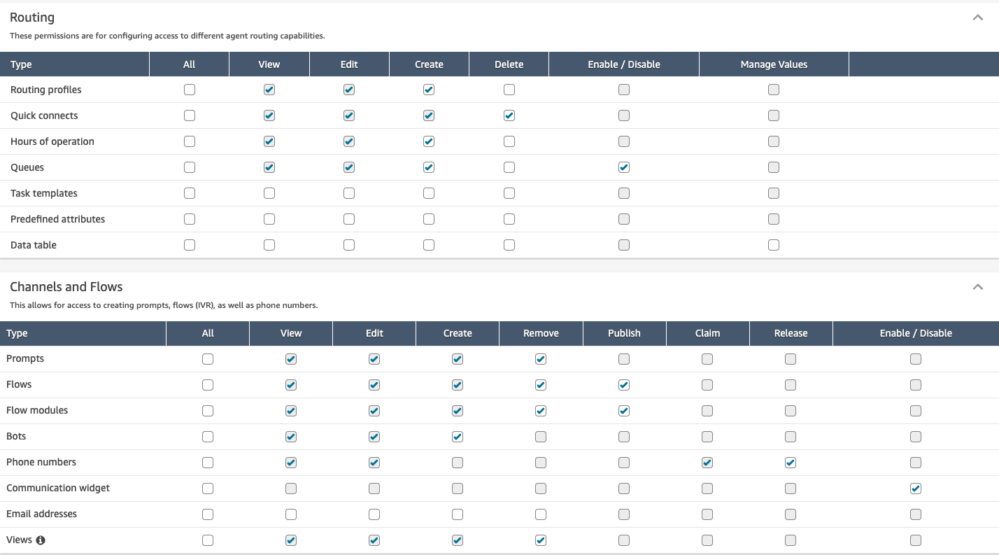
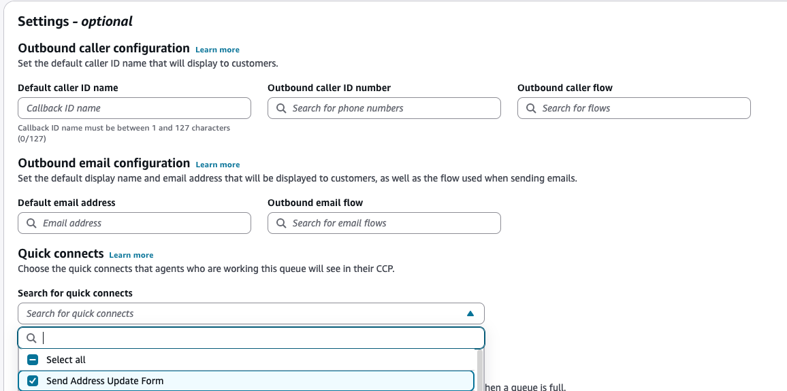
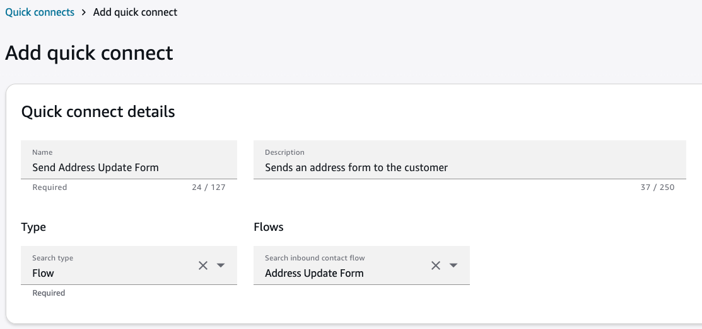
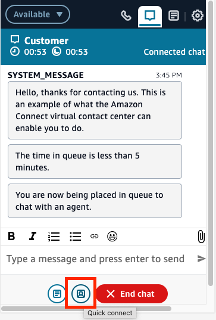
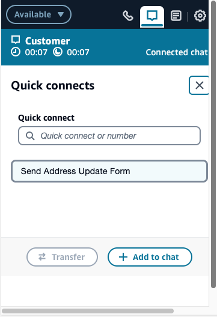
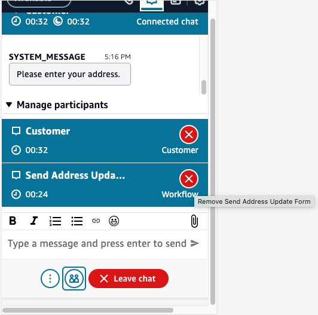
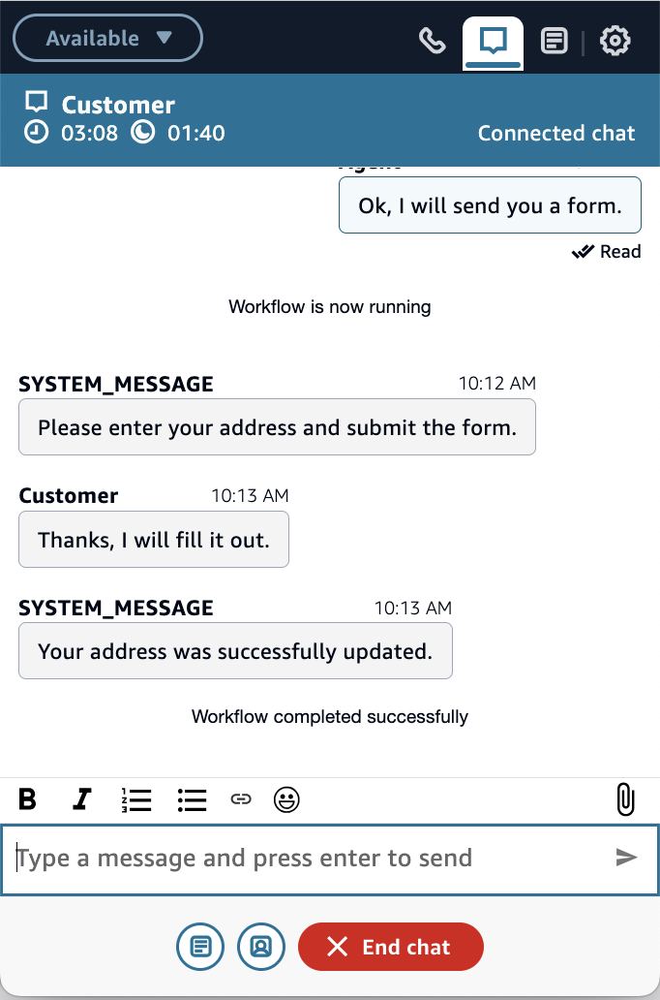
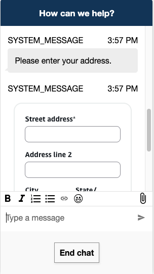
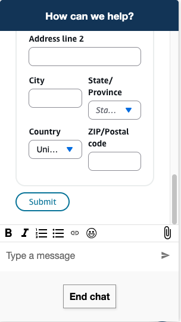

# Enable agent-initated flows during active chat

sessions

Agent-initiated workflows are interactive workflows that agents can trigger during active
chat sessions with customers. This feature enables agents to send forms for data
collection, process payments, update customer profiles, and initiate automated processes
while maintaining direct interaction with customers within the chat experience.

## Benefits

Agent-initiated flows provides the following benefits:

- Simplify customer task completion by keeping interactions within the chat
  interface
- Enable agents to provide real-time assistance during form completion
- Support sensitive data collection through Show View blocks with [sensitive data configuration options](https://aws.amazon.com/about-aws/whats-new/2024/12/amazon-connect-collect-sensitive-customer-data-chats/ "https://aws.amazon.com/about-aws/whats-new/2024/12/amazon-connect-collect-sensitive-customer-data-chats/")

## Where you can use agent-initiated

flows

You can use agent-initiated flows in chat channels, including:

- Web chat
- SMS
- WhatsApp Business
- Apple Messages for Business

Voice and other channels are not currently supported.

## Limitations

- The supported Quick Connect "FLOW" type only work for chat channels (web
  chat, SMS, WhatsApp Business, Apple Messages for Business).
- Only [Inbound Flows](sample-inbound-flow.md "sample-inbound-flow.md") are supported
- Transfers and adding new participants will not work during an ongoing
  agent-initiated workflow. The workflow needs to be either completed or
  cancelled before adding a new agent or contact.
- Only one agent-initiated flow can execute at a time per contact
- The following flow blocks are not supported: [**Connect assistant**](q-block.md "q-block.md"), [**Authenticate Customer**](authenticate-customer.md "authenticate-customer.md"), [**Create Persistent Contact
  Association**](create-persistent-contact-association-block.md "create-persistent-contact-association-block.md"), [**Get Customer Input**](get-customer-input.md "get-customer-input.md")
- Limited to 10 Agent-initiated flows per Chat

## Security profile permissions for

agent-initiated flows

Before you can create agent-initiated flows, you must have permissions in your
security profile.

The required permissions are:

- **Channels and flows - Views**
- **Routing - Quick Connects**

## Create Quick Connect for

agent-initiated flow

1. On the navigation menu, choose **Routing**, **Quick
   connects**.
2. Choose **Add new**.
3. For **Type**, select **Flow**.
4. Select a specific **Inbound Flow** for agents to
   send.
5. Choose **Save**.

## Associate Quick Connect with

queue

1. On the navigation menu, choose **Routing**,
   **Queues**.
2. Select the queue where agents will use this flow.
3. In the **Quick connects** section, add your Quick
   Connect.
4. Choose **Save**.

For additional details on quick connects, see [Create quick connects in Amazon Connect](quick-connects.md "quick-connects.md").

## Send Form to Customer

1. On **agent control panel**, select the **Quick
   connect** button at the action bar
2. On the selection menu, choose the appropriate form
3. Select **Add to chat**

When the form is active, the agent may cancel the workflow. Agents will see events
for the status of the workflow.

## Receive Form from Agent

- Customer will receive the respective form to fill out
- Customers and agents continue ongoing conversation during the active
  form
- Upon submission, the agent will be notified through new events

