# Agent performance evaluations

dashboard

You can use the **Agent performance evaluations dashboard** to view
aggregated agent performance, and get insights across agent cohorts and over time.

Use the dashboard to view your agents' performance evaluation scores and drill-down
into evaluation scores received on different evaluation forms, sections, and questions.
You can also use it to view agent performance metrics such as average handle time,
occupancy, and more.

The dashboard provides a single place to view aggregated agent performance.

###### Contents

- [Enable access to
  the dashboard](#enable-agent-performance-evaluations-dashboard "#enable-agent-performance-evaluations-dashboard")
- [Specify "Time range" and "Compare to"
  benchmark](#agents-timerange "#agents-timerange")
- [Examples of "Time range" and "Compare
  to" configurations](#agents-timerange-examples "#agents-timerange-examples")
- [Agent performance overview and Agent
  evaluation performance overview charts](#agent-performance-overview "#agent-performance-overview")
- [Evaluation scorecard chart](#evaluation-scorecard-dashboard "#evaluation-scorecard-dashboard")
- [Evaluation score trend
  chart](#evaluation-scorecard-trend-chart "#evaluation-scorecard-trend-chart")
- [Agent performance evaluation metrics
  table](#agent-perf-metrics-chart "#agent-perf-metrics-chart")
- [Agent online time breakdown
  chart](#agent-online-time-breakdown-chart "#agent-online-time-breakdown-chart")
- [Average handle time breakdown
  chart](#avg-handletime-breakdown-chart "#avg-handletime-breakdown-chart")
- [Agent performance metrics table](#agent-perf-metrics-table "#agent-perf-metrics-table")

## Enable access to

the dashboard

Ensure users are assigned the appropriate security profile permissions:

- **Access metrics - Access permission** or the
  **Dashboard - Access permission**. For information
  about the difference in behavior, see [Assign permissions to view dashboards
  and reports in Amazon Connect](dashboard-required-permissions.md "dashboard-required-permissions.md").
- **Evaluation forms - perform evaluations - View**: This
  permission enables users to view performance evaluation results.
- **Evaluation forms - manage form definitions - View**:
  This permission enables users to view evaluation form definitions such as
  form structure, scoring weights, and more.

## Specify "Time range" and "Compare to"

benchmark

Following are a few use cases that help explain how to configure the
**Time range** and **Compare to**
settings.

- **Time range**: Select from intraday (trailing 8 hours),
  daily, weekly, monthly performance. You can view data from 15 seconds up to
  3 months in the past. Some of the metrics are available only starting
  January 10, 2025 0:00:00 GMT. For more information, see [Metric definitions](metrics-definitions.md "metrics-definitions.md").
- **Compare to**: Compare performance with prior time
  period (for example, prior week, prior month, and more) or with a Amazon Connect
  resource (for example, comparison with all agents within the contact center,
  a specific hierarchy, queue, and more).
- **Agent**
- **Agent hierarchy**
- **Channel**
- **Queue**
- **Routing Profile**

## Examples of "Time range" and "Compare

to" configurations

- **Use case 1**: I want to compare my agents’
  performance today with my performance yesterday

Configure the dashboard as follows:

    + Time range = Trailing
    + Time = Customer: Today (since 12 am)
    + Compare to

    	- Comparison type: Prior time period
    	- Benchmark time range: Day, Prior day

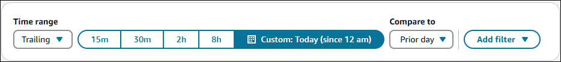

- **Use case 2**: I want to compare my agents’
  performance last week with the prior week

Configure the dashboard as follows:

    + Time range = Week
    + Time = Last week
    + Compare to

    	- Comparison type: Prior time period
    	- Benchmark time range: Week, Prior week

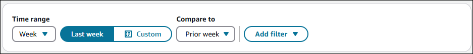

- **Use case 3**: I want to compare my agents’
  performance last week with the average of the contact center.

Configure the dashboard as follows:

    + Time range = Week
    + Time = Last week
    + Compare to

    	- Comparison type: Resource
    	- Select resource: Agent

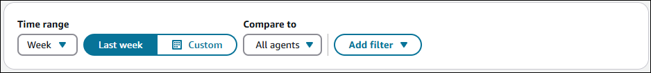

## Agent performance overview and Agent

evaluation performance overview charts

These two charts provide aggregated metrics based on your filters.

For example, they show the average handle time of the agent hierarchy that you
selected, for the specified time range (for example, last week).

The charts also provide the benchmark value based on your selections within
"Compare to" and the difference in values versus the comparison.

The following image shows an example **Agent performance
overview** chart.

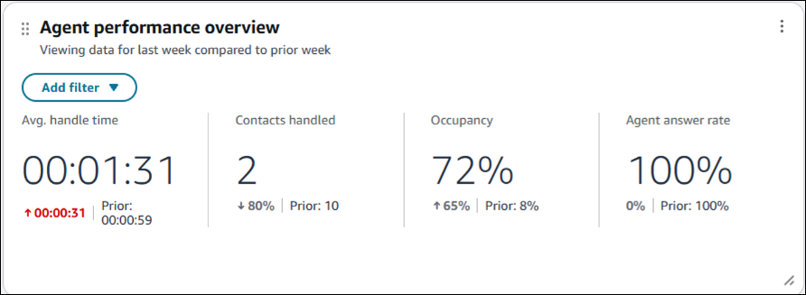

The following image of the **Agent evaluation performance
overview** chart shows the **Avg evaluation score**
decreased from 67.58% to 48.72%.

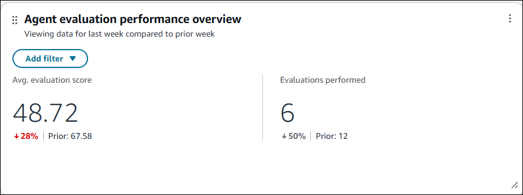

## Evaluation scorecard chart

This chart provides a drill-down of the aggregated evaluation score from form to
section to questions.

For example, you can select your team in the agent hierarchy and view how the team
is performing overall. You can identify what evaluation questions they need to
improve on by sorting questions using **Avg evaluation score**
column.

You can view the score (out of 100%) of sections and questions in the
**Avg. evaluation score** column. To see how each section and
question contributes to the evaluation score of the form, view the **Avg
weighted evaluation score** column.

**Percent change in avg evaluation score** is as follows:

- (**Avg evaluation score** - **Prior avg
  evaluation score**) / **Prior avg evaluation
  score**)

In addition to the using the page filters, you can add filters to the chart for
the evaluation form and the evaluation source.

The evaluation source helps you differentiate between evaluations performed
manually, automatically, or where the manager completed the evaluation with
assistance from automation. For a description of each `evaluationSource`
valid value (`ASSISTED_BY_AUTOMATION`, `MANUAL`,
`AUTOMATED`), see [Evaluation form metadata
definitions](evaluationforms-example-output-file.md#evaluation-form-metadata "evaluationforms-example-output-file.md#evaluation-form-metadata").

The following image shows an example **Evaluation scorecard**
chart.

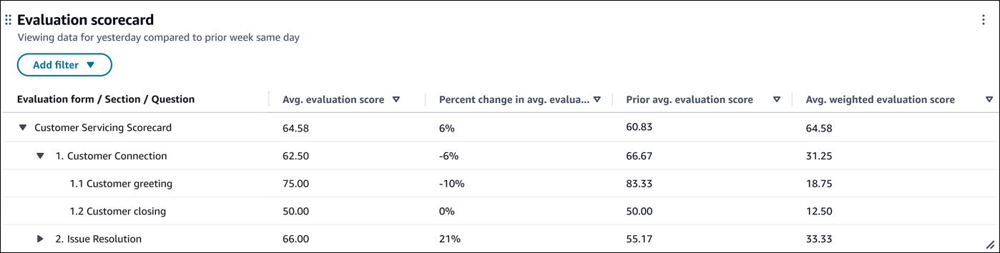

## Evaluation score trend

chart

On the **Evaluation score trend** chart you can view trends at
intervals of 15 minutes, daily, weekly or monthly, and perform comparison with prior
time period and resource benchmarks. The available intervals depend on time range
selections. For example, for a Time Range of weekly, you can view trends at daily
and weekly intervals.

In addition to the page filters, you can also add filters to the chart for the
evaluation form and the evaluation source.

The following image shows an example **Evaluation score trend**
chart.

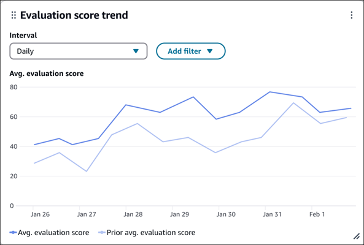

## Agent performance evaluation metrics

table

You can view the average evaluation score for each of your agents. For example,
you can filter for a particular agent hierarchy and sort agents by their
**Avg. evaluation score**.

You can drill-down into agents to view their score across the different evaluation
forms and can also filter the table for a particular evaluation form or evaluation
source (that is, automated, manual, and more).

The table provides evaluations performed so you can assess if the agent has
received enough evaluations for the **Avg. evaluation score** to be
representative of their performance. You can also check if the agent received any
automatic fails on their performance evaluations.

You can set custom thresholds that enable you to get an at-a-glance view of agents
that are below the desirable threshold for their average evaluation score. For more
information, see [Modify thresholds for summary widgets and
tables](dashboard-customize-widgets.md#dashboard-thresholds "dashboard-customize-widgets.md#dashboard-thresholds").

The following image shows an example **Agent performance evaluation
metrics** table.

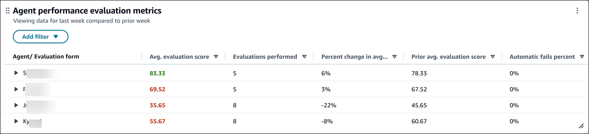

## Agent online time breakdown

chart

This chart provides a breakdown of the online time spent by agents being
on-contact, being idle (while being available to take calls), and non-productive
(that is, in custom status).

You can then compare the breakdown over time or versus a benchmark (for example,
the average of all agents in the contact center).

This chart helps you assess whether agents are spending too much time on
activities outside of taking contacts, so you can take action (for example, driving
better adherence to scheduled breaks).

For more information about metrics definitions, see [Metric definitions](metrics-definitions.md "metrics-definitions.md").

The following image shows an example **Agent online time
breakdown** chart.

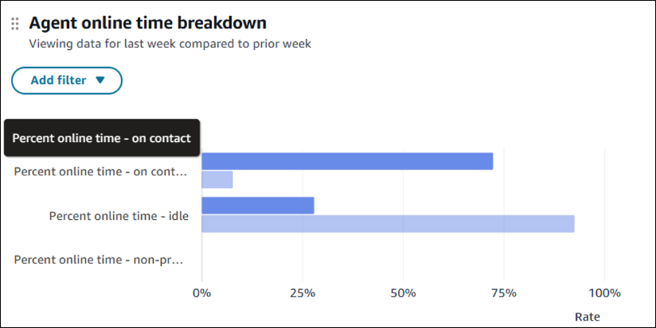

## Average handle time breakdown

chart

This chart provides a breakdown of the average handle time across interaction
time, hold time, and After Contact Work (ACW) time.

You can benchmark average handle time components over time or versus benchmark
(for example, the average of all agents).

This chart helps you identify opportunities to reduce average hold time, for
example, if average handle time is high because average after contact work time is
higher than the contact center's average, then you can coach agents on how to
complete after contact work more efficiently.

The following image shows an example **Avg. handle time
breakdown** chart.

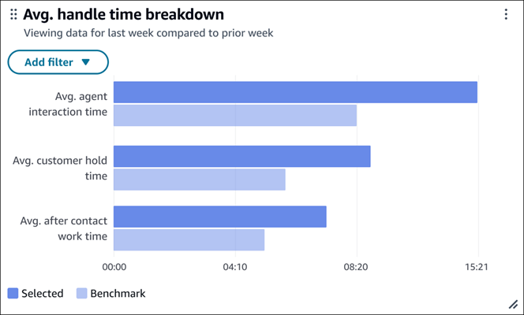

## Agent performance metrics table

This table provides you with key agent performance metrics. You can sort the table
in ascending or descending order of the metrics. For example, which agents have the
highest **Avg after contact work time**.

You can also edit the chart to add or remove agent performance metrics, and set
thresholds for highlighting insights.

The following image shows an example **Agent performance
metrics** chart.

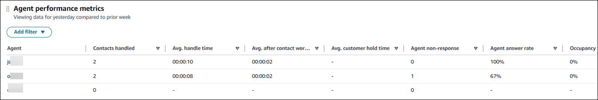
