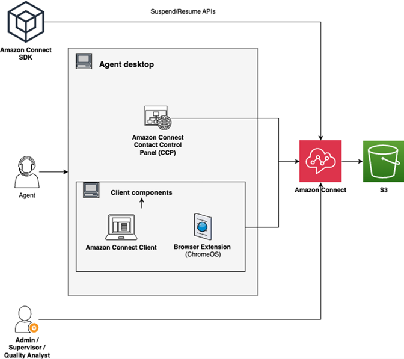

# Set up and review agent screen recordings in Amazon Connect

Contact Lens

To help coach your agents to provide great customer service, you can use the Contact Lens screen recording
feature to gain quality management insights. It records the agent's desktop, which helps you
identify opportunities to improve performance. This information is also useful for ensuring
compliance.

For example, let's assume it takes most agents two minutes to process a refund, but Jane
Doe takes four minutes. You can watch a recording of her desktop when she's doing a refund
and discover why she is taking longer.

The following diagram shows the high-level components of screen recording. For a sequence
diagram that shows the network calls between different components, see
[Network requirements](sr-system-req.md#network-requirements "sr-system-req.md#network-requirements").

###### Contents

- [Amazon Connect Client Application](amazon-connect-client-app.md "amazon-connect-client-app.md")
- [System and network
  requirements](sr-system-req.md "sr-system-req.md")
- [Enable screen recording](enable-sr.md "enable-sr.md")
- [Review agent screen
  recordings](review-screen-recordings.md "review-screen-recordings.md")
- [Download log files for the screen
  recording app](troubleshoot-sr.md "troubleshoot-sr.md")
- [FAQ for screen recording
  capabilities](faq-screenrecording.md "faq-screenrecording.md")
