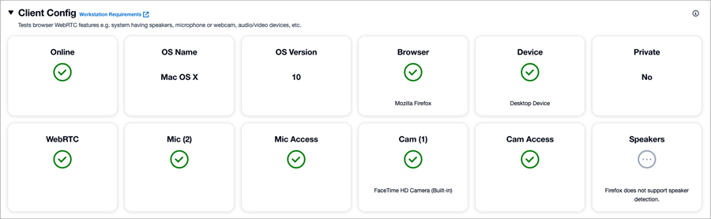

# Troubleshoot an agent's workstation for call quality and

disconnect problems

Before you read this topic, we recommend that you confirm your agent's workstation
meets the [minimum hardware requirements](ccp-agent-hardware.md "ccp-agent-hardware.md") for
using Amazon Connect.

This topic explains how to investigate device problems.

- Investigate platform issues
  - Run the [Endpoint Test
    Utility](check-connectivity-tool.md "check-connectivity-tool.md") from the affected agent's machine and check the
    results.
  - Check whether the agent workstation meets [minimum hardware requirements](ccp-agent-hardware.md "ccp-agent-hardware.md")
    for Amazon Connect. For a workstation that meets the requirements, the results
    are similar to those in the following image.

  
  - The contact record displays the [DeviceInfo](ctr-data-model.md#ctr-deviceinfo "ctr-data-model.md#ctr-deviceinfo") of the participant (customer or agent) including
    the platform, platform version, and the operating system. The
    `deviceInfo` parameter helps to identify the agent's
    workstation settings.

  `"deviceInfo": { "platformName": "Chrome", "platformVersion":
 "116", "operatingSystem": "Windows" },`
  - Check whether there are any recent operating system or browser
    upgrades/patches applied for the impacted agents. If so, confirm whether
    the issue can be resolved by rolling back to the last known working
    revision.
  - Check whether the issue is reproducible across [all browsers supported by
    Amazon Connect](connect-supported-browsers.md "connect-supported-browsers.md").

- Investigate headset issues
  - Ensure that the agent's headset meets the [minimum headset requirements](ccp-agent-hardware.md#ccp-agent-headset "ccp-agent-hardware.md#ccp-agent-headset").
  - Check whether the issue occurs when a different headset (or no
    headset) is used.
    - If using a wireless headset, consider using a wired one.

  - If your audio input device supports noise cancellation, consider
    changing the settings for the same as required.

- Investigate for application incompatibility
  - Check whether any recent software/application installed on the
    workstation that may be doing one of the following:

        - Taking exclusive control of agent's mic/speaker. This issue
         documented in [Contact Control Panel (CCP) Issues](common-ccp-issues.md "common-ccp-issues.md")
        - Consuming excessive network bandwidth, and thus preventing the
         bandwidth from being available to Amazon Connect.

    If so, to find the problematic application, remove the recently
    installed applications one at a time until the issue is resolved.

- Investigate your custom CCP
  - If you are using a custom CCP (not the default CCP), does the issue
    reproduce on a default CCP?
