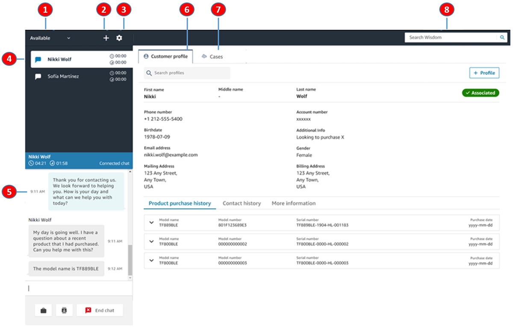
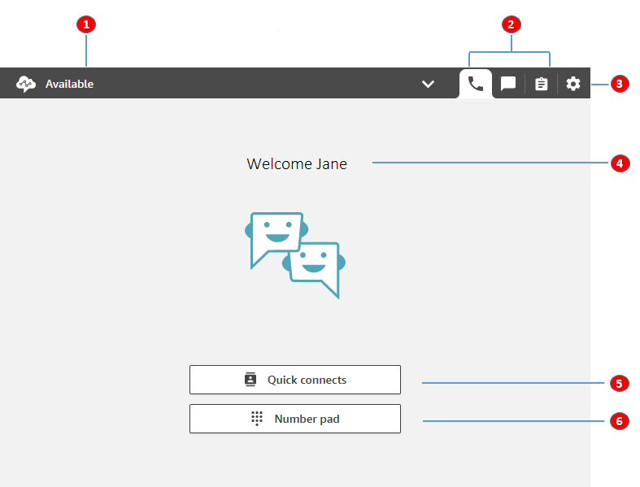

# Agent training guide for the Contact Control Panel (CCP)

and agent workspace in Amazon Connect

This section provides an overview of the default Amazon Connect agent workspace and Contact Control
Panel. Your organization may be using a customized version of the agent workspace and/or
Contact Control Panel. Please contact your Technical Support for specific questions about
how your instance of Amazon Connect works.

Agent workspace
With the agent workspace you can access all Amazon Connect features in a single
application. You can:

- Use the Contact Control Panel (CCP) to interact with customer
  contacts.
- [Use Customer Profiles](ag-cp-select.md "ag-cp-select.md") to view
  customer information.
- [Use Cases](search-cases.md "search-cases.md") to create, edit, and
  resolve customer cases.
- [Use Amazon Q in Connect](search-for-answers.md "search-for-answers.md") to obtain
  the information you need from your company knowledge base.

To access the agent workspace use the following URL:

- https://`instance name`.my.connect.aws/agent-app-v2/

Where `instance name` is provided by your IT
department or the individuals that set up Amazon Connect for your business.

The following image shows the agent workspace with the CCP, Customer Profiles,
Cases, and Amazon Q in Connect.

1. Set your status.
2. Access to the number pad, quick connects, and task creation.
3. Log in and out. Set your language preferences, device settings (if
   enabled), and phone type.
4. Inbox of inbound calls, chats, and tasks.
5. Based on the channel of the contact that is in focus in your inbox,
   the appropriate content shows here; for example, when a chat is
   selected, the chat interface appears.
6. View customer information for the contact that is in focus in your
   inbox.
7. Search and view cases.
8. Search for knowledge articles to solve customer issues.

CCP
You use the Amazon Connect Contact Control Panel (CCP) to interact with customer
contacts. It's how you receive calls, chat with contacts, transfer them to other
agents, put them on hold, and perform other key tasks.

The URL to launch the CCP is:

- https://`instance name`.my.connect.aws/ccp-v2/

Where `instance name` is provided by your IT
department or the individuals that set up Amazon Connect for your business.

Large businesses often choose to customize their CCP. For example, they might
want to integrate it with a CRM. However, this section describes how CCP works
before it is customized.

The following image shows the CCP.

1. Set your status.
2. The channels enabled for your agent routing profile.
3. Log in and out. Set your language preferences, device settings (if
   enabled), and phone type.
4. Name of the agent that's currently signed in.
5. Choose a predefined destination to transfer the contact. Or call an
   external number.
6. Call a number or enter digits into an IVR menu.
