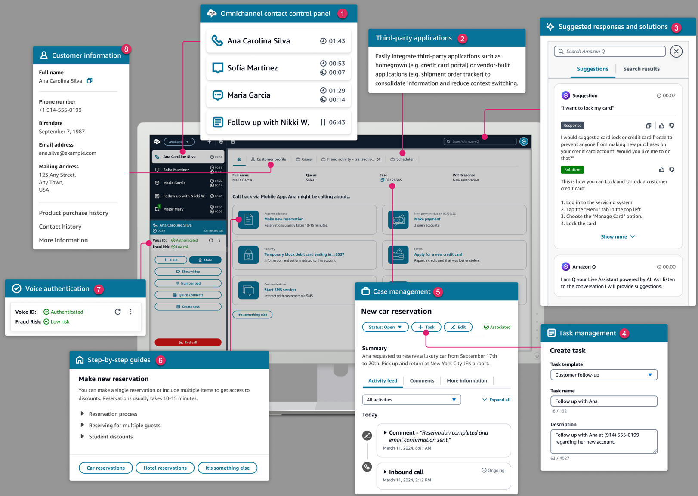
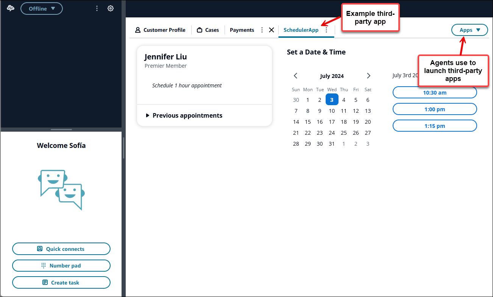

# Customize the Amazon Connect Agent Workspace

This section explains how to customize the agent workspace and enable guided experiences.

Out-of-the-box the agent workspace integrates all of your agent facing capabilities on one
page. For example, when an agent accepts a call, chat, or task, they are given necessary
information about the case and customer, plus real-time recommendations.

You can customize the agent workspace by enabling guided experiences, for example, and
customizing the look and feel of the View resources in the agent workspace.

The following image shows the parts of the agent workspace.

1. The **Contact Control Panel**, which agents use to
   accept calls, chats, and tasks.
2. **Third-party applications**, which reduce the number
   of windows an agent interacts with.
3. Real-time recommendations, powered by Amazon Q in Connect.
4. **Tasks** to assign work or follow-up
   activities.
5. The case ID, and other info on the **Cases** tab, powered by
   Amazon Connect Cases.
6. **Step-by-step guides**, which provide consistent
   workflows to reduce cognitive load.
7. Machine-learning powered voice authentication, powered by **Voice ID**.
8. Customer information on the **Customer profile** tab, powered by
   Amazon Connect Customer Profiles.
   You can also integrate [third-party applications](3p-apps.md "3p-apps.md")—built
   by vendors or you—into the agent workspace. The following image shows an example
   third-party app named **SchedulerApp** in the agent workspace. Agents can
   launch apps by using the **Apps** launcher, which is located in the right
   corner of the agent workspace.

###### Contents

- [Step-by-step
  Guides](step-by-step-guided-experiences.md "step-by-step-guided-experiences.md")
- [Enable step-by-step
  guides](enable-guided-experiences-sg.md "enable-guided-experiences-sg.md")
- [View resource](view-resources-sg.md "view-resources-sg.md")
- [No-code UI builder](no-code-ui-builder.md "no-code-ui-builder.md")
- [Invoke a guide at the start of a
  contact](how-to-invoke-a-flow-sg.md "how-to-invoke-a-flow-sg.md")
- [Deploy step-by-step guides in
  chats](step-by-step-guides-chat.md "step-by-step-guides-chat.md")
- [Display contact attributes
  in the agent workspace](display-contact-attributes-sg.md "display-contact-attributes-sg.md")
- [Enable agents to enter disposition
  codes](disposition-codes-sg.md "disposition-codes-sg.md")
- [PII
  Redaction](step-by-step-guides-pii-redaction.md "step-by-step-guides-pii-redaction.md")
- [Integrate third-party applications (3p
  apps)](3p-apps.md "3p-apps.md")
