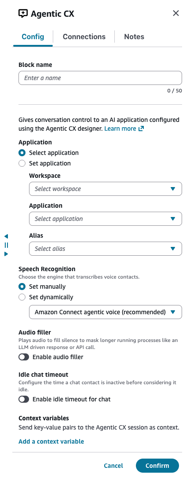
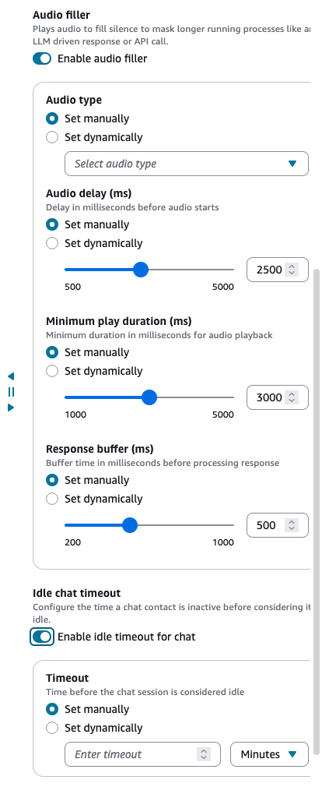
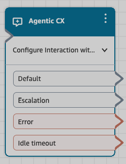

# Flow block in Connect Customer: Agentic CX

This topic defines the flow block for Agentic CX.

###### Note

The **Agentic CX** block is only available in [Amazon
Connect Customer](enable-nextgeneration-amazonconnect.md "enable-nextgeneration-amazonconnect.md") instances, and only in certain Regions. For the list of
Regions, see [Agentic CX Designer](regions.md#agentic-cx_region "regions.md#agentic-cx_region").

## Description

- The Agentic CX Flow block connects a contact to an Agentic CX application
  built using Agentic CX Designer. Use this block to hand the conversation to
  the application and pass data from your flow into it as context variables. The
  block routes the contact to a branch based on the exit condition that the
  application returns. An exit condition is a signal that the Agentic CX
  application returns to indicate the outcome of the conversation.
- For more information about building Agentic CX applications, see [Agentic CX designer](acxd.md "acxd.md").

###### Prerequisite

Before you can use this block, you must build an Agentic CX application in
Agentic CX Designer. The block's **Application** dropdowns only
list applications that already exist in your Agentic CX Designer
environment.

## Supported channels

The following table lists how this block routes a contact who is using the
specified channel.

| Channel | Supported? |
| ------- | ---------- |
| Voice   | Yes        |
| Chat    | Yes        |
| Task    | No         |
| Email   | No         |

## Flow types

You can use this block in the following [flow
types](create-contact-flow.md#contact-flow-types "create-contact-flow.md#contact-flow-types"):

- Inbound flow
- Customer Queue flow
- Customer Hold flow
- Customer Whisper flow
- Outbound Whisper flow
- Transfer to Agent flow
- Transfer to Queue flow

## How to configure this block

When you add an Agentic CX Flow block to your flow, you configure the following
properties.

### Application

Select the Agentic CX application to handle the contact. Each application
defines its own conversation logic, AI models, tools, and knowledge bases.

- **Select application** — Choose the workspace,
  application, and alias from the dropdown. The dropdowns list the
  workspaces, applications, and aliases configured in Agentic CX
  Designer.
- **Set application** — Enter the IDs of the workspace,
  application, and alias manually, or set them dynamically using contact
  attributes.

### Speech recognition engine

Select the speech recognition engine that converts customer speech to
text.

- **Engine** — Choose the speech recognition engine. Set
  manually or set dynamically using a contact attribute. Default: Amazon
  Connect agentic voice. Available options:

  - **Amazon Connect agentic voice
    (recommended)** — A next-generation speech experience
    with enhanced automatic speech recognition (ASR), built for
    natural agentic voice conversations. Recommended for most use
    cases.
  - **Amazon Transcribe** — A fully
    managed automatic speech recognition (ASR) service that converts
    real-time speech to text.
  - **Speech to speech** — Processes
    customer audio and generates responses directly as speech, without
    an intermediate text transcription step.

### Audio configuration (voice only)

**Audio filler** — (Optional) Enable audio filler to play
while the AI processes a response. This reduces perceived latency for the
customer. When enabled, configure the following settings:

- **Audio type** — Select the audio filler sound to play.
  Set manually or set dynamically using a contact attribute. Available
  options:

  - Melody - Chipper Chime
  - Melody - Curious Crawl
  - Melody - Rising Ripple
  - Melody - Patient Ping
  - Melody - Pondering Pong
  - Typing - Kinetic Keys
  - Typing - Quiet Qwerty

- **Audio delay (ms)** — Delay in milliseconds before
  audio starts. Set manually or set dynamically using a contact attribute.
  Min: 500, Max: 5000, Default: 2500.
- **Minimum play duration (ms)** — Minimum duration in
  milliseconds for audio playback. Set manually or set dynamically using a
  contact attribute. Min: 1000, Max: 5000, Default: 3000.
- **Response buffer (ms)** — Buffer time (pause) in
  milliseconds after the audio filler is played and before sending the
  response to the user. Set manually or set dynamically using a contact
  attribute. Min: 200, Max: 1000, Default: 500.

### Idle chat timeout (chat only)

Configure how long the system waits for customer input before timing out. This
setting is available under **Optional settings**.

- **Idle chat timeout** — The maximum time to wait for
  customer input before following the **Idle chat timeout**
  branch. Set manually or set dynamically using a contact attribute.

### Context variables

Pass key-value pairs to the Agentic CX application as context variables. These
values are available in the Agentic CX application and can be used to personalize
responses or provide additional context.

- **Key** — Select from preconfigured context variables
  defined in the Agentic CX application, or enter a custom key using free
  text.
- **Value** — Enter a value manually or set dynamically
  using a contact attribute.

###### Note

Maximum of 10 context variables per block.

## Configuration tips

- **Keep conversations focused** — Design your
  Agentic CX application with clear exit conditions. This makes sure contacts
  are routed appropriately when the conversation completes or when a handoff to
  a live agent is needed.
- **Use interim messages** — For voice
  experiences, configure interim messages in your Agentic CX application to fill
  silence while tools (such as API calls or knowledge base lookups) are
  executing.
- **Test thoroughly** — Use the Agentic CX
  debugger to trace conversation paths and verify that exit conditions route
  contacts to the correct branch.
- **Model selection affects latency** — Choose
  faster models (such as Amazon Nova Micro) for latency-sensitive voice
  interactions. More powerful models can be used for complex reasoning tasks
  where slight delays are acceptable.

## Branches

This block supports the following branches:

| Branch            | Description                                                                                                                                                                                                                                                                                 |
| ----------------- | ------------------------------------------------------------------------------------------------------------------------------------------------------------------------------------------------------------------------------------------------------------------------------------------- |
| Default           | The agentic conversation completed successfully. The Agentic CX application reached an exit condition indicating the task was fulfilled.                                                                                                                                              |
| Error             | An error occurred during the conversation (for example, the Agentic CX application could not be reached or encountered an internal error). Connect this branch to a fallback experience, such as transferring the contact to a queue or playing a message before disconnecting. |
| Idle chat timeout | The customer did not provide input within the configured **Idle chat timeout**. This branch applies to chat only.                                                                                                                                                                     |
| Escalation        | The Agentic CX application determined that the contact should be escalated to a live agent. Connect this branch to a *_Transfer to queue_ • or *_Set working queue_ • block to route the contact to a live agent.                                                            |

## How it works

When a contact reaches the Agentic CX Flow block, the contact is routed to the
Agentic CX application configured in the block. The Agentic CX application manages the
conversation. This includes the following:

- Automatic speech recognition (ASR) for converting customer speech to
  text.
- AI-powered conversation orchestration using the models and tools you
  configured.
- Text-to-speech (TTS) for delivering AI responses back to the
  customer.

The conversation continues until one of the following occurs:

- The Agentic CX application reaches an exit condition
  (**Default** branch).
- An error occurs (**Error** branch).
- The customer stops responding on a chat contact (**Idle chat
  timeout** branch).
- The Agentic CX application determines the contact should be escalated to a
  live agent (**Escalation** branch).

After the block completes, the contact flow continues along the appropriate
branch.

## Contact attributes

The Agentic CX Flow block sets `$.AgenticCX.ContextVariables`, which
contains any context variables returned by the Agentic CX Designer application. You
can reference these in subsequent blocks. To reference an individual variable, use
`$.AgenticCX.ContextVariables.<variableName>` (for example,
`$.AgenticCX.ContextVariables.orderId`).
