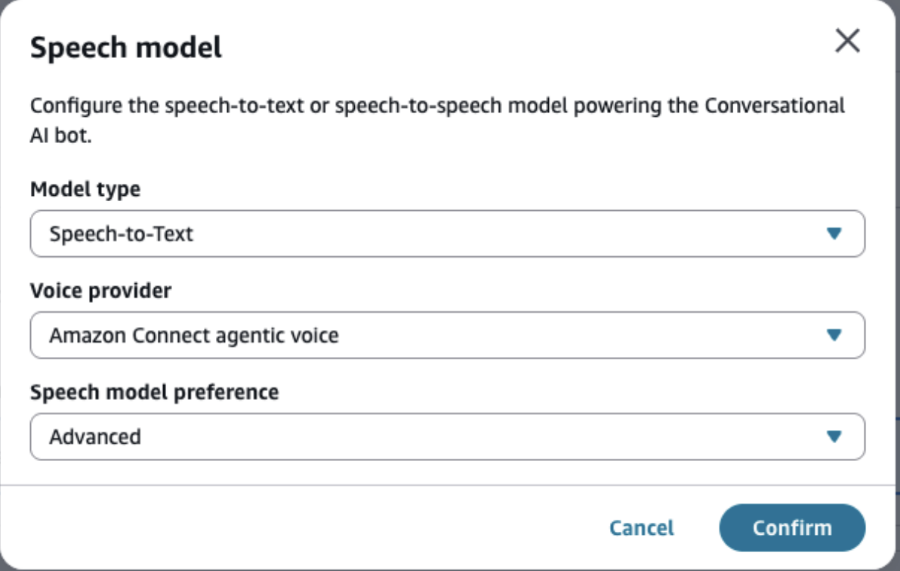
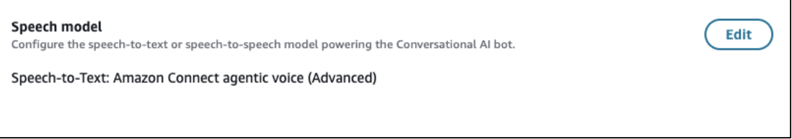
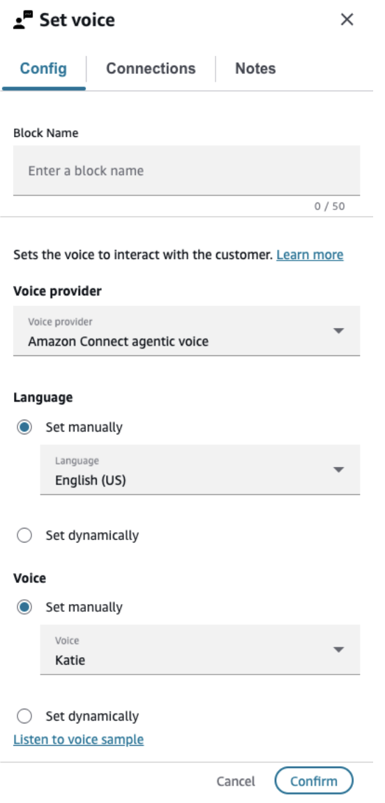

# Agentic voice configuration guide

Amazon Connect agentic voice is a next-generation speech experience that delivers expressive voice capabilities and enhanced automatic speech recognition (ASR). It integrates natively with your existing Amazon Connect contact flows and bot configurations.

This guide walks you through:

- Configuring enhanced speech recognition (ASR) for your bots
- Configuring voice using the Set Voice contact flow block
- Selecting a language and voice, and previewing audio samples

###### Note

Amazon Connect agentic voice is the default voice provider for Amazon Connect customers. Both ASR and voice share the same **Amazon Connect agentic voice** provider selection in their respective configuration panels.

## Advanced Speech Recognition (ASR) configuration

Configure Advanced speech recognition at the bot level in the Amazon Connect console. Follow these steps to enable the Amazon Connect agentic voice speech model for your bots.

### Step 1: Navigate to bot configuration

In the Amazon Connect console:

1. Navigate to **Conversational AI** > **Bots**.
2. Select the bot you want to configure.
3. Open the **Speech Configuration** section.

### Step 2: Configure Speech-to-Text

In the Speech-to-Text configuration:

1. Set **Voice Provider** to **Amazon Connect agentic voice** — this matches the same provider framing used in the Set Voice block.
2. Set **Speech model preference** to **Advanced** to enable the enhanced speech recognition model with lower latency and improved accuracy.

### Step 3: Verify configuration

After saving, verify the configuration on the bot landing page:

- Confirm that the speech model section displays **Amazon Connect agentic voice** as the provider.
- Confirm that **Advanced** appears as the speech model preference.

## Voice configuration — Set Voice block

The Set Voice contact flow block supports Amazon Connect agentic voice as a voice provider. Follow these steps to configure voice for your contact flows.

### Step 1: Select voice provider

In your contact flow editor, add or open an existing Set Voice block. In the configuration panel:

1. Choose the **Voice Provider** dropdown.
2. Select **Amazon Connect agentic voice**.

Amazon Connect agentic voice is the default selection for Amazon Connect customers. When selected, the block displays the Amazon Connect agentic voice configuration options.

### Step 2: Choose language and voice

With Amazon Connect agentic voice selected as the provider:

1. Use the **Language** dropdown to select your target locale (for example, English - US, Spanish - US, French - France). This dynamically filters the available voices.
2. Select a voice from the filtered list.
3. Choose **Listen to voice sample** to preview the voice. This opens a new tab playing a recording of the selected voice.

1. Choose the **Listen to voice sample** link.
2. Listen to the audio sample to confirm that voice matches your requirements.
3. If needed, go back and select a different voice.

### Step 3: Save and publish

Once you are satisfied with your selection:

1. Choose **Save** to apply the voice configuration to the block.
2. Publish the contact flow to make the changes live.

###### Tip

For detailed guidance on prompt design, voice tuning, and getting the best results from the Amazon Connect agentic voice feature, see [Agentic voice best practices](agentic-voice-best-practices.md "agentic-voice-best-practices.md").
