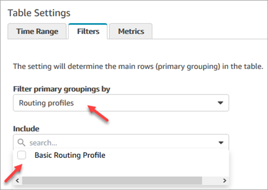

# List agents grouped by routing

profile in Amazon Connect

This topic shows you how to display a list of agents grouped by routing profile in
your Amazon Connect contact center.

1. Go to **Analytics and optimization**, **Real-time
   metrics**, **Queues**.
2. Choose **New table**, **Agents**.
3. Click **Settings**, as shown in the following
   image.

 4. On the **Filters** tab, choose **Routing
profiles** from the **Filter primary groupings
by** dropdown list. In **Include**, select the
routing profiles you want included in the table, as shown in the following
image.

 5. Choose **Apply**.
