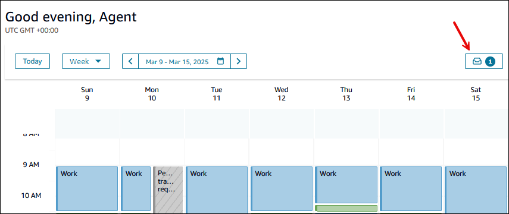
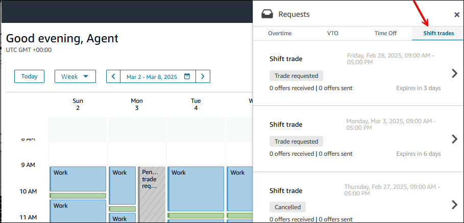
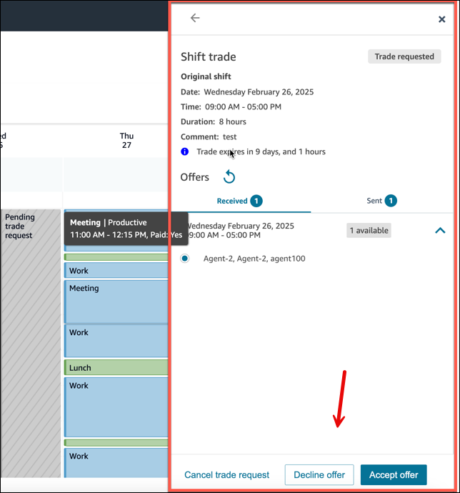
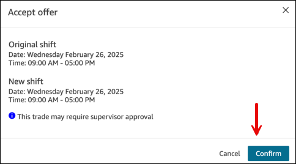
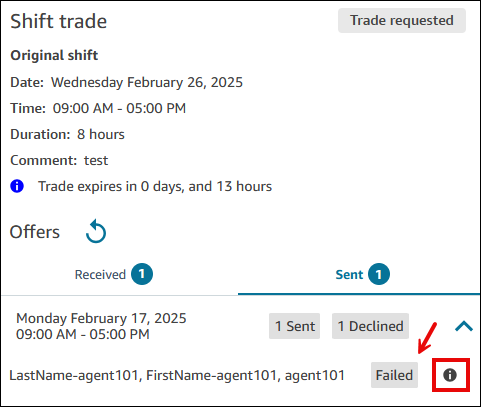

# How agents receive and

approve shift trade requests

To view trade offers, agents go to their schedule calendar, and click or tap
on the request drawer, as shown in the following image.

Then choose the **Shift trades** tab, as shown in the
following image.

You can click on the received trade section to review the incoming trade
offers from other agents. You can then select that offer and take one of the
following actions.

- **Accept offer**: Choose to accept the trade request
  and accept the offer.
- **Decline offer**: Choose to decline this trade
  request, and instead keep your offer in the pool.
- **Cancel trade request**: Choose to cancel this trade
  request, and remove your offer from the request pool. You can cancel a
  trade request at any time, even after it has gone to your supervisor for
  approval.
  The following image shows the location of these options on the **Shift
  trade** pane.

When you choose **Accept offer**, a dialog box prompts you to
confirm your selection. The **Confirm** button is shown in the
following image.

**Expired** status means you created an offer for a shift but
the **Notice period** specified for your [shift trade group](scheduling-create-shift-trade-groups.md "scheduling-create-shift-trade-groups.md") has
passed before the trade was completed. No further actions can be taken on that
shift.

## Why a shift trade request may

be Failed

A shift trade request may have a status of **Failed**.
The Info icon provides a brief description why, such as **Shift
trade affects other shifts**. This means the agent already has
a shift on the same day you are asking to trade.

The following image shows a **Failed** status.

