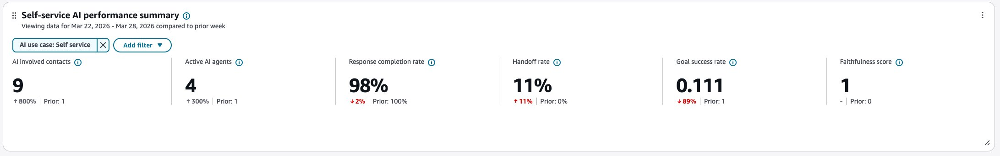
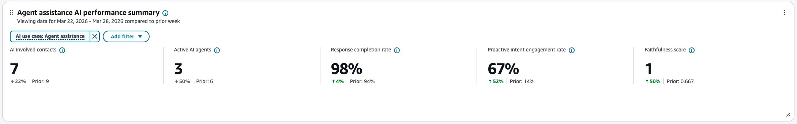
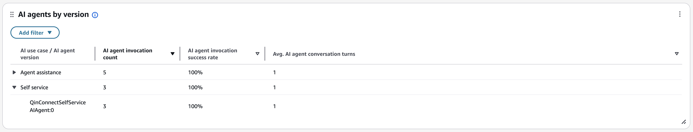
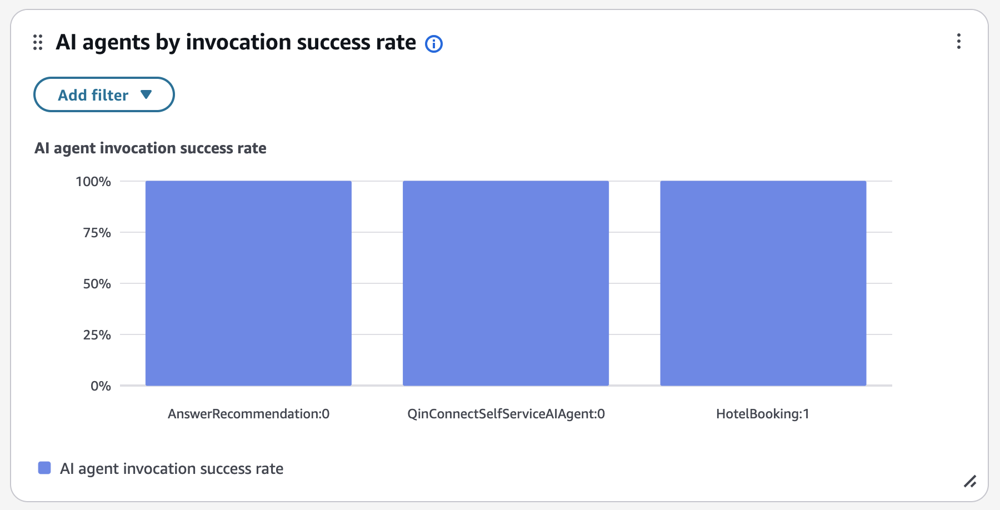
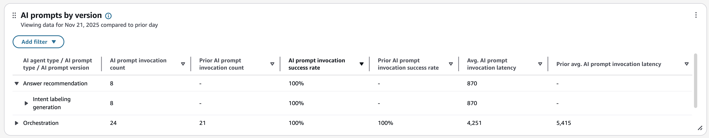

# AI Agent performance dashboard

You can use the **AI Agent performance dashboard** to view AI Agent performance, and get
insights across AI Agents and over time.

The dashboard provides a single place to view aggregated AI Agent performance. Use the dashboard to view your AI
Agents metrics such as invocation count, latency, and success rate.

###### Contents

- [Enable access to the dashboard](#enable-ai-agent-performance-dashboard "#enable-ai-agent-performance-dashboard")
- [Specify "Time range" and "Compare to" benchmark](#ai-agents-timerange "#ai-agents-timerange")
- [Self-service AI performance summary](#self-service-ai-agent-performance-summary "#self-service-ai-agent-performance-summary")
- [AI agent assistance performance summary](#ai-agent-assistance-performance-summary-dashboard "#ai-agent-assistance-performance-summary-dashboard")
- [AI agents by version chart](#ai-agents-by-version-chart "#ai-agents-by-version-chart")
- [AI agents by invocation success rate](#ai-agents-by-invocation-success-chart "#ai-agents-by-invocation-success-chart")
- [AI prompts by version](#ai-prompts-by-version "#ai-prompts-by-version")

## Enable access to the dashboard

Ensure users are assigned the appropriate security profile permissions:

**Access metrics - Access** permission or the **Dashboard -
Access** permission. For information about the difference in behavior, see [Assign permissions to view dashboards
and reports in Amazon Connect](dashboard-required-permissions.md "dashboard-required-permissions.md").

**Agent applications -** **Connect Workspace AI Chat Widget** permission: This permission is needed to access the AI Agent Performance dashboard.

The dashboard is available at: **Analytics and optimization > Analytics dashboards > AI Agent
Performance**.

## Specify "Time range" and "Compare to" benchmark

Use the **Time range** filter to specify the date and time period for which you want to view
data in the dashboard.

By default, the dashboard displays data for the last week. You can customize the time range to view data from as
recent as the last 15 minutes or going back up to 3 months in history.

Use the **Compare to** filter to select a time period to compare your current data against.
This allows you to identify trends and track improvements or issues over time.

## Self-service AI performance summary

This section shows health of your AI-Agent initiated Self-Service interactions. It displays the following key
metrics for the selected time period filtered by ‘Self service’ usecase:

- **AI involved contacts**:

Total count of contacts handled where AI agents resolved customer inquiries with out involving human
agents.

- **Active AI agents**:

The total number of unique AI agents, where each agent is identified by its unique combination of Name and
Version.

- **Response completion rate**:

The percentage of AI agent sessions that were successful in responding to incoming requests.

- **Handoff rate**:

Percentage of self service contacts handled by AI agents that was marked for needing additional support
including but not limited to human agents.

- **Avg. AI conversation turns**:

Average number of conversation turns across AI-enabled contacts.

The following image shows an example **Self-service AI performance summary** chart.

## AI agent assistance performance summary

This widget shows the health of your agent-assisted interactions where AI provides support to human agents. It
displays the following key metrics for the selected time period filtered by ‘Agent Assistance’ usecase.

- **AI involved contacts**:

Total number of contacts where AI Agents assisted human agents in resolving customer inquiries.

- **Active AI agents**:

The total number of unique AI agents, where each agent is identified by its unique combination of Name and
Version.

- **Response completion rate**:

The percentage of AI agent sessions that were successful in responding to incoming requests.

- **Proactive intent engagement rate**:

Percentage of detected proactive intents clicked by human agents.

- **Avg. AI conversation turns**:

Average number of conversation turns across AI-enabled contacts.

- **Avg. handle time**:

Average handle time for contacts where AI Agents were engaged

The following image shows an example **AI agent assistance performance summary** chart.

## AI agents by version chart

On the **Evaluation score trend** chart you can view trends at intervals of 15 minutes, daily,
weekly or monthly, and perform comparison with prior time period and resource benchmarks. The available intervals
depend on time range selections. For example, for a Time Range of weekly, you can view trends at daily and weekly
intervals.

In addition to the page filters, you can also add filters to the chart for the evaluation form and the
evaluation source.

The following image shows an example **Evaluation score trend** chart.

## AI agents by invocation success rate

The AI agents by invocation success rate chart displays the invocation success rate for each AI agent. You can
configure this widget further by filtering for specific AI agents, AI agent type, AI use case, or other dimensions
directly from this chart.

The following image shows an example **AI agents by invocation success rate** chart.

## AI prompts by version

This table provides a drill-down view of AI prompt performance. You can expand the AI agent type and prompt type
rows to drill down into specific prompt versions. To see how each version contributes to the overall prompt type
performance, view the individual metrics for each prompt version row.

The table displays performance metrics at three levels:

- **AI agent type level**:

Aggregated metrics across all prompts and versions for an AI agent type

- **AI prompt type level**:

Aggregated metrics across all versions of a specific AI prompt type

- **AI prompt version level**:

Individual performance metrics for each AI prompt version

**Metrics displayed:**

- **AI prompt invocation count**:

Total number of times the AI prompt version was invoked

- **AI prompt invocation success rate**:

Percentage of AI prompt invocations that executed successfully

- **Avg. AI prompt invocation latency**:

Average invocation latency in milliseconds for the AI prompt version

In addition to using the page filters, you can add filters to the table for specific AI agents, AI prompts, time
ranges, or other dimensions.

The following image shows an example **AI prompts by version** chart.

