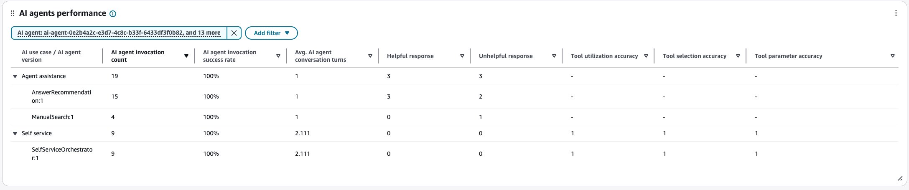
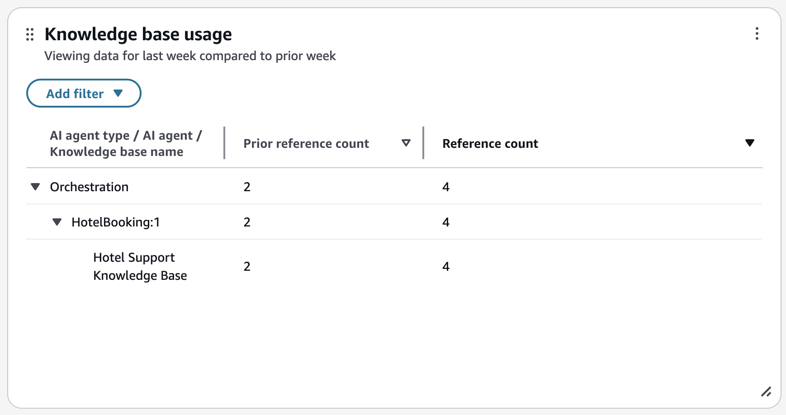
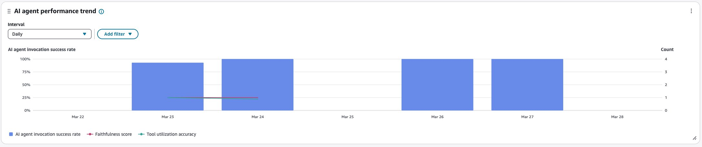
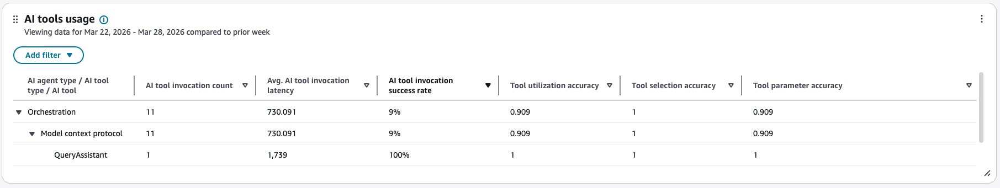
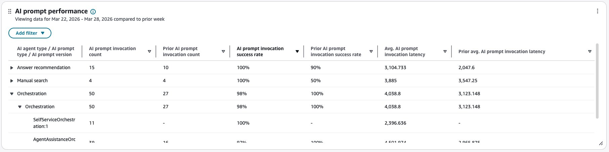
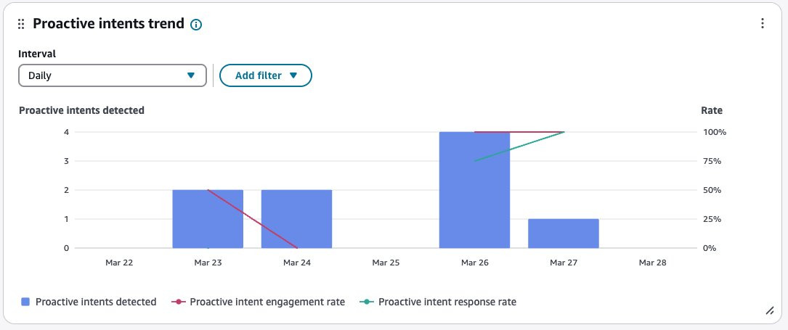
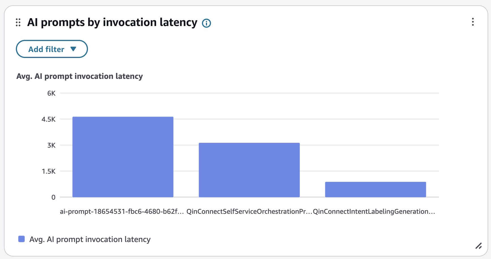
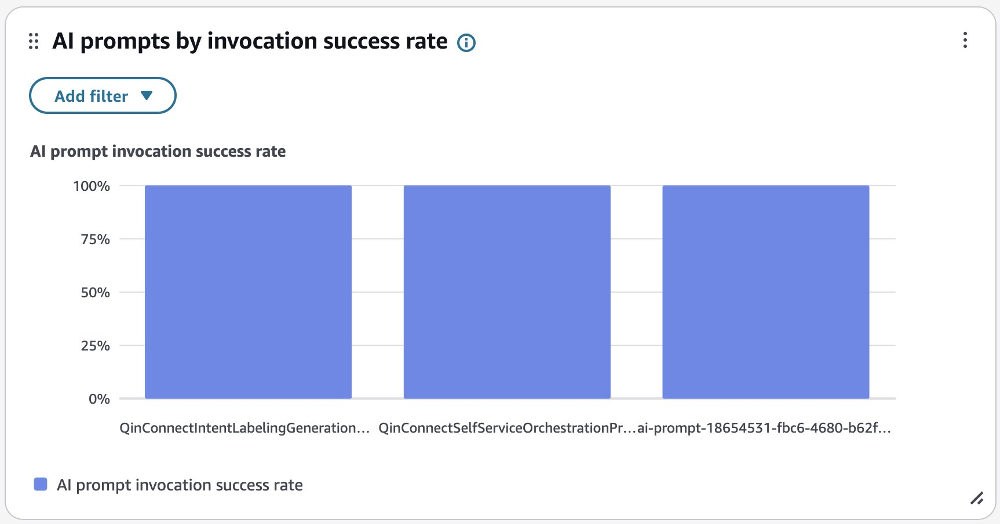

# AI Agent performance dashboard

You can use the **AI Agent performance dashboard** to view AI Agent performance, and get
insights across AI Agents and over time.

The dashboard provides a single place to view aggregated AI Agent performance. Use the dashboard to view your AI
Agents metrics such as invocation count, latency, and success rate.

###### Contents

- [Enable access to the dashboard](#enable-ai-agent-performance-dashboard "#enable-ai-agent-performance-dashboard")
- [Specify "Time range" and "Compare to" benchmark](#ai-agents-timerange "#ai-agents-timerange")
- [Self-service AI performance summary](#self-service-ai-agent-performance-summary "#self-service-ai-agent-performance-summary")
- [Agent assistance AI performance summary](#ai-agent-assistance-performance-summary-dashboard "#ai-agent-assistance-performance-summary-dashboard")
- [AI agents performance](#ai-agents-performance "#ai-agents-performance")
- [AI agents by invocation success rate](#ai-agents-by-invocation-success-chart "#ai-agents-by-invocation-success-chart")
- [Knowledge base usage](#knowledge-base-usage "#knowledge-base-usage")
- [AI agent performance trend](#ai-agent-performance-trend "#ai-agent-performance-trend")
- [AI tools usage](#ai-tools-usage "#ai-tools-usage")
- [AI prompt performance](#ai-prompt-performance "#ai-prompt-performance")
- [Proactive intents trend](#proactive-intents-trend "#proactive-intents-trend")
- [AI prompts by invocation latency](#ai-prompts-by-invocation-latency "#ai-prompts-by-invocation-latency")
- [AI prompts by invocation success rate](#ai-prompts-by-invocation-success-rate "#ai-prompts-by-invocation-success-rate")

## Enable access to the dashboard

Ensure users are assigned the appropriate security profile permissions:

**Access metrics - Access** permission or the **Dashboard - Access** permission. For information about the difference in
behavior, see [Assign permissions to view dashboards and reports in Connect Customer](dashboard-required-permissions.md "dashboard-required-permissions.md").

At least one of the following security profile permissions is needed to access the AI Agent Performance dashboard:

- **AI agent designer – AI agent** view permission
- **AI agent designer – AI prompt** view permission
- **AI agent designer – AI guardrails** view permission
- **Agent applications – Connect assistant** view permission

The dashboard is available at: **Analytics and optimization > Analytics dashboards > AI Agent
Performance**.

## Specify "Time range" and "Compare to" benchmark

Use the **Time range** filter to specify the date and time period for which you want to view
data in the dashboard.

By default, the dashboard displays data for the last week. You can customize the time range to view data from as
recent as the last 15 minutes or going back up to 3 months in history.

Use the **Compare to** filter to select a time period to compare your current data against.
This allows you to identify trends and track improvements or issues over time.

## Self-service AI performance summary

This section shows health of your AI-Agent initiated Self-Service interactions. It displays the following key
metrics for the selected time period filtered by 'Self service' use case:

- **AI involved contacts**:

Total count of contacts handled where AI agents resolved customer inquiries without involving human
agents.

- **Active AI agents**:

The total number of unique AI agents, where each agent is identified by its unique combination of Name and
Version.

- **Response completion rate**:

The percentage of AI agent sessions that were successful in responding to incoming requests.

- **Handoff rate**:

Percentage of self service contacts handled by AI agents that was marked for needing additional support
including but not limited to human agents.

- **Goal success rate**:

The proportion of sessions where AI agents successfully resolved customer issues. Value is between 0-1, where 1 indicates successful resolution across all sessions.

- **Faithfulness score**:

The proportion of AI agent responses that remain faithful to the conversational context, including messages and tool call results. Value is between 0-1, where 1 indicates perfect contextual fidelity.

The following image shows an example **Self-service AI performance summary** chart.

## Agent assistance AI performance summary

This widget shows the health of your agent-assisted interactions where AI provides support to human agents. It
displays the following key metrics for the selected time period filtered by 'Agent Assistance' use case.

- **AI involved contacts**:

Total number of contacts where AI Agents assisted human agents in resolving customer inquiries.

- **Active AI agents**:

The total number of unique AI agents, where each agent is identified by its unique combination of Name and
Version.

- **Response completion rate**:

The percentage of AI agent sessions that were successful in responding to incoming requests.

- **Proactive intent engagement rate**:

Percentage of detected proactive intents clicked by human agents.

- **Faithfulness score**:

The proportion of AI agent responses that remain faithful to the conversational context, including messages and tool call results. Value is between 0-1, where 1 indicates perfect contextual fidelity.

The following image shows an example **Agent assistance AI performance summary** chart.

## AI agents performance

This table provides a drill-down view of AI agent performance from use case to individual agent versions and their key performance metrics.

The table displays performance metrics at two levels:

- **AI use case level**:

Aggregated metrics across all agent versions within a use case (End customer self-service, Agent assistance).

- **AI agent version level**:

Individual performance metrics for each agent version.

You can expand or collapse the use case rows to drill down into specific agent versions. To see how each version contributes to the overall use case performance, view the individual metrics for each agent version row.

**Metrics displayed:**

- **AI agent invocation count**:

Total number of times the AI agent version was invoked.

- **AI agent invocation success rate**:

Percentage of AI agent invocations that executed successfully.

- **Avg. AI agent conversation turns**:

Average number of conversation turns the AI agent took to reach an outcome.

- **Helpful response**:

The count of AI suggestions rated as helpful with a thumbs-up.

- **Unhelpful response**:

The count of AI suggestions rated as unhelpful with a thumbs-down.

- **Tool use accuracy**:

The rate of correct tool use by the AI agent. Value is between 0-1, where 1 indicates perfect use.

- **Tool selection accuracy**:

The rate of correct tool selections by AI Agents. Value is between 0-1, where 1 indicates optimal selection.

- **Tool parameter accuracy**:

The rate of tool invocations where AI Agents provided the correct parameters. Value is between 0-1, where 1 indicates perfect parameter accuracy.

The following image shows an example **AI agents performance** table.

## AI agents by invocation success rate

The AI agents by invocation success rate chart displays the invocation success rate for each AI agent. You can
configure this widget further by filtering for specific AI agents, AI agent type, AI use case, or other dimensions
directly from this chart.

The following image shows an example **AI agents by invocation success rate** chart.

## Knowledge base usage

This table provides a drill-down view of knowledge base articles referenced by your AI agents. You can expand
by AI agent type and AI agent rows to drill down into specific knowledge base name to see how many times a knowledge
base was referenced by AI agents.

**Metrics displayed:**

- **Reference count** – Number of times the article was referenced by AI agents.

The following image shows an example **Knowledge base usage** table.

## AI agent performance trend

The AI agent performance trend is a time-series chart that displays the AI agent invocation success rate (blue bars), Faithfulness score (red line), and Tool use accuracy (green line) over a given time period broken down by intervals (15min, daily, weekly, monthly). You can configure different time range intervals by using the "Interval" button directly in the widget. The intervals that you might select depend on the page-level time range filter.

For example:

- If you select the "Today" time range filter on your dashboard, you can only see an interval of 15min for the last 24 hours.
- If you select the "Day" time range filter on your dashboard, you can see a trailing 8 day interval trend, or a 15min interval trend for the trailing 24 hours.
- If you select the "Week" time range filter on your dashboard, you can see daily or weekly interval trends.
- If you select the "Month" time range filter on your dashboard, you can see daily or monthly interval trends.

The following image shows an example **AI agent performance trend** chart.

## AI tools usage

This table compares tool implementations (for example, MCP - Model Context Protocol, Return-to-Control) on invocations, average latency and invocation success rate, and tool use accuracy.

For example, you can select an AI agent type (such as Orchestration or Answer Recommendation) and view how different tools and their versions are performing within that agent type. You can identify which tool versions need optimization by sorting columns using **AI tool invocation count**, **AI tool invocation success rate**, or **Avg. AI tool invocation latency**.

The table displays performance metrics at three levels:

- **AI agent type level**:

Aggregated metrics across all tools and versions within an agent type.

- **AI tool type level**:

Aggregated metrics across all versions of a specific tool type.

- **AI tool**:

Individual performance metrics for each tool version.

You can expand or collapse the AI agent type and tool type rows to drill down into specific tool versions. To see how each version contributes to the overall tool type performance, view the individual metrics for each tool version row.

**Metrics displayed:**

- **AI tool invocation count**:

Total number of times the AI tool version was invoked.

- **Avg. AI tool invocation latency**:

Average invocation latency in milliseconds for the tool version.

- **AI tool invocation success rate**:

Percentage of AI tool invocations that executed successfully.

- **Tool use accuracy**:

The rate of correct tool use by the AI agent. Value is between 0-1, where 1 indicates perfect use.

- **Tool selection accuracy**:

The rate of correct tool selections by AI Agents. Value is between 0-1, where 1 indicates optimal selection.

- **Tool parameter accuracy**:

The rate of tool invocations where AI Agents provided the correct parameters. Value is between 0-1, where 1 indicates perfect parameter accuracy.

The following image shows an example **AI tools usage** table.

## AI prompt performance

This table provides a drill-down view of AI prompt performance. You can expand the AI agent type and prompt type
rows to drill down into specific prompt versions. To see how each version contributes to the overall prompt type
performance, view the individual metrics for each prompt version row.

The table displays performance metrics at three levels:

- **AI agent type level**:

Aggregated metrics across all prompts and versions for an AI agent type.

- **AI prompt type level**:

Aggregated metrics across all versions of a specific AI prompt type.

- **AI prompt version level**:

Individual performance metrics for each AI prompt version.

**Metrics displayed:**

- **AI prompt invocation count**:

Total number of times the AI prompt version was invoked.

- **AI prompt invocation success rate**:

Percentage of AI prompt invocations that executed successfully.

- **Avg. AI prompt invocation latency**:

Average invocation latency in milliseconds for the AI prompt version.

In addition to using the page filters, you can add filters to the table for specific AI agents, AI prompts, time
ranges, or other dimensions.

The following image shows an example **AI prompt performance** table.

## Proactive intents trend

The proactive intents trend chart shows the Proactive intents detected (blue bars), against Proactive intent engagement rate (red line) and Proactive intent response rate (green line) over a given time period broken down by intervals (15min, daily, weekly, monthly). You can configure different time range intervals by using the "Interval" button directly in the widget. The intervals that you might select depend on the page-level time range filter.

**Metrics displayed:**

- **Proactive intents detected**:

The number of proactive intents (customer queries) detected during AI sessions, for Agent Assistance use cases.

- **Proactive intent engagement rate**:

The percentage of detected proactive intents that were clicked or engaged with by human agents, for Agent Assistance use cases.

- **Proactive intent response rate**:

The percentage of engaged proactive intents that were successfully fulfilled by AI Agents, for Agent Assistance use cases.

The following image shows an example **Proactive intents trend** chart.

## AI prompts by invocation latency

The AI prompts by invocation latency chart displays the average invocation latency in milliseconds for each AI prompt. You can configure this widget further by filtering for specific AI prompts, AI prompt type, AI agent, AI agent type, AI use case, or other dimensions directly from this chart.

The following image shows an example **AI prompts by invocation latency** chart.

## AI prompts by invocation success rate

The AI prompts by invocation success rate chart displays the invocation success rate for each AI prompt. You can configure this widget further by filtering for specific AI prompts, AI prompt type, AI agent, AI agent type, AI use case, or other dimensions directly from this chart.

The following image shows an example **AI prompts by invocation success rate** chart.

