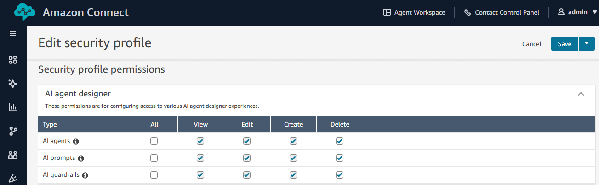
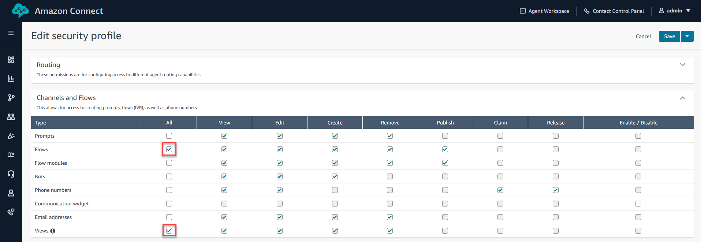

# Assigning security profile permissions to AI agents

## Security Profiles

Security Profiles in Amazon Connect control what users can access and what actions they can perform. For AI Agents, security profiles govern:

- Which tools an AI Agent can invoke
- What data the agent can access
- Which users can configure AI Agents and Prompts
- Whether an employee is authorized to have an AI agent take a particular action on their behalf

## Security Profile Permissions for AI Agents

Security profiles control both user capabilities and AI agent tool access in Connect. When you create or edit a security profile, you can assign permissions for:

- **AgentCore gateway tools** added to Connect
- **Flow modules** saved as tools
- **Out-of-the-box tools** for common operations like updating cases and starting tasks

The security profile permissions for built-in tools mirror those used for employee access.

| AI Agent Tool                  | Required Human Agent Permission                   |
| ------------------------------ | ------------------------------------------------- |
| Cases (Create, Update, Search) | Cases • View/Edit in Agent Applications        |
| Customer Profiles              | Customer Profiles • View in Agent Applications |
| Knowledge Base (Retrieve)      | Connect assistant • View Access                |
| Tasks (StartTaskContact)       | Tasks • Create in Agent Applications           |

To assign an AI agent one or multiple security profiles, go to the AI agent edit page in your Connect website and you will find a dropdown where you can pick the security profiles to assign the AI agent and hit save to confirm the changes.

## Tool-Level Permissions

Beyond security profiles, you can control tool access at the AI Agent level:

### Configuring Tool Access

When creating or editing an AI Agent:

1. Navigate to **Analytics and Optimization** → **AI Agents**
2. Select or create an AI Agent
3. In the **Tools** section, select which tools this agent can access
4. Add instructions on how the AI agent should use the selected tool to optimize AI agent performance.

### Agent Workspace Permissions

For human agents using AI Agent assistance in the Agent Workspace, assign this permission to get access to the Connect Assistant that is powered by AI agents.

| Permission                             | Location           |
| -------------------------------------- | ------------------ |
| **Connect assistant • View Access** | Agent Applications |

###### Shared Permissions

When using AI Agents for Agent Assistance, the human agent's security profile must include the same permissions as the AI Agent's configured tools. The AI Agent operates within the context of the human agent's session, so tool invocations are authorized against the combination of the AI agent and human agent's permissions.

**Example**: If an AI Agent has access to the Cases tool (CreateCase, SearchCases), the human agent using that AI Agent must also have Cases permissions in their security profile. Otherwise, the AI Agent's tool invocations will fail.

## Administrator Permissions

For administrators configuring AI Agents and Prompts:

| Permission                            | Location           | Purpose                                |
| ------------------------------------- | ------------------ | -------------------------------------- |
| **AI Agents • All Access**         | AI agent designer  | Create, edit, and manage AI Agents     |
| **AI Prompts • All Access**        | AI agent designer  | Create, edit, and manage AI Prompts    |
| **AI Guardrails • All Access**     | AI agent designer  | Create, edit, and manage AI Guardrails |
| **Conversational AI • All Access** | Channels and Flows | View, edit, and create Lex bots        |
| **Flows • All Access**             | Channels and Flows | Create and manage contact flows        |
| **Flow Modules • All Access**      | Channels and Flows | Create flow modules as tools           |

## Configuring Security Profiles

### Step 1: Access Security Profiles

1. Log in to the Amazon Connect admin console
2. Navigate to **Users** → **Security profiles**
3. Select the security profile to modify (or create a new one)

### Step 2: Configure Agent Permissions

For agents who will use AI assistance:

1. In the security profile, expand **Agent Applications**
2. Enable **Connect assistant - View Access**

### Step 3: Configure Administrator Permissions

For administrators who will configure AI Agents:

1. Expand **AI agent designer**
2. Enable **AI Agents - All Access**
3. Enable **AI Prompts - All Access**
4. Enable **AI Guardrails - All Access**

 5. Expand **Channels and Flows** 6. Enable **Bots - All Access** 7. Enable **Flows - All Access** 8. Enable **Flow Modules - All Access** (if using flow modules as tools)

### Step 4: Save Changes

- Click **Save** to apply the security profile changes

## Reference Documentation

For detailed information, see:

- [Update security profiles](update-security-profiles.md "update-security-profiles.md")
- [Security profile permissions](security-profile-list.md "security-profile-list.md")
