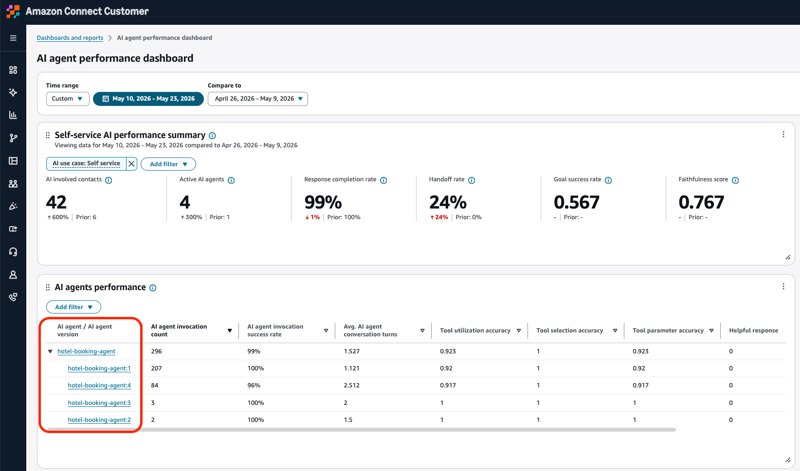
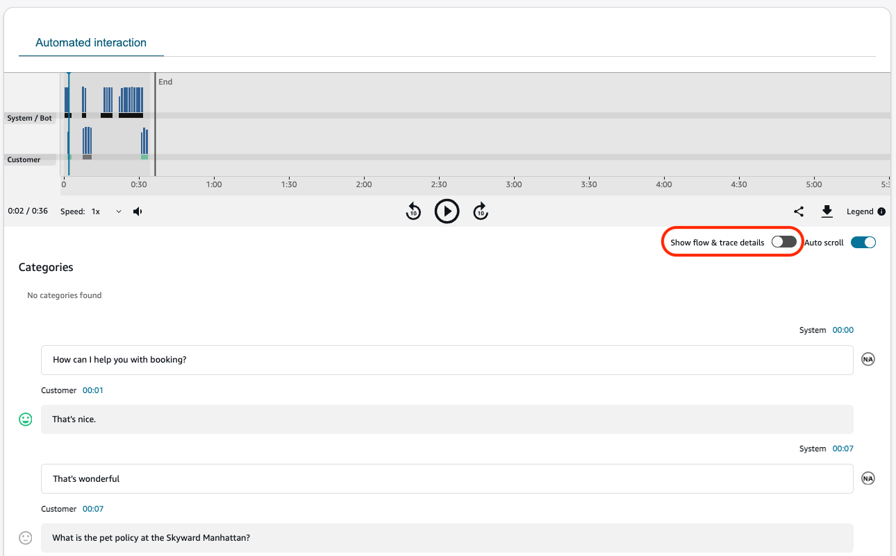
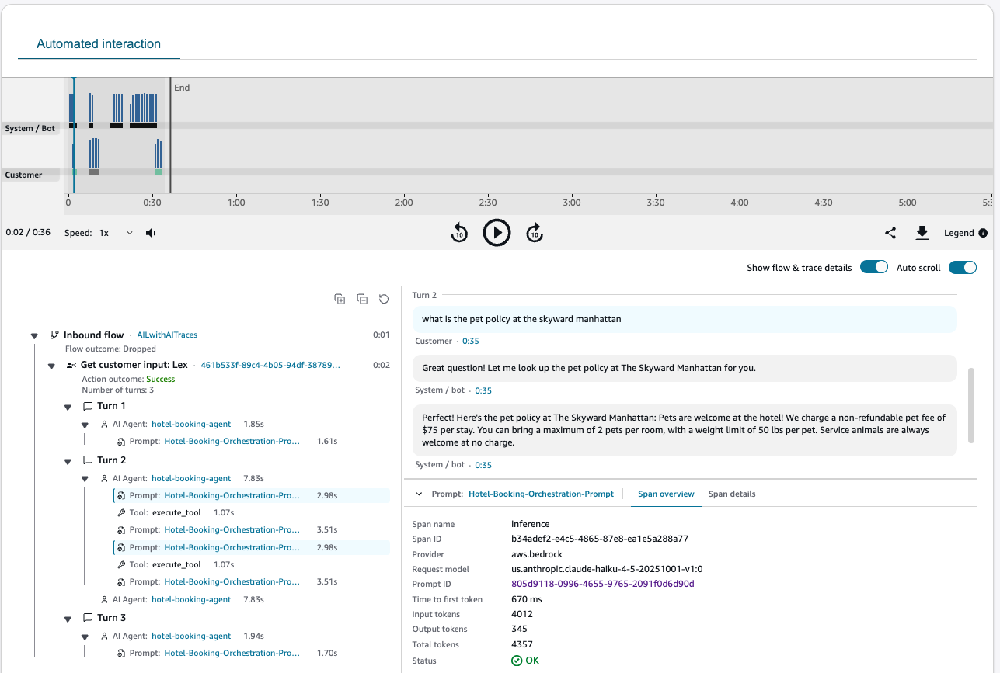
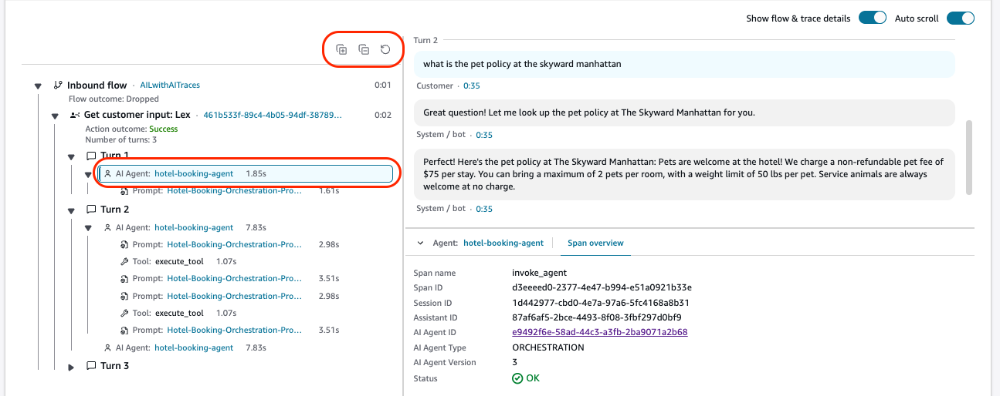
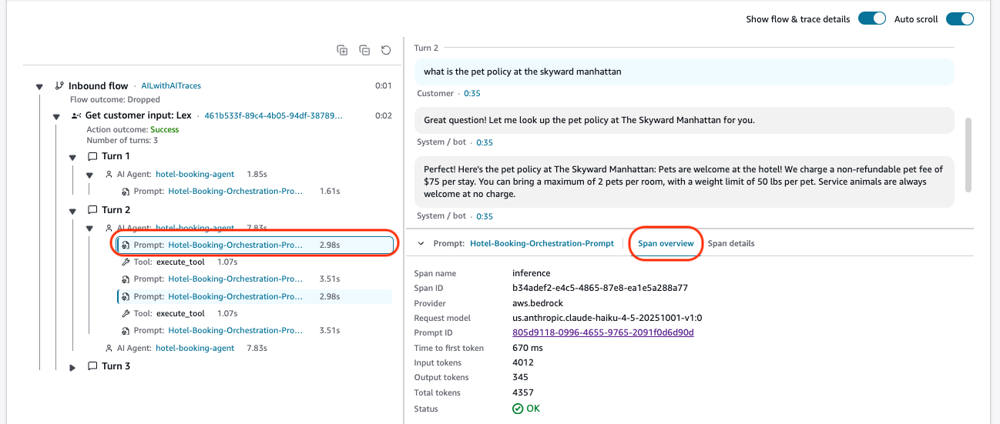
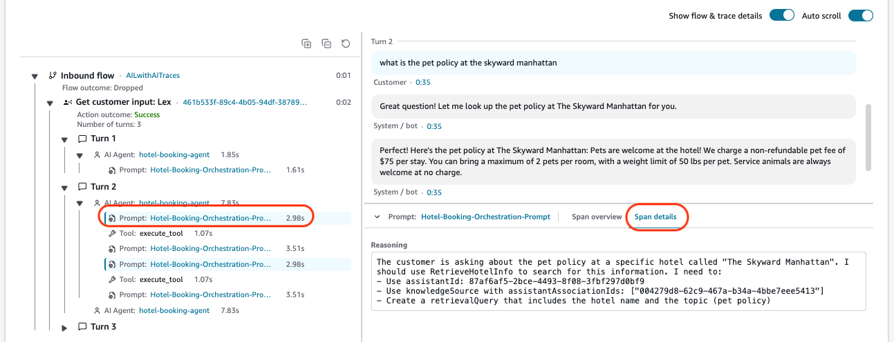

# AI agent traces using Contact search and Contact details

You can use AI agent traces to review, investigate, and improve your automated customer
interactions. Drill down into AI agent trace details from the Connect Customer analytics dashboards,
or directly through Contact search. The AI agent trace details appear on the
**Contact details** page and include the following information:

- Flow, Lex bot, and AI agent invocation and span details alongside the
  self-service transcript. This experience is powered by the Automated Interaction
  Log. For more details, see [Monitor automated interactions (IVR) in Connect Customer](monitor-automated-interaction-logs.md "monitor-automated-interaction-logs.md").

## Enable AI agent trace details

Complete the following steps to verify that AI agent trace details are enabled for
your Connect Customer instance.

###### Note

Currently, Connect Customer doesn't support S3 buckets with [Object Lock](../../../AmazonS3/latest/userguide/object-lock.md "../../../AmazonS3/latest/userguide/object-lock.md")
enabled.

1. Open the Connect Customer console at
   `https://console.aws.amazon.com/connect/`.
2. Verify that your automated interaction logs are saved to the S3 bucket you
   configured for call recordings. If call recordings are not yet enabled for
   your instance, enable them now:

   1. In the navigation pane, choose **Data storage**,
      **Call recordings**, **Edit**,
      **Enable call recording**, and then create or
      select your S3 bucket.

3. In the navigation pane, choose **Flows**.
4. Under the **Amazon Lex Bots** section, select
   **Enable Bot Analytics, Transcripts, and AI Agent Traces in
   Amazon Connect**. Choose this option to log a full transcript of the
   Amazon Lex portion of the customer's experience. The transcript and traces
   is then available for you to read on the
   **Contact details** page.

###### Note

If you previously enabled **Bot Analytics, Transcripts, and AI
Agent Traces in Amazon Connect** (prior to June 5, 2026), you
must disable and
re-enable this setting to activate the AI agent traces
feature. 5. Under the **Automated interaction logs** section, select
**Enable Automated Interaction Logs**. This enables you to
view Flow details, Lex bot, and AI agent traces on
the **Contact details** page.

## Permissions for automated interaction logs

To keep customer data secure, you need to set up permissions for granular control
over who can access automated interaction logs. Access is gated by the following
security profile permissions:

- **Flows** and **Flow modules – View**
  permissions: These permissions are required to see flow and module specific
  data on the automated interaction logs.
- **Analytics and Optimization** - **Automated
  interaction voice (IVR) transcripts (unredacted)** permissions:
  These permissions are required to access logs of the IVR interaction such as
  keypad inputs in response to IVR prompts, transcripts of Lex interactions,
  AI agent traces and more.

## Navigate to AI agent trace details

You can drill down into AI agent trace details in two ways:

- **From the AI agent performance
  dashboard:** Navigate to the AI agent performance widget and drill
  into the AI agent of your interest. This automatically redirects you to the
  Contact search page, pre-filtered to the AI agent and time range you
  selected. You see all contacts handled by that AI agent. Choose the
  **Contact ID** hyperlink to open Contact details.
- **From Contact search:** Search for a contact
  directly through Contact search. For more information, see [Search for completed and in-progress
  contacts](contact-search.md "contact-search.md").

On the **Contact details** page, under the **Automated
Interaction** tab, toggle **Show flow & trace
details** to show or hide automated interaction details for Flows, Lex
bots, and AI agents.

###### Note

Please allow up to 30 minutes after a contact terminates for the Automated
Interaction Log to become available, and the toggle to be activated.

The following image shows an example of AI agent trace details on the
**Contact details** page.

## AI agent performance metrics

The following AI agent performance metrics are available for your contact:

- **Completeness score:** This metric measures
  the proportion of sessions where the Orchestration AI agent responses fully
  address all parts of customer requests rather than providing partial or
  incomplete answers. Value is between 0-1, where 1 indicates complete
  responses across all sessions.
- **Faithfulness score:** This metric measures
  the proportion of sessions where the Orchestration AI agent responses remain
  faithful to the conversational context, including messages and tool call
  results. Value is between 0-1, where 1 indicates perfect contextual
  fidelity.
- **Goal success rate:** This metric measures
  the proportion of sessions where the Orchestration AI agent successfully
  resolved customer issues. Value is between 0-1, where 1 indicates successful
  resolution across all sessions.
- **Tool utilization accuracy:** This metric
  measures the rate of correct tool utilization by AI agents, including proper
  parameters and selection. Value is between 0-1, where 1 indicates perfect
  utilization.

###### Note

This set of metrics becomes available after 24 hours and is included as part
of the Connect Customer AI.

## AI agent trace details

###### Note

AI agent trace details are currently available for the voice channel.

### Flows

- Choose the flow and block hyperlinks to open the flow designer in a
  new tab, enabling you to quickly follow along with your flow.
- Select **Play** to play the specific prompt within
  your audio recording file.

###### Note

If no audio recording is available, the Play option does not
appear.

- Quickly identify where errors have occurred, including customer
  timeouts or Lambda function errors.

### Lex bot

- The hyperlink redirects to the Get customer input block configured in
  your flow.
- You can see where bot intents are detected and resolved, with the
  Action outcome status.

### AI agents

- You can choose to expand all trace details using the (+) icon, and
  collapse all trace details with (-) icon. You can also manually refresh
  your traces.
- Choose an AI agent invocation activity to see AI agent trace
  details.

- When your AI agent calls a Prompt (executed through an inference
  span), the AI agent is invoking an LLM through Amazon Bedrock. The
  trace details show model reasoning and tool call information.
- Knowledge base citation reference is available under the Prompt
  (inference span) under Span details, when configured and
  available. To make sure you have your citations configured, see
  [Knowledge base retrieval configuration](multiple-knowledge-base-setup-and-content-segmentation.md#add-citation-data-ai-agent-trace "multiple-knowledge-base-setup-and-content-segmentation.md#add-citation-data-ai-agent-trace").
- For each tool call, you can view the Tool metadata along with the
  input parameters passed into the tool call.
- Latency for each span is displayed on the right to each
  activity.
- Choose the **AI agent** or
  **Prompt** hyperlink to navigate to the AI agent
  configuration page or the AI agent prompt page,
  respectively.

The following labels might appear in the trace:

- **ESC:** Stands for Escalate. Shows you
  when the AI agent escalated to a human agent.
- **ERR:** Stands for Error. When the span
  received an error status. A status description provides the error
  details. This can include errors such as:

  - **AI barge in:** The end-customer
    interrupted during AI reasoning or response generation, causing
    the model inference to stop before the AI agent completed its
    response.
  - **Timeout:** The system waited
    for a response or result from that operation, but it exceeded
    the maximum allowed time window.
