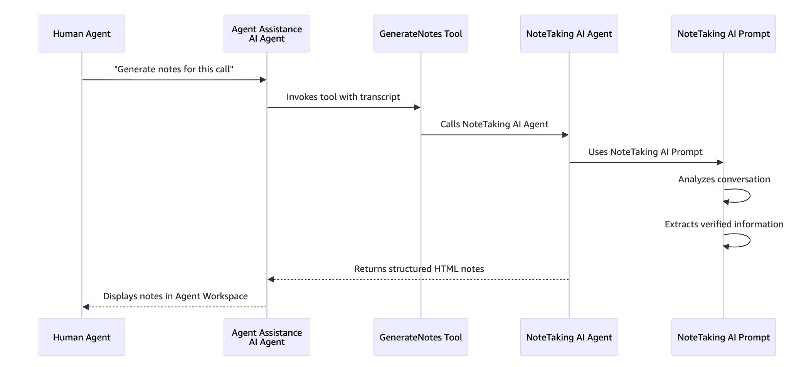
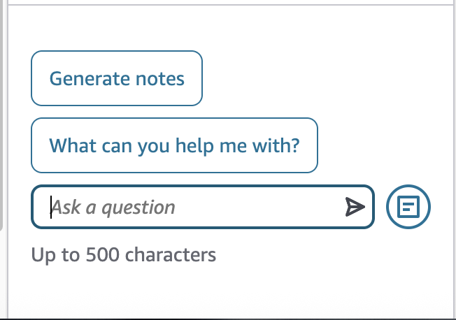
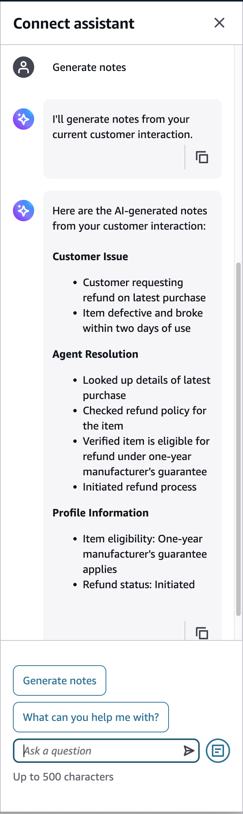

# Use AI-generated note taking

Connect AI agents can on-demand generate contact summaries and notes for voice and chat
interactions. AI-generated note taking boosts agent productivity by eliminating manual
note-taking and bookkeeping tasks, creating a draft summary based on the conversation
transcript.

When enabled, the AI agent analyzes the full conversation transcript and generates a
structured summary that might include:

- The customer's issue or intent
- Relevant account or contextual details discussed
- Actions taken during the interaction
- Follow-up steps (if any)
- The final resolution or outcome
  The generated notes are displayed in the agent workspace during or after the contact. Agents
  can review, edit, or replace the generated content before saving it.

## When to generate notes

Notes can be generated at any point during a contact – not just at the end. The AI
agent analyzes the current transcript and produces an updated summary.

### Mid-contact use cases

- **Recall earlier details** – Review long
  conversations quickly.
- **Prepare for transfer** – Provide complete
  context to specialists.
- **Document progress** – Track multi-issue
  contacts between resolutions.
- **Verify understanding** – Confirm key points
  after complex explanations.
- **Update CRM mid-call** – Enter fresh
  information during customer holds.

## How AI-generated note taking works

The GenerateNotes tool automatically processes conversation transcripts through the
NoteTaking AI Prompt with RESULT\_TYPE: NOTES to produce and display HTML-formatted
structured notes in the Agent Workspace.

### Agent experience

AI-generated notes appear directly within the agent workspace as editable text.
Agents can:

- Modify wording for clarity
- Add missing details
- Remove unnecessary information
- Replace the summary entirely with manual notes

This ensures agents maintain control over what is stored in the contact record.

### Administrative considerations

Before using AI-generated note taking:

- Contact transcription must be enabled.
- AI agents must be configured for the applicable channel (voice or chat).
- Appropriate permissions must be granted to agents.

Administrators control whether AI-generated note taking is enabled for their instance
and which agents have access to it.

### Configure AI-generated note taking

Following is an overview of the steps to configure AI-generated note taking for
your contact center.

1. [Enable AI agents for your
   instance](ai-agent-initial-setup.md "ai-agent-initial-setup.md").
2. Enable NoteTaking for your instance.
3. Add the [Connect assistant](connect-assistant-block.md "connect-assistant-block.md") block to your flows before a
   contact is assigned to your agent.
4. Customize the outputs of your generative AI-powered assistant by
   [defining your prompts](create-ai-prompts.md "create-ai-prompts.md") to guide
   the AI agent with generating responses that match your company's language,
   tone, and policies for consistent customer service.

### Data handling

AI-generated notes are derived from the conversation transcript associated with the
contact. The generated summary becomes part of the contact record after the agent saves
or completes the contact.

The quality and completeness of generated notes depend on the accuracy of the
underlying transcript.
