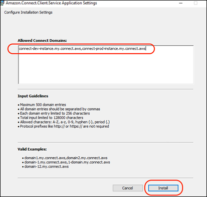
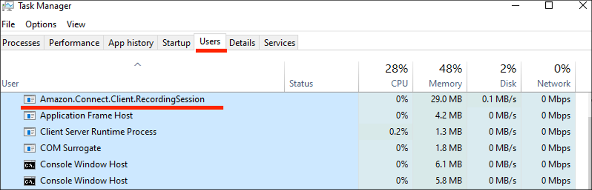
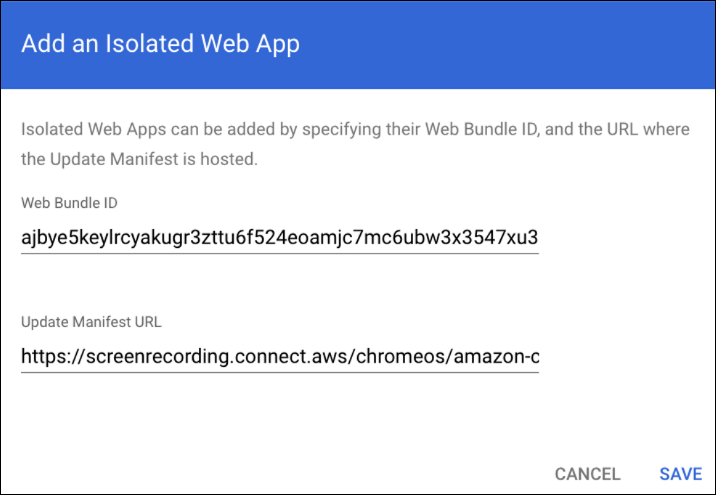
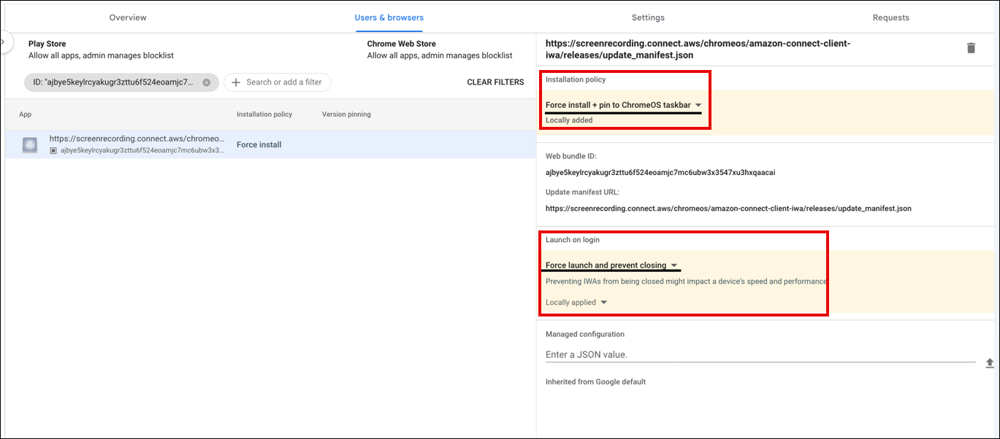
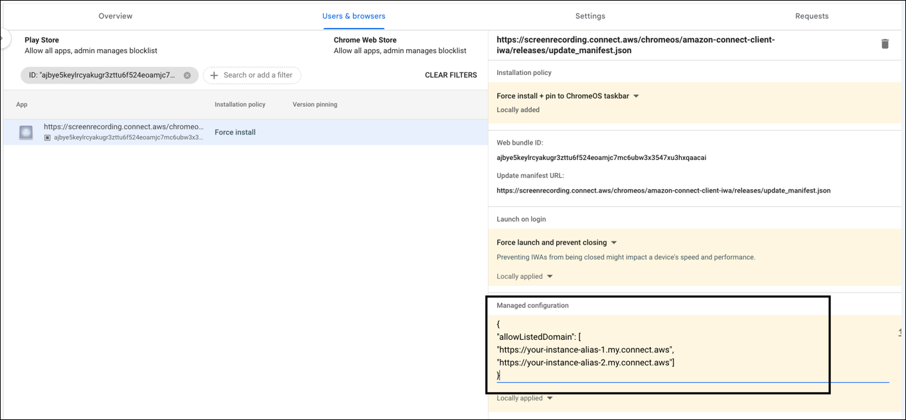
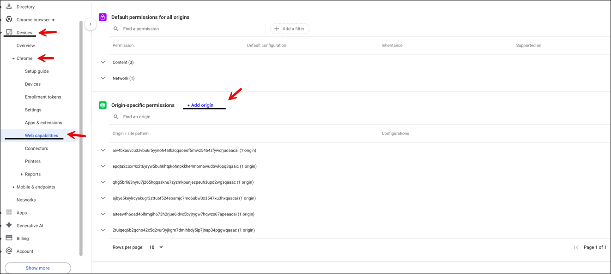
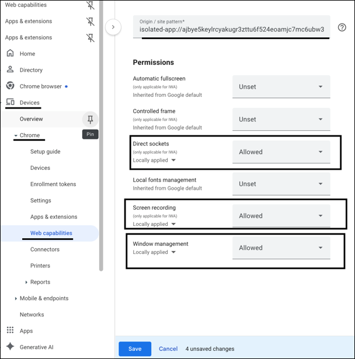
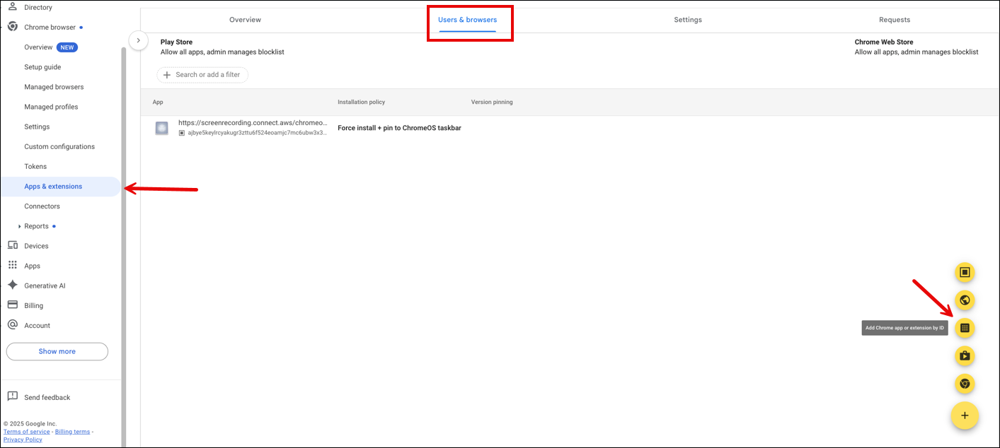
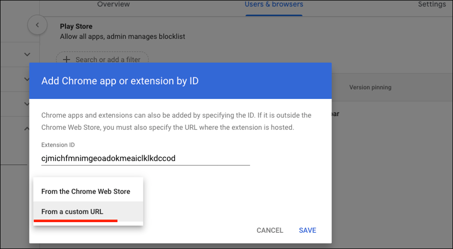
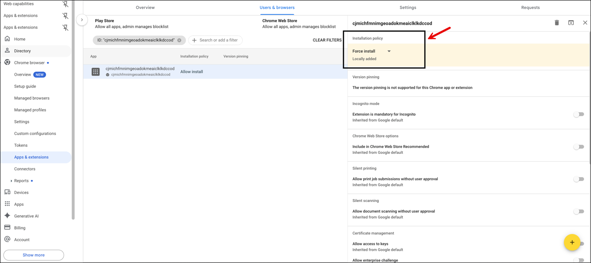

# Amazon Connect Client Application

Amazon Connect screen recording is supported in Windows and Chrome OS. This page provides the
download and installation instructions for the screen recording application in each
operating system, and the minimum system requirements for the agent devices.

###### Contents

- [Windows](#windows-client "#windows-client")
- [Chrome OS](#chrome-os "#chrome-os")

## Windows

### Version information

- Version: v2.0.3 (latest)
- Release date: January 16 2025
- Download link: [AmazonConnectClientWin-v2.0.3](https://d4yqf2f7seiym.cloudfront.net/builds/AmazonConnectClientWin-v2.0.3.zip "https://d4yqf2f7seiym.cloudfront.net/builds/AmazonConnectClientWin-v2.0.3.zip")
- Release note: This version supports AWS GovCloud (US) customers and has
  security improvements.

The above link downloads the
**AmazonConnectClientWin-[version].zip** file. The zip file
contains the
**Amazon.Connect.Client.Service.Setup.[version].msi** file.
For installation instructions, see [Enable screen recording](enable-sr.md "enable-sr.md").

To be notified when there is an update to the Amazon Connect Client Application, we recommend
subscribing to the RSS feed of this administrator guide. Choose the
**RSS** link that appears under the title of this page
(it's next to the PDF link).

### Client install instructions

In this step you install the
**Amazon.Connect.Client.Service** file onto the agent's
desktop, or into the virtual environment that the agent uses. This is the
Amazon Connect Client Application.

###### Note

- In case of Windows multi-session OS, run the installer only once
  on the machine. Screen recording on Windows multi-session OS is
  supported only by version 2.0.0 or later.
- If your Amazon Connect instance is in AWS GovCloud (US-West), you must install
  version 2.0.3 or later.
- You need to configure an allowlist of Amazon Connect domains that are
  allowed to communicate with the client application. Screen
  recordings are captured only from Amazon Connect domains specified in your
  allowlist.

#### Programmatic installation by using software distribution

tools

- Download the latest version of the
  **Amazon.Connect.Client.Service.Setup.msi**
  file.
- Use your organization's software distribution mechanism, such as
  Software Center, to install the
  A**mazon.Connect.Client.Service** client app on
  agent desktops.
- Deploy using your organization's enterprise software distribution
  system such as Microsoft System Center Configuration Manager, SCCM,
  or other automated deployment tools.
- Include the `ALLOWED_CONNECT_DOMAINS` parameter by
  using the following syntax:

```
msiexec /i Amazon.Connect.Client.Service.Setup.msi ALLOWED_CONNECT_DOMAINS="connect-dev-instance.my.connect.aws,connect-prod-instance.my.connect.aws"
```

#### Manual installation

- Download the latest version of the
  **Amazon.Connect.Client.Service.Setup.msi** file.
- Double-click the installer file.
- Enter the Amazon Connect domains allowlist when prompted. The following
  image shows an example of how to specify a domain in the allowlist
  on the **Configure Installation Settings** dialog
  box. For more examples, see _Guidelines for specifying your
  Amazon Connect domains allowlist_ below.



- Choose **Install** to complete the
  installation.

#### Verify the Amazon Connect Client Application is running and functioning correctly

##### To verify that the application is running:

- In Windows Task Manager, check for a background process named
  **Amazon.Connect.Client.Service**. This is
  the Amazon Connect Client Application.
- In Windows Task Manager, under **Users
  processes**, check for another process named
  **Amazon.Connect.Client.RecordingSession**
  after the user accepts the very first contact where screen
  recording is enabled.

The following image shows
**Amazon.Connect.Client.RecordingSession**
in Task Manager.



##### To verify that the application is functioning correctly and

creating log files:

1. Navigate to the following directory:
   `C:\ProgramData\Amazon\Amazon.Connect.Client.Service\logs`
2. Open log files that are present in the directory.
3. In a successful installation the log files contain the
   following line: `Checking that services are still
running, result : true`
4. Navigate to the following directory:
   `%USERPROFILE%\AppData\Local\Amazon\Amazon.Connect.Client.RecordingSession\Logs`
5. Open log files that are present in the directory.
6. In a successful installation the log files contain the
   following line: `Session initiation completed
with result: True`

#### Guidelines for specifying your Amazon Connect domains allowlist

Be sure to adhere to the following guidelines when you enter domains in
the **Allowed Connect Domains** box. Otherwise your
installation will fail.

- Format: Comma-separated Amazon Connect domains
- Valid characters for Amazon Connect domains: Use only A-Z, a-z, 0-9, hyphen
  (-), period (.)
- Protocol prefixes such as https:// or http:// are not
  required.
- Limitations:
  - Maximum 500 domain entries
  - Maximum 256 characters per domain entry
  - Maximum 128,000 characters total input length

Following are examples of how to specify your domain.

##### Correct

- domain1.my.connect.aws,domain2.my.connect.aws
- ddomain-1.my.connect.aws, 1-domain.my.connect.aws
- domain-12.my.connect.aws

##### Incorrect

- \_123domain.foo
- domain:2.foo
- \*domain.my.connect.aws
- https://domain1.my.connect.aws
- \*.my.connect.aws

## Chrome OS

Amazon Connect screen recording feature on ChromeOS requires two components:

- Isolated Web App
- Google Chrome Browser Extension

The installation of these components on Agent Chrome devices can be performed
through Google Enterprise Admin Console. The URLs to configure the installation of
the Isolated Web App and Chrome browser extension are provided below and can be set
to automatic update through web manifest configuration JSON.

### Download location and Install instructions

Complete the following steps on the Google Enterprise Admin Console. Apply the
policy for all the agent devices where screen recording feature needs to be
enabled.

#### Install Isolated Web App

- Web Bundle ID:
  `ajbye5keylrcyakugr3zttu6f524eoamjc7mc6ubw3x3547xu3hxqaacai`
- Update Manifest URL:
  `https://screenrecording.connect.aws/chromeos/amazon-connect-client-iwa/releases/update_manifest.json`

###### To install Isolated Web App

1.  Navigate to the [Google Admin
    Portal](https://admin.google.com "https://admin.google.com") (https://admin.google.com) and login with your
    Google enterprise admin credentials.
2.  Select **Add an Isolated Web App**.
3.  Copy and paste the following details, and then choose
    **Save**:

        * Web Bundle ID:
         `ajbye5keylrcyakugr3zttu6f524eoamjc7mc6ubw3x3547xu3hxqaacai`
        * Update Manifest URL:
         https://screenrecording.connect.aws/chromeos/amazon-connect-client-iwa/releases/update\_manifest.json

    The following image shows an example **Add an Isolated Web
    App** dialog box that has been completed.

 4. Configure **Installation Policy** to `Force
 Install + Pin to ChromeOS Taskbar` and change
**Launch on Login** to `Force Launch and
 Prevent Closing` to make sure Isolated Web App starts
automatically when a computer is logged into and restarts.

 5. Configure **Managed configuration** to allowlist
your Amazon Connect domains that are allowed to initiate screen recording on
agent machines. An example of **Managed
configuration** is shown in the following image.



    * The key name MUST be `allowListedDomain`.
     Domain names should not include any paths, query strings, or
     trailing slashes (/).
    * Replace `your-instance-alias-*` with your
     actual Amazon Connect instance alias.

```
{
"allowListedDomain": [
"https://your-instance-alias-1.my.connect.aws",
"https://your-instance-alias-2.my.connect.aws"]
}
```

6.  Complete the following steps to configure the Isolated Web App to
    allow Direct sockets, Screen recording, and Window management
    permissions:

        * Navigate to **Devices**,
         **Chrome**, **Web
         capabilities**, **Add
         Origin**.
        * input
         `ajbye5keylrcyakugr3zttu6f524eoamjc7mc6ubw3x3547xu3hxqaacai`,
         and then choose **Save**.

    The following image shows where Devices, ChromeS, and Web
    capabilities are located in the left navigation menu in Chrome.



The following image shows the location of **Direct
sockets**, **Screen recording**, and
**Window management** on the Web capabilities
page.



#### Install Google Chrome Browser Extension

- Extension ID: cjmichfmnimgeoadokmeaiclklkdccod
- Custom URL:
  `https://screenrecording.connect.aws/chromeos/amazon-connect-extension/releases/updates.xml`

###### To install Google Chrome Browser Extension

1. Navigate to **Add Chrome app or extension by
   ID**, as shown in the following image.

 2. In the **Add Chrome app or extension by ID**,
choose **From a custom URL** and enter the
following information:

    * Extension ID:
     `cjmichfmnimgeoadokmeaiclklkdccod`
    * Custom URL:
     `https://screenrecording.connect.aws/chromeos/amazon-connect-extension/releases/updates.xml`


    

3. Configure **Installation Policy** to
   **Force Install**, and then choose
   **Save**, as shown in the following
   image.


