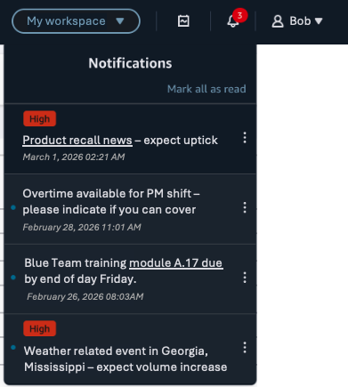

# Notifications in the workspace header

## Understanding in-app notifications

In-app notifications are on-screen alerts that appear in the Amazon Connect header. They provide a central way to communicate important information to users that are logged into Amazon Connect. Notifications can be sent to administrators and agents. No matter what page a user is on, the header icon will indicate if they have unread messages.

###### Supported Use Cases

Notifications support the following use cases:

- System notifications such as availability impacts, failover events, policy changes, and critical feature updates.
- Custom organizational messages specified in API requests by your team for desired use cases, for example training reminders, schedule adherence alerts, and emergency notifications to your teams.

## How Notifications Appear

Notifications display in the Connect header with an icon indicating an unread message(s). Users click the icon to view messages.

The notification panel shows:

- **Priority indicator**: Urgent messages are emphasized
- **Message content**: Up to 500 characters per localized string, with support for embedded links
- **Mark as read**: Users can mark as read or unread by clicking on the actions menu on the right of each message

Unread notifications appear in bold with a dot indicator, sequenced newest to oldest. Read notifications have reduced visual emphasis. Users that do not have time to react to a message they have opened can mark it as unread as a visual reminder.

Notifications have a default visibility period of one week. Expired messages are automatically removed.

## Creating and Managing Notifications (API only)

Any user can _receive_ notifications without additional permissions, but special permission is required to create, edit, delete, and view sent notifications.

###### Important

To compose and send a notification requires API permissions. For more information about leveraging notification APIs see the [API guide](../APIReference/actions-by-resource.md "../APIReference/actions-by-resource.md").

Granular access controls are enforced for users with permission to manage notifications:

- **Tag-Based Access Control (TBAC)**: Admins with TBAC restrictions can only create, edit, or delete notifications that match their assigned tags. They can also only send notifications to users who have matching tags.
- **Hierarchy-Based Access Control (HBAC)**: Admins can only create or manage notifications sent to users below their hierarchy level.

Your team can perform the following notification actions:

- Send rich text messages with embedded links
- Translate message in different languages to align with user preferences (up to 500 characters per localized string)
- Specify the duration of each message, its "time to live" i.e. TTL (default is 1 week)
- Update or delete existing messages
- Send to up to 200 users at one time, or if necessary, everyone in the instance
  - ###### Important

  Only admins without tag-based access control (TBAC) restrictions or hierarchy-based access control (HBAC) restrictions can create notifications for all users in an instance

- Flag urgent messages as high priority so they are more visible

### Best practices

###### Important

Do not include Personally Identifiable Information (PII)

###### Minimize notification overload

Up to 500 active notifications per instance are supported. Avoid the probability of notification fatigue by:

- **Targeting specific audiences**: Cast the narrowest net possible.
- **Consolidating related updates**: Group information into a single notification rather than sending multiple messages.
- **Avoiding redundant messages**: Before creating a new notification, consider whether updating an existing one would be more appropriate.
- **Using appropriate priority**: Reserve high priority for truly important messages to maintain its effectiveness.
- **Providing succinct messages**: Include links to full documentation rather than lengthy content in notifications.

###### Manage ongoing situations

For events that generate multiple updates (such as weather disruptions or system issues), consider:

- Sending only the most pertinent status changes (e.g., "incident initiated" and "incident resolved")
- Pacing updates at reasonable intervals—avoid overwhelming users with rapid-fire messages
- Setting expectations about update frequency (e.g., "Updates will be sent every 10 minutes until conditions improve")
- Using the update API to modify existing notifications rather than creating new ones for each status change

_Example_: If severe weather affects 320 agents in your IT support queue, send an initial alert with the impact. Five minutes later, update with current status: "170 agents remain without access." Continue with meaningful updates at defined intervals.

###### Important

Notifications refresh each time the user navigates pages or refreshes their browser.

###### When to use alternatives

Consider alternatives to notifications in these scenarios:

- **For tracked action items**: Notifications provide CloudTrail auditing but are not as robust as the Tasks feature, which provides assignment, tracking, and reporting capabilities. The notification system does not provide delivery confirmation or read receipts.
- **For scenarios that require data retention**: Notifications are only stored until their TTL expires or they are manually deleted. Default TTL is one week.
- **For AWS console users**: Notifications only appear in the Connect website. They cannot reach users working exclusively in the AWS console.

###### Testing and verifying receipt

Follow these guidelines when testing notifications:

- **Test before broad deployment**: Send to a small group first to validate content and formatting.
- Be aware that notifications are sent immediately upon creation; scheduled delivery is not supported.
- **Verify delivery**: Include yourself in the recipient list to confirm the notification appears as expected.
