# Release notes for Amazon Connect

We recommend subscribing to the RSS feed so updates to these notes are delivered to your
Inbox. Click the **RSS** link (under the topic title **Release
notes**), and then copy the URL (it ends with `doc-history.xml.rss`) into
your RSS reader. For example, you can subscribe to an RSS feed in Outlook.

## January 2026 Updates

### Amazon Connect now simplifies linking related contacts to cases using flows

Amazon Connect now makes it easier to link related contacts such as email replies, call transfers,
persistent chats, and queued callbacks to the same case so agents can view the complete customer
journey and resolve issues faster. You can use flows to search for a case associated with a
prior contact in the [chain](contacts-contact-chains-attributes.md#contact-chains "contacts-contact-chains-attributes.md#contact-chains")
to follow-up contacts more easily.

In addition, you can now use flows to link a related contact to a case. For example, when you
create a case via a Step-by-Step Guide, you can link that case to the main contact (e.g., voice,
chat, email, or tasks) directly using flows.

### Recurring overrides and visual calendar for hours of operation

Amazon Connect now makes it easier to manage contact center operating hours for recurring events
like holidays, maintenance windows, and promotional periods, with a visual calendar that provides at-a-glance
visibility by day, month, or year. You can set up recurring overrides that automatically take effect weekly,
monthly, or every other Friday, and use them to provide customers with personalized experiences, all without
having to manually revisit configurations. For example, every January 1st you can automatically greet
customers with "Happy New Year!" and route them to a special holiday message before checking if agents are
available, then on January 2nd your contact center automatically returns to normal operations.

For more information, see [Set overrides for extended, reduced, and holiday hours](hours-of-operation-overrides.md "hours-of-operation-overrides.md").

### Cases now supports AWS CloudFormation

Amazon Connect Cases now supports AWS CloudFormation, enabling you to model, provision, and manage case resources as infrastructure as code. With this launch, administrators can create CloudFormation templates to programmatically deploy and update their Cases configuration—such as templates, fields, and layouts—across Amazon Connect instances, reducing manual setup time and minimizing configuration errors.

For more information, see [documentation](../../../AWSCloudFormation/latest/TemplateReference/AWS_Cases.md "../../../AWSCloudFormation/latest/TemplateReference/AWS_Cases.md").

### Agent screen recording status tracking

Amazon Connect now offers customers the ability to view status of agent screen recordings in near real time in CloudWatch using Amazon EventBridge. With screen recording, supervisors can identify areas for agent coaching (e.g., non-compliance with business processes) by not only listening to customer calls or reviewing chat transcripts, but also watching agents' actions while handling a contact (i.e., a voice call, chat and task). Using Amazon EventBridge, customers can see status of each agent screen recording including success/failure, failure codes with description, installed client version, agent web browser version, agent operating system, screen recording start and end times from CloudWatch.

Customers can start using Amazon Connect screen recording status tracking by subscribing to Screen Recording Status Changed event type in Amazon EventBridge event bus.

For more information, see [Set up and review agent screen recordings in Amazon Connect
Contact Lens](agent-screen-recording.md "agent-screen-recording.md").

### Store nested JSON object and looping arrays

Amazon Connect now enables you to store and work with complex data structures in your flows, making it easy to build dynamic automated experiences that use rich information returned from your internal business systems. You can save complete data records, including nested JSON objects and lists, and reference specific elements within them, such as a particular order from a list of orders returned in JSON format.

Additionally, you can automatically loop through lists of items in your customer service flows, moving through each entry in sequence while tracking the current position in the loop. This allows you to easily access item-level details and present relevant information to end-customers. For example, a travel agency can retrieve all of a customer's itineraries in a single request and guide the caller through each booking to review or update their reservations. A bank can similarly walk customers through recent transactions one by one using data retrieved securely from its systems. These capabilities reduce the need for repeated calls to your business systems, simplify workflow design, and make it easier to deliver advanced automated experiences that adapt as your business requirements evolve.

For more information, see [Flows in Amazon Connect](connect-contact-flows.md "connect-contact-flows.md").

## December 2025 Updates

### Workspace and data table resources provide business users with greater control over daily operations

Amazon Connect now gives business users greater control over daily contact center operations without
requiring technical resources. With new capabilities to adjust queues, routing behavior, and
customer experience settings in real time, business users can respond to changing conditions
immediately while maintaining enterprise-grade governance and security. Contact center
administrators can start by defining key business configurations such as queue assignments,
operating hours, skill mappings, and escalation rules, in data tables that directly drive contact
flows. Guides can then be configured to surface role-specific actions for each business user
within persona based workspaces. Together, these updates enable a business-led operating model
that keeps contact center operations fast, consistent, and secure, all without relying on IT.

For more information, see [Set up workspaces for your admin website users](amazon-connect-workspaces.md "amazon-connect-workspaces.md").

### Dashboards now support filtering metrics based on custom business dimensions

Amazon Connect dashboards now support filtering metrics based on custom business dimensions such as business divisions, product lines, or customer segments. Using predefined attributes, you can create business dimensions to filter metrics helping you customize the dashboards based on your unique business need. For example, if your queue handles contacts across product lines, you can filter metrics by product line to compare handle times and determine where agents need product training.

For more information, see [Dashboards in Amazon Connect for getting contact center performance
data](dashboards.md "dashboards.md").

### Automated agent performance evaluations support 5 additional languages

Amazon Connect now automates agent performance evaluations in Portuguese, French, Italian, German, and Spanish using generative AI. Managers define custom evaluation criteria in natural language and receive AI-generated evaluations with justifications in their preferred language. Performance evaluations also supports cross-language evaluation and can complete assessments in English, even when the conversation is in another language. This enables multilingual contact centers to use a standardized evaluation framework across languages.

For more information, see [Evaluate agent and self-service interaction performance in Amazon Connect](evaluations.md "evaluations.md").

### Additional details available within real-time metric alerts

Amazon Connect alerts on real-time metrics now provide the specific agents, queues, flows, or routing profiles that exceeded thresholds and triggered the alert. This enables managers to respond faster to customer experience and operational issues by eliminating the need to manually investigate the root cause of the alert. For example, alerts on elevated queue wait times now include the exact queues affected, so managers can reassign agents to those queues. These detailed alerts can be sent through email, tasks, and Amazon EventBridge.

For more information, see [Create alerts on real-time metrics in
Amazon Connect](rule-real-time-metrics.md "rule-real-time-metrics.md").

### Multiple choice and date questions now possible in evaluation forms

Amazon Connect provides two new evaluation question types to capture deeper insights on human and AI agent performance. Managers can now create questions that allow multiple answer selections, such as the products that the customer was interested in during a sales conversation. Additionally, managers can capture dates for customer and agent actions within evaluation forms. For example, you can record when a customer applied for a loan and when it was approved.

For more information, see [Create an evaluation form in Amazon Connect](create-evaluation-forms.md "create-evaluation-forms.md").

### WhatsApp channel for Outbound Campaigns

Amazon Connect Outbound Campaigns now supports WhatsApp, expanding on the WhatsApp Business messaging capabilities that already allow customers to contact your agents. You can now engage customers through proactive, automated campaigns on their preferred messaging platform, delivering timely communications such as appointment reminders, payment notifications, order updates, and product recommendations directly through WhatsApp. Setting up WhatsApp campaigns uses the same familiar Amazon Connect interface, where you can define your target audience, choose personalized message templates, schedule delivery times, and apply compliance guardrails, just as you do for SMS, voice, and email campaigns.

Previously, Outbound Campaigns supported SMS, email, and voice channels, while WhatsApp was available only for customers to initiate conversations with your agents. With WhatsApp support in Outbound Campaigns, you can now proactively reach customers through an additional messaging platform while maintaining a unified campaign management experience. You can personalize WhatsApp messages using real-time customer data, track delivery and engagement metrics, and manage communication frequency and timing to ensure compliance. This expansion provides greater flexibility to connect with customers on their preferred platforms while streamlining your omnichannel outreach strategy.

For more information, see [Create an outbound campaign in Amazon Connect](how-to-create-campaigns.md "how-to-create-campaigns.md").

## November 2025 Updates

### Conditional case field visibility and dependent options

Amazon Connect Cases now supports conditional field visibility and dependent field options,
so you can simplify case layouts and ensure agents capture the right information faster.
For example, you can show a Return Reason field only when the case involves a return,
and limit Issue Type choices to hardware-related options when Issue Category is set to Hardware.

For more information, see [Add case field conditions to a case template in
Amazon Connect](case-field-conditions.md "case-field-conditions.md").

### Custom metrics

Amazon Connect now supports creation of custom metrics, enabling contact center supervisors to
analyze tailored performance measurements without requiring technical skills. This feature
provides a simple, no-code interface for performing mathematical operations (e.g., addition,
subtraction, sum, average) on existing Connect data to build metrics that align with your
organization's specific business requirements. Custom metrics are available to use in the
dashboards and APIs.

For more information, see [Custom metric primitives](metric-primitive-definitions.md "metric-primitive-definitions.md").

### Native testing and simulation capabilities

Amazon Connect now allows you to test and simulate contact center experiences in just a few clicks, making it easy to validate workflows, self-service voice interactions, and their outcomes. For each test, you can configure the test parameters including the caller's phone number or customer profile, the reason for the call (such as "I need to check my order status"), the expected responses (such as "Your request has been processed"), and business conditions like after-hours scenarios or full call queues. After executing tests, results show success or failure based on your defined criteria, along with the path taken by the simulated interaction and detailed logs to quickly diagnose potential issuesWith this launch, you can run multiple tests simultaneously to validate scenarios and workflows at scale, reducing testing time. Companies can view test results and identify common failure patterns across all their tests in Connect's analytics dashboards. These capabilities enable you to rapidly validate changes to your workflows and confidently deploy new experiences to adapt to your ever-changing business needs.

For more information, see [Amazon Connect call simulation](testing-simulation.md "testing-simulation.md").

### New criteria to automatically select relevant contacts for performance evaluation

Amazon Connect provides managers with new criteria while setting up automated evaluations, making it easier to identify relevant contacts for evaluation, and providing additional insights to automatically populate evaluation forms. For example, managers can specify that inbound contacts with no connectivity issues, handled by agents in a specific department, should be automatically evaluated using a particular evaluation form. Additionally, managers can use new metrics criteria on agent call avoidance, contact handling efficiency, and audibility, to automatically fill the selected form.

For more information, see [Evaluate agent and self-service interaction performance in Amazon Connect](evaluations.md "evaluations.md").

### Support for third-party speech-to-text and text-to-speech AI models for end-customer self-service

Amazon Connect now supports third-party speech providers for end-customer self-service, giving you greater flexibility in how you deliver voice experiences. You can integrate Deepgram for speech-to-text and ElevenLabs for text-to-speech directly within Amazon Connect, using them together with Amazon Connect's native speech capabilities, built-in orchestration, analytics, and compliance controls. This feature is available with Amazon Connect unlimited AI and in all commercial AWS regions where Amazon Connect is offered.

For more information, see [Configure third-party speech-to-text (STT)
providers](configure-third-party-stt.md "configure-third-party-stt.md").

### Enhanced agent assistance capabilities

Amazon Connect now provides customer service representatives with new AI agents that guide them through customer interactions by recommending actions, retrieving information, and executing tasks on their behalf. For example, an AI agent can guide a representative through processing a product return by automatically pulling order history, calculating refund amounts, and initiating the return process. These AI agents analyze conversation context and customer sentiment in real-time, actively completing tasks such as preparing documentation and handling routine processes. This enables representatives to focus on building customer relationships and handling complex situations while AI manages the background work, enhancing productivity and ensuring consistent outcomes. You can get started with out-of-the-box agents provided by Amazon Connect or easily customize AI agent behavior and actions to align with your business needs.

For more information, see [Create AI agents in Amazon Connect](create-ai-agents.md "create-ai-agents.md").

### Granular access controls for performance evaluations

Amazon Connect now enables businesses to restrict access to specific performance evaluation forms, preventing unauthorized access to evaluation form templates and completed evaluations. Businesses can provide managers access to modify or use only the evaluation form templates that are relevant to their business line or function, improving security and making it easier for managers to select the right form while completing evaluations. Additionally, both managers and agents can be restricted from viewing certain completed evaluations. For example, you can restrict agents from viewing test evaluations filled with a form template that is yet to be finalized.

For more information, see [Assign security profile permissions for
users to create and access evaluation forms](evaluation-forms-permissions.md "evaluation-forms-permissions.md").

### Simplified linking of related contacts to cases using flows

Amazon Connect now makes it easier to link related contacts such as email replies, call transfers, persistent chats, and queued callbacks to the same case so agents can view the complete customer journey and resolve issues faster. You can use flows to link a follow-up contact to an existing case, eliminating the need for custom logic or manual linking.

For more information, see [Flow block in Amazon Connect: Cases](cases-block.md "cases-block.md").

### Chat now supports agent-initiated workflows

Amazon Connect now supports agent-initiated workflows, enabling agents to send interactive forms to collect sensitive data or share general policies and disclosures within customer chat conversations, increasing efficiency and improving customer experience. For example, when a customer needs to update their address, agents can now send a form that customers complete without leaving the chat interface.Agents can trigger these workflows at any point during a chat conversation, making interactions more dynamic and responsive to customer needs. By handling everything within the ongoing chat conversation, businesses can maintain security and compliance standards while helping customers get faster solutions.

For more information, see [Enable agent-initated flows during active chat
sessions](agent-initiated-flows.md "agent-initiated-flows.md").

### Agentic self-service with more natural, expressive, and adaptive voice interactions

Amazon Connect is introducing agentic self-service capabilities that enable AI agents to understand, reason, and take action across voice and messaging channels to automate routine and complex customer service tasks. Connect enables you to blend deterministic and agentic experiences, allowing you to deploy these AI agents at scale, reliably and safely. With integration with advanced speech models from Amazon Nova Sonic, voice self-service experiences now deliver more natural and adaptive interactions. Connect's self-service voice AI agents understand not only what customers say but how they say it, adapting voice responses to match customer tone and sentiment while maintaining natural conversational pace across multiple languages and accents. For example, when a customer calls about an order issue, your AI agent can greet them by name, ask clarifying questions, look up their order status, and process a refund, with voice interactions that adapt to the customer's tone and respond expressively throughout the conversation. This enables your contact center to automate complex troubleshooting, account management, and consultative interactions while maintaining the ability to escalate to a live representative at any point.Nova Sonic support with Amazon Connect is available in two commercial AWS Regions: US East (N. Virginia) and US West (Oregon) and fully available in English and Spanish and in preview for French, Italian, and German.

For more information, see [this blog post](https://aws.amazon.com/blogs/aws/introducing-amazon-nova-2-sonic-next-generation-speech-to-speech-model-for-conversational-ai "https://aws.amazon.com/blogs/aws/introducing-amazon-nova-2-sonic-next-generation-speech-to-speech-model-for-conversational-ai").

### Chat now supports in-flight data redaction and message processing

Amazon Connect now supports message processing that intercepts and processes chat messages before they reach any participant. This new capability enables automatic redaction of sensitive data and custom message processing, helping businesses maintain compliance and security standards while delivering personalized customer experiences.The built-in sensitive data redaction can automatically detect and remove sensitive information like credit card numbers and social security numbers across multiple languages, including English, French, Portuguese, German, Italian, and Spanish variants. You can choose to redact selected or all sensitive data entities, with options to replace them with generic or entity-specific placeholders (e.g., [PII] or [NAME]). Businesses can also integrate custom processors for use cases such as language translation or profanity filtering, ensuring compliant and effective communications for their specific business needs.

For more information, see [Enable in-flight sensitive data redaction
and message processing](redaction-message-processing.md "redaction-message-processing.md").

### Automated email responses using conditional keywords and phrases

Amazon Connect now allows you to automate email responses and agent routing logic using keyword and phrase conditions, helping organizations increase self-service, reduce manual handling time, and improve routing accuracy. For example, if a customer sends an email asking if a certain product is in stock, or is checking on their shipment status, an automated response can be sent without involving an agent.To enable this feature, add the Get stored content block to your flows and use accompanying flow blocks such as Check contact attributes and Send message to configure automated email responses and routing.

For more information, see [How Amazon Connect email works](email-capabilities.md "email-capabilities.md").

### AI agent assistance and summarization for Agentforce Service

Amazon Connect launches real-time AI agent assistance and contact summarization for Salesforce Contact Center with Amazon Connect (SCC-AC). It enables Connect AI agents to automatically leverage customer information and knowledge base articles from Salesforce CRM for accelerated issue resolution and consistent outcomes across voice and chat interactions.When human intervention is required, the seamless integration within SCC-AC connects customers to agents who have a unified view of customer data, issue context, and interaction history within Agentforce Service and Agentforce Sales. Agents receive real-time voice transcripts and contextual recommendations, while supervisors gain enhanced call monitoring capabilities directly in Salesforce. Upon resolution, automated post-contact summarization enables agents to easily update Salesforce cases, streamlining administrative tasks. Administrators can deploy and configure this integrated contact center solution in minutes, leveraging Amazon Connect's voice, digital channels, and intelligent routing capabilities.

### Support for multiple knowledge bases and integrates with your Amazon Bedrock Knowledge Bases

Amazon Connect now allows you to bring your own Amazon Bedrock Knowledge Bases and supports multiple knowledge bases per AI agent, giving you greater flexibility in how you organize and access knowledge content for your AI agents. You can now connect your existing Bedrock Knowledge Bases directly to Amazon Connect AI agents in just a few clicks, with no additional setup or data duplication required. This allows you to leverage your current data sources and the Amazon Bedrock Knowledge Base connectors, including Adobe Experience Manager, Confluence, SharePoint, and OneDrive, giving you flexibility to use existing content repositories.With support for multiple knowledge bases per AI agent, you can configure AI agents to query multiple sources in parallel for more comprehensive responses. For example, a financial services company can easily connect separate knowledge bases for compliance documentation, product information, and internal policies, enabling AI agents to provide complete guidance across all relevant content during customer interactions.This feature is available in all AWS Regions where Amazon Connect AI agents and Amazon Bedrock Knowledge Bases are offered.

For more information, see [Amazon Bedrock Knowledge Base configuration](../../../bedrock/latest/userguide/agents-kb-add.md "../../../bedrock/latest/userguide/agents-kb-add.md").

### Stream messages for AI-powered interactions

Amazon Connect now supports message streaming for AI-powered chat interactions. This new capability shows Connect AI agent responses as they're being generated, which reduces perceived wait times and improves the customer experience.When using Amazon Connect AI agents, customers see status updates like "One moment while I review your account" during processing, and watch responses appear progressively. This experience gives customers confidence their request is actively being worked on while AI agents reason, invoke tools, and craft comprehensive solutions.

For more information, see [Enable message streaming for AI-powered
chat](message-streaming-ai-chat.md "message-streaming-ai-chat.md").

### Model Context Protocol (MCP) support

Amazon Connect now supports Model Context Protocol (MCP), enabling AI agents for end-customer self-service and employee assistance to use standardized tools for retrieving information and completing actions. With this launch, businesses can enhance their AI agents with extensible tool capabilities that improve issue resolution. For example, an AI agent can automatically look up order status, process refunds, and update customer records during a self-service interaction without requiring human intervention.With this launch, Amazon Connect provides out-of-the-box MCP tools for common tasks such as updating contact attributes and retrieving case information. You can also use flow modules as MCP tools to reuse the same business logic across both deterministic and generative AI workflows. Additionally, you can integrate custom tools or third-party services through flow modules or the Amazon Bedrock AgentCore Gateway.

For more information, see [this blog](https://aws.amazon.com/blogs/contact-center/using-mcp-with-amazon-connect-to-monitor-operational-readiness/ "https://aws.amazon.com/blogs/contact-center/using-mcp-with-amazon-connect-to-monitor-operational-readiness/").

### Agent workspace now supports custom visual themes

Amazon Connect now allows you to customize the visual appearance of the agent workspace. You can apply a custom theme, including a logo, font, and color palette for light and dark modes, so the agent workspace aligns with the brand identity of your company or business unit.Contact center agents spend hours each day in the Amazon Connect agent workspace, which provides them with all of the customer information, applications, and step-by-step guidance they need to deliver superior customer experiences. With today’s launch, organizations can change the default Amazon Connect theme to their own branded experience, creating a more familiar and intuitive experience for agents who use the agent workspace and other company applications. The agent workspace also has a new header bar where agents can easily access their settings, including their preference of light and dark mode, contributing to greater agent satisfaction and efficiency.

For more information, see [Customize the Amazon Connect agent workspace](agent-workspace.md "agent-workspace.md").

### AI-powered case summaries

Amazon Connect now provides AI-powered case summaries that give agents complete context into customer issues, reduce manual wrap-up work, and help resolve cases faster. With a single click, agents can generate a concise case summary even when the case spans multiple interactions, follow-up tasks, and teams, capturing key details such as issue background, actions taken, and next steps. Administrators can configure custom prompts and guardrails to ensure that summaries align with organizational style and preferences.

For more information, see [Amazon Connect Cases](cases.md "cases.md").

### Outbound Campaigns now supports multi-step, multi-channel customer engagement journey builder

Amazon Connect Outbound Campaigns now supports visual journey builder, a new feature that lets you create multi-step, multi-channel customer engagements directly in the Amazon Connect console. You can design end-to-end engagement experiences that combine voice, SMS, email, and WhatsApp interactions to reach customers proactively and reduce inbound contact volume.Outbound Campaigns help you automate personalized communication flows based on customer behavior or time-based triggers. For example, you can send an appointment reminder by SMS, follow up with a voice call if the customer does not respond, and send a confirmation email once the appointment is booked. You can also configure steps in the journey builder that offer customers the option to connect with a live agent through Amazon Connect when additional support is needed. You can use existing Amazon Connect Flow integrations, AI capabilities, and customer data from Amazon Connect Customer Profiles to tailor each interaction. This helps contact centers improve engagement rates, reduce manual effort, and deliver more consistent customer experiences.

For more information, see [Set up Amazon Connect outbound campaigns](enable-outbound-campaigns.md "enable-outbound-campaigns.md").

### Automated performance evaluations for self-service interactions

Amazon Connect now provides businesses with the ability to automatically evaluate the quality of self-service interactions and get aggregated insights to improve customer experience. Managers can define custom criteria to assess the quality of self-service interactions, that can be filled manually or automatically using insights from conversational analytics, and other Connect data. For example, you can automatically assess if the AI agent repeatedly fails to understand the customer, resulting in poor customer sentiment and transfer to a human agent. Managers can review these insights in aggregate and on individual contacts, alongside self-service interaction recordings and transcripts, to identify opportunities to improve AI agent performance.Manually filled evaluations of self-service interactions are available in all regions where Amazon Connect is offered. Automated evaluations of self-service interactions are available in the following AWS regions: US East (N. Virginia), US West (Oregon), Asia Pacific (Seoul), Asia Pacific (Singapore), Asia Pacific (Sydney), Asia Pacific (Tokyo), and Europe (Frankfurt).

For more information, see [Evaluate agent and self-service interaction performance in Amazon Connect](evaluations.md "evaluations.md").

### Improved analytics and monitoring for AI agents

Amazon Connect now provides analytics and monitoring capabilities for AI agents across self-service and agent assistance experiences. With this launch, you can measure and continuously improve AI agent performance and customer outcomes through easy to customize dashboards that provide key metrics like number of AI agent led interactions, hand-off rates, conversation turns, and average handle time. You can also compare AI agent performance across versions to identify optimal configurations and review insights to understand where AI agents are performing well and where improvements are needed. Additionally, with this launch, you can configure rules to trigger automated actions, such as sending alerts when self-service contacts are transferred to human agents with low sentiment scores. Amazon Connect also provides AI agent traces via APIs with detailed information such as request and response payloads and tool invocations, enabling you to easily understand AI agent actions and decision-making for faster troubleshooting.

For more information, see [Dashboards in Amazon Connect for getting contact center performance
data](dashboards.md "dashboards.md").

### Business users can create custom UIs to adjust contact center configurations in real time

Amazon Connect now gives business users greater control over daily contact center operations without requiring technical resources. With new capabilities to create customer UIs that adjust queues, routing behavior, and customer experience settings in real time, business users can respond to changing conditions immediately while maintaining enterprise-grade governance and security. For example, during a weather disruption, an airline contact center operations manager can shift agents to rebooking queues, update after-hours routing, and activate a pre-approved protocol that refreshes IVR prompts and triggers customer notifications, all in minutes and without technical team intervention. This reduces wait times, increases agent productivity, and improves the customer experience at moments of peak demand.Contact center administrators can start by defining key business configurations such as queue assignments, operating hours, skill mappings, and escalation rules, in data tables that directly drive contact flows. Guides can then be configured to surface role-specific actions for each business user within persona based workspaces. Together, these updates enable a business-led operating model that keeps contact center operations fast, consistent, and secure, all without relying on IT.

For more information, see [Set up workspaces for your admin website users](amazon-connect-workspaces.md "amazon-connect-workspaces.md").

### Lex now supports LLMs as the primary option for natural language understanding

Amazon Lex now allows you to use Large Language Models (LLMs) as the primary option to understand customer intent across voice and chat interactions. With this capability, your voice and chat bots can better understand customer requests, handle complex utterances, maintain accuracy despite spelling errors, and extract key information from verbose inputs. When customer intent is unclear, bots can intelligently ask follow-up questions to fulfill requests accurately. For example, when a customer says “I need help with my flight,” the LLM automatically clarifies whether the customer wants to check their flight status, upgrade their flight, or change their flight.

For more information, see [Amazon Lex documentation](../../../lexv2/latest/dg/intent-structure.md "../../../lexv2/latest/dg/intent-structure.md").

### Flow modules now support custom inputs, outputs, and version management

Amazon Connect flow modules now support custom inputs, outputs, and branches, along with version and alias management. With this launch, you can now define flexible parameters for your reusable flow modules to math your specific business logic. For example, you can create an authentication module that accepts a phone number and PIN as inputs, then returns the customer name and authentication status as outputs with branches such as "authenticated" or "not authenticated". All parameters are customizable to meet your specific needs.Additionally, advanced versioning and aliasing capabilities allow you to manage module updates more seamlessly. You can create immutable version snapshots and map aliases to specific versions. When you update an alias to point to a new version, all flows using that module automatically reference the updated version. These new features make flow modules more powerful and reusable, allowing you to build and maintain flows more efficiently.

For more information, see [Flow modules for reusable functions in Amazon Connect](contact-flow-modules.md "contact-flow-modules.md").

### Agents can send follow-up replies to email contacts

Amazon Connect now allows agents to send follow-up replies to email contacts, making it easier to share additional information or continue assisting customers without starting a new thread. This capability preserves the full conversation history, helping agents maintain context and deliver consistent, seamless support.

For more information, see [Set up email in Amazon Connect](setup-email-channel.md "setup-email-channel.md").

### Monitor contacts queued for callback

Amazon Connect now provides you with the ability to monitor which contacts are queued for callback. This feature enables you to search for contacts queued for callback and view additional details such as the customer’s phone number and duration of being queued within the Connect UI and APIs. You can now pro-actively route contacts to agents that are at risk of exceeding the callback timelines communicated to customers. Businesses can also identify customers that have already successfully connected with agents, and clear them from the callback queue to remove duplicative work.

For more information, see [Search for in-progress contacts in
Amazon Connect](search-in-progress-contacts.md "search-in-progress-contacts.md").

### Amazon Lex extends wait & continue feature in 10 new languages

Amazon Lex now supports wait & continue functionality in 10 new languages, enabling more natural conversational experiences in Chinese, Japanese, Korean, Cantonese, Spanish, French, Italian, Portuguese, Catalan, and German. This feature allows deterministic voice and chat bots to pause while customers gather additional information, then seamlessly resume when ready. For example, when asked for payment details, customers can say "hold on a second" to retrieve their credit card, and the bot will wait before continuing.

For more information, see [Lex documentation](../../../lexv2/latest/dg/wait-and-continue.md "../../../lexv2/latest/dg/wait-and-continue.md").

### Multi skill agent scheduling

Amazon Connect now enables you to optimize scheduling based on agent’s multiple specialized skills. You can now maximize agent utilization across multiple dimensions such as departments, languages, and customer tiers by intelligently matching agents with multiple skills to forecasted demand. You can now also preserve multi-skilled agents for high-value interactions when needed most. For example, bilingual agents can now be strategically scheduled to cover peak periods for high-value French language queues that frequently experience staffing shortages, while handling general inquiries during off-peak times.

For more information, see [Scheduling in Amazon Connect](scheduling.md "scheduling.md").

### Persistent agent connections for faster call handling

Amazon Connect now offers the ability to maintain an open communication channel between your agents and Amazon Connect, helping reduce the time it takes to establish a connection with a customer. Contact center administrators can configure an agent’s user profile to maintain a persistent connection after a conversation ends, allowing for subsequent calls to connect faster. Amazon Connect persistent agent connection makes it easier to support compliance requirements with telemarketing laws such as the U.S. Telephone Consumer Protection Act (TCPA) for outbound campaigns’ calling by reducing the time it takes for a customer to connect with your agents.

For more information, see [Enable persistent connection for Amazon Connect
agents](enable-persistent-connection.md "enable-persistent-connection.md").

### Conversational analytics for voice and chat bots

Amazon Connect now provides conversational analytics for end-customer self-service interactions across voice and digital channels, helping you better understand and improve your customers' self-service experiences. This includes across PSTN/telephony, in-app and web-calling, web and mobile chat, SMS, WhatsApp Business messaging, and Apple Messages for Business.With this launch, Connect now provides rich conversational analytics across both human-agent interactions and end-customer self-service interactions. You can now automatically analyze the quality of automated self-service interactions including customer sentiment, redact sensitive data, discover top contact drivers and themes, identify compliance risks, and proactively identify areas for improvement through easy-to-customize dashboards. Connect’s conversational analytics also enables you to use semantic matching rules to categorize interactions based on customer behavior, keywords, sentiment, or issue types, such as billing inquiries or agent escalation requests.

For more information, see [Enable persistent connection for Amazon Connect
agents](enable-persistent-connection.md "enable-persistent-connection.md").

### Outbound campaigns supports ring time configuration for unanswered calls

Amazon Connect outbound campaigns now offers campaign managers the ability to configure how long voice calls should ring—between a range of 15 and 60 seconds—before marking a call as “no answer” and moving to the next contact. Each contact also records when ringing began and ended for precise reporting and traceability.When ring duration is static, businesses struggle to balance calling efficiency and customer reach. Calls that ring too briefly may miss customers who take longer to answer, while excessive ring times delay overall campaign pacing. This lack of control leads to inconsistent contact rates and reduced agent productivity.With configurable ring time, campaign managers can tune dialing behavior to their audience for each campaign, use analytics to see exactly how long each call rang, and understand where connections were missed. This visibility helps identify patterns, refine calling strategies, and continuously improve campaign effectiveness.

For more information, see [Set up Amazon Connect outbound campaigns](enable-outbound-campaigns.md "enable-outbound-campaigns.md").

### Metrics on completion of agent performance evaluations by managers

Amazon Connect now provides metrics that measure completion of agent performance evaluations, improving manager productivity and evaluation consistency. Businesses can monitor if the required number of evaluations for their agents have been completed, ensuring compliance with internal policies (e.g., complete 5 evaluations per agent per month), regulatory requirements, and labor union agreements. Additionally, businesses can analyze evaluation scoring patterns across different managers, to identify opportunities to improve evaluation consistency and accuracy. These insights are available in real-time through analytics dashboards in the Connect UI, and APIs.

For more information, see [Evaluate agent and self-service interaction performance in Amazon Connect](evaluations.md "evaluations.md").

### Configuration of email address aliases

Amazon Connect now lets you configure aliases for email addresses, so customers see trusted identities when sending or receiving messages, helping maintain a consistent brand experience and simplify email management. For example, when forwarding a customer-facing address such as support@company.com to an address in Amazon Connect, you can configure an alias to ensure customers continue to see support@company.com as the sender.

For more information, see [Create email addresses](create-email-address1.md "create-email-address1.md").

## October 2025 Updates

### Preview dialing mode for outbound campaigns

Outbound campaigns support preview dialing, allowing agents to review customer information
before placing calls. Campaign managers can configure review time limits and enable contact
removal. New analytics dashboards provide visibility into agent behavior and campaign
performance.

For more information, see [Set up Amazon Connect outbound campaigns](enable-outbound-campaigns.md "enable-outbound-campaigns.md").

### Configure thresholds for schedule adherence

You can configure thresholds for schedule adherence, giving you more flexibility in how you
track agent performance. You can define thresholds for how early or late agents start or end
their shifts, as well as for individual activities. For example, agents can start their shift 5
minutes early and end 10 minutes late, or end their breaks 3 minutes late, without negatively
impacting their adherence scores.

You can further customize these thresholds for individual
teams. For example, teams that handle contacts with long handle times can be given more
flexibility in when they start their breaks. This enables you to focus on true
adherence violations and eliminates the impact of minor schedule deviations on agent
performance.

For more information, see [Schedule Adherence](schedule-adherence.md "schedule-adherence.md").

### Use granular permissions for conversation recordings

and transcripts

You can use granular permissions to manage access to conversation recordings and
transcripts in the Amazon Connect admin website. You can separately configure access to recordings and transcripts,
allowing users to listen to calls while preventing unauthorized copying of transcripts. Amazon Connect
provides flexible download controls, enabling users to download redacted recordings while
restricting downloads of unredacted versions.

For more information, see [List of security profile
permissions](security-profile-list.md "security-profile-list.md").

### Set up agent schedule adherence notifications

You can set up agent schedule adherence notifications to make it easier for you to
proactively identify when agents aren't adhering to their scheduled activities. You can define
rules to automatically send email or text notifications (using EventBridge) to supervisors when
agents exceed adherence thresholds. For example, if agent adherence drops below 85% in a
trailing 15-minute window, supervisors can receive an email alert.

For more information, see [Set up schedule adherence
notifications](schedule-adherence.md#schedule-adherence-notifications "schedule-adherence.md#schedule-adherence-notifications").

### Search for related items across all cases within a

domain

You can use the [SearchAllRelatedItems](../APIReference/API_connect-cases_SearchAllRelatedItems.md "../APIReference/API_connect-cases_SearchAllRelatedItems.md") API to search for related items across all cases within a
domain. This is a global search operation that returns related items from multiple cases, unlike
the case-specific [SearchRelatedItems](../APIReference/API_connect-cases_SearchRelatedItems.md "../APIReference/API_connect-cases_SearchRelatedItems.md") API.

### Generative AI-powered email conversation overviews and

suggested responses

Amazon Connect provides agents with generative AI-powered email conversation overviews, suggested
actions, and responses. This enables agents to handle emails more efficiently, so customers
receive faster, more consistent support.

For example, a customer emails about a refund request. Amazon Connect Connect automatically provides
key details about the customer's purchase history on the agent workspace, recommends a refund
resolution step-by-step guide, and generates an email response to help resolve the contact
quickly.

For more information, see [Use generative AI-powered email
conversation overviews and suggested responses](use-generative-ai-email.md "use-generative-ai-email.md"). Also see the [CreateSession](../APIReference/API_amazon-q-connect_CreateSession.md "../APIReference/API_amazon-q-connect_CreateSession.md")
API for updates to support this feature, updates to data types such as [DataDetails](../APIReference/API_amazon-q-connect_DataDetails.md "../APIReference/API_amazon-q-connect_DataDetails.md"), and new data types such as [EmailGenerativeAnswerAIAgentConfiguration](../APIReference/API_amazon-q-connect_EmailGenerativeAnswerAIAgentConfiguration.md "../APIReference/API_amazon-q-connect_EmailGenerativeAnswerAIAgentConfiguration.md").

### Amazon Connect makes it easier to get customer input on outbound

calls

Amazon Connect supports [Get customer input](get-customer-input.md "get-customer-input.md") and [Store customer input](store-customer-input.md "store-customer-input.md") flow
blocks for outbound voice whisper flows. The **Get customer input block**
allows a prompt to be played to a customer on an outbound call after they answer the call but
before they are connected with an agent, and the customer’s response can be collected through
either DTMF input or by using an Amazon Lex bot.

This capability allows you to capture interactive and dynamic customer input on outbound
calls before these are connected to an agent. For example, you can use the **Get
customer input** block to obtain customer consent for call recording as part of
outbound calls placed by agents, and use it to trigger Amazon Connect Contact Lens recording and
analytics.

### Agent time-off balance data in the Amazon Connect analytics data

lake

Agent time-off balance data is available in the Amazon Connect analytics data lake, making it easier
for you to generate reports and insights from this data. You access the latest and historical
agent time-off balances across different time-off categories (paid time-off, sick leave, leave
of absence, etc.) in the analytics data lake. You can also view a chronological list of all
transactions that impacted the balance. For example, if an agent starts with 80 hours of paid
time-off on January 1, submits a 20-hour request on January 3, and later cancels it, you can see
each transaction's impact on the final 80-hour balance. This makes time-off management easier by
eliminating the need for managers to manually reconcile balances and time-off
transactions.

For more information, see [Staff timeoff balance
changes](data-lake-scheduling.md#data-lake-staff-timeoff-balance-changes "data-lake-scheduling.md#data-lake-staff-timeoff-balance-changes").

### Agent screen recording for ChromeOS devices

You can use screen recording for agents using ChromeOS devices. With screen recording, you
can identify areas for agent coaching (for example, long contact handle duration or
non-compliance with business processes) by not only listening to customer calls or reviewing
chat transcripts, but also watching agent actions while handling a voice, chat, or task contact.
Email is not supported.

For more information, see [Amazon Connect Client Application](amazon-connect-client-app.md "amazon-connect-client-app.md").

### Scheduling of individual agents

Amazon Connect now supports scheduling of individual agents, giving you more flexibility in scheduling your workforce. For example, when onboarding 100 new agents to a business unit with schedules already published for next two months, you can create schedules for only those new agents and automatically merge them with existing schedules. This eliminates the need for workarounds such as manually copying schedules from existing agents to new agents or regenerating schedules for entire business unit, thus improving manager productivity and operational efficiency.

For more information, see [Forecasting, capacity planning, and scheduling in Amazon Connect](forecasting-capacity-planning-scheduling.md "forecasting-capacity-planning-scheduling.md").

### Email supports threaded views and includes conversation history in replies

Amazon Connect now includes the conversation history in agent replies and introduces threaded views of email exchanges, making it easier for both agents and customers to maintain context and continuity across interactions. This enhancement provides a more natural and familiar email experience for both agents and customers.

For more information, see [Set up email in Amazon Connect](setup-email-channel.md "setup-email-channel.md").

### Automate follow-up evaluations triggered by initial evaluation results

Amazon Connect can now automatically initiate follow-up evaluations to analyze specific situations identified during initial evaluations. For example, when an initial customer service evaluation detects customer interest in a product, Amazon Connect can automatically trigger a follow-up evaluation focused on the agent's sales performance. This enables managers to maintain consistent evaluation standards across agent cohorts and over time, while capturing deeper insights on specific scenarios such as sales opportunities, escalations, and other critical interaction moments.

For more information, see [Enable persistent connection for Amazon Connect
agents](enable-persistent-connection.md "enable-persistent-connection.md").

### Copy and bulk edit of agent scheduling configuration

Amazon Connect now supports copy and bulk edit of agent scheduling configuration, making it easier to set up and maintain agent schedules. You can create new scheduling configurations by copying existing ones — for example, copy a weekday shift profile to create a weekend variant, or, copy scheduling configuration (time-zone, weekly working hours, days off, etc.) from an existing agent to multiple new hires. When bulk editing, you can select specific fields to update, such as update time-zone and start date for new hires without changing their weekly working hours. These updates reduce time spent by managers on configuration management, thus improving productivity and operational efficiency.

For more information, see [Forecasting, capacity planning, and scheduling in Amazon Connect](forecasting-capacity-planning-scheduling.md "forecasting-capacity-planning-scheduling.md").

### Customize service level calculations

Amazon Connect now enables you to customize service level calculations to your specific needs. Supervisors and managers can define time thresholds for when a contact is considered to meet service level standards and select which contact outcomes to include in the calculation. For example, managers can choose to count callback contacts, exclude contacts transferred out while waiting in queue, and exclude short abandons using a configurable time threshold. Customization of service level calculation is available from the metric configuration section on the analytics dashboards.With this feature supervisors and managers can now create a service level metric calculation that better aligns with their business operations. With a customized view of service level performance, operations managers can assess how effectively they have met their service standards.

For more information, see [Metrics, dashboards, and reports in Amazon Connect](amazon-connect-metrics.md "amazon-connect-metrics.md").

## September 2025 Updates

### Dashboards support filtering and comparing metrics by any time

range

Amazon Connect dashboards support selecting and comparing any time ranges. This enables you to focus
on specific, relevant data and perform in-depth analysis up to a maximum of 35 days in the last
3 months. Additionally, you can select Week to Date and Month to Date time ranges.

For example, if a new sales campaign launches at the start of the current week, a contact
center manager can compare the current week's handle time or contact volume with the same time
range last week using Week to Date, to decide if additional agents are required to handle the
increasing contact volume and maintain service levels.

For more information, see [Dashboards in Amazon Connect for getting contact center
performance data](dashboards.md "dashboards.md").

### Added two APIs: AssociateContactWithUser and

ListRoutingProfileManualAssignmentQueues

Use these APIs to programmatically assign queued contacts to available users and list the
manual assignment queues associated with a routing profile: [AssociateContactWithUser](../APIReference/API_AssociateContactWithUser.md "../APIReference/API_AssociateContactWithUser.md") and [ListRoutingProfileManualAssignmentQueues](../APIReference/API_ListRoutingProfileManualAssignmentQueues.md "../APIReference/API_ListRoutingProfileManualAssignmentQueues.md").

These APIs support the functionality described in [Access the Worklist app in the Amazon Connect agent
workspace](worklist-app.md "worklist-app.md").

### Customize service level calculations

You can customize service level calculations to your specific needs by selecting if
callbacks, abandons, or transfers are included in service level calculations. You can define
time thresholds for when a contact is considered to meet service level standards and select
which contact outcomes to include in the calculation.

For example, managers can choose to count callback contacts, exclude contacts transferred
out while waiting in queue, and exclude short abandons using a configurable time threshold. This
enables them to create a service level metric calculation that better aligns with their business
operations.

For more information, see [Create custom calculations of service level
metrics](dashboard-customize-widgets.md#dashboard-custom-sl "dashboard-customize-widgets.md#dashboard-custom-sl").

### Amazon Connect Contact Lens sensitive data redaction in 7

additional languages

Amazon Connect Contact Lens provides sensitive data redaction from voice and chat
conversational analytics in French (France, Canada), Portuguese (Portugal, Brazil), Italian,
German, and Spanish (Spain).

For more information, see [AI features](supported-languages.md#supported-languages-contact-lens "supported-languages.md#supported-languages-contact-lens").

### Flow designer analytics mode

You can use analytics in the drag-and-drop flows designer. This enables you to make
data-driven decisions when optimizing your flows. You can view aggregate traffic through each
completed and in-progress step in the flow, allowing you to identify behavioral patterns of your
customers or pinpoint where errors are being encountered. For more information, see [Monitor flow
performance](monitor-flow-performance.md "monitor-flow-performance.md").

### New callback metrics

Added the following metric definitions:

- [Average queue
  abandon time - customer first callback](metrics-definitions.md#average-queue-abandon-time-customer-first-callback "metrics-definitions.md#average-queue-abandon-time-customer-first-callback")
- [Average queue answer
  time - customer first callback](metrics-definitions.md#average-queue-answer-time-customer-first-callback "metrics-definitions.md#average-queue-answer-time-customer-first-callback")
- [Average speed
  of answer - customer first callback dialed](metrics-definitions.md#average-speed-of-answer-customer-first-callback-dialed "metrics-definitions.md#average-speed-of-answer-customer-first-callback-dialed")
- [Average wait time after customer connection - customer first callback](metrics-definitions.md#average-wait-time-after-customer-connection-customer-first-callback "metrics-definitions.md#average-wait-time-after-customer-connection-customer-first-callback")
- [Callback attempts - customer
  first callback](metrics-definitions.md#callback-attempts-customer-first-callback "metrics-definitions.md#callback-attempts-customer-first-callback")
- [Contact volume - agent first
  callback](metrics-definitions.md#contact-volume-agent-first-callback "metrics-definitions.md#contact-volume-agent-first-callback")
- [Contact volume - customer first
  callback](metrics-definitions.md#contact-volume-customer-first-callback "metrics-definitions.md#contact-volume-customer-first-callback")
- [Contacts abandoned -
  customer first callback](metrics-definitions.md#contacts-abandoned-customer-first-callback "metrics-definitions.md#contacts-abandoned-customer-first-callback")
- [Contacts handled - customer
  first callback](metrics-definitions.md#contacts-handled-customer-first-callback "metrics-definitions.md#contacts-handled-customer-first-callback")

### Use contact segment attributes

For scenarios where information for a contact varies between transfers or multi-party
conferences—such as business unit name, account type, or contact reason—you can
use contact segment attributes. Contact segment attributes enable you to centrally manage the
information with predetermined values and apply it to a unique contact record. This approach
preserves accurate business context throughout customer journeys. It helps minimize data
inconsistencies by enforcing standardized attribute values, and ensures reporting and analytics
always reflect the true customer journey. For more information, see [Contacts, contact chains, and contact
attributes](contacts-contact-chains-attributes.md "contacts-contact-chains-attributes.md") and [Use contact segment attributes](use-contact-segment-attributes.md "use-contact-segment-attributes.md").

### New detailed disconnect reasons for improved call

troubleshooting

Amazon Connect offers expanded disconnect reasons to help you better understand why outbound calls
failed to connect in your contact center. These enhanced reasons are based on standard telecom
error codes that provide deeper call insights and enable faster troubleshooting. For more
information, see DisconnectReason under [ContactTraceRecord](ctr-data-model.md#ctr-ContactTraceRecord "ctr-data-model.md#ctr-ContactTraceRecord").

### Use agent hierarchy filters to search for

contacts

You can search for contacts by using agent hierarchy filters on the **Contact
search** page in the Amazon Connect admin website. You can drill-down into your hierarchy to review contacts
handled by specific contact center sites, departments or teams, for assessing contact quality or
agent performance.

This functionality enables centralized teams within contact centers, such as quality
management and regulatory compliance, to efficiently locate and review contacts handled by
specific teams or departments. This streamlines their workflow for performance evaluation and
compliance auditing. For more information see [Search for completed and in-progress
contacts in Amazon Connect](contact-search.md "contact-search.md").

### Manual work item assignment for agents

Agents can manually prioritize the next important task, email, or chat in a queue. For
example, when a customer calls in to enquire about their previously submitted refund request, an
agent can search for any pending tickets related to the case, assign it to themselves, and
resolve it immediately.

Supervisors and managers can enable manual assignment by updating agent configuration in
routing and security profiles. Agents can then use the new worklist application in their agent
workspace to manually assign themselves the next important chat, task, or email. For more
information, see [Access the Worklist app in the Amazon Connect agent
workspace](worklist-app.md "worklist-app.md").

## August 2025 Updates

### Contact Lens with external voice

expanded to additional AWS Regions

Contact Lens with external voice is now supported in Asia Pacific (Tokyo),
Asia Pacific (Sydney), Canada (Central), Europe (Frankfurt), and Europe (London).
For more information, see [Integrate Amazon Connect Contact Lens with external
voice systems](contact-lens-integration.md "contact-lens-integration.md") and [Conversational analytics availability by Region](regions.md#contactlens_region "regions.md#contactlens_region").

### Multi-user web, in-app, and video calling

Amazon Connect supports multi-user web, in-app, and video calling, allowing multiple users to join
the same session with an agent through a web browser or mobile application. Contact center
customers and agents can dynamically add participants during a live call or multiple
participants can join a scheduled session with the same agent. Participants can engage in audio,
video, and screen sharing for a fully collaborative experience. For more information, see [Enable multi-user in-app, web, and video
calling](enable-multiuser-inapp.md "enable-multiuser-inapp.md").

### Recurring activities in agent schedules

Amazon Connect supports recurring activities in agent schedules, allowing you to add repeating
events in a few clicks. You can schedule activities such as daily stand-up at 8 a.m. or team
meeting every Monday at 9 a.m. as a series that automatically gets added to agent schedules.
These can be scheduled as individual recurring series for each agent or a shared recurring
series across multiple agents. For more information, see [Forecasting, capacity planning, and scheduling in Amazon Connect](forecasting-capacity-planning-scheduling.md "forecasting-capacity-planning-scheduling.md").

### Amazon Connect communications widget supports task

and email forms for websites and applications

Amazon Connect provides out-of-the-box embedding of tasks and emails into your websites and
applications using the contact form option in the communications widget. You can add the
communications widget to your website to enable customers to submit callback requests outside
business hours or send emails through webforms.

The feature includes these capabilities:

- Configure customer-facing forms using the drag and drop editor
- Generate code snippets for seamless website integration
- Provide customers with flexible engagement options
- Manage all engagements through existing Amazon Connect workflows

For more information, see [Add the Amazon Connect widget to your website to accept
chat, task, email, and web calling contacts](connect-widget-on-website.md "connect-widget-on-website.md").

### Amazon Connect Outbound Campaigns supports

multi-profile campaigns and enhanced phone number retry sequencing

Amazon Connect Outbound Campaigns supports account-based campaigns, enabling you to reach multiple
people associated with the same account. For example, when calling about a joint bank account,
if the first person is unavailable, the system automatically tries to reach other authorized
members of the account.

The feature includes these enhancements:

- Target multiple profiles within the same campaign for outreach to all associated contacts
  in an account
- Define prioritized contact sequences across multiple phone numbers (mobile, home,
  work)
- Configure fallback phone numbers within each profile
- Automatically progress to next preferred phone number after unsuccessful attempts
- Create more flexible engagement workflows to improve right-party contact rates

This feature is available in all AWS Regions where Amazon Connect Outbound Campaigns is supported.
For more information, see [Outbound Campaigns](outbound-campaigns.md "outbound-campaigns.md").

### Use the GetContactMetrics API to retrieve real-time

position in queue

You can use the [GetContactMetrics](../APIReference/API_GetContactMetrics.md "../APIReference/API_GetContactMetrics.md") API and
the [Position in queue](metrics-definitions.md#position-in-queue "metrics-definitions.md#position-in-queue") metric to retrieve
real-time position in queue data. (This functionality is not available in flows, only by using
the API.) This enhancement provides contact centers with a way to manage customer wait times
more effectively by:

- Retrieving accurate queue position for each contact
- Offering proactive callbacks during long wait periods
- Making data-driven decisions between primary and alternative queues
- Monitoring queues with routing criteria and agent proficiencies
- Optimizing agent resource allocation through improved queue visibility

For more information, see the [GetContactMetrics](../APIReference/API_GetContactMetrics.md "../APIReference/API_GetContactMetrics.md") API
documentation and the [Position in queue](metrics-definitions.md#position-in-queue "metrics-definitions.md#position-in-queue")
metric definition.

## July 2025 Updates

### Enhancements to audio treatment while customers wait in

queue

You can configure flows to execute logic such as routing priority changes while continuing
to play audio to customers waiting in queue. For example, when a customer is in queue listening
to music or instructions, you can periodically check metrics to determine whether to transfer
them to a different queue or conditionally offer a callback, without having the check itself
cause any interruption to the music. For more information, see the [Loop prompts](loop-prompts.md "loop-prompts.md") block.

### Enhanced third-party application

support in agent workspace

The agent workspace supports new actions and workflows powered by third-party applications
running in the background. This enhancement allows agents to perform various tasks without
leaving the agent workspace, such as:

- Completing new training prompts upon login
- Accessing company-specific phone directories during contact transfers
- Filling out forms in pop-up windows
- Downloading files

Agents can seamlessly resume their work exactly where they left off after helping a
customer. This single-pane-of-glass experience improves agent productivity and enhances customer
satisfaction.

Third-party applications are available in the following AWS Regions: US East (N. Virginia),
US-West (Oregon), Africa (Cape town), Asia Pacific (Seoul), Asia Pacific (Singapore), Asia
Pacific (Sydney), Asia Pacific (Tokyo), Canada (Central), Europe (Frankfurt), and Europe
(London).

For more information, see [Access third-party applications in the
Amazon Connect agent workspace](3p-apps-agent-workspace.md "3p-apps-agent-workspace.md") in the Amazon Connect Administrator Guide and the
[Amazon
Connect Agent Workspace Developer Guide](../../../agentworkspace/latest/devguide/what-is-service.md "../../../agentworkspace/latest/devguide/what-is-service.md").

### Apply Automatic fail to a section or the entire

evaluation form

You can configure an evaluation form so answering 0 to a specific question assigns a score
of 0 to the section, the subsection, or the entire evaluation form. Previously this option
assigned a score of 0 to the entire form. For more information, see [Step 5: Assign scores and ranges to
answers](create-evaluation-forms.md#step-assignscores "create-evaluation-forms.md#step-assignscores") in [Create an evaluation form in Amazon Connect](create-evaluation-forms.md "create-evaluation-forms.md").

### Direct signing of calls from US numbers to North American

Numbering Plan (NANP) destinations

All calls from US numbers (toll-free or direct-inward-dial) are marked and signed with
STIR/SHAKEN attestation headers and attestation levels provided by Amazon Connect through AMCS LLC.
Previously, these calls were marked and signed with headers and attestation levels determined by
our carrier partners. For more information, see [Stir/Shaken attestation in Amazon Connect](stirshaken.md "stirshaken.md").

### Forecast editing user interface

You can select a forecast and then make edits—such as increasing contact volume by a
percentage or setting exact values—across specific date ranges, queues, and channels. You can
preview and apply changes within the forecasting user interface. For example, if a there's an
upcoming marketing campaign expected to drive higher traffic, you can increase the short-term
forecast by 15% for Tuesdays and Wednesdays between 12 PM and 2 PM for the next two weeks. With
this feature, you can simplify the process of managing forecast changes, improve planning
accuracy, and respond faster to demand fluctuations. For more information, see [Edit a forecast in Amazon Connect](edit-forecast.md "edit-forecast.md").

### New disconnect reason: CUSTOMER_NEVER_ARRIVED

Added the disconnect reason `CUSTOMER_NEVER_ARRIVED` to the contact record. For
more information, see [ContactTraceRecord](ctr-data-model.md#ctr-ContactTraceRecord "ctr-data-model.md#ctr-ContactTraceRecord").

### Analytics dashboard in agent

workspace

The agent workspace includes an out-of-box analytics dashboard that provides agents with
insights into their individual performance metrics and queue status. Agents can view their
performance metrics, such as contacts handled and average handle time. They can also view
metrics about their assigned queue, such as contacts in queue and longest wait time.

These insights help agents improve their performance and make data-driven decisions to
enhance customer experience. For example, agents can better time their breaks by monitoring
queue volumes.

For more information, see [Access the performance dashboard directly in
the agent workspace](performance-dashboard-aw.md "performance-dashboard-aw.md").

In addition, there's a new widget on the **Queue and agent performance**
dashboard: [Agent status drill down](queue-performance-dashboard.md#agent-status-drill-down "queue-performance-dashboard.md#agent-status-drill-down").
And there's a new metric: [Agents on contact](metrics-definitions.md#agents-on-contact "metrics-definitions.md#agents-on-contact").

### Parallel AWS Lambda execution in flows

You can set up the parallel execution of AWS Lambda functions in flows, enabling faster and
more seamless customer experiences. You can integrate with third-party or homegrown systems such
as CRMs by using Lambda to automate tasks like reading or updating customer records. You can now
execute multiple Lambda functions concurrently or continue progressing the flow and run
additional actions while a Lambda runs. For example, in an automated customer interaction, you
can now look up a customer's past purchases while simultaneously checking for active promotions
and playing a message about a new offer.

You can configure these capabilities directly in the drag-and-drop flow designer using the
[AWS Lambda
function](invoke-lambda-function-block.md "invoke-lambda-function-block.md") and [Wait](wait.md "wait.md") flow blocks, or through public
APIs.

###### Note

The name of the **Invoke Lambda function** block has been changed to
**AWS Lambda function** to indicate this increased functionality.

## June 2025 Updates

### Flow designer: new features

The following new features have been added to the flow designer to help you navigate, edit,
and troubleshoot flows more efficiently.

#### Connections tab

Use the **Connections** tab on the block configuration panel to quickly
navigate and edit between blocks by using their incoming and outgoing branches. The following
sections explain the features on the **Connections** tab.

###### Topics

- [Navigation](#navigation "#navigation")
- [Change connection](#change-connection "#change-connection")
- [Create a new block](#create-a-new-block "#create-a-new-block")

##### Navigation

- Choose **Center this block in the view** to center the
  selected block in the viewport.
- Choose an **outgoing branch's name** to visualize its
  path.
- Choose the **edit icon** to immediately modify the
  connected block.
- Choose an **incoming block's name** to open the connected
  block for editing.
- Choose the **active branch** to visualize the connection.
  If a branch appears greyed out, it indicates the block is not currently linked to that
  branch.

The following GIF shows how to navigate through the flow designer canvas using these
options.

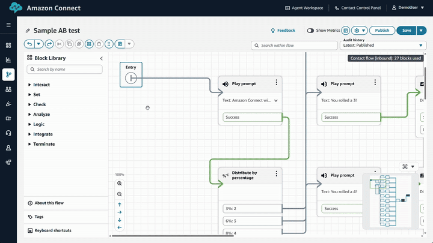

##### Change connection

For **outgoing branches**, use the dropdown menu to select a
block and update the connection.

Use **free-text search** to quickly locate and connect to a
specific block.

To remove a connection, use the **Disconnect** option. The
following GIF shows how to use **Disconnect**.

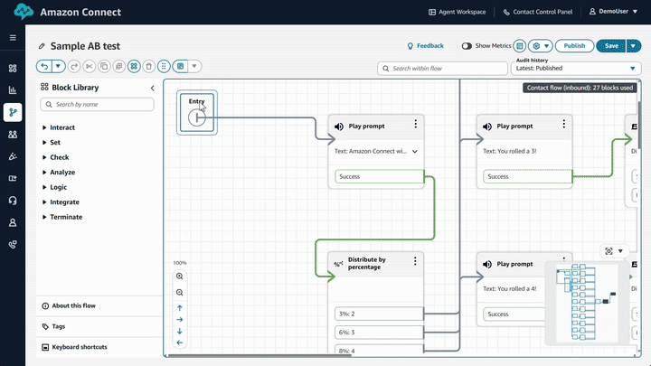

##### Create a new block

You can create a new block directly from the **Connections**
tab without leaving the current view.

- Select **Add New Block**, choose the desired block type,
  and optionally provide a name.
- The block will be created instantly. No need to drag and drop from the block
  library

The following GIF shows how to add a new block (in this case a
**Disconnect** block) from the **Connections** tab.

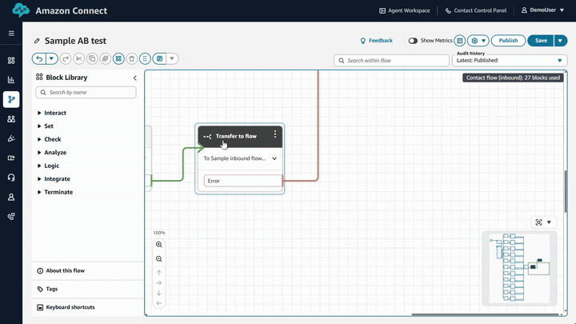

#### Notes tab

Use the **Notes** tab to view all notes attached to a block.
You can create and edit notes directly within this tab.

The following GIF shows the **Notes** tab for the **Set
disconnect flow** block.

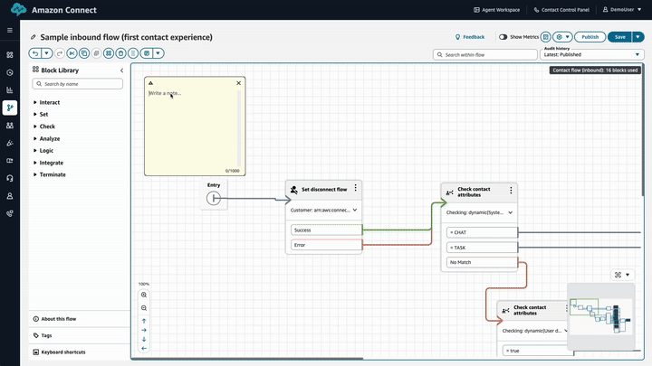

#### Block error navigation

The flow designer includes shortcuts and buttons to help locate blocks with issues more
efficiently.

When publishing, if a block contains errors, you can click the associated error message
button to navigate directly to the problematic block.

- Additionally, use **Ctrl + ;** and **Ctrl + '** to cycle
  between blocks with errors.
- Each block's issue is also clearly displayed in the block configuration panel

The following GIF shows how to navigate to the problematic blocks.

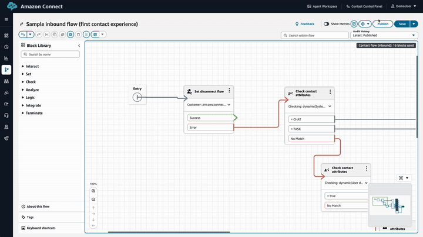

### Flow designer keyboard shortcuts and

accessibility improvements

The flow designer includes a **Keyboard shortcuts** panel, which includes
an expanded set of shortcuts for navigating through and editing flows. For more information, see
[Keyboard shortcuts for the
Amazon Connect flow designer](keyboard-shortcuts.md "keyboard-shortcuts.md").

The flow designer includes the following accessibility improvements: screen reader support,
Reflow Mode, button-based movement, and high-contract lines. These are described below.

#### Screen reader support

Changes made on the canvas are announced if the users have enabled screen reader, allowing
users to better follow updates as they happen. On Windows the shortcut is
**Win+Ctrl+Enter** and on Mac **Cmd+F5**.

#### Reflow Mode

Reflow Mode ensures that panels and interface elements automatically rearrange when zoomed
in. So even at high zoom levels, everything remains visible and can be navigated to.

The following GIF shows how to use Reflow Mode.

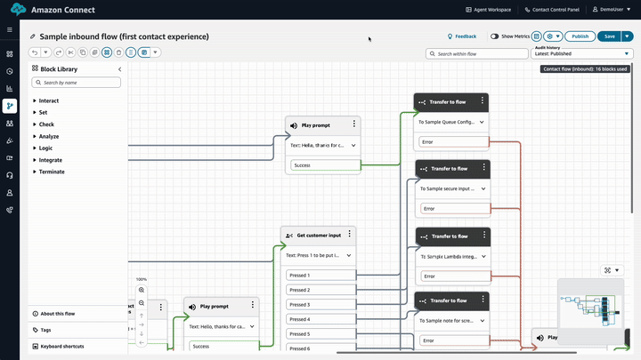

#### Button-based movement

You can use the directional buttons on the flow designer canvas for precise block
movement. You can reposition selected blocks using the arrow buttons for greater control and
navigation.

The following GIF shows how to use the directional buttons.

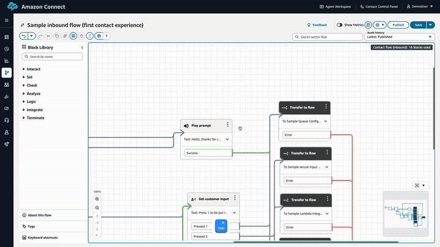

#### High contrast lines

High contrast lines enhance the visual distinction between the three connector line types,
making it easier for users with visual impairments to differentiate connections.

The following GIF shows how to enable high contrast lines in the flow designer.

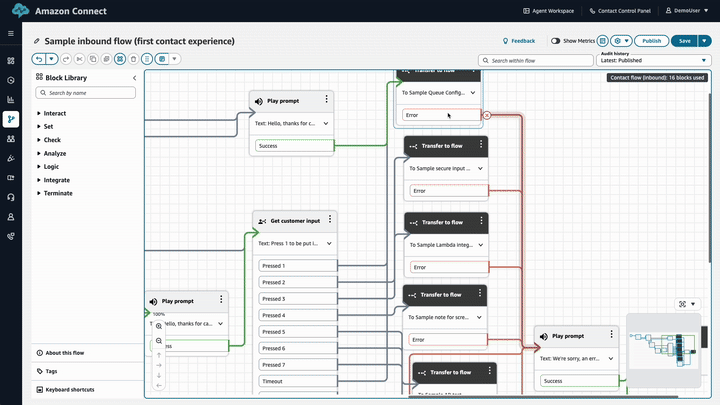

The following image shows two flow designer canvases. The first one shows the default
contrast. The second one shows high contrast lines.

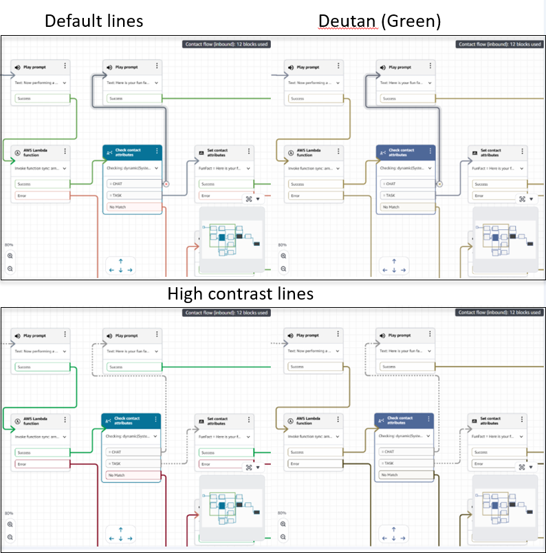

### Enhanced audio treatment for customers in queue

The Loop prompts block allows you to run flow logic while continuing to play audio to
customers waiting in queue. You can check metrics and modify routing priorities without
interrupting the customer's audio experience. For more information, see [How the interrupt option works](loop-prompts.md#loop-prompts-interrupt "loop-prompts.md#loop-prompts-interrupt").

### Improved UI for No-code builder

The Amazon Connect UI builder, used to create Views that power Step-by-Step Guides, has an updated
user interface. The improved UI is designed to reduce the complexity of building Views used in
guided workflows. It makes the process of passing dynamic data onto Views and storing data
entered on a view by a user more initiative and consistent with Amazon Connect workflow orchestration.

In addition, the UI builder contains a consistent look and feel with the rest of Amazon Connect by
using [Cloudscape Design System](https://cloudscape.design/ "https://cloudscape.design/") components.

For more information, see [Use the UI builder in Amazon Connect for resources
in step-by-step guides](no-code-ui-builder.md "no-code-ui-builder.md"), especially the subtopic [Configure
dynamic fields](no-code-ui-builder-properties-dynamic-fields.md "no-code-ui-builder-properties-dynamic-fields.md").

### Segment creation from imported files in Customer

Profiles

Amazon Connect Customer Profiles allows you to create customer segments from imported CSV files. This feature
enables you to upload predefined customer lists, streamline targeted segment creation, and
utilize them for multichannel outbound campaigns.

- Map CSV data to standard profile attributes using AI-powered analysis
- Create custom attributes as needed
- Configure profile expiry settings up to 90 days
- Utilize unique identifiers to match and update existing profiles

For more information, see [Create segments from imported
files in Amazon Connect](customer-segments-imported-files.md "customer-segments-imported-files.md").

### Additional chat metrics

Added the following chat metrics to Amazon Connect. Each metric is available in the Amazon Connect admin website and by
using the GetMetricDataV2 API.

- [Average messages](metrics-definitions.md#average-messages "metrics-definitions.md#average-messages")
- [Agent average contact
  first response wait time](metrics-definitions.md#agent-average-contact-first-response-wait-time "metrics-definitions.md#agent-average-contact-first-response-wait-time")
- [Average conversation close
  time](metrics-definitions.md#average-conversation-close-time "metrics-definitions.md#average-conversation-close-time")
- [Conversations abandoned](metrics-definitions.md#conversations-abandoned "metrics-definitions.md#conversations-abandoned")
- [Average customer messages](metrics-definitions.md#average-customer-messages "metrics-definitions.md#average-customer-messages")
- [Average customer response time](metrics-definitions.md#average-customer-response-time "metrics-definitions.md#average-customer-response-time")
- [Average agent messages](metrics-definitions.md#average-agent-messages "metrics-definitions.md#average-agent-messages")
- [Average agent message length](metrics-definitions.md#average-agent-message-length "metrics-definitions.md#average-agent-message-length")
- [Average agent first response
  time](metrics-definitions.md#average-agent-first-response-time "metrics-definitions.md#average-agent-first-response-time")
- [Average agent response time](metrics-definitions.md#average-agent-response-time "metrics-definitions.md#average-agent-response-time")
- [Average bot messages](metrics-definitions.md#average-bot-messages "metrics-definitions.md#average-bot-messages")

Also added fields to the [Contact record](data-type-definitions.md#data-lake-contacts-record "data-type-definitions.md#data-lake-contacts-record") in the Amazon Connect analytics data lake.

### Create instance replication between Asia Pacific (Tokyo)

and Asia Pacific (Osaka)

You can maintain a synchronized instance in Asia Pacific (Osaka) that mirrors the
channel configurations and service quotas of your Asia Pacific (Tokyo) environment. With a
resiliency instance in Asia Pacific (Osaka), you can replicate your Amazon Connect configurations,
such as users, routing profiles, and flows, and configure traffic distribution settings to
pre-define groups of users and phone numbers to shift between Asia Pacific (Tokyo) and
Asia Pacific (Osaka). This enables your resiliency instance to handle new incoming traffic
after switching Regions. To get started, you first need to set up an Amazon Connect instance in
Asia Pacific (Tokyo) as your primary Region. You can then create a replica instance for
Amazon Connect in the Asia Pacific (Osaka) Region. For more information, see [Set up Amazon Connect Global Resiliency](setup-connect-global-resiliency.md "setup-connect-global-resiliency.md").

### Use customizable work labels for agent scheduling

You can use customizable work labels for agent scheduling. Customizable work labels make it
easier for you to identify the type of work an agent is scheduled for. You can create work
activities with custom labels and assign them to agent schedules by day of the week. For
example, you can assign "Order processing" as the work activity for Monday, "Returns management"
for Tuesday, and "Work" (existing default activity) for rest of the week. This simplifies the
experience for managers because they can now easily identify who is scheduled for which type of
work. This capability also improves the experience for agents as they now have visibility into
how their time is allocated. For more information, see [Create shift
activities](scheduling-create-shift-activities.md "scheduling-create-shift-activities.md").

### Ingest agent activities from third-party applications to

evaluate agent performance

You can integrate agent activities from third-party applications as Amazon Connect tasks. Managers
can then evaluate these activities alongside work completed in Amazon Connect. This provides managers
with a unified application for quality management. For more information, see [Ingest agent activities from
third-party applications to evaluate agent performance](evaluations-external-activities.md "evaluations-external-activities.md").

### Amazon Connect Customer Profiles Profile

Explorer

Amazon Connect Customer Profiles Profile Explorer is a feature that provides a unified, customizable view of
customer information. Key features include:

- Real-time search using multiple identifiers (for example, email, phone number, booking
  references)
- Customizable views highlighting relevant customer information
- AI-generated customer summaries with personalized behavioral insights

Profile Explorer is available in the following AWS regions: US East (N. Virginia), US West
(Oregon), Africa (Cape Town), Asia Pacific (Seoul), Asia Pacific (Tokyo), Asia Pacific
(Singapore), Asia Pacific (Sydney), Canada (Central), Europe (Frankfurt), and Europe (London).
Note that AI summary is currently not available in Africa (Cape Town).

For more information, see the [Set up Profile explorer in
Amazon Connect Customer Profiles](customer-profiles-profile-explorer.md "customer-profiles-profile-explorer.md").

### New quota: Maximum contacts in an agent queue per

instance

A new quota has been introduced for the maximum number of contacts that can be queued at
once in a single agent queue. The quota is set to 10 contacts per queue and applies to every
agent queue in your instance. (The default was already 10 contacts; we're surfacing the quota so
it's easier for you to change.) This is a resource-level quota and can be increased upon
request. For more information, see [Amazon Connect service
quotas](amazon-connect-service-limits.md "amazon-connect-service-limits.md").

### Amazon Connect Customer Profiles enhanced calculated

attributes

Amazon Connect Customer Profiles provides enhanced calculated attributes with the following improvements:

- Timestamp controls: Specify timestamps on data, including future-dated events
- Historical data backfill: Automatically include previously ingested data when creating
  new attributes
- Improved limits: Process historical data information with increased limits

These enhancements enable more accurate and relevant calculated attributes, supporting
sophisticated use cases such as:

- Tracking upcoming appointments
- Analyzing long-term customer behavior patterns
- Evaluating customer lifetime value
- Providing agents with relevant context before customer interactions

These features are available in US East (N. Virginia), US West (Oregon), Africa (Cape
Town), Asia Pacific (Singapore), Asia Pacific (Sydney), Asia Pacific (Tokyo), Asia Pacific
(Seoul), Canada (Central), Europe (Frankfurt), and Europe (London).

For more information, see the [Create calculated
attributes in Amazon Connect](calculated-attributes-admin-website-create.md "calculated-attributes-admin-website-create.md").

### Enhanced hold duration tracking for multiparty calls

You can track durations of holds initiated by individual agents in multiparty calling
scenarios by using the new Agent Initiated Hold Duration field on the contact record. Use this
field to gain insights into hold patterns at the individual agent level during customer
interactions. For more information, see [AgentInitiatedHoldDuration](ctr-data-model.md#AgentInitiatedHoldDuration-CTR "ctr-data-model.md#AgentInitiatedHoldDuration-CTR") in the [Data model for Amazon Connect contact records](ctr-data-model.md "ctr-data-model.md") topic.

### Updates to email quotas

The following updates have been released for email quotas and feature specifications:

###### New

- **Email addresses per inbound email message** quota is 50 email
  addresses total across To and CC. It is not adjustable.
- **File attachments per email** = 10 attachments. This is a feature
  specification and cannot be adjusted.

###### Updates

- **Active email contact expiry** quota is customizable up to 90 days.
- **Email domains per instance** quota has been increased from 5 custom
  email domains to 100.
- **Email addresses per instance** is an adjustable quota; it was
  incorrectly documented as a feature specification. The default is 100.

For more information, see [Amazon Connect service
quotas](amazon-connect-service-limits.md "amazon-connect-service-limits.md").

## May 2025 Updates

### End of support notice for Amazon Connect Voice ID

End of support notice: On May 20, 2026, AWS will end support for Amazon Connect
Voice ID. After May 20, 2026, you will no longer be able to access Voice ID on the
Amazon Connect console, access Voice ID features on the Amazon Connect admin website or Contact Control Panel, or access Voice ID
resources. For more information, visit [Amazon Connect
Voice ID end of support](amazonconnect-voiceid-end-of-support.md "amazonconnect-voiceid-end-of-support.md").

### Audio optimization for Omnissa cloud desktops

You can deliver high-quality voice experiences in Omnissa Virtual Desktop Infrastructure
(VDI) environments. Amazon Connect automatically optimizes audio by redirecting media from your agent's
local desktop to Amazon Connect, simplifying the agent experience and improving audio quality by reducing
network hops. Agents can simply log into their Omnissa remote desktop application (that is,
Omnissa Horizon) and start accepting calls using your custom agent user interface. For more
information, see [Optimize Amazon Connect audio for
Omnissa cloud desktops](using-ccp-vdi-omnissa-step-by-step.md "using-ccp-vdi-omnissa-step-by-step.md").

### Agent hierarchy groups datatype in Analytics Data Lake

You can use an agent hierarchy groups table to incorporate organizational structure data
into your custom analytics and reporting workflows. You can join this with existing tables such
as Users to retrieve complete hierarchical information about your agents and their team
assignments. For more information, see [Agent Hierarchy Groups](data-lake-configuration-data.md#agent-hierarchy-groups "data-lake-configuration-data.md#agent-hierarchy-groups").

### Additional AWS Regions for WhatsApp Business

messaging and SMS

Amazon Connect supports WhatsApp Business messaging and SMS in additional Regions. For more
information, see [Availability of Amazon Connect features by Region](regions.md "regions.md").

### Access Contact Lens real-time dashboards in

AWS GovCloud (US) Region

You can access Amazon Connect Contact Lens real-time queue and agent performance dashboards,
and flows performance dashboards in AWS GovCloud (US) Region, a secure cloud environment designed
for government and public sector customers. For more information, see [Conversational analytics features by Region](regions.md#regions-contactlens "regions.md#regions-contactlens").

### Administrator access for agent schedules

You can grant administrator access to agent schedules, making it easier to address key
operational needs with minimal configuration. You can give certain users access to all published
agent schedules without being added as a supervisor to every staff group. See the
**Access to all published schedules** option on the **Staff
rules** tab of the **Scheduling** page. For more information, see
[Create staff
rules](scheduling-create-staff-rules.md "scheduling-create-staff-rules.md").

## April 2025 Updates

### Enhanced contact information in

DescribeContact API

The DescribeContact API provides richer contact information, enabling more efficient
contact center operations. The enhanced API response includes detailed insights such as
disconnect reasons, recording status, after-contact work time, and custom contact attributes in
a single call. This allows programmatic handling of contact scenarios, such as automatically
re-queuing disconnected chats based on specific disconnect reasons, helping maintain
conversation continuity. For more information, see the [DescribeContact API](../APIReference/API_DescribeContact.md "../APIReference/API_DescribeContact.md")
documentation.

### New metrics and dashboard drill downs for

outbound campaigns

Outbound campaigns provides enhanced reporting capabilities for outbound campaigns, including five new
metrics and detailed dashboard drill downs. Contact Lens dashboards show campaign engagement metrics,
execution-level performance data, and delivery issue details. Admins can monitor campaign
progress in real-time and troubleshoot delivery issues with granular insights. These metrics are
accessible through the [GetMetricDataV2 API](../APIReference/API_GetMetricDataV2.md "../APIReference/API_GetMetricDataV2.md") and
[Zero-ETL data lake](data-lake-outbound-campaigns-data.md "data-lake-outbound-campaigns-data.md") for custom
reporting. For more information, see [Outbound campaign metrics in Amazon Connect](outbound-campaign-metrics.md "outbound-campaign-metrics.md").

### View real-time adherence on the Queue and agent performance

dashboard

You can view real-time agent adherence displayed in the **Agent
adherence** widget on the **Queue and agent performance** dashboard.
Use the widget to apply filters on adherence status, duration, and percentage; sort by duration
or percentage; and apply conditional formatting within the agent adherence widget on the queue
and agent performance dashboard. For example, a supervisor can highlight agents who have been
falling behind schedule for more than 5 minutes, quickly identify breaches, and notify the
agents accordingly. For more information, see [Schedule Adherence for agent productivity in
Amazon Connect](schedule-adherence.md "schedule-adherence.md").

### Remove agent schedules in bulk

You can remove agent schedules in bulk, making day-to-day management of agent schedules
more efficient. With this launch, you can now remove schedules for up to 400 agents for a single
day, or up to 30 days for a single agent. For example, remove all schedules for next Monday as
the contact center is going to be closed, or remove future shifts for an agent who is no longer
with the organization. For more information, see [Remove agent shifts](scheduling-remove-agent-shifts.md "scheduling-remove-agent-shifts.md").

### Enforce granular access control by using

agent hierarchies

You can enforce granular access control based on a specific agent hierarchy. Assigning
hierarchies to a user allows you to define organizational groups that a user belongs to and you
can enable granular access controls by allowing users to only view metrics for agents within
their hierarchy or a specific assigned hierarchy. For example, you can configure hierarchy
groups and levels for a team, and only users assigned to a hierarchy group within that team will
be able to see metrics for those agents. For more information, see [Apply hierarchy-based access control to
dashboards and reports in Amazon Connect](dashboard-access-control.md "dashboard-access-control.md").

### Track and meet service level agreements (SLAs) on cases

Amazon Connect Cases provides capabilities to help contact centers track and meet service level
agreements (SLAs) on cases. Using the Amazon Connect admin website, admins can set up SLA rules based on case
attributes and configure target statuses and resolution times without having to write code.
Agents and managers can view the real-time SLA status directly in their case list view to
prioritize urgent work, while admins can create rules to automatically escalate cases when SLAs
are not met. For more information, see [How SLAs work in Amazon Connect Cases](cases-sla.md "cases-sla.md").

## March 2025 Updates

### Enable or disable Contact Lens sentiment

analysis

In Amazon Connect Contact Lens, when you choose a language that is supported by sentiment
analysis, and choose **Enable speech analytics** or **Enable chat
analytics**, sentiment analysis is enabled by default for all agents and customers.
For a list of languages supported by sentiment analysis, see [AI features](supported-languages.md#supported-languages-contact-lens "supported-languages.md#supported-languages-contact-lens").
For information about disabling sentiment analysis, see [Disable
sentiment analysis](enable-analytics.md#disable-sentiment-analysis-voice-and-chat "enable-analytics.md#disable-sentiment-analysis-voice-and-chat").

### Customize the wait time for DTMF input

You can customize the number of seconds that Amazon Connect waits between a caller's keypad button
presses so you can optimize user inputs in your IVR systems. You can adjust the waiting period
from 1 to 20 seconds; previously it was fixed at 5 seconds. For more information, see the [Store customer input](store-customer-input.md "store-customer-input.md") block.

This update applies to keypad button presses. To configure wait times for voice input for
Amazon Lex, you use the [Get customer input](get-customer-input.md "get-customer-input.md")
block. See _Configurable time-outs for voice input_ in the [Get customer input](get-customer-input.md "get-customer-input.md") topic.

### Added 34 languages to Amazon Connect Contact Lens conversational

analytics

Amazon Connect Contact Lens added support for conversational analytics in 34 new languages including
Afrikaans, Arabic (Modern Standard), Bengali, Bosnian, Bulgarian, Chinese (Cantonese), Croatian,
Czech, Estonian, Farsi, Galician, Greek, Hebrew, Hungarian, Kannada, Latvian, Lithuanian,
Macedonian, Malayalam, Marathi, Romanian, Russian, Serbian, Sinhala, Slovak, Slovenian, Somali,
Sundanese, Telugu, Thai, Turkish, Ukrainian, Vietnamese, and Zulu.

For more information, see the [Amazon Connect Contact Lens
language table](supported-languages.md#supported-languages-contact-lens "supported-languages.md#supported-languages-contact-lens").

### View agents' adherence to their work schedules in a

calendar view

You can view adherence breaches by agent and day, for up to 90 days in the past, alongside
their shifts. You can filter out minimal adherence breaches. This visualization allows you to
immediately spot adherence breaches across your team, prioritize the most critical incidents,
compare with past agent behavior, and take steps to address concerns with the agent.

For more information, see [How supervisors view
published schedules using the Amazon Connect admin website](scheduling-view-schedule-supervisors.md "scheduling-view-schedule-supervisors.md").

### Process to enable outbound campaigns for the purpose of

event-driven mass notifications

Amazon Connect outbound campaigns supports event-driven mass notifications, such as severe weather warnings,
evacuation notices, disaster response communications, or utility disruptions impacting many
thousands of customers with prior authorization and approval. Additional charges may apply based
on your location and anticipated notification volumes.

For more information, see [Set up Amazon Connect outbound campaigns](enable-outbound-campaigns.md "enable-outbound-campaigns.md").

### Track agent acknowledgements of performance evaluations

You can capture and review agent acknowledgements of performance evaluations within
Contact Lens. This helps you ensure that agents have reviewed evaluation feedback and
understand performance expectations. Agents can acknowledge their review of performance
evaluations within the Amazon Connect admin website, and add optional notes (for example, "reviewed and accepted
feedback on being more empathetic towards angry customers"). Managers can then track agent
acknowledgements, to confirm that agents are regularly reviewing the feedback on performance
evaluations for improving their performance.

For more information, see [Acknowledge performance evaluations in
Amazon Connect](acknowledge-evaluations.md "acknowledge-evaluations.md").

### Configure Connect AI agents directly from the Amazon Connect admin website

You can customize your Connect AI agents experience directly from the Amazon Connect admin website. With this no-code
approach, contact center administrators can configure AI agent behaviors, create or edit custom
prompts and set appropriate guardrails. For example, users can update AI prompts when launching
new products, adjust AI guardrails to filter inappropriate content, or refine AI agents.

For more information, see [Customize Connect AI agents](customize-connect-ai-agents.md "customize-connect-ai-agents.md").

### Increased limit on number of routing criteria updates per

queued contact

Previously, routing criteria could be updated only up to three times while a contact was in
queue. You can now update the routing criteria on a queued contact an unlimited number of times.
However, if you update the routing criteria more than 3 times on a queued contact, only the
latest 3 updates will be stored on the contact record and used to calculate metrics such as Step
Expired % and Step Contacts Queued. To learn more, see [RoutingCriteria](ctr-data-model.md#ctr-RoutingCriteria "ctr-data-model.md#ctr-RoutingCriteria") in the contact record documentation.

### Dynamically update questions on an evaluation

form

You can create dynamic evaluation forms that automatically show or hide questions based on
responses to previous questions, tailoring each evaluation to specific customer interaction
scenarios. For example, when a manager answers "Yes" to the form question _Did the
customer try to make a purchase on the call?_, the form automatically presents a
follow-up question: _Did the agent read the sales disclosure?_

You can consolidate evaluation forms that are applicable to different interaction scenarios
into a single dynamic evaluation form which automatically hides irrelevant questions. This
reduces manager effort in selecting the relevant evaluation form and determining which
evaluation questions are applicable to the interaction, helping managers perform evaluations
faster and more accurately.

For more information, see [Step 4: Conditionally enable
questions](create-evaluation-forms.md#step-conditionally-enable-questions "create-evaluation-forms.md#step-conditionally-enable-questions") in [Create an evaluation
form](create-evaluation-forms.md "create-evaluation-forms.md").

## February 2025 Updates

### Updates to Amazon Connect Analytics data

lake

Amazon Connect Analytics Data Lake provides a unified source for contact center data,
including contact records, agent performance metrics, Contact Lens insights, and more. This
eliminates the need to build and maintain complex data pipelines. You can create custom reports
using Amazon Connect data or seamlessly combine it with third-party data using [zero-ETL](https://aws.amazon.com/what-is/zero-etl/ "https://aws.amazon.com/what-is/zero-etl/")
integration.

Analytics data lake enables contact center managers to leverage BI tools of their choice,
such as QuickSight, to analyze the information that matters most to improving customer
experience and operational efficiency.

For more information on Analytics data lake, see [Amazon Connect analytics data lake](data-lake.md "data-lake.md").

There are updated tables for Contact records, Contact Evaluation records, Lex, and Outbound
Campaigns. For tables of the latest fields, see [Data type definitions for the Amazon Connect analytics
data lake](data-type-definitions.md "data-type-definitions.md").

### Allow agents to exchange shifts with each other

Agents can initiate shift trades directly with each other, allowing them to manage
unexpected life events without using time off. Managers can automate some approvals while
ensuring others are approved manually. This option reduces their work without sacrificing
controls when needed. For example, supervisors can automate approvals for agents handling
non-critical tasks, such as routine customer inquiries, while manually approving requests from
agents who handle sensitive customer segments, like healthcare or high-value enterprise
accounts.

For more information, see [Create shift trade
groups](scheduling-create-shift-trade-groups.md "scheduling-create-shift-trade-groups.md") and [Set up shift exchange in Amazon Connect](shift-exchange.md "shift-exchange.md").

### Released ListAnalyticsDataLakeDataSets

API and update to preview APIs

Released the [ListAnalyticsDataLakeDataSets](../APIReference/API_ListAnalyticsDataLakeDataSets.md "../APIReference/API_ListAnalyticsDataLakeDataSets.md") API. Use this API to list the data lake datasets
available to associate with for a given Amazon Connect instance.

In addition, updated the following preview APIs with `ClientToken`, a unique,
case-sensitive identifier that you provide to ensure the idempotency of the request.

- [AssociateApprovedOrigin](../APIReference/API_AssociateApprovedOrigin.md "../APIReference/API_AssociateApprovedOrigin.md")
- [AssociateBot](../APIReference/API_AssociateBot.md "../APIReference/API_AssociateBot.md")
- [AssociateInstanceStorageConfig](../APIReference/API_AssociateInstanceStorageConfig.md "../APIReference/API_AssociateInstanceStorageConfig.md")
- [AssociateLambdaFunction](../APIReference/API_AssociateLambdaFunction.md "../APIReference/API_AssociateLambdaFunction.md")
- [AssociateSecurityKey](../APIReference/API_AssociateSecurityKey.md "../APIReference/API_AssociateSecurityKey.md")
- [DeleteInstance](../APIReference/API_DeleteInstance.md "../APIReference/API_DeleteInstance.md")
- [DisassociateApprovedOrigin](../APIReference/API_DisassociateApprovedOrigin.md "../APIReference/API_DisassociateApprovedOrigin.md")
- [DisassociateBot](../APIReference/API_DisassociateBot.md "../APIReference/API_DisassociateBot.md")
- [DisassociateInstanceStorageConfig](../APIReference/API_DisassociateInstanceStorageConfig.md "../APIReference/API_DisassociateInstanceStorageConfig.md")
- [DisassociateLambdaFunction](../APIReference/API_DisassociateLambdaFunction.md "../APIReference/API_DisassociateLambdaFunction.md")
- [DisassociateLexBot](../APIReference/API_DisassociateLexBot.md "../APIReference/API_DisassociateLexBot.md")
- [DisassociateSecurityKey](../APIReference/API_DisassociateSecurityKey.md "../APIReference/API_DisassociateSecurityKey.md")
- [UpdateInstanceAttribute](../APIReference/API_UpdateInstanceAttribute.md "../APIReference/API_UpdateInstanceAttribute.md")
- [UpdateInstanceStorageConfig](../APIReference/API_UpdateInstanceStorageConfig.md "../APIReference/API_UpdateInstanceStorageConfig.md")

### Agent performance evaluations dashboard

You can use the agent performance evaluation dashboard to view aggregations of agent
performance, and insights across cohorts of agents over time. You can access a unified dashboard
on agent performance across evaluation scores, productivity (for example, contacts handled,
average handle time, and more) and operational metrics.

Through detailed performance scorecards at both team and individual levels, you can dive
deep into specific performance criteria, and compare performance with similar cohorts and over
time, to identify agent strengths and improvement opportunities. The dashboard also provides you
with insights into agent time allocation and contact handling efficiency, so you can drive
improvements in agent productivity.

For more information, see [Agent performance evaluations
dashboard](agent-performance-evaluation-dashboard.md "agent-performance-evaluation-dashboard.md").

### Evaluations metrics

There are now four evaluations metrics. For more information, see [Evaluation metrics](evaluation-metrics.md "evaluation-metrics.md").

### Target multiple agent proficiencies in a single routing

step

You can target up to four different combinations of agent proficiencies per routing step.
By using up to three OR conditions, routing tries to match a contact with four different types
of agents which increases the possibility of finding a suitable match. For example, if the
backup for a niche of banking skills consists of agents trained on account management,
registration, and tax, then after an initial search for balance transfer agents, you can attempt
a match across all four types of agents at the same time.

For more information, see [How routing criteria
works](set-routing-criteria.md#set-routing-criteria-how-it-works "set-routing-criteria.md#set-routing-criteria-how-it-works").

### Configure which states an agent can be in when adhering to

their schedule

You can choose which states an agent can be in when adhering to their schedule, making it
easier for you to customize adherence tracking to match your unique operational needs. You can
define custom mappings between agent statuses and schedule activities.

For example, you can map schedule activity "Work" to multiple agent statuses such as
"Available" and "Back-office work." An agent scheduled for "Work" from 8 AM to 10 AM will be
considered adherent if they are either in "Available" or "Back-office work" status.

You can also view the actual name of the scheduled activity in the real-time adherence
dashboard (as opposed to only Productive/Non-productive).

For more information, see [Create shift
activities](scheduling-create-shift-activities.md "scheduling-create-shift-activities.md").

### Create conditionally required fields in Amazon Connect

Cases

You can create conditionally required fields to streamline case field population for agents
and reduce data entry errors. You can configure case templates that prompt agents to enter
relevant information in specific situations. For example:

- Provide a Close Reason when a case moves to Closed status.
- Provide a Product Serial Number when the Issue Type is Hardware Problem.
- Provide a Disposition Code when handling a system-generated case.

Conditionally required fields help agents follow processes for capturing necessary
information, improving data quality for reporting, resolution tracking, and compliance. For more
information, see [Add case field conditions to a case
template](case-field-conditions.md "case-field-conditions.md").

Also see the following APIs that are part of these release:

- [CreateCaseRule](../APIReference/API_connect-cases_CreateCaseRule.md "../APIReference/API_connect-cases_CreateCaseRule.md")
- [BatchGetCaseRule](../APIReference/API_connect-cases_BatchGetCaseRule.md "../APIReference/API_connect-cases_BatchGetCaseRule.md")
- [DeleteCaseRule](../APIReference/API_connect-cases_DeleteCaseRule.md "../APIReference/API_connect-cases_DeleteCaseRule.md")
- [ListCaseRules](../APIReference/API_connect-cases_ListCaseRules.md "../APIReference/API_connect-cases_ListCaseRules.md")
- [UpdateCaseRule](../APIReference/API_connect-cases_UpdateCaseRule.md "../APIReference/API_connect-cases_UpdateCaseRule.md")

### Automatically email agents about completed performance

evaluations

You can send automatic email notifications to agents when their contacts are evaluated, so
they can review the evaluations and improve their performance. Managers can create rules to send
emails based on specific evaluation criteria. For example, you can set up automatic
notifications for agents who receive evaluation scores below 50%, ensuring prompt attention to
performance opportunities. Managers can also personalize email content based on performance
levels — whether recognizing top performers or providing constructive guidance for improvement
areas. For more information, see [Create rules that send
email notifications](contact-lens-rules-email.md "contact-lens-rules-email.md").

## January 2025 Updates

### Use Agent Workspace audio optimization for Citrix and

Amazon WorkSpaces virtual desktops

You can use Amazon Connect Agent Workspace to redirect audio from Citrix and Amazon WorkSpaces Virtual
Desktop Infrastructure (VDI) environments to an agent's local device. Audio redirection improves
voice quality and reduces latency for voice calls handled on virtual desktops. It provides a
better experience for both end customers and agents. For more information, see [Use the agent workspace to optimize
audio for Citrix, Amazon WorkSpaces, and Omnissa cloud desktops](optimize-audio-cdd.md "optimize-audio-cdd.md").

### Screen recording available in

AWS GovCloud (US-West)

Government and public sector customer can use the screen recording capabilities in the
AWS GovCloud (US-West) Region. For more information about screen recording, see [Set up and review agent screen
recordings](agent-screen-recording.md "agent-screen-recording.md").

### Public preview of persistent agent connections

for faster call handling

You can maintain an open communication channel between your agents and Amazon Connect to help reduce
the time it takes to establish a connection with a customer. Contact center administrators can
configure an agent's user profile to maintain a persistent connection after a conversation ends.
This allows for subsequent calls to connect faster.

Amazon Connect persistent agent connection makes it easier to support compliance requirements with
telemarketing laws such as the U.S. Telephone Consumer Protection Act (TCPA) for outbound
campaigns' calling by reducing the time it takes for a customer to connect with your
agents.

For more information, see [Enable persistent
connection](enable-persistent-connection.md "enable-persistent-connection.md").

### Evaluate agent performance for email contacts

You can evaluate agent performance for email contacts. Managers can assess agent
performance across contact channels (voice, chat, email, and tasks) in a single easy-to-use web
interface, and get aggregated insights across cohorts of agents over time. Managers can evaluate
agent performance by reviewing email threads and additional details of the email interaction
(for example, handle time) in the Amazon Connect admin website.

You can also use public APIs to incorporate data from third-party systems (such as CSAT,
sales volumes, customer retention, and more) into performance evaluations of email contacts,
providing managers with comprehensive insights on agent performance. For more information, see
[Evaluate performance](evaluations.md "evaluations.md").

### Dashboards provide configurable

groupings and filters

You can define widget level filters and groupings, re-order and re-size columns, and delete
or add new metrics. With these dashboards, you can view and compare real-time and historical
aggregated performance, trends, and insights using custom-defined time periods (for example,
week over week), summary charts, time-series chart, etc. For example, you can create a single
line chart that combines contacts queued, average queue answer time, and abandoned contacts,
filtered for your most important queues, so you can quickly see how increasing contact volumes
impact both wait time and customer abandonment rates. For more information, see [Customize your Amazon Connect dashboard](dashboard-customize-widgets.md "dashboard-customize-widgets.md").

### Real-time dashboard for agent activity

You can monitor real-time agent activity and take immediate actions such as listen-in to a
contact, barge (take over) a contact, or change an agent state in a few clicks from a single
interface. You can track how long an agent has been on after contact work, color code time in
specific statuses, and listen into live contacts that need immediate attention. For example, you
can automatically highlight in red if an agent is an error state to give a quick visual
indicator of where agents might need additional help to change their status back to available.
For more information, see [Queue and agent performance
dashboard](queue-performance-dashboard.md "queue-performance-dashboard.md").

## Earlier Updates

### December 2024 Updates

#### Route to a specific range of agent

proficiencies

Amazon Connect allows you to target a range of agent proficiency levels, such as from levels 1 to 3
for French. You can ensure each contact is matched to an agent with the right skill level to
handle it, resulting in reduced contact transfers and lower handle times. You can assign
simpler contacts to new hires while reserving your tenured agents for the difficult contacts
that require their knowledge and expertise. . For more information, see [Frequently asked questions](proficiency-routing.md#proficiency-routing-faq "proficiency-routing.md#proficiency-routing-faq").

#### Exclude certain proficiencies during

routing

Amazon Connect allows you to exclude certain proficiencies from consideration when using routing
criteria for routing. You can use this to exclude or reserve niche skills. For example, you can
exclude dual-skilled Spanish and English speaking agents from English language contacts to
reserve them for contacts in Spanish. You can include the dual-skilled agents when required by
removing the exclusion condition.. For more information, see [How routing criteria
works](set-routing-criteria.md#set-routing-criteria-how-it-works "set-routing-criteria.md#set-routing-criteria-how-it-works").

#### Delete queues and routing profiles by using the

Amazon Connect admin website

You can use the Amazon Connect admin website to permanently delete queues and routing profiles. For example, if
your team set up sample queues to test a use case that is no longer needed, or you're
consolidating your routing profiles because you have reorganized agents, you can easily remove
the unwanted resources by using the Amazon Connect admin website. For more information, see [Delete a queue](delete-queue.md "delete-queue.md") and [Delete a routing
profile](delete-routing-profiles.md "delete-routing-profiles.md").

#### Connect AI agents supports 64 languages for agent assistance

capabilities

Customer service agents can chat with Q for assistance in their native language and Q will
provide answers, knowledge article links, and recommended step-by-step guides in that language.
New languages supported include: Chinese, French, French (Canadian), Italian, Japanese, Korean,
Malay, Portuguese, Spanish, Swedish, and Tagalog. For the full list of supported languages, see
[AI features](supported-languages.md#supported-languages-contact-lens "supported-languages.md#supported-languages-contact-lens").

For more information, see [Set languages](ai-agent-configure-language-support.md "ai-agent-configure-language-support.md").

#### Multi-party chat

You can enable multiparty chat for your contact center, allowing up to 4 additional agents
to join an ongoing chat conversation with a customer. This makes it easier to collaborate and
resolve customer issues quickly. For example, agents can add a supervisor or subject matter
expert to the chat, ensuring customers receive accurate and timely support.

For more information, see [Host multi-party chats](multi-party-chat.md "multi-party-chat.md").

#### Authenticate customers during a chat

You can use built-in capabilities for customer authentication within chat, making it
easier to verify customer identity and deliver personalized experiences. The [Authenticate Customer](authenticate-customer.md "authenticate-customer.md") flow block
provides the flexibility to prompt your customers to sign in after they start a chat, making it
simple to authenticate. For example, unauthenticated customers engaged with a chat bot can be
prompted to sign in before being routed to an agent.

For more information, see [Set up customer authentication](customer-auth.md "customer-auth.md").

#### Agent schedule data in Analytics data

lake

Published schedules data is provided in the Analytics data lake, which allows you to
generate reports and insights. From agent schedules data in the Analytics data lake, you can
automate key operational use cases such as generating reports for paid and unpaid hours for
payroll, generating summarized views of how many agents are scheduled to work and how many have
time-off in a given time period.

For more information, see [Scheduling data in the Amazon Connect analytics data
lake](data-lake-scheduling.md "data-lake-scheduling.md").

#### Configure holidays and other overrides to hours of

operation

You can set up variations to standard day-of-the-week operating hours in advance. You can
configure overrides by using the Amazon Connect admin website or APIs. During daily contact handling, Amazon Connect
automatically checks for overrides and provides your customers with an appropriate flow path,
such as offering a callback when the call center is closed. After an override period passes,
your call center automatically reverts to standard hours of operation.

For more information, see [Set overrides for extended, reduced, and holiday hours](hours-of-operation-overrides.md "hours-of-operation-overrides.md"). For a list of new APIs associated with this release, see
[Hours of operation actions](../APIReference/hours-of-operation-api.md "../APIReference/hours-of-operation-api.md") in the _Amazon Connect API Reference_.

#### Amazon Connect supports push notifications for mobile chat on

iOS and Android devices

Amazon Connect supports push notifications for mobile chat on iOS and Android devices, improving
the customer experience and enabling faster issue resolution. For more information, see [Enable push notifications for
mobile chat](enable-push-notifications-for-mobile-chat.md "enable-push-notifications-for-mobile-chat.md").

#### Configure tasks to expire up to 30 days from creation

You can set task durations to expire up to 30 days from creation, with a default of 7
days. For example, you can specify one issue to expire at 2 hours from creation for urgent
escalations, and specify another issue for mandatory training to stay active for 30 days. For
more information, see [Create task templates in Amazon Connect](task-templates.md "task-templates.md").

#### Track the originating agent when they create a task

manually

You can track the originating agent when they create a task manually from the agent
workspace or Contact Control Panel (CCP). This capability allows supervisors to run analytics
on how many tasks are created by an individual agent. For more information, see [Track who created a task](tasks.md#createdby-tasks "tasks.md#createdby-tasks").

#### Provide callbacks for customers who use chat, tasks, and

email

You can enable customers to request callbacks from chats, tasks, and email, in addition to
voice calls. For example, if a customer reaches out after hours when no agent is available,
they can request a callback by sending a chat message or completing a webform request that uses
tasks. Callbacks allow your customers to get a call from an available agent during normal
business hours, without requiring them to stay on the line. For more information, see [Set up queued callback](setup-queued-cb.md "setup-queued-cb.md").

#### Collect sensitive customer data within

chats without requiring the customer to switch channels

Amazon Connect makes it easier for you to collect sensitive customer data and deliver seamless
transactional experiences within chats. You can support inline chat interactions such as
processing payments, updating customer information like address changes, or collecting customer
data like account details, without requiring the customer to switch channels or navigate to
another page on your website. For more information, see the [Flow block in Amazon Connect: Show view](show-view-block.md "show-view-block.md") block.

#### Proactive outbound engagement in the

Amazon Connect admin website

You can proactively engage your customers in a personalized manner. Amazon Connect includes
features that help non-technical business users create customer segments using prompts and
drive trigger-based campaigns to deliver timely, relevant communications to the right
audiences.

- Use the segment AI assistant in Amazon Connect Customer Profiles to build audiences using natural language
  queries and receive recommendations based on trends in the customer data.
- Identify segments such as customers with an increase in support cases over the last
  quarter, or whose have reduced purchases in the last month, using easy-to-use prompts.
- Use trigger-based campaigns based on real-time customer events on Amazon Connect outbound campaigns to
  proactively drive outbound communications in just a few clicks.

Engage customers with timely, relevant communications by using their preferred channels,
responding instantly to behaviors such as abandoned shopping carts or frequent visits to
specific help pages.

For more information, see [Use the segment AI assistant in
Amazon Connect](customer-segments-ai-assistant.md "customer-segments-ai-assistant.md") and [Create an outbound campaign using
event triggers](how-to-create-campaigns-using-event-triggers.md "how-to-create-campaigns-using-event-triggers.md").

#### Generative AI-powered self-service with

Connect AI agents

Connect AI agents, a generative-AI powered assistant for customer service, supports end-customer
self-service interactions across Interactive Voice Response (IVR) and digital channels. With
this launch, businesses can augment their existing self-service experiences with generative AI
capabilities to create more personalized and dynamic experiences to improve customer
satisfaction and first contact resolution. For more information, see [Use generative AI-powered
self-service with Connect AI agents](generative-ai-powered-self-service.md "generative-ai-powered-self-service.md").

#### AI guardrails for Connect AI agents

Connect AI agents, a generative AI powered assistant for customer service, enables you to natively
configure AI guardrails to implement safeguards based on their use cases and responsible AI
policies. Contact center administrators can configure company-specific guardrails for Connect AI agents
to filter harmful and inappropriate responses, redact sensitive personal information, and limit
incorrect information in the responses due to potential large language model (LLM)
hallucination. For more information, see [Create AI guardrails for Connect AI agents](create-ai-guardrails.md "create-ai-guardrails.md").

#### Built-in dashboards to analyze

conversational AI bot performance

You can use built-in dashboards to monitor the performance of your conversational AI bots.
This makes it easy for you to analyze and continuously improve your self-service and automated
experiences. From the Contact Lens flows performance dashboard, you can view Amazon Lex
and Q in Connect bot analytics including how your customers communicate their issues, the most
common contact reasons, and the outcomes of the interaction. From the dashboard, you can
navigate to the bot management page and make updates in a couple clicks to improve bot
accuracy. These new capabilities make it easy for you analyze the performance of your
conversational AI experiences, all within the Amazon Connect admin website.

For more information, see [Flows and conversational bot performance
dashboard](flows-performance-dashboard.md "flows-performance-dashboard.md").

#### Create conversational AI bots by using

the Amazon Connect admin website

In just a few clicks you can create, edit, and continuously improve conversational AI bots
for interactive voice response (IVR) and chatbot self-service experiences by using the Amazon Connect admin website
(powered by [Amazon Lex](https://aws.amazon.com/lex/ "https://aws.amazon.com/lex/")). By using the Amazon Connect
drag-and-drop workflow designer, you can enhance your bots with Amazon Connect Customer Profiles, making
it easy to deliver personalized experiences with no code. For example, you can upgrade your
touch-tone menu (for example, Press 1 for Account Support) with a bot to greet your customer by
name, proactively offer to help them pay an upcoming bill, and offer them additional support
options. These new bot building capabilities in Amazon Connect make it easy for you create and launch
bot-powered self-service experiences by reducing the need for you to manage multiple
applications or custom integrations.

For more information, see [Create conversational AI bots in Amazon Connect](connect-conversational-ai-bots.md "connect-conversational-ai-bots.md").

For a list of new metrics included in this release, see [Amazon Connect bot metrics and analytics](bot-metrics.md "bot-metrics.md").

#### Record audio during IVR and other

automated interactions

You can record audio when your customer engages with self-service interactive voice
response (IVR) and other automated interactions. On the **Contact details**
page, you can listen to the recording or review logs which includes information such as the bot
transcription or touch-tone menu selection. Recording settings can be configured using the
**Set recording and analytics behavior** block on the Amazon Connect drag-and-drop
workflow designer. This allows you to easily specify portions of the experience to record. For
example, pausing and resuming recordings before and after sensitive exchanges, such as when a
customer shares their credit card or social security number. These new capabilities make it
easy for you to monitor and audit the quality of your self-service experiences or to record
interactions for compliance or policy purposes.

For more information, see [Monitor automated interactions
(IVR) in Amazon Connect](monitor-automated-interaction-logs.md "monitor-automated-interaction-logs.md").

#### Intraday forecast dashboards

With the Intraday forecast dashboards you can compare intraday forecasts against
previously published forecasts, review projected daily performance, and receive predictions for
effective staffing, all available within the Amazon Connect Contact Lens dashboards. With
intraday forecasts, you receive updates every 15 minutes with predictions for rest-of-day
contact volumes, average queue answer time, average handle time, and, now, effective staffing.
These forecasts allow you to take proactive actions to improve customer wait time and service
level. For example, contact center managers can now track agent utilization at the queue level,
enabling them to identify potential imbalances or staffing shortages and take action before
wait times are impacted.

This release includes a new metric: [Effective staffing](metrics-definitions.md#effective-staffing "metrics-definitions.md#effective-staffing").

For more information, see [Intraday forecast performance
dashboard](intraday-forecast-performance-dashboard.md "intraday-forecast-performance-dashboard.md").

#### Automatically categorize your contacts using

generative AI

Amazon Connect Contact Lens allows you to automatically categorize your contacts using
generative AI, making it easy to identify top drivers, customer experience, and agent behavior
for your contacts. You can provide criteria to categorize contacts in natural language, such as
_Did the customer try to make a payment on their balance?_.
Contact Lens then automatically labels contacts that meet the match criteria, and
provides relevant points from the conversation. For more information, see [Use Generative AI to
semantically match contacts with natural language statements](natural-language-semantic-match.md "natural-language-semantic-match.md")
and [Automatically categorize contacts by matching
conversations with natural language statements, or specific words and
phrases](rules.md "rules.md").

#### Amazon Connect Contact Lens automates

agent performance evaluations using generative AI

Amazon Connect Contact Lens provides you with the ability to use generative AI to
automatically fill and submit agent performance evaluations. Managers can specify their
evaluation criteria in natural language, and use generative AI for automating evaluations of
any or all of agents’ customer interactions, and get aggregated agent performance insights
across cohorts of agents over time.. For more information, see [Create an evaluation form in Amazon Connect](create-evaluation-forms.md "create-evaluation-forms.md").

#### Integrate WhatsApp with Amazon Connect

You can integrate WhatsApp with Amazon Connect and enable customers to use WhatsApp to message your
call centers. For more information, see [Set up WhatsApp Business messaging](whatsapp-integration.md "whatsapp-integration.md").

#### Integrate Amazon Connect Contact Lens with

on-premise voice systems

You can integrate Amazon Connect Contact Lens with other voice systems for real-time and
post-call analytics. Using Contact Lens with your existing voice system can help you
improve customer experience and agent performance. In addition, this can be a first step to
migrating to a cloud contact center. You can start with Contact Lens analytics and
performance insights and then at a later date migrate your agents to Amazon Connect.

For more information, see [Integrate Amazon Connect Contact Lens with external
voice systems](contact-lens-integration.md "contact-lens-integration.md").

### November 2024 Updates

#### Amazon Connect Email is generally available

Amazon Connect Email provides built-in capabilities that make it easy for you to
prioritize, assign, and automate the resolution of customer service emails, improving customer
satisfaction and agent productivity. With Amazon Connect Email, you can receive and respond to
emails sent by customers to business addresses or submitted via web forms on your website or
mobile app.

You can configure auto-responses, prioritize emails, create or update cases, and route
emails to the best available agent when agent assistance is required. Additionally, these
capabilities work seamlessly with Amazon Connect outbound campaigns enabling you to deliver
proactive and personalized email communications. For more information, see [Set up email in Amazon Connect](setup-email-channel.md "setup-email-channel.md").

This release includes additional APIs. For more information, see [Email actions](../APIReference/email-api.md "../APIReference/email-api.md") in
the _Amazon Connect API Reference Guide_.

#### Amazon Connect Contact Lens launches calibrations

for agent performance evaluations

You can conduct calibration sessions to drive consistency and accuracy in how managers
evaluate agent performance. Through calibrations, you can review differences in evaluations
filled by different managers to align managers on evaluation best practices and identify
opportunities to improve the evaluation form. For more information, see [Calibration sessions for
performance evaluations](calibrations-performance-evaluations.md "calibrations-performance-evaluations.md").

#### Amazon Connect offers personalized and proactive engagement

capabilities

Amazon Connect offers a set of capabilities to help you proactively address customer needs before
they become potential issues, enabling better customer outcomes. You can initiate proactive
outbound communications for real-time service updates, promotional offers, product usage tips,
and appointment reminders at just the right moments throughout your customer’s experience from
the right channel. For more information, see [Set up customer segments in
Amazon Connect Customer Profiles](segmentation-admin-website.md "segmentation-admin-website.md") and [Set up Amazon Connect outbound campaigns](enable-outbound-campaigns.md "enable-outbound-campaigns.md").

#### Create custom dashboards

You can create custom dashboards, as well as add and remove widgets from existing
dashboards. This functionality enables you to change widgets to create the view that best fits
your specific business need. For example, if you want to monitor performance covering
self-service, queue, and agent, you can add all three types of widgets to your dashboard to
have a single end-to-end view of contact center performance. For more information, see [Add or remove widgets on a dashboard](dashboard-customize-widgets.md#dashboard-add-widgets "dashboard-customize-widgets.md#dashboard-add-widgets") and [Create custom dashboards](dashboard-customize-widgets.md#dashboard-create-custom "dashboard-customize-widgets.md#dashboard-create-custom").

### October 2024 Updates

#### Callbacks for a chat or task contact

Your customers can request voice callbacks by sending you a chat and task, in addition to
when they make voice calls. For example, if a customer reaches out after hours when no agent is
available, they can request a voice callback by sending a chat message or completing a webform
request (which uses tasks). Callbacks allow your customers to get a voice call from an
available agent during normal business hours, without requiring them to stay on the line. For
more information, see [Callbacks from a chat, task, or email
contact](setup-queued-cb.md#queued-callback-chat-task "setup-queued-cb.md#queued-callback-chat-task").

#### Monitor Connect AI agents by using CloudWatch Logs

To gain visibility into the real-time recommendations that Connect AI agents provides to your
agents, and the customer intents it detects through natural language understanding, you can
query CloudWatch Logs. For more information, see [Monitor Connect AI agents by using CloudWatch Logs](monitor-ai-agents.md "monitor-ai-agents.md").

#### Forecasting data in Amazon Connect Analytics data lake

You can use published forecast (short-term and long-term) data in the analytics data lake.
This makes it easier for you to generate reports and insights from this data. For example, you
can build dashboards that compare forecasts against actuals or view this data in conjunction
with other data sets such as sales forecasts. You can also automate ingestion of this data in
business intelligence tools. To generate these reports and insights, you can use Amazon Athena with
Amazon Quick Suite or another business intelligence tool of your choice.

For more information about the content of the forecasting tables in the data lake, see
[Forecasting data in the Amazon Connect analytics
data lake](data-lake-forecasting-data.md "data-lake-forecasting-data.md").

#### Use screen sharing with web and video calls

You can use screen sharing with Amazon Connect web and video calls, and pass contextual information
to Amazon Connect. Screen sharing enables agents to quickly gain an understanding of issues and help
guide the customer. For more information, see [Set up in-app, web, video calling, and
screen sharing capabilities](inapp-calling.md "inapp-calling.md"). In addition, see the [StartScreenSharing](../APIReference/API_StartScreenSharing.md "../APIReference/API_StartScreenSharing.md")
API.

#### Amazon Connect Chat provides SDKs for iOS and

Android

Amazon Connect Chat provides SDKs for iOS and Android, allowing you to deliver native in-app chat
experiences that improve customer satisfaction and reduce operational costs. These SDKs provide
pre-built components for network and session management. For more information, see [Integrate Amazon Connect chat into a mobile
application](integrate-chat-with-mobile.md "integrate-chat-with-mobile.md").

#### Connect AI agents adds personalized guidance

for agents

Connect AI agents can recommend personalized guidance to agents using customer data from Amazon Connect and
other third-party CRM systems. Connect AI agents detects the customer's intent from the real-time voice
or chat conversation and understands customer data to recommend what an agent should say or
what action they should take.

For more information, see [Use Connect AI agents for real-time assistance](connect-ai-agent.md "connect-ai-agent.md").

#### Added new configuration capabilities to metrics

dashboards

Three configuration capabilities have been added to the Amazon Connect metrics dashboards:

- Changing Metrics
- Color coded performance thresholds
- Customizing Service Level and other metrics

For more information, see [Dashboards in Amazon Connect for getting contact center performance
data](dashboards.md "dashboards.md").

### September 2024 Updates

#### Send message flow block to initiate outbound SMS

contacts

Amazon Connect supports the ability to initiate outbound SMS contacts, enabling
businesses to help increase customer satisfaction by engaging customers on their preferred
communication channel. For more information, see the [Flow block in Amazon Connect: Send message](send-message.md "send-message.md") flow block and the [StartOutboundChatContact](../APIReference/API_StartOutboundChatContact.md "../APIReference/API_StartOutboundChatContact.md") API.

#### Enhancements for automated evaluations

Released the following enhancements for automated evaluations:

- You can automatically mark a performance evaluation question as not applicable based on
  conversational insights (for example, detected call reason). This enables you to
  automatically fill and submit evaluation forms that contain situation-specific questions, for
  example, if the customer called to open an account, did the agent explain the account
  benefits and pricing?
- Automatically fill answers to evaluation form questions using additional contact metrics
  such as longest hold duration, number of holds, agent interaction, and hold time.

For more information, see [Create a rule
in Contact Lens that submits an automated evaluation](contact-lens-rules-submit-automated-evaluation.md "contact-lens-rules-submit-automated-evaluation.md").

### August 2024 Updates

#### Contact Lens supports additional

languages

Contact Lens can generate transcriptions in 10 more languages: Catalan (Spain),
Danish (Denmark), Dutch (Netherlands), Finnish (Finland), Indonesian (Indonesia), Malay
(Malaysia), Norwegian Bokmål (Norway), Polish (Poland), Swedish (Sweden), and Tagalog/Filipino
(Philippines). These languages are not available in Amazon Connect instances created in the
Africa (Cape Town) AWS Region.

With this launch, Contact Lens conversational analytics provides transcription
support for 33 languages. For the complete list, see [AI features](supported-languages.md#supported-languages-contact-lens "supported-languages.md#supported-languages-contact-lens").

#### View the Intraday forecast performance dashboard

Use the Intraday forecast performance dashboard to view forecasts that are updated every
15 minutes for queues that have a minimum of 5000 unique contacts per week, per queue-channel
for last 4 weeks. For more information, see [Intraday forecast performance
dashboard](intraday-forecast-performance-dashboard.md "intraday-forecast-performance-dashboard.md").

#### View an audit trail for changes to an agent performance

evaluation

You can review the changes made to an agent performance evaluation when it is
re-submitted. Previously the audit trail was available in an S3 bucket. Now it's available in
the Amazon Connect admin website.

When an evaluator submits changes to an existing evaluation, managers can view an audit
trail of who submitted the original evaluation, who re-submitted the evaluation, and what
changes they made. You can this information to perform internal audits and improve consistency
across evaluators. For more information, see [View an evaluation audit trail in Amazon Connect](evaluation-audit-trail.md "evaluation-audit-trail.md").

#### Specify a flow that runs when a callback is

created

You can specify a flow that runs when a callback is created for customers who want to
maintain their position in queue. For example, you can specify a flow that sends an advance SMS
to notify the customer, updates contact attributes with the latest customer data for reference
on the call, or terminate the callback if the issue has already been resolved. For more
information, see the **Set creation flow** parameter on the [Flow block in Amazon Connect: Transfer to queue](transfer-to-queue.md "transfer-to-queue.md") block.

#### Updates to filter comparison operator and

metric results dimension for the GetMetricDataV2 API

You can now use metric threshold comparison operator such as `LTE` (less than
equal) and `LT` (less than) to explicitly include the threshold boundary
value.

The metric results empty dimension values were also updated to be consistent in returning
`null`. Previously `empty String` was returned in some scenarios when
the request contained groupings attributes that were not defined in the filters. For more
information, see the [GetMetricDataV2](../APIReference/API_GetMetricDataV2.md "../APIReference/API_GetMetricDataV2.md") API
documentation.

#### Programmatically set routing criteria on a contact

via the UpdateContactRoutingData API

You can now use the `UpdateContactRoutingData` API to programmatically update
the routing criteria on a contact. Previously, you could only set the routing criteria on a
contact using the Set routing criteria flow block in the Amazon Connect admin website. For
more information, see the [UpdateContactRoutingData](../APIReference/API_UpdateContactRoutingData.md "../APIReference/API_UpdateContactRoutingData.md") API documentation.

#### Amazon Connect supports audio optimization for Amazon WorkSpaces

cloud desktops

You can deliver high-quality voice experiences in Amazon WorkSpaces Virtual Desktop Infrastructure
(VDI) environments. Amazon Connect automatically optimizes audio by redirecting media from your agent's
local desktop to Amazon Connect, simplifying the agent experience and improving audio quality by
reducing network hops. For more information, see [Optimize Amazon Connect audio for Amazon WorkSpaces cloud
desktops](using-ccp-vdi-workspaces.md "using-ccp-vdi-workspaces.md").

### July 2024 Updates

#### Configure when whisper flows are used

You can configure when whisper flows are used during a contact. For example, you can
choose to turn off whisper flows during an outbound or callback scenario to save time when the
agent and customer are expecting the contact. This helps you optimize the performance of your
flows and reduce the duration of a contact. For more information, see [Flow block in Amazon Connect: Set whisper flow](set-whisper-flow.md "set-whisper-flow.md").

#### Download screen recordings from the Contact details page

You can download screen recordings from the **Contact details** page in
the Amazon Connect admin website. This enables you to evaluate contact quality and agent performance by using offline
reviews, as well as review downloaded screen recordings with agents for coaching. This release
also provides a new security profile permission—**Screen recording - Enable
download button**—to manage who can download screen recordings. For more
information, see [Review agent screen recordings in the Amazon Connect
Client Application](review-screen-recordings.md "review-screen-recordings.md").

#### Updated

`AmazonConnectSynchronizationServiceRolePolicy` service-linked role managed
policy

Updated the service-linked role managed policy with additional permissions for Managed
Synchronization. For a description of the additional actions, see [Amazon Connect updates to AWS managed
policies](security_iam_awsmanpol.md#security-iam-awsmanpol-updates "security_iam_awsmanpol.md#security-iam-awsmanpol-updates").

#### Dashboard and metrics for outbound campaigns

You use the [outbound campaigns
performance dashboard](outbound-campaigns-performance-dashboard.md "outbound-campaigns-performance-dashboard.md") to understand the performance of your outbound campaigns across
voice contacts. You can easily visualize and monitor campaign performance, track efficiency,
measure compliance, and understand campaign outcomes for your voice workloads. You can view
real-time and historical reports using custom time periods and benchmarks, track campaign
progress and delivery status, and drill down into call classification outcomes (for example,
human answered, voicemail).

Following are new historical metrics for outbound campaigns:

- [Average dials per minute](metrics-definitions.md#average-dials-per-minute "metrics-definitions.md#average-dials-per-minute")
- [Average wait time after
  customer connection](metrics-definitions.md#average-wait-time-after-customer-connection "metrics-definitions.md#average-wait-time-after-customer-connection")
- [Campaign contacts abandoned after
  X](metrics-definitions.md#campaign-contacts-abandoned-after-x "metrics-definitions.md#campaign-contacts-abandoned-after-x")
- [Campaign contacts abandoned
  after X rate](metrics-definitions.md#campaign-contacts-abandoned-after-x-rate "metrics-definitions.md#campaign-contacts-abandoned-after-x-rate")
- [Delivery attempts](metrics-definitions.md#delivery-attempts "metrics-definitions.md#delivery-attempts")
- [Delivery attempt disposition
  rate](metrics-definitions.md#delivery-attempt-disposition-rate "metrics-definitions.md#delivery-attempt-disposition-rate")
- [Human answered](metrics-definitions.md#human-answered "metrics-definitions.md#human-answered")

#### Amazon Connect Client Application v2.0.1 is available

Released Amazon Connect Client Application v2.0.1. This version includes bug fixes and enhancements to improve the
stability and monitoring of the application. To download the latest version, see [Amazon Connect Client Application](amazon-connect-client-app.md "amazon-connect-client-app.md").

#### Faster generative AI-powered post-contact

summaries for agents ACW

Enhancements to generative AI-powered post-contact summaries enable your users to access
them within seconds after a voice contact ends. For example, agents can access post-contact
summaries on the CCP and use them to quickly complete after contact work (ACW). This feature
supports only voice contacts on the CCP.

These faster summaries are available by using APIs and Amazon Kinesis Data Streams, enabling you to
integration with third-party agent workspace or CRM systems. For more information, see [View generative AI-powered post-contact summaries in
Amazon Connect](view-generative-ai-contact-summaries.md "view-generative-ai-contact-summaries.md").

#### More options for searching for resources on

the Amazon Connect admin website

You have more options for searching resources on the Amazon Connect admin website. The search options are
available on pages that you use for managing (adding, editing) the following resources: users,
queues, hours of operation, routing profiles, and prompts.

There are two ways you can search resources on the Amazon Connect admin website resource management pages:

- **Search box**: This option helps you find matches fast
  with minimal effort. It provides free-text type-ahead search, and supports searching with
  "contains" logic.

For example, as you start typing the name of the resource, any results that match are
returned. The following image shows the first part of the login name was typed in search.
Amazon Connect automatically returned users that matched the first two characters typed - "ja".

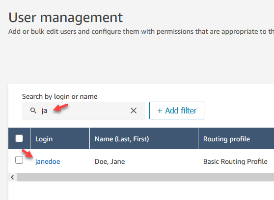

- **Add filter**: This option enables you to perform more
  targeted searches using more advanced criteria. For example, you can specify multiple routing
  profiles, tags, or logins. The following image shows a Login filter. The search will return
  results for two logins: janedoe and johndoe.

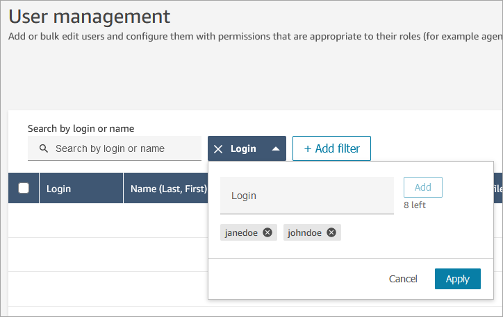

#### Automated rotation of agent shifts

You can create a pattern of shifts that agents will repeatedly rotate through (for
example, morning shift, afternoon shift, night shift). You can define how many weeks each shift
should be scheduled before moving to the next one in the rotation. This feature makes it easier
to administrate schedules and ensure that agents receive a business-defined sequence of shifts.
For more information, see [Set up shift rotation patterns in Amazon Connect](shift-rotations.md "shift-rotations.md").

### June 2024 Updates

#### Updates to Routing Profiles and Queues

Search APIs

You can search for routing profiles by associated queues, and search for queues based on
the routing profile they are assigned to by using the `SearchRoutingProfile` and
`SearchQueues` APIs. These search APIs allow you to query by both name and ID, and
support granular access controls (using tags) over the associated resources. For more
information, see the [SearchRoutingProfile](../APIReference/API_SearchRoutingProfiles.md "../APIReference/API_SearchRoutingProfiles.md")
and [SearchQueues](../APIReference/API_SearchQueues.md "../APIReference/API_SearchQueues.md") API documentation.

#### New definitions for

NextContactId and PreviousContactId

`NextContactId` and `PreviousContactID` have new definitions. For
more information, see [ContactTraceRecord](ctr-data-model.md#ctr-ContactTraceRecord "ctr-data-model.md#ctr-ContactTraceRecord").

#### Amazon Connect outbound campaigns performance dashboard

You can use the outbound campaigns performance dashboard to understand the performance of your
outbound campaigns across voice contacts. For more information, see [Outbound campaigns
performance dashboard](outbound-campaigns-performance-dashboard.md "outbound-campaigns-performance-dashboard.md").

#### Route contact within a queue to a specific

agent

You can now offer a contact in a queue to a specific agent or set of agents based on user
ID; if the agent is not available within a given period of time, you can expire off the routing
criteria to instead offer the contact to any available agent in queue. For more information,
see [Set up routing in Amazon Connect based on agent
proficiencies](proficiency-routing.md "proficiency-routing.md").

#### Connect AI agents recommends step-by-step guides

Connect AI agents, a generative-AI powered assistant for contact center agents, recommends
step-by-step guides in real-time. Agents use step-by-step guides to quickly take action to
resolve customer issues. For more information, see [Integrate Connect AI agents with step-by-step
guides](integrate-guides-with-ai-agents.md "integrate-guides-with-ai-agents.md").

In addition, see the following new APIs that are part of this release:

- [CreateContentAssociation](../APIReference/API_amazon-q-connect_CreateContentAssociation.md "../APIReference/API_amazon-q-connect_CreateContentAssociation.md")
- [DeleteContentAssociation](../APIReference/API_amazon-q-connect_DeleteContentAssociation.md "../APIReference/API_amazon-q-connect_DeleteContentAssociation.md")
- [GetContentAssociation](../APIReference/API_amazon-q-connect_GetContentAssociation.md "../APIReference/API_amazon-q-connect_GetContentAssociation.md")
- [ListContentAssociations](../APIReference/API_amazon-q-connect_ListContentAssociations.md "../APIReference/API_amazon-q-connect_ListContentAssociations.md")

#### Updated look and feel for the Amazon Connect agent workspace

The Amazon Connect agent workspace features an updated user interface to improve the productivity
and focus for your agents. The updated user interface is designed to be more intuitive and
highly responsive, and it increases the visual consistency across capabilities. It provides
your agents with a more streamlined user experience.

With this launch, you can also easily build and embed third-party applications that have a
consistent look and feel with the agent workspace by using Cloudscape Design System components.
For more information, see [Access third-party applications in the
Amazon Connect agent workspace](3p-apps-agent-workspace.md "3p-apps-agent-workspace.md").

### May 2024 Updates

#### Multi-party calls

Agents in a multi-party call can add participants to the call after the customer has
disconnected. Agents can use quick connects or the number pad on the Contact Control Panel to
add participants.

Some examples:

- After a customer disconnects from a multi-party call, the agent can add another agent or
  supervisor to the call to continue the discussion.
- If a customer is accidentally dropped from a multi-party call, the agent can reinstate
  the customer without restarting the multi-party call by manually adding all the
  participants.

###### Note

You must enable multi-party calling to use this feature. For more information about
enabling multi-party calling, see [Update telephony and chat options](update-instance-settings.md#update-telephony-options "update-instance-settings.md#update-telephony-options").

#### Amazon Connect supports multiple features in Apple Messages for Business

As part of the Apple Messages for Business integration, Amazon Connect supports the ability to send Attachments, use
Apple Forms, leverage Apple Pay, access iMessage Apps, and provide authentication support. For
more information on how to enable Apple Messages for Business, see [Enable Apple Messages for Business with Amazon Connect](apple-messages-for-business.md "apple-messages-for-business.md").

#### Set the forecast time zone

You can generate, view, and download forecasts in the time zone where your business
operates. Amazon Connect automatically adjusts forecasts to account for daylight saving changes. For
example, if your contact center receives contacts from 8AM-8PM US Eastern time, then forecasts
will automatically switch from 8AM-8PM Eastern Daylight Time (EDT) to 8AM-8PM Eastern Standard
Time (EST) on November 3, 2024.

Time zone support in forecasts simplifies the day-to-day experience for managers. For more
information, see [Set the forecast time zone](set-forecast-timezone.md "set-forecast-timezone.md").

#### Updated `AmazonConnectServiceLinkedRolePolicy`

service-linked role managed policy

Updated the service-linked role managed policy with the Connect AI agents API action
`wisdom:ListContentAssociations`. For a description of the additional action, see
[Amazon Connect updates to AWS managed policies](security_iam_awsmanpol.md#security-iam-awsmanpol-updates "security_iam_awsmanpol.md#security-iam-awsmanpol-updates").

#### New flow and flow module analytics

You can use the following historical metrics for flows and flow modules to identify
emergent issues, monitor usage patterns, and measure the impact of configuration changes across
your customer or internal facing experiences:

- [Average flow time](metrics-definitions.md#average-flow-time "metrics-definitions.md#average-flow-time")
- [Flows started](metrics-definitions.md#flows-started "metrics-definitions.md#flows-started")
- [Flows outcome](metrics-definitions.md#flows-outcome "metrics-definitions.md#flows-outcome")
- [Flows outcome percentage](metrics-definitions.md#flows-outcome-percentage "metrics-definitions.md#flows-outcome-percentage")
- [Maximum flow time](metrics-definitions.md#maximum-flow-time "metrics-definitions.md#maximum-flow-time")
- [Minimum flow time](metrics-definitions.md#minimum-flow-time "metrics-definitions.md#minimum-flow-time")

These metrics are available in the Amazon Connect admin website. You can also access them programmatically by
using the [GetMetricDataV2](../APIReference/API_GetMetricDataV2.md "../APIReference/API_GetMetricDataV2.md") API.

You can use the [flows dashboard](flows-performance-dashboard.md "flows-performance-dashboard.md") to view
and compare real-time and historical aggregated performance, trends, and insights using
custom-defined time periods (for example, week over week), charts, and tables. The flows
dashboard can help you answer questions such as "how many contacts dropped out of my contact
center before reaching a queue?" or "how long does it take for contacts to navigate through my
self-service voice flow?"

#### Create rules for monitoring flow metrics

You can configure rules to automatically create a task, send an email, or generate an
Amazon EventBridge event whenever a flow or flow module metric breaches the threshold you define. For
example, you can create a rule to assign a task to a contact center administrator whenever the
dropped rate (that is, a percentage of contacts that dropped from a flow) for your inbound
welcome flow exceeds 10% over a trailing 4 hour window. For more information, see [Create alerts on real-time metrics in
Amazon Connect](rule-real-time-metrics.md "rule-real-time-metrics.md").

#### New Amazon Connect Cases APIs

Amazon Connect Cases provides attached file APIs that make it easy to upload attachments, check
attachments details, and delete attachments from cases. For more information on enabling and
working with attachments, see [Enable attachments](enable-attachments.md "enable-attachments.md") and
[Uploading Attached Files](../APIReference/working-with-acps-api.md#uploading-attachments-connect-service "../APIReference/working-with-acps-api.md#uploading-attachments-connect-service"). To view the attached file APIs, see [Files
actions](../APIReference/files-api.md "../APIReference/files-api.md").

#### Amazon Connect Contact Lens provides

generative AI-powered agent performance evaluations (Preview)

Amazon Connect Contact Lens provides managers with generative AI-powered recommendations for
answers to questions in agent evaluation forms, enabling them to perform evaluations faster and
more accurately. For more information, see [Evaluate agent performance in
Amazon Connect using generative AI](generative-ai-performance-evaluations.md "generative-ai-performance-evaluations.md").

#### New metrics available on the Historical metrics page

The following metrics are available on the **Historical metrics** page in
the Amazon Connect admin website. For a description of each metric, see [Metric definitions in Amazon Connect](metrics-definitions.md "metrics-definitions.md").

- Abandonment rate
- Agent non-response without customer abandons
- Average contact duration
- Average conversation duration
- Average customer hold time all contacts
- Average agent greeting time
- Average agent interruptions
- Average holds
- Average agent interruption time
- Average non-talk time
- Average resolution time
- Average talk time
- Average agent talk time
- Average customer talk time
- Agent talk time percent
- Customer talk time percent
- Talk time percent
- Non-talk time percent
- Contacts handled (connected to agent timestamp)
- Contacts queued (enqueue timestamp)
- Callback attempts
- Contacts abandoned in X
- Contacts answered in X
- Contacts resolved in X

### April 2024 Updates

#### New definitions for

NextContactId and PreviousContactId

`NextContactId` and `PreviousContactID` have new definitions. For
more information, see [ContactTraceRecord](ctr-data-model.md#ctr-ContactTraceRecord "ctr-data-model.md#ctr-ContactTraceRecord").

#### Use screen recording with multiple agents connecting to the same desktop

in your environment

You can enable agent screen recording when your VDI environment is configured to allow
multiple agents to connect concurrently to the same Windows instance (multi-session VDI). This
makes it even easier and more cost effective for you to help agents improve their performance
when using Amazon Connect in a multi-session VDI environment.

To use this update, download the latest version of the screen recording client
application. For the download location, see [Amazon Connect Client Application](amazon-connect-client-app.md "amazon-connect-client-app.md").

#### Voice contacts rejected by an agent have a state of

`REJECTED`

Voice contacts rejected by an agent used to have a state of `ERROR` for Contact
State in the Agent Event Stream. Now they have a state of `REJECTED`, which is the
same as chat and task contacts. This is also reflected on Real-time metrics for the
agent.

### March 2024 Updates

#### Contact Lens enables you to

automatically fill and submit evaluations

Contact Lens enables you to automatically fill and submit evaluations, using
insights and metrics from conversational analytics. For more information on creating a rule
that submits an automated evaluation, see [Create a rule
in Contact Lens that submits an automated evaluation](contact-lens-rules-submit-automated-evaluation.md "contact-lens-rules-submit-automated-evaluation.md").

#### Amazon Connect allows you to create rich, interactive chat

experiences for customers using step-by-step guides

Amazon Connect allows you to create rich, interactive chat experiences for customers using
step-by-step guides, that help resolve issues faster and improve the customer experience. For
more information, see [Deploy step-by-step guides in Amazon Connect
chats](step-by-step-guides-chat.md "step-by-step-guides-chat.md").

#### Amazon Connect agent workspace supports third-party applications in

general availability

The Amazon Connect agent workspace now supports third-party applications in general availability.
Agents can use Amazon Connect's native agent applications (Q in Connect, Cases, Customer Profiles, and Step-by-step
Guides) alongside internal or custom-built agent applications, all within a unified agent
workspace. For more information, see [Integrate third-party applications (3p apps) in the Amazon Connect
agent workspace](3p-apps.md "3p-apps.md"), [Use screen pop functionality of
third-party applications in the Amazon Connect agent workspace](no-code-ui-builder-app-integration.md "no-code-ui-builder-app-integration.md"), the [Agent Workspace developer
guide](../../../agentworkspace/latest/devguide/what-is-service.md "../../../agentworkspace/latest/devguide/what-is-service.md"), the [Amazon Connect API reference
guide](../APIReference/API_CreateSecurityProfile.md "../APIReference/API_CreateSecurityProfile.md"), and the [Amazon AppIntegrations API
reference](../../../appintegrations/latest/APIReference/API_CreateApplication.md "../../../appintegrations/latest/APIReference/API_CreateApplication.md").

#### GA for generative AI-powered post-contact summaries

Released generative AI-powered post-contact summaries for general availability. This feature summarizes long customer
conversations into succinct, coherent, and context rich contact summaries. For example, a
summary might say "The customer didn't receive a reimbursement for a last minute flight
cancellation and the agent didn't offer a partial reimbursement as per the SOP." Use these
summaries to help supervisors improve the customer experience by getting faster insights when
reviewing contacts, saving time on quality and compliance reviews, and more quickly identifying
opportunities to improve agent performance.

For more information, see [View generative AI-powered post-contact summaries in
Amazon Connect](view-generative-ai-contact-summaries.md "view-generative-ai-contact-summaries.md").

#### Hierarchy-based access control (Preview)

In addition to tags, you can enable granular access controls for users by [configuring agent](agent-hierarchy.md "agent-hierarchy.md") hierarchies within the Amazon Connect admin website.
Assigning hierarchies to a user allows you to define organizational groups that a user belongs
to, and you can restrict users from accessing others outside their hierarchy by configure
granular permissions. For example, you can configure hierarchy groups and levels for a BPO,
such as Acme Corp, and only users assigned to hierarchy groups under Acme Corp will be able to
see or edit these users. To learn more about using agent hierarchies to enforce granular access
controls for users, see the [Apply hierarchy-based access control in
Amazon Connect](hierarchy-based-access-control.md "hierarchy-based-access-control.md").

### February 2024 Updates

#### Amazon Connect provides case management metrics

Amazon Connect Cases provides the following metrics for case management:

- [Average case resolution time](metrics-definitions.md#average-case-resolution-time "metrics-definitions.md#average-case-resolution-time")
- [Average contacts per case](metrics-definitions.md#average-contacts-per-case "metrics-definitions.md#average-contacts-per-case")
- [Cases created](metrics-definitions.md#cases-created "metrics-definitions.md#cases-created")
- [Cases reopened](metrics-definitions.md#cases-reopened "metrics-definitions.md#cases-reopened")
- [Cases resolved](metrics-definitions.md#cases-resolved "metrics-definitions.md#cases-resolved")
- [Cases resolved on first
  contact](metrics-definitions.md#cases-resolved-on-first-contact "metrics-definitions.md#cases-resolved-on-first-contact")
- [Current cases](metrics-definitions.md#current-cases "metrics-definitions.md#current-cases")

These metrics give you insights into case volumes and performance. You can view new
reports using the historical metrics dashboard in the Amazon Connect admin website to analyze case resolution
performance based on point in time snapshots or specific time intervals.

#### Amazon Connect Cases provides audit history on cases

Amazon Connect Cases provides audit history on cases, allowing you to see which users worked on a
case, what changes they made, and the order in which those changes occurred. This launch makes
it easier for contact center agents and managers to understand what happened on a case for
improved collaboration, quality assurance, and compliance. For information on how to enable the
feature for your users, see [Assign
permissions](assign-security-profile-cases.md "assign-security-profile-cases.md"). Also, see [GetCaseAuditEvents](../../../cases/latest/APIReference/API_GetCaseAuditEvents.md "../../../cases/latest/APIReference/API_GetCaseAuditEvents.md") in the
_Amazon Connect API Reference_.

### January 2024 Updates

#### GA for Amazon Connect outbound campaigns voice dialing API

Released the [PutDialRequestBatch](../../../connect-outbound/latest/APIReference/API_PutDialRequestBatch.md "../../../connect-outbound/latest/APIReference/API_PutDialRequestBatch.md") for general availability. This API enables you to use your own
list management capability to set up the contact strategy (for example, campaign start and end
times, do-not-call times, maximum contact attempts) while programmatically using Amazon Connect
predictive dialer with machine learning (ML)–powered answering machine detection. This helps
increase live-party connections.

#### Barge for chat: Managers can join ongoing chats between agents

and customers

Managers can join and participate in ongoing chats between agents and customers, ensuring
that even the most complex customer issues are resolved quickly and accurately. For more
information, see [Barge into live voice and chat conversations between contact center agents and
customers](monitor-barge.md "monitor-barge.md"). Also see
updates to the [MonitorContact](../APIReference/API_MonitorContact.md "../APIReference/API_MonitorContact.md") and [SendEvent](../../../connect-participant/latest/APIReference/API_SendEvent.md "../../../connect-participant/latest/APIReference/API_SendEvent.md") APIs.

#### GetRecommendations and QueryAssistant APIs will be discontinued

starting June 1, 2024

Two Amazon Q in Connect APIs—[GetRecommendations](../../../amazon-q-connect/latest/APIReference/API_GetRecommendations.md "../../../amazon-q-connect/latest/APIReference/API_GetRecommendations.md") and [QueryAssistant](../../../amazon-q-connect/latest/APIReference/API_QueryAssistant.md "../../../amazon-q-connect/latest/APIReference/API_QueryAssistant.md")—will be discontinued starting June 1, 2024. To receive
generative responses after March 1, 2024, you will need to create a new Assistant in the
Amazon Connect console and integrate the Amazon Q in Connect JavaScript library
(amazon-q-connectjs) into your applications.

#### High-quality voice experiences for agents using Citrix

Virtual Desktop Infrastructure (VDI) environments.

Amazon Connect allows you to deliver high-quality voice experiences when your agents use Citrix
Virtual Desktop Infrastructure (VDI) environments. Your agents can leverage the Citrix remote
desktop application to offload audio processing to the agent’s local device and to
automatically redirect audio to Amazon Connect, resulting in a simpler agent experience and improved
audio quality over challenging networks. For more information, see [Citrix VDI with Amazon Connect audio optimization](scenario-deployment-approaches.md#vdi-citrix "scenario-deployment-approaches.md#vdi-citrix").

#### Granular access controls using resource tags

for historical metrics reports

You can apply granular permissions to resource metrics that are included in historical
metrics reports. For more information, see [Apply granular access control to
historical metrics reports in Amazon Connect](hm-tag-based-access-control.md "hm-tag-based-access-control.md").

### December 2023 Updates

#### Update to third-party applications preview

Added support for third-party applications (preview) to listen to Amazon Connect contact and agent
events.

Expanded AWS Regions to support: US East (N. Virginia), US-West (Oregon), Africa
(Capetown), Asia Pacific (Seoul), Asia Pacific (Singapore), Asia Pacific (Sydney), Asia Pacific
(Tokyo), Canada (Central), Europe (Frankfurt), and Europe (London).

#### Amazon Connect provides granular access controls using resource tags

configured for hours of operation and prompts in the Amazon Connect admin website

Provide granular access controls using resource tags configured for hours of operation and
prompts in the Amazon Connect admin website. For example, you can tag hours of operation with
`Division:HumanResources`, and then only let HR administrators see and edit those
work hours.

Prompts are audio files, such as on-hold music, that can be customized and configured to
play within call flows. For example, you can tag celebrity prompts with
`Department:Insurance`, and then only let administrators from your insurance line
of business access those prompts.

#### Amazon Connect provides an API to programmatically update the

priority of contacts

Programmatically update the priority of contacts, such as voice calls, callbacks, chats,
and tasks, in addition to the existing [Change routing
priority/age](change-routing-priority.md "change-routing-priority.md") flow block. With this API, you can update a contact's or customer's
position in a queue directly from your custom monitoring dashboards. For more information, see
the [UpdateContactRoutingData](../APIReference/API_UpdateContactRoutingData.md "../APIReference/API_UpdateContactRoutingData.md") API.

#### Route contacts according to the proficiency of

agents

You create and use agent proficiencies for routing a contact to the best available agent
in a queue. Each proficiency indicates an agent’s level of expertise in an predefined attribute
such as language fluency, skillset, or customer issue types they support. For more information,
see [Set up routing in Amazon Connect based on agent
proficiencies](proficiency-routing.md "proficiency-routing.md").

#### Added Amazon Connect Cloudformation

resources

Added [AWS::Connect::PredefinedAttribute](../../../AWSCloudFormation/latest/UserGuide/aws-resource-connect-predefinedattribute.md "../../../AWSCloudFormation/latest/UserGuide/aws-resource-connect-predefinedattribute.md") and [AWS::Connect::User UserProficiency](../../../AWSCloudFormation/latest/UserGuide/aws-properties-connect-user-userproficiency.md "../../../AWSCloudFormation/latest/UserGuide/aws-properties-connect-user-userproficiency.md") Cloudformation resources.

#### Amazon Connect Contact Lens provides an API to

programmatically search for contacts

Programmatically search for contacts using filters such as contact attributes (time range,
agent, channel, queue, etc.) and keywords within a conversation. Using this API, you can build
custom user interfaces that enable managers and agents to search for completed or in progress
contacts. For more information, see the [SearchContacts](../APIReference/API_SearchContacts.md "../APIReference/API_SearchContacts.md") API.

#### Pause and resume tasks

You can pause and resume all tasks that aren't expired, disconnected, or scheduled for a
later time. This enables agents to free up an active slot so they can receive more critical
tasks when their current task is stalled, for example, because of a missing approval or waiting
on an external input. For more information, see [Concepts: Pause and
resume tasks](concepts-pause-and-resume-tasks.md "concepts-pause-and-resume-tasks.md"). Also see the [PauseContact](../APIReference/API_PauseContact.md "../APIReference/API_PauseContact.md")
and [ResumeContact](../APIReference/API_ResumeContact.md "../APIReference/API_ResumeContact.md") APIs.

#### Manage your cases and set up escalation workflows using

the rules designer in the Amazon Connect UI

you can create rules to automatically create a task, update a case, or send email alerts
to a manager whenever a case is created or updated. In addition, you can create rules
leveraging Amazon Connect Contact Lens to automatically create a case for post-conversation
follow-up, such as when negative customer sentiment or specific key words are detected in a
conversation.

For more information, see [Automatically monitor and update cases in
Amazon Connect Cases](create-alerts-on-cases.md "create-alerts-on-cases.md"), [Allow Amazon Connect Cases to send
updates to Contact Lens rules](cases-rules-integration-onboarding.md "cases-rules-integration-onboarding.md"), [Create a rule in
Contact Lens that creates a case](contact-lens-rules-create-case.md "contact-lens-rules-create-case.md"),
[Create a rule in
Contact Lens that ends associated tasks from a case](contact-lens-rules-ends-tasks.md "contact-lens-rules-ends-tasks.md"),
and [Create a rule in
Contact Lens that updates a case](contact-lens-rules-update-case.md "contact-lens-rules-update-case.md").

#### Get a more granular view of your Amazon Connect bill and

usage

You can get detailed billing reports in AWS Cost Explorer and AWS Cost & Usage
Reports by using cost allocation tags (key:value pairs) to aggregate the data. You can gain
more insights into your Amazon Connect bill and better organize your bill by lines of
business/departments (for example, support, banking, sales, claims), types of issues, phone
numbers, environments, and more.

For more information, see [Set up granular billing for a detailed view of your Amazon Connect
usage](granular-billing.md "granular-billing.md"). Also see [TagContact](../APIReference/API_TagContact.md "../APIReference/API_TagContact.md") and
[UntagContact](../APIReference/API_UntagContact.md "../APIReference/API_UntagContact.md") in the _Amazon Connect API Reference_.

#### Customer Profiles calculated attributes

that turn customer data into actionable insights

Amazon Connect Customer Profiles enables contact center managers to create calculated attributes that turn
customer behavior data (contacts, orders, web visits) into actionable customer insights such as
a customer’s preferred channel to drive dynamic routing, personalize IVRs, and provide agents
with more relevant customer context. For more information, see the [Getting
started with calculated attributes in Amazon Connect Customer Profiles](customerprofiles-calculated-attributes-admin-website.md "customerprofiles-calculated-attributes-admin-website.md") documentation.

#### Contacts Answered/Abandoned in X

On the **Real-time metrics** page, you can define custom thresholds for
[Contacts abandoned](metrics-definitions.md#contacts-abandoned "metrics-definitions.md#contacts-abandoned") and [Contacts answered in X seconds](metrics-definitions.md#contacts-answered-in-x-seconds "metrics-definitions.md#contacts-answered-in-x-seconds"),
where X is a time range that you specify.

### November 2023 Updates

#### Customer Profiles provides a generative AI

powered customer data mapping capability

Customer Profiles provides a generative AI powered customer data mapping capability that significantly
reduces the time needed to create unified profiles, which allows you to create more
personalized customer experiences more efficiently. For more information, see [Generative AI powered data mapping in
Amazon Connect](genai-powered-data-mapping.md "genai-powered-data-mapping.md").

#### UI builder for step-by-step

guides

This feature allows you to create and manage the UI pages shown to agents in step-by-step
guides. Using a drag-and-drop interface you are able to define static and dynamic content for
the agent’s UI. This includes layouts, styles, and dynamic data, which enables you to control
the look and feel of your agent’s experience. With this capability, you are able define what
gets displayed in your agent’s UI during the step-by-step guided experience. For more
information, see the [Use the UI builder in Amazon Connect for resources
in step-by-step guides](no-code-ui-builder.md "no-code-ui-builder.md")
documentation.

#### Added Connect AI agents

Connect AI agents is a generative AI customer service assistant. It is an LLM-enhanced
evolution of Amazon Connect Wisdom that delivers real-time recommendations to help contact center agents
resolve customer issues quickly and accurately.

Connect AI agents automatically detects customer intent during calls and chats using
conversational analytics and natural language understanding (NLU). It then provides agents with
immediate, real-time generative responses and suggested actions. It also provides links to
relevant documents and articles.

For more information, see [Use Connect AI agents for real-time assistance](connect-ai-agent.md "connect-ai-agent.md") and the [Connect AI agents API Reference](../../../amazon-q-connect/latest/APIReference/Welcome.md "../../../amazon-q-connect/latest/APIReference/Welcome.md").

#### Amazon Connect Contact Lens provides real-time

conversational analytics for chat

Contact Lens provides real-time conversational analytics for chat, extending the
machine learning-powered post-contact analytics (for example, sentiment analysis, automated
contact categorization, and more) to real-time contact scenarios. These capabilities enable
contact center managers to help detect customer issues during in-progress chat contacts, and
help them resolve customer issues faster. For example, managers can get a real-time email alert
when customer sentiment for a chat contact turns negative, allowing them to join the
in-progress contact and help resolve the customer issue.

For more information, see [Analyze conversations using conversational
analytics in Amazon Connect Contact Lens](analyze-conversations.md "analyze-conversations.md"). In addition, see the [ListRealtimeContactAnalysisSegmentsV2](../APIReference/API_ListRealtimeContactAnalysisSegmentsV2.md "../APIReference/API_ListRealtimeContactAnalysisSegmentsV2.md") action in the _Amazon Connect
API Reference_.

#### Amazon Connect Contact Lens provides

generative AI-powered post-contact summaries (Preview)

Contact Lensprovides generative AI-powered post-contact summaries, enabling contact center managers to more
efficiently monitor and help improve contact quality and agent performance.

Contact Lens already labels parts of contact transcripts as issue, outcome, and
action item. With this launch, Contact Lens condenses a long customer conversation into
a concise and coherent summary (for example, customer didn't receive reimbursement for last
minute flight cancellation, and the agent didn't offer partial reimbursement as per the SOP).
This enables managers to help reduce the overall time spent on evaluating contact quality and
agent performance, as they no longer have to read long contact transcripts or listen to call
recordings.

For more information, see [View generative AI-powered post-contact summaries in
Amazon Connect](view-generative-ai-contact-summaries.md "view-generative-ai-contact-summaries.md").

#### Amazon Connect supports in-app, web, and video

calling

The Amazon Connect in-app, web, and video calling capabilities enable your customers to contact you
without ever leaving your web or mobile application. You can use these capabilities to pass
contextual information to Amazon Connect. This enables you to personalize the customer experience based
on attributes such as the customer's profile or other information, like actions previously
taken within the app.

For more information, see [Set up in-app, web, video calling, and screen sharing
capabilities](inapp-calling.md "inapp-calling.md").
In addition, see the [StartWebRTCContact](../APIReference/API_StartWebRTCContact.md "../APIReference/API_StartWebRTCContact.md") action in the _Amazon Connect API
Reference_.

#### Amazon Connect supports two-way SMS

Amazon Connect supports two-way Short Messaging Service (SMS) capabilities, making it easy for you
to resolve customer issues by text messaging. SMS offers a ubiquitous and convenient channel
for customers to get help, while enabling you to deliver personalized experiences at a lower
cost.

To get started, claim your two-way SMS number from AWS End User Messaging SMS and associate the number with
your Amazon Connect instance. Amazon Connect SMS uses the same automation, routing, configuration, analytics, and
agent experience as calls and chats, making it easy to deliver seamless omnichannel customer
experiences.

For more information, see [Set up SMS messaging in Amazon Connect](setup-sms-messaging.md "setup-sms-messaging.md"). In addition, see the following new actions in the
[Amazon Connect API Reference
Guide](../APIReference/Welcome.md "../APIReference/Welcome.md").

- `AssociateFlow`
- `DisassociateFlow`
- `GetFlowAssociation`
- `ImportPhoneNumber`
- `ListFlowAssociations`
- `SendChatIntegrationEvent`

#### Analytics data lake

(Preview)

You can use Analytics data lake as a central location to query various types of data from
Amazon Connect. This data includes contact records and Contact Lens conversational analytics.
Data is refreshed around every 24 hours. You can use the Analytics data lake to create custom
reports or run SQL queries.

For more information, see [Access Amazon Connect analytics data lake](access-datalake.md "access-datalake.md"). In addition, see new actions in the [Analytics data lake
actions](../APIReference/analyticsdataset-api.md "../APIReference/analyticsdataset-api.md") topic in the _Amazon Connect API Reference_.

#### Added metrics to the `GetMetricDataV2`

action

Added the following agent and contact performance metrics to the [GetMetricDataV2](../APIReference/API_GetMetricDataV2.md "../APIReference/API_GetMetricDataV2.md") action:

- [After contact work time](metrics-definitions.md#after-contact-work-time "metrics-definitions.md#after-contact-work-time")
- [Agent interaction and hold
  time](metrics-definitions.md#agent-interaction-and-hold-time "metrics-definitions.md#agent-interaction-and-hold-time")
- [Agent interaction time](metrics-definitions.md#agent-interaction-time "metrics-definitions.md#agent-interaction-time")
- [Contact flow time](metrics-definitions.md#contact-flow-time "metrics-definitions.md#contact-flow-time")
- [Contact handle time](metrics-definitions.md#contact-handle-time "metrics-definitions.md#contact-handle-time")
- [Contacts hold agent disconnect](metrics-definitions.md#contacts-hold-agent-disconnect "metrics-definitions.md#contacts-hold-agent-disconnect")
- [Contacts hold customer disconnect](metrics-definitions.md#contacts-hold-customer-disconnect "metrics-definitions.md#contacts-hold-customer-disconnect")
- [Contacts put on hold](metrics-definitions.md#contacts-put-on-hold "metrics-definitions.md#contacts-put-on-hold")
- [Customer hold time](metrics-definitions.md#customer-hold-time "metrics-definitions.md#customer-hold-time")
- [Contacts transferred out
  external](metrics-definitions.md#contacts-transferred-out-external "metrics-definitions.md#contacts-transferred-out-external")
- [Contacts transferred out internal](metrics-definitions.md#contacts-transferred-out-internal "metrics-definitions.md#contacts-transferred-out-internal")
- [Agent answer rate](metrics-definitions.md#agent-answer-rate "metrics-definitions.md#agent-answer-rate")
- [Agent idle time](metrics-definitions.md#agent-idle-time "metrics-definitions.md#agent-idle-time")
- [Error status time](metrics-definitions.md#error-status-time "metrics-definitions.md#error-status-time")
- [Agent non-productive](metrics-definitions.md#agent-non-productive "metrics-definitions.md#agent-non-productive")
- [Online time](metrics-definitions.md#online-time "metrics-definitions.md#online-time")
- [Agent outbound connecting time](metrics-definitions.md#agent-outbound-connecting-time "metrics-definitions.md#agent-outbound-connecting-time")
- [Agent contact time](metrics-definitions.md#agent-contact-time "metrics-definitions.md#agent-contact-time")
- [Non-adherent time](metrics-definitions.md#non-adherent-time "metrics-definitions.md#non-adherent-time"): This metric is
  available in AWS Regions where Forecasting, capacity planning, and scheduling is
  available.

#### Customer Profiles block enhancements

You can access more customer information, including orders, cases, assets, custom
attributes, and calculated attributes through the Customer Profiles Flow block. For more
information, see [Flow block in Amazon Connect: Customer profiles](customer-profiles-block.md "customer-profiles-block.md").

#### View and manage applied service quotas for

Amazon Connect using AWS Service Quotas

Service Quotas allows you to view both default and applied quota values for resources used
by each of your Amazon Connect instances. When requesting a quota increase, Service Quotas allows you to
indicate both the Amazon Connect quota and desired value. For quotas that support resource level
adjustability you can also specify your Amazon Connect instance. For more information, see [Amazon Connect service quotas](amazon-connect-service-limits.md "amazon-connect-service-limits.md").

#### Added an action to

`AmazonConnectServiceLinkedRolePolicy`

Updated `AmazonConnectServiceLinkedRolePolicy` with an action for Connect AI agents.
For a description of the additional action, see [Amazon Connect updates to AWS managed
policies](security_iam_awsmanpol.md#security-iam-awsmanpol-updates "security_iam_awsmanpol.md#security-iam-awsmanpol-updates").

#### Amazon Connect provides a

Contact Lens conversational analytics dashboard

Amazon Connect provides a pre-built Contact Lens conversational analytics dashboard that
enables customers to understand why customers are contacting, the trends of contact drivers
over time, and the performance of each of those call drivers (for example, average handle time
for call driver “where’s my stuff?”). For more information, see [Contact Lens conversational analytics dashboard](contact-lens-conversational-analytics-dashboard.md "contact-lens-conversational-analytics-dashboard.md").

#### Amazon Connect provides a pre-built queue

performance dashboard

Amazon Connect provides a pre-built queue performance dashboard that helps contact center managers
analyze, track, and improve contact center performance. This dashboard enables managers to view
and compare real-time and historical aggregated queue performance using custom-defined time
periods (for example, week over week), a summary chart, and a time series graph. For more
information, see [Queue performance
dashboard](queue-performance-dashboard.md "queue-performance-dashboard.md").

#### Amazon Connect prompts configuration page provides CloudTrail

coverage

The prompts configuration user interface has been updated to make it more efficient for
you to manage prompts. In addition, when you add, update or delete a prompt from the Amazon Connect admin website, a
record of that activity is available in AWS CloudTrail for visibility, reporting, and compliance. For
example, you may notice a discrepancy in the IVR prompt that customers hear when they call your
support line. To investigate, you can leverage AWS CloudTrail to answer questions such as, "who saved
this recording?" and "when was this prompt changed?" For more information about the new prompts
page, see [Create prompts in Amazon Connect](prompts.md "prompts.md").

#### Amazon Connect enables integration with your

preferred file scanning application to detect malware

You can integrate Amazon Connect with your preferred file scanning application to detect malware or
other unwanted content in attachments before they can be shared in a chat or uploaded to a
case. This capability provides an additional layer of protection for your customers and
organization by preventing malicious files from being shared and downloaded. For more
information, see [Set up attachment scanning in Amazon Connect](setup-attachment-scanning.md "setup-attachment-scanning.md").

#### Amazon Connect outbound campaigns voice

dialing API

You can create contacts for all high-volume voice outreach by using the [BatchPutContact](../APIReference/API_BatchPutContact.md "../APIReference/API_BatchPutContact.md") API. This API makes it easier for you to track
outcomes of all campaign calls by using the Amazon Connect
[contact record](ctr-data-model.md#ctr-ContactTraceRecord "ctr-data-model.md#ctr-ContactTraceRecord").

#### Amazon Connect Cases supports author name on

comments

You can programmatically add and view author comments by using the [CreateRelatedItem](../../../cases/latest/APIReference/API_CreateRelatedItem.md "../../../cases/latest/APIReference/API_CreateRelatedItem.md") and [SearchRelatedItems](../../../cases/latest/APIReference/API_SearchRelatedItems.md "../../../cases/latest/APIReference/API_SearchRelatedItems.md") APIs.

#### Updated

`AmazonConnectCampaignsServiceLinkedRolePolicy` service-linked role managed
policy

Updated the service-linked role managed policy for outbound campaigns. For a description of the
additional actions, see [Amazon Connect updates to AWS
managed policies](security_iam_awsmanpol.md#security-iam-awsmanpol-updates "security_iam_awsmanpol.md#security-iam-awsmanpol-updates").

#### Added Create persistent chat association flow block and

CreatePersistentContactAssociation API

You can set up a chat to be persistent either when the chat session is initially created
or at any time during the lifetime of the chat. To set up persistent chat after the chat
session has started, use the new [CreatePersistentContactAssociation](../APIReference/API_CreatePersistentContactAssociation.md "../APIReference/API_CreatePersistentContactAssociation.md") API or include the new [Create
persistent contact association](create-persistent-contact-association-block.md "create-persistent-contact-association-block.md") block in your flow.

#### Optimization to how the CCP detects and handles stale

WebSocket connections

When an agent initializes the CCP, a WebSocket connection is opened and it is used during
subsequent contact handling. If that agent experiences poor network conditions, this may result
in the agent becoming unreachable without the backend detecting it. With this release the
WebSocket connections for these agents are detected as stale and cleaned in 1-2 minutes.

Amazon Connect can identify, within about 2 minutes, a situation where a chat customer and an agent
are on a chat contact, and the agent becomes unreachable (for example, as a result of losing
wifi or losing power to their local machine), allowing the backend to run the chat disconnect
flow. Before this optimization, it could take up to 10 minutes to run any chat disconnect
flows.

#### Added new service-linked role policy and

service-linked role

Added `AmazonConnectSynchronizationServiceRolePolicy` service-linked role
policy and `AWSServiceRoleForAmazonConnectSynchronization` service-linked role for
managed synchronization. The policy and role provide access to read, create, update, and delete
Amazon Connect resources and is used to automatically synchronize AWS resources across AWS regions.
For more information, see [AWS managed policy:
AmazonConnectSynchronizationServiceRolePolicy](security_iam_awsmanpol.md#amazonconnectsynchronizationservicerolepolicy "security_iam_awsmanpol.md#amazonconnectsynchronizationservicerolepolicy") and [Using service-linked roles for Amazon Connect
Managed Synchronization](managed-synchronization-slr.md "managed-synchronization-slr.md").

#### Added Contact Lens conversational analytics metrics

to the GetMetricDataV2 API

You can analyze aggregate agent and contact performance using Contact Lens
conversational analytics metrics in the [GetMetricDataV2](../APIReference/API_GetMetricDataV2.md "../APIReference/API_GetMetricDataV2.md"). The following new metrics were added:
**non-talk time percent**, **talk time percent**,
**talk time agent percent**, and **talk time customer
percent**. For descriptions of these metrics, see [Metric definitions in Amazon Connect](metrics-definitions.md "metrics-definitions.md").

#### Added configuration management across AWS Regions for Amazon Connect Global Resiliency customers

Amazon Connect Global Resiliency customers can use the [ReplicateInstance](../APIReference/API_ReplicateInstance.md "../APIReference/API_ReplicateInstance.md") API to copy configuration information for resources
such as users, routing profiles, queues, and flows across AWS Regions. The API
also automatically matches the service quotas for these resources across AWS Regions as part of the replication process. For more information, see [Create a replica of your existing
Amazon Connect instance](create-replica-connect-instance.md "create-replica-connect-instance.md").

Added the [BatchGetFlowAssociation](../APIReference/API_BatchGetFlowAssociation.md "../APIReference/API_BatchGetFlowAssociation.md") API. Use this API to obtain a list of
flow-associations for the resource identifiers provided in the API request. For example, you
can list which phone numbers are associated with which flows in an Amazon Connect instance.

### October 2023 Updates

#### Added actions to

`AmazonConnectServiceLinkedRolePolicy`

Updated `AmazonConnectServiceLinkedRolePolicy` with actions for Amazon Connect Customer Profiles. For
a description of the additional actions, see [Amazon Connect updates to AWS managed
policies](security_iam_awsmanpol.md#security-iam-awsmanpol-updates "security_iam_awsmanpol.md#security-iam-awsmanpol-updates").

#### Third-party applications preview

You can integrate third-party applications into the agent workspace. For more information,
see [Integrate third-party applications (3p apps) in the Amazon Connect
agent workspace](3p-apps.md "3p-apps.md") and the [Amazon Connect agent workspace
third-party developer guide](../../../agentworkspace/latest/devguide/what-is-service.md "../../../agentworkspace/latest/devguide/what-is-service.md").

#### Added actions to

`AmazonConnectServiceLinkedRolePolicy`

###### Note

In November 2023 we released Amazon Q. It includes real-time agent assist functionality formerly known as Amazon Connect Wisdom,
along with generative AI-powered recommended responses, actions, and links to more information.

Updated `AmazonConnectServiceLinkedRolePolicy` with actions for
Amazon Connect Wisdom. For a description of the additional actions, see [Amazon Connect updates to AWS managed
policies](security_iam_awsmanpol.md#security-iam-awsmanpol-updates "security_iam_awsmanpol.md#security-iam-awsmanpol-updates").

#### Added the UpdatePhoneNumberMetadata API

Use the [UpdatePhoneNumberMetadata](../APIReference/API_UpdatePhoneNumberMetadata.md "../APIReference/API_UpdatePhoneNumberMetadata.md") to update the metadata for a phone number,
such as the phone number description.

#### Add as many as four access control tags to a

single security profile

Adding additional access control tags will make a given security profile more restrictive.
For example, if you add four access control tags like `BPO:AcmeCorp`,
`Specialty:Claims`, `Department:Billing`, and `City:NewYork`,
the user would only be able to see resources containing all four of these tags. For more
information, see [Apply tag-based access control in
Amazon Connect](tag-based-access-control.md "tag-based-access-control.md").

#### Added actions to

`AmazonConnectServiceLinkedRolePolicy`

Updated `AmazonConnectServiceLinkedRolePolicy` with actions for Amazon Connect Customer Profiles. For
a description of the additional actions, see [Amazon Connect updates to AWS managed
policies](security_iam_awsmanpol.md#security-iam-awsmanpol-updates "security_iam_awsmanpol.md#security-iam-awsmanpol-updates").

#### CTI Adapter upgrade for third-party cookies

This upgrade prevents the blocking of third-party cookies from impacting Amazon Connect across
Chrome and all supported browsers. For more information, see [Amazon Connect CTI Adapter for Salesforce](https://amazon-connect.github.io/amazon-connect-salesforce-cti/docs/lightning/release-notes/ "https://amazon-connect.github.io/amazon-connect-salesforce-cti/docs/lightning/release-notes/") release notes and [Using Amazon Connect with third-party cookies](admin-3pcookies.md "admin-3pcookies.md").

#### Create and customize up to 15 communications widgets

You can create and customize up to 15 communications widgets per Amazon Connect instance. For more
information, see [Add a chat user interface to your website hosted by
Amazon Connect](add-chat-to-website.md "add-chat-to-website.md").

#### Access the trailing 90 days of historical agent and

contact metrics

You can access the trailing 90 days of historical agent and contact metrics (for example,
[Service level X](metrics-definitions.md#service-level "metrics-definitions.md#service-level"), [Average handle time](metrics-definitions.md#average-handle-time "metrics-definitions.md#average-handle-time")) by using the [GetMetricDataV2](../APIReference/API_GetMetricDataV2.md "../APIReference/API_GetMetricDataV2.md") API. You can also make requests spanning up to 35
days with data categorized by customizable time intervals such as 15 minutes, hourly, or
weekly.

In addition, added the following metrics to the `GetMetricDataV2` API. These
metrics are not available in Amazon Connect admin website.

- [Abandonment rate](metrics-definitions.md#abandonment-rate "metrics-definitions.md#abandonment-rate")
- [Agent non-response
  without customer abandons](metrics-definitions.md#agent-non-response-without-customer-abandons "metrics-definitions.md#agent-non-response-without-customer-abandons")
- [Average customer hold time all
  contacts](metrics-definitions.md#average-customer-hold-time-all-contacts "metrics-definitions.md#average-customer-hold-time-all-contacts")
- [Average resolution time](metrics-definitions.md#average-resolution-time "metrics-definitions.md#average-resolution-time")
- [Contacts resolved in X seconds](metrics-definitions.md#contacts-resolved "metrics-definitions.md#contacts-resolved")

#### Added actions to

`AmazonConnectServiceLinkedRolePolicy`

###### Note

In November 2023 we released Amazon Q. It includes real-time agent assist functionality formerly known as Amazon Connect Wisdom,
along with generative AI-powered recommended responses, actions, and links to more information.

Updated `AmazonConnectServiceLinkedRolePolicy` with actions for
Amazon Connect Wisdom. For a description of the additional actions, see [Amazon Connect updates to AWS managed
policies](security_iam_awsmanpol.md#security-iam-awsmanpol-updates "security_iam_awsmanpol.md#security-iam-awsmanpol-updates").

### September 2023 Updates

#### Released Amazon Connect Client Application v1.0.2.38

Released Amazon Connect Client Application v1.0.2.38. This version contains minor fixes and
improvements. For more information, see [Amazon Connect Client Application](amazon-connect-client-app.md "amazon-connect-client-app.md").

#### Added "View my contacts" permission

Added a new security profile permission: View my contacts. On the **Contact
search** page, agents who have this permission can access the contacts that they've
handled. If you're using Contact Lens, agents can also review the analyzed recording and
transcripts of the contact. For more information, see [Assign permissions to use
Contact Lens conversational analytics in Amazon Connect](permissions-for-contact-lens.md "permissions-for-contact-lens.md").

#### Streams API upgrade for third-party cookies

This upgrade prevents the blocking of third-party cookies from impacting Amazon Connect across
Chrome and all supported browsers. For more information, see [Using Amazon Connect with third-party cookies](admin-3pcookies.md "admin-3pcookies.md").

#### Create alerts on real-time metrics

You can create rules that automatically send emails or tasks to managers based on the
values of real-time metrics. This enables you to alert managers on contact center operations
that could potentially impact the end-customer experience.

For more information, see [Create alerts on real-time metrics in
Amazon Connect](rule-real-time-metrics.md "rule-real-time-metrics.md").

#### "Maximum contacts in queue" includes all channels

If you have a queue that combines more than one channel, and you set a custom value for
**Maximum contacts in queue**, the queue stops accepting new contacts after
that number is reached, regardless of the distribution of contacts. For example, if you set the
value to 50, and the first 50 contacts are chats, then voice calls are not routed to this
queue.

For more information, see [Set the limit of maximum contacts in a queue
using Amazon Connect](set-maximum-queue-limit.md "set-maximum-queue-limit.md").

#### Manage contacts from the Contact details page

On the **Contact details** page of an in-progress contact, you can manage
a contact by transferring, rescheduling, or ending the contact. For more information, see [Manage contacts from the Contact details page in
Amazon Connect](manage-contacts-admin.md "manage-contacts-admin.md").

#### Upload file attachments to cases

Agents can upload file attachments to cases. For more information, see [Enable attachments in your CCP so customers and
agents can share and upload files](enable-attachments.md "enable-attachments.md"). For a list of supported
file types, see [Amazon Connect feature specifications](feature-limits.md "feature-limits.md").

In addition, when agents leave comments on cases, their name is included.

#### Search for in-progress contacts

You can search for in-progress contacts on the **Contact search** page.
For more information, see [Search for in-progress contacts in
Amazon Connect](search-in-progress-contacts.md "search-in-progress-contacts.md").

#### Subscribe to the Contact Data Updated event in the contact event

stream

You can subscribe to an event type called `CONTACT_DATA_UPDATED`. The
`Contact` object includes an `UpdatedProperties` field. This enables you
to monitor for changes to scheduled timestamp for tasks, and changes to user-defined attributes
on the contact record. In addition, hierarchy groups information in the `AgentInfo`
object is included for `CONTACT_DATA_UPDATED`, `CONNECTED_TO_AGENT`, and
`DISCONNECTED` event types. For more information, see [Contact events data model](contact-events.md#contact-events-data-model "contact-events.md#contact-events-data-model").

#### APIs to programmatically configure views in step-by-step

guides

Amazon Connect provides APIs to programmatically create and manage view resources used in
step-by-step guides. View resources define what gets displayed in your agent’s UI during a
step-by-step guide. For more information, see the [Views: UI templates to customize an agent's
workspace in Amazon Connect](view-resources-sg.md "view-resources-sg.md") documentation.

#### Support for UIFN in more than 60 countries

Amazon Connect supports Universal International Freephone number (UIFN) in more than 60 countries
that are registered with the International Telecommunications Union, an organization that
supports the administration of the UIFN service. Amazon Connect allows you to enable UIFNs in as many
countries as you need, with a requirement of at least 5 countries. For more information, see
[Amazon Connect support of the inbound only UIFN service](uifn-service.md "uifn-service.md").

### August 2023 Updates

#### Voice dialing for outbound campaigns, no agents

required

You can use Amazon Connect outbound campaigns for high-volume outreach with no agents required. A
new dialer type called "Agentless" makes it easier to proactively communicate with your
customers for use cases such as personalized voice notifications and appointment reminders. For
more information, see [Create an outbound
campaign](how-to-create-campaigns.md "how-to-create-campaigns.md") and the [CreateCampaign](../../../connect-outbound/latest/APIReference/API_CreateCampaign.md "../../../connect-outbound/latest/APIReference/API_CreateCampaign.md") API.

#### Amazon Connect Cases supports nine additional languages

Amazon Connect Cases supports nine additional languages. You can view the Amazon Connect Cases user
interface in any language supported by Amazon Connect regardless of your AWS Region. For more
information, see [Amazon Connect Cases](supported-languages.md#supported-languages-cases "supported-languages.md#supported-languages-cases").

#### Granular access controls using resource

tags for the agent activity audit report

You can apply granular permissions to the agent activity audit report in the Amazon Connect
historical metrics UI using resource tagging and tag-based access controls. For more
information, see [Agent activity
audit tag-based access control in Amazon Connect](agent-activity-audit-tag-based-access-control.md "agent-activity-audit-tag-based-access-control.md") and [Apply tag-based access control in
Amazon Connect](tag-based-access-control.md "tag-based-access-control.md").

#### Enhanced user bulk edit

You can update up to 100 user records on the Amazon Connect admin website in less than half the time it used to
take to make bulk updates. This enhancement is especially useful during contact surges when you
may need to change the routing profile for many agents. For more information, see [Edit users in bulk in Amazon Connect](edit-users-in-bulk.md "edit-users-in-bulk.md").

#### Amazon Connect scheduling supports agent group

activities

Amazon Connect scheduling allows contact center managers to more efficiently create and manage
activities for groups of agents. For more information, see [Add shift activities in
draft or published schedules in Amazon Connect](scheduling-shift-activities-calendar-view.md "scheduling-shift-activities-calendar-view.md").

#### GA for global sign-in and agent distribution

capabilities

Released the following Amazon Connect Global Resiliency capabilities for general availability:
global sign-in and agent distribution across Amazon Connect Regions. This release includes:

- A global sign-in endpoint that enables agents to sign in once and be logged into
  multiple AWS Regions. This eliminates the need to log off / log back into either region
  separately
- An API action to provision agents that are "global" and available in both
  Regions.
- An API action to distribute agents across these AWS Regions by percentage in 10%
  increments (for example, 100% in US East (N. Virginia) and 0% in US West (Oregon), or 50% in
  each Region). This provides you with the flexibility to slowly shift agents across Regions or
  all at the same time.
- Custom and embedded Contact Control Panel enhancements that enable agents to process
  contacts from their current active Region without needing to know which Region is active at
  any given time.

For more information, see [Set up your agent's experience with
Amazon Connect Global Resiliency](overview-agent-distribution.md "overview-agent-distribution.md"). Also see the following new APIs:

- [AssociateTrafficDistributionGroupUser](../APIReference/API_AssociateTrafficDistributionGroupUser.md "../APIReference/API_AssociateTrafficDistributionGroupUser.md")
- [DisassociateTrafficDistributionGroupUser](../APIReference/API_DisassociateTrafficDistributionGroupUser.md "../APIReference/API_DisassociateTrafficDistributionGroupUser.md")
- [ListTrafficDistributionGroupUsers](../APIReference/API_ListTrafficDistributionGroupUsers.md "../APIReference/API_ListTrafficDistributionGroupUsers.md")

Updated [UpdateTrafficDistribution](../APIReference/API_UpdateTrafficDistribution.md "../APIReference/API_UpdateTrafficDistribution.md") with `SignInConfig` and
`AgentConfig` parameters.

To create a CloudFormation template for traffic distribution groups, see the
following topic:

- [AWS::Connect::TrafficDistributionGroup](../../../AWSCloudFormation/latest/UserGuide/aws-resource-connect-trafficdistributiongroup.md "../../../AWSCloudFormation/latest/UserGuide/aws-resource-connect-trafficdistributiongroup.md")

#### 100 rows on real-time metrics

tables

You can now view up to 100 rows in the real-time metrics tables on the **Real-time
metrics** page. Previously, the maximum was 50 rows. For more information about
real-time metrics, see [Real-time metrics reports in Amazon Connect](real-time-metrics-reports.md "real-time-metrics-reports.md").

#### Sorting on column header names

You now have the ability to sort by choosing a column header, rather than choosing the
smaller arrow next to the header text. For more information about real-time metrics, see [Real-time metrics reports in Amazon Connect](real-time-metrics-reports.md "real-time-metrics-reports.md").

#### Route based on time since last inbound contact

Added an option to specify that selected agents with this routing profile will not have
their routing order impacted by outbound contacts. For more information, see [Create a routing profile in Amazon Connect to link queues to
agents](routing-profiles.md "routing-profiles.md").

### July 2023 Updates

#### Customize the names of flow blocks

To help you distinguish blocks in a flow, you can customize the names of blocks. For
example, you might rename a _Play Prompt_ flow block to _Welcome
message_ or a _Get customer input_ flow block to _Hotel
booking Lex bot_. The following GIF shows how to customize the name of a flow
block.

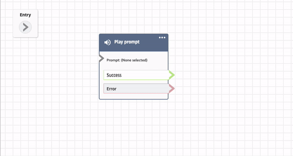

For more information, see [Customize the name of a flow block in
Amazon Connect](set-custom-flow-block-name.md "set-custom-flow-block-name.md").

#### Archive, restore, and delete flows and modules

You can archive, restore, and delete flows and modules by using the Amazon Connect admin website.
This makes it easier to manage flows and modules that are not in use or no longer needed. For
example, flows used only during certain times of the year can be archived when not in use and
then unarchived when needed. When a flow or module has been archived, you can then permanently
delete it so it is no longer available within your list of flows and modules. For more
information, see [Archive, delete, and restore flows in
Amazon Connect](delete-contact-flow.md "delete-contact-flow.md").

#### Undo and redo actions in the flow designer

You can undo and redo actions in the flow designer. Choose the undo and redo items on the
toolbar. Or, with your cursor on the flow designer canvas, use the shortcut keys: Ctrl+Z to
undo, Ctrl+Y to redo. For more information, see [Undo and redo actions in the flow designer in
Amazon Connect](undo-redo-history.md "undo-redo-history.md").

#### Add notes to a flow block

To add notes to a block, on the toolbar choose Annotation. Or, with your cursor on the
flow designer canvas, use the shortcut keys: Ctrl + Alt +N. A yellow box opens for you to type
up to 1000 characters. This enables you to leave comments that others can view. For more
information, see [Add comments to a flow block in the flow designer
in Amazon Connect](add-notes-to-block.md "add-notes-to-block.md").

The following GIF shows how to move notes around the flow designer and attach them to a
block.

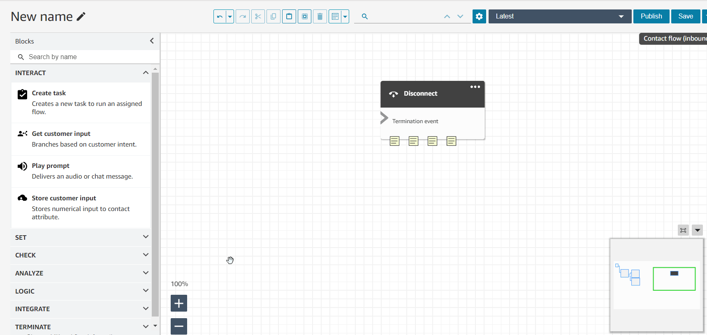

#### Use the mini-map to navigate a flow

On the flow designer, the mini-map view to helps you easily navigate the flow. The
drag-to-move mini-map has visual highlights that enable you to quickly move to any point in the
flow. For more information, see [Use the mini-map in Amazon Connect to navigate a flow](flow-minimap.md "flow-minimap.md").

The following GIF shows an example of how you can use the mini-map to navigate a large
flow.

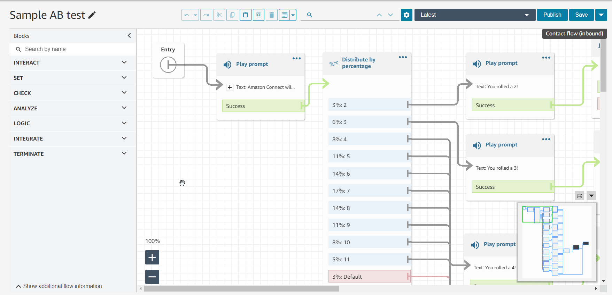

#### Restrict attributes to specific flows

Released a new type of attributes called a flow attribute. Flow attributes are restricted
to the flow in which they are configured. They are useful in situations where you don't want to
persist the data throughout the contact, such as when you need to use sensitive information
like the customer's credit card number to do a Lambda data dip. For more information, see [Flow attributes](connect-attrib-list.md#flow-attributes "connect-attrib-list.md#flow-attributes").

#### Import time off balances

You can import time off balances for your users. You can also set the group allowance for
time off by hour, for each calendar day, for specific time off activities. Amazon Connect uses the time
off balance to automatically approve or decline time off requests based on the agent's
available net balance and the group allowance for time off. For more information, see [Import an agent's time off balance to
Amazon Connect](upload-timeoff-balance.md "upload-timeoff-balance.md") and [Set group allowance for time off in
Amazon Connect](config-group-allowance-to.md "config-group-allowance-to.md").

#### Schedule flexible days and shift activities based

on shift length

The following scheduling functionality has been released:

- You can generate agent schedules that have the appropriate number of activities, such as
  breaks or meals, depending on the duration of the shift. The required number of breaks and
  meals are automatically placed in schedules that are compliant to various regional labor
  laws.
- You can generate agent schedules that include flexible days, that is, days that will be
  optionally scheduled if there's a need. Amazon Connect can automatically generate flexible schedules
  that are compliant to agent's contracts and regional labor laws, thereby saving time for
  schedulers.

For more information, see [Create a template for an agent's
weekly shift in Amazon Connect](scheduling-create-shift-profiles.md "scheduling-create-shift-profiles.md").

#### Amazon Connect Customer Profiles supports rule-based matching and

merging

Amazon Connect Customer Profiles supports rule-based resolution to match and merge similar profiles into unified
ones. This enables you to enhance customer service by granting agents and automated systems
access to relevant customer information. As a result, interactions become faster and more
personalized for customers. For more information, see [Use Identity Resolution to consolidate similar profiles in
Amazon Connect](use-identity-resolution.md "use-identity-resolution.md").

#### Released Amazon Connect Client Application v1.0.1.33

The Amazon Connect Client Application is used to [record agent
screens](agent-screen-recording.md "agent-screen-recording.md"). With this newer version you no longer need to restart your desktop after
installing the client application. For the download location, see the [Amazon Connect Client Application](amazon-connect-client-app.md "amazon-connect-client-app.md") topic.

#### Amazon Connect Cases provides case assignment

Case assignment helps organizations reduce the time to resolve customer issues by clearly
tracking case activities and resolution ownership. Agents can associate a case with a queue or
an individual agent for resolution. Agents can view and filter cases assigned to their queue,
and managers can directly assign cases to individual agents. For more information, see [Set up a case assignment in Amazon Connect Cases](case-assignment.md "case-assignment.md").

#### Contact Lens

Conversational Analytics metrics in the API

You can analyze aggregate agent and contact performance using Contact Lens
Conversational Analytics metrics in the [GetMetricDataV2](../APIReference/API_GetMetricDataV2.md "../APIReference/API_GetMetricDataV2.md") API. The list of metrics include Average contact duration, Average
conversation duration, Average greeting time agent, Average holds, Average interruptions agent,
Average interruption time agent, Average non-talk time, Average talk time, Average talk time
agent, and Average talk time customer. For more information, see [Metric definitions in Amazon Connect](metrics-definitions.md "metrics-definitions.md") and [GetMetricDataV2](../APIReference/API_GetMetricDataV2.md "../APIReference/API_GetMetricDataV2.md").

#### Amazon Connect Wisdom supports real-time recommendations for chat

conversations

###### Note

In November 2023 we released Amazon Q. It includes real-time agent assist functionality formerly known as Amazon Connect Wisdom,
along with generative AI-powered recommended responses, actions, and links to more information.

Amazon Connect Wisdom delivers ML-powered, real-time recommended information to help chat
agents quickly solve customer needs.

#### Delete queues and routing profiles

programmatically

You can delete queues and routing profiles programmatically. For more information, see the
following topics:

- [DeleteQueue](../APIReference/API_DeleteQueue.md "../APIReference/API_DeleteQueue.md") action
- [delete-queue](../../../cli/latest/reference/connect/delete-queue.md "../../../cli/latest/reference/connect/delete-queue.md") AWS CLI
- [DeleteRoutingProfile](../APIReference/API_DeleteRoutingProfile.md "../APIReference/API_DeleteRoutingProfile.md") action
- [delete-routing-profile](../../../cli/latest/reference/connect/delete-routing-profile.md "../../../cli/latest/reference/connect/delete-routing-profile.md") AWS CLI

To create an CloudFormation template for queues and routing profiles, see the following
topics:

- [AWS::Connect::Queue](../../../AWSCloudFormation/latest/UserGuide/aws-resource-connect-queue.md "../../../AWSCloudFormation/latest/UserGuide/aws-resource-connect-queue.md")
- [AWS::Connect::RoutingProfile](../../../AWSCloudFormation/latest/UserGuide/aws-resource-connect-routingprofile.md "../../../AWSCloudFormation/latest/UserGuide/aws-resource-connect-routingprofile.md")

### June 2023 Updates

#### Agents can change their audio device settings in

the CCP and agent workspace

You can configure the Contact Control Panel (CCP) or agent workspace to enable agents to
select their preferred device for microphone input and audio output, such as voice media and
new contact notifications. For more information, see [How to use the CCP to change your
audio device settings](audio-device-settings.md "audio-device-settings.md").

#### Amazon Connect Chat: New interactive message

types

Amazon Connect Chat supports new interactive message types: quick replies and
carousels. With quick replies, customers are presented with a list of response options (for
example, **Yes**, **No**) that they can easily click to
reply. Carousels present a set of interactive messages in a horizontally-scrolling format. Your
customers can scroll through them and select the best option. For more information, see [Add Amazon Lex interactive messages for customers in
chat](interactive-messages.md "interactive-messages.md").

#### GetMetricDataV2 API: Region availability and new

functionality

The [GetMetricDataV2](../APIReference/API_GetMetricDataV2.md "../APIReference/API_GetMetricDataV2.md") API is available in the AWS GovCloud (US-West)
Region. GetMetricDataV2 is now released in all AWS Regions where Amazon Connect is
offered. This API enables you to access the trailing 35 days of historical agent and contact
metrics (for example, service level, average handle time) with customizable filters and
groupings.

You can use GetMetricDataV2 to build custom dashboards to measure queue and agent
performance over time. For example, you can identify the number of contacts that were
disconnected by an agent versus disconnected by a customer hanging up. For more information,
see [GetMetricDataV2](../APIReference/API_GetMetricDataV2.md "../APIReference/API_GetMetricDataV2.md").

#### Search for existing tags within an Amazon Connect

instance

Amazon Connect provides the ability to search for existing tags within an instance, both
programmatically via API and within the UI. When tagging resources, you can search from
pre-existing key:value pairs before creating new ones. For more information, see the [SearchResourceTags](../APIReference/API_SearchResourceTags.md "../APIReference/API_SearchResourceTags.md") API.

#### Added screen recording capabilities to

Contact Lens

Amazon Connect Contact Lens provides screen recording capabilities, making it easy for you to
help agents improve their performance. With screen recording, you can identify areas for agent
coaching (for example, long contact handle duration or non-compliance with business processes)
by not only listening to customer calls or reviewing chat transcripts, but also watching the
agent's actions while they are handling a contact. For more information, see [Set up and review agent screen recordings in Amazon Connect
Contact Lens](agent-screen-recording.md "agent-screen-recording.md").

#### Amazon Connect scheduling allows agents to manage

time off requests

Amazon Connect scheduling allows contact center agents to manage their time off requests in a
self-serve manner. For more information, see [Create a time off request in Amazon Connect](create-time-off-to.md "create-time-off-to.md").

#### Real-time data export of unified customer profiles to

an Amazon Kinesis Data Stream

Amazon Connect Customer Profiles supports real-time data export of unified customer profiles to an Amazon Kinesis
Data Stream. Companies can enable data streaming and automatically receive data for new
profiles and updates to existing profiles into their Amazon Kinesis Data Stream. For more
information, see [Export your unified customer profile
data](set-up-real-time-export.md "set-up-real-time-export.md").

### May 2023 Updates

#### Added theme detection to Contact Lens

Contact Lens provides a machine learning powered capability for businesses to help
identify top contact drivers by grouping customer conversations into themes. For more
information, see [Use theme detection in Amazon Connect
Contact Lens to discover issues with contacts](use-theme-detection.md "use-theme-detection.md").

#### New APIs for managing prompts

You can programmatically create and manage prompts using APIs, for example, to extract
prompts stored in Amazon Connect and add them to your Amazon S3 bucket. AWS CloudTrail, CloudFormation, and
tagging are supported. For more information, see [Prompt actions](../APIReference/prompts-api.md "../APIReference/prompts-api.md") in the
_Amazon Connect API Reference Guide_. Also see [AWS::Connect::Prompt](../../../AWSCloudFormation/latest/UserGuide/aws-resource-connect-prompt.md "../../../AWSCloudFormation/latest/UserGuide/aws-resource-connect-prompt.md") in the _CloudFormation User Guide_.

#### Added supervisor alerts on agent performance

Amazon Connect Contact Lens provides supervisor alerts on agent performance. This enables you
to identify which contacts (for example, those with an evaluation score less < 50%) that
require supervisors follow-up with agents on their team. For more information, see [Notify supervisors and agents about
performance evaluations](create-evaluation-rules.md "create-evaluation-rules.md").

#### Interactive messages: Rich formatting in chat

titles and subtitles

You can add rich formatting to the titles and subtitles of your chat messages. For
example, you can add links, italics, bold, numbered lists, and bulleted lists. You use [markdown](https://commonmark.org/help/ " https://commonmark.org/help/") to format your text. For more
information, see [Rich formatting
in titles and subtitles](interactive-messages.md#rich-link-formatting "interactive-messages.md#rich-link-formatting") in the _Add interactive messages to chat_
topic.

### April 2023 Updates

#### GA for Amazon Connect evaluation capabilities

Released Amazon Connect evaluation capabilities for general availability. Use these capabilities
to:

- [Create evaluation forms](create-evaluation-forms.md "create-evaluation-forms.md")
- [Evaluate agent performance](evaluations.md "evaluations.md")
- [Create rules](create-evaluation-rules.md "create-evaluation-rules.md") that trigger an action (such
  as send email or tasks) based on evaluation results
- [Search evaluation forms and evaluations](search-evaluations.md "search-evaluations.md")

To manage evaluation forms programmatically, see the [Evaluation](../APIReference/evaluation-api.md "../APIReference/evaluation-api.md") actions in the
_Amazon Connect API Reference_. To create a shared template for evaluation forms,
see the AWS::Connect::EvaluationForm resource in the _CloudFormation User Guide_.

#### New API: Use `CreateParticipant` to customize chat flow

experiences

Added the [CreateParticipant](../APIReference/API_CreateParticipant.md "../APIReference/API_CreateParticipant.md") API which you can use to customize chat flow
experiences. You use it to integrate custom participants. For more information, see [Customize chat flow experiences in Amazon Connect by
integrating custom participants](chat-customize-flow.md "chat-customize-flow.md").

#### Customer Profiles displays case information in the agent

workspace

Using Amazon Connect Customer Profiles inside the agent workspace, agents can see cases from
third-party case management solutions and Amazon Connect Cases inside a particular customer
profile. For more information, see [Use Amazon Connect Customer Profiles](customer-profiles.md "customer-profiles.md") and [Access Amazon Connect Customer Profiles in the agent
workspace](customer-profile-access.md "customer-profile-access.md").

#### Added Cross-channel concurrency

You can configure an agent's routing profile to receive contacts from multiple channels at
the same time. For example, while an agent is on a voice contact, they can be offered contacts
from any other channels enabled in the routing profile, such as chats and tasks.

For more information, see [Create a routing profile in Amazon Connect to link queues to
agents](routing-profiles.md "routing-profiles.md"). Also see the [CrossChannelBehavior](../APIReference/API_CrossChannelBehavior.md "../APIReference/API_CrossChannelBehavior.md") API.

#### Set Voice ID block supports fraud watchlist ID

Updated the [Set Voice ID block](set-voice-id.md "set-voice-id.md") so it supports fraud watchlist ID for fraud detection.

#### Search, sort, and filter published

agent schedules

Schedulers can quickly search, sort, and filter agent schedules from within the published
schedule calendar. For more information, see [How supervisors view
published schedules using the Amazon Connect admin website](scheduling-view-schedule-supervisors.md "scheduling-view-schedule-supervisors.md").

### March 2023 Updates

#### Added Wisdom support for Microsoft SharePoint

Online

###### Note

In November 2023 we released Amazon Q. It includes real-time agent assist functionality formerly known as Amazon Connect Wisdom,
along with generative AI-powered recommended responses, actions, and links to more information.

You can choose Microsoft SharePoint Online as knowledge base for Wisdom articles.
For more information, see [Initial set-up for AI agents](ai-agent-initial-setup.md "ai-agent-initial-setup.md"). Also see the
[AppIntegrationsConfiguration](../../../amazon-q-connect/latest/APIReference/API_AppIntegrationsConfiguration.md "../../../amazon-q-connect/latest/APIReference/API_AppIntegrationsConfiguration.md") API in the _Connect AI agents API
Reference_.

#### Create step-by-step guides for your agents

Inside the out-of-the-box Amazon Connect agent workspace, you can create workflows
that walk agents through custom UI pages that suggest what to do at a given moment during a
customer interaction. You can create guides that help agents identify customer issues and
recommend subsequent actions, as well as surface screen-pops and forms for submitting
transactions and disposition codes. For more information, see [Step-by-step Guides to set up your
Amazon Connect agent workspace](step-by-step-guided-experiences.md "step-by-step-guided-experiences.md").

#### Added support for nested JSON in Invoke AWS

Lambda function flow block

The Invoke AWS Lambda function flow block supports JSON responses. For more
information, see [Flow block in Amazon Connect: AWS Lambda
function](invoke-lambda-function-block.md "invoke-lambda-function-block.md").

#### Added Show View flow block

This block is used to configure UI based workflows that you can surface to users in front
end applications. For more information, see [Flow block in Amazon Connect: Show view](show-view-block.md "show-view-block.md").

#### Added staff level shift profile

You can assign a shift profile to individual agents. This is useful to do when, for
example, you have part-time agents who are in the same staffing group as your full-time agents,
but they require their own shift profile. For more information, see the **Associate to
shift profile** option described in [Create staff rules for scheduling in
Amazon Connect](scheduling-create-staff-rules.md "scheduling-create-staff-rules.md").

#### Added support for multiple fraudster watchlists

Every domain has a default watchlist where all existing fraudsters are placed by default.
You can create and manage custom watchlists to be evaluated against for known fraudster
detection. For more information, see [Known fraudster
detection](voice-id.md#fraud-detection "voice-id.md#fraud-detection"), and see new actions in the [Amazon Connect Voice ID API Reference](../../../voiceid/latest/APIReference/Welcome.md "../../../voiceid/latest/APIReference/Welcome.md").

#### Search and sort schedules in the

Schedule Manager

Schedulers can quickly search for schedule names using partial keywords or sort the
schedule list based on start date, end date, creation date, or updated date. For more
information, see [Search and sort a
schedule](scheduling-publish-schedule.md#scheduling-manager-search-sort "scheduling-publish-schedule.md#scheduling-manager-search-sort").

#### Added the ability to configure multiple IAM roles that

can be assigned to a single user when using SAML 2.0

You can configure multiple IAM roles that can be assigned to a single user when using SAML
2.0 which enables you to support user access from multiple identity providers simultaneously.
For example, if you are migrating identity providers, you can configure multiple IAM roles
associated to a single user and that user will be able to access Amazon Connect from either provider. To
learn more about configuring IAM roles for SAML 2.0 in Amazon Connect, see the [Configure SAML with IAM for Amazon Connect](configure-saml.md "configure-saml.md") documentation.

#### Added panel template for interactive chat

messages

With a panel template, you can present customers with up to 10 choices under one question
in a chat message. For more information, see [Add Amazon Lex interactive messages for customers in
chat](interactive-messages.md "interactive-messages.md").

#### Added `GetMetricDataV2` API

Added the [GetMetricDataV2](../APIReference/API_GetMetricDataV2.md "../APIReference/API_GetMetricDataV2.md") API to the
_Amazon Connect API Reference Guide_. This API enables you to programmatically
access trailing 14 days of historical agent and contact metrics data. It extends the
capabilities of the [GetMetricData](../APIReference/API_GetMetricData.md "../APIReference/API_GetMetricData.md")
API, provides new [historical metrics](metrics-definitions.md "metrics-definitions.md") (for
example, the number of [contacts
disconnected](metrics-definitions.md#contacts-disconnected "metrics-definitions.md#contacts-disconnected"), and the number of [callback
attempts](metrics-definitions.md#callback-attempts "metrics-definitions.md#callback-attempts")), and provides the ability to filter metrics with more granularity.

### February 2023 Updates

#### Added new attribute type

`ENHANCED_CONTACT_MONITORING` to the Describe, List, and Update Instance Attribute
APIs

This release updates the APIs: `DescribeInstanceAttribute`,
`ListInstanceAttributes`, and `UpdateInstanceAttribute`. You can use it
to programmatically enable/disable enhanced contact monitoring using attribute type
`ENHANCED_CONTACT_MONITORING` on the specified Amazon Connect instance. For more
information, see [DescribeInstanceAttribute](../APIReference/API_DescribeInstanceAttribute.md "../APIReference/API_DescribeInstanceAttribute.md"), [ListInstanceAttributes](../APIReference/API_ListInstanceAttributes.md "../APIReference/API_ListInstanceAttributes.md"), and [UpdateInstanceAttribute](../APIReference/API_UpdateInstanceAttribute.md "../APIReference/API_UpdateInstanceAttribute.md").

#### Added the `DeleteDomain` API for Cases

For more information, see the [DeleteDomain](../../../cases/latest/APIReference/API_DeleteDomain.md "../../../cases/latest/APIReference/API_DeleteDomain.md") API
in the _Amazon Connect Cases API Reference Guide_.

#### Added `RelatedContactId` to

`StartTaskContact` API

You can link together an unlimited number of task contacts using the
`RelatedContactID` parameter supported in the `StartTaskContact` API.
For more information, see [Linked tasks](tasks.md#linked-tasks "tasks.md#linked-tasks") and the [StartTaskContact](../APIReference/API_StartTaskContact.md "../APIReference/API_StartTaskContact.md") API in the _Amazon Connect API Reference
Guide_.

#### Amazon Connect Cases integrates with AWS PrivateLink

For more information, see [Creating an interface VPC endpoint for
Amazon Connect](vpc-interface-endpoints.md#vpc-endpoint-create "vpc-interface-endpoints.md#vpc-endpoint-create").

#### Added support for more

granular access controls (using resource tags) to view real-time metrics for agents, queues,
and routing profiles

You can enable more granular access controls for real-time metrics by configuring resource
tags and access control tags within security profiles in the Amazon Connect admin website. For more
information, see [Real-time tag-based access
control](rtm-tag-based-access-control.md "rtm-tag-based-access-control.md") and [Tag based access control in
Amazon Connect](tag-based-access-control.md "tag-based-access-control.md").

#### Added support to provide more

granular permissions to metrics reports, including new permissions for real-time metrics,
historical metrics, and agent activity audit

You can configure more granular permissions to metrics and reports from within security
profiles in the Amazon Connect admin website. For more information, see [Permissions required to
view real-time metrics reports](dashboard-required-permissions.md "dashboard-required-permissions.md") and [Agent activity audit
permissions](agent-activity-audit-permissions.md "agent-activity-audit-permissions.md").

#### Added support to provide visibility into an

agent’s next activity

You can view an agent’s next activity in the real-time metrics agent table in the Amazon Connect
real-time metrics UI and by using the public API. For more information, see the [NextStatus API reference](../APIReference/API_UserData.md#connect-Type-UserData-NextStatus "../APIReference/API_UserData.md#connect-Type-UserData-NextStatus").

#### Apply S3 Object Lock for the call recordings bucket

You can use Amazon S3 Object Lock in combination with your call recording bucket
to help prevent call recordings from being deleted or overwritten for a fixed amount of time,
or indefinitely. For more information, see [How to set up S3 Object Lock for
immutable call recordings](s3-object-lock-call-recordings.md "s3-object-lock-call-recordings.md").

#### CloudFormation templates for instance management

You can use CloudFormation templates to manage Amazon Connect instances for
associating Amazon Lex and Lex V2 bots, Lambda functions, security keys,
and approved origins—along with the rest of your AWS
infrastructure—in a secure, efficient, and repeatable way. For more information, see
[Amazon Connect resource type reference](../../../AWSCloudFormation/latest/UserGuide/AWS_Connect.md "../../../AWSCloudFormation/latest/UserGuide/AWS_Connect.md") in the _CloudFormation User
Guide_.

### January 2023 Updates

#### Added long lasting, persistent chat experiences

Amazon Connect makes it easier for you to deliver long lasting, persistent chat
experiences for your customers. Persistent chats enable customers to resume previous
conversations with the context, metadata, and transcripts carried over, eliminating the need
for customers to repeat themselves and allowing agents to provide personalized service with
access to the entire conversation history. To set up persistent chat experiences, provide a
previous contact ID when calling the [StartChatContact](../APIReference/API_StartChatContact.md "../APIReference/API_StartChatContact.md") API to create a new chat contact.

For more information, see [Enable persistent chat](chat-persistence.md "chat-persistence.md"). Also see
changes to [StartChatContact](../APIReference/API_StartChatContact.md "../APIReference/API_StartChatContact.md") in the _Amazon Connect API Reference
Guide_, and see the new `RelatedContactId` parameter in the [GetTranscript](../../../connect-participant/latest/APIReference/API_GetTranscript.md "../../../connect-participant/latest/APIReference/API_GetTranscript.md") API in the _Amazon Connect Participant
Service API Reference Guide_.

### December 2022 Updates

#### Added message receipts feature for chat messages

The message receipts feature allows customers to receive _Message
delivered_ and _Read_ receipts after they send a chat message.
For more information, see [Enable message Delivered and Read
receipts in your chat user interface](message-receipts.md "message-receipts.md"). Also see the [SendEvent](../../../connect-participant/latest/APIReference/API_SendEvent.md "../../../connect-participant/latest/APIReference/API_SendEvent.md") action, and the [Item](../../../connect-participant/latest/APIReference/API_Item.md "../../../connect-participant/latest/APIReference/API_Item.md"),
[MessageMetadata](../../../connect-participant/latest/APIReference/API_MessageMetadata.md "../../../connect-participant/latest/APIReference/API_MessageMetadata.md"), and [Receipt](../../../connect-participant/latest/APIReference/API_Receipt.md "../../../connect-participant/latest/APIReference/API_Receipt.md")
data types in the _Amazon Connect Participant Service API Reference
Guide_.

#### Updates to GetCurrentMetricData and

GetCurrentUserData

For the [GetCurrentMetricData](../APIReference/API_GetCurrentMetricData.md "../APIReference/API_GetCurrentMetricData.md") API, added support for routing profile filter,
sort criteria, and grouping by routing profiles. For the [GetCurrentUserData](../APIReference/API_GetCurrentUserData.md "../APIReference/API_GetCurrentUserData.md") API, added support for routing profiles, user
hierarchy groups, and agents as filters, and next status and agent status name. For both APIs,
added ApproximateTotalCount.

#### Added chat timeouts for chat participants

When a chat conversation between an agent and a customer has been inactive (no messages
sent) for a certain amount of time, you may want to consider a chat participant to be idle, and
you may even want to automatically disconnect an agent from the chat. To set up chat timeout
timers, see [Set up chat timeouts for chat
participants](setup-chat-timeouts.md "setup-chat-timeouts.md").

#### Microsoft Edge Chromium support

Amazon Connect now supports Microsoft Edge Chromium. For more information about
supported browsers, see [Browsers supported by Amazon Connect.](connect-supported-browsers.md "connect-supported-browsers.md")

#### Amazon Connect supports JSON as a content type

for chat messages

By supporting JSON as a content type, Amazon Connect provides you with a way to pass
additional information over chat to provide rich personalized experiences. For example,
rendering updates to a custom UI, customer-built interactive messages, language translation
capabilities, and passing customer metadata to a third party bot. For more information, see
[StartChatContact](../APIReference/API_StartChatContact.md "../APIReference/API_StartChatContact.md") in the _Amazon Connect API Reference
Guide_, and [SendMessage](../../../connect-participant/latest/APIReference/API_SendMessage.md "../../../connect-participant/latest/APIReference/API_SendMessage.md") in the _Amazon Connect Participant Service
API Reference Guide_.

#### Added topic on Amazon Connect availability by

Region

For more information, see [Availability of Amazon Connect services by
Region](regions.md "regions.md").

#### Contact Lens granular data

redaction

When you set up Contact Lens sensitive data redaction, you can choose which
entities you want to redact, and how you want the redaction to appear in the transcript. For
more information, see [Enable redaction of
sensitive data](enable-analytics.md#enable-redaction "enable-analytics.md#enable-redaction").

#### Additional Contact Lens language support

and Region availability

Contact Lens now [supports the following languages](supported-languages.md#supported-languages-contact-lens "supported-languages.md#supported-languages-contact-lens"): English - New Zealand, English - South Africa. It
is also [available in the
following Regions](enable-analytics.md#regions-contactlens "enable-analytics.md#regions-contactlens"): Africa (Cape Town), Asia Pacific (Seoul), Asia Pacific (Singapore).

#### Released Barge to allow contact center managers to

join ongoing calls

Barge allows managers to join and participate in an ongoing customer service call between
a contact center agent and customer. After joining the call, a manager can speak with the
customer, add participants, and even choose to remove an agent if needed. For more information,
see [Barge live
conversations](monitor-barge.md "monitor-barge.md").

#### Added user hierarchy to bulk user upload

You can assign the user hierarchy in the .csv file when you add users in bulk. For more
information, see [Add users in bulk](user-management.md "user-management.md").

#### Granular access controls using resource

tags for users, security profiles, routing profiles, and queues

You can now enable more granular access controls for security profiles, users, routing
profiles, and queues by configuring resource tags within the Amazon Connect console. You can add
resource tags to filter and organize these resources logically, and configure access control
tags within security profiles to enforce granular permissions. For more information, see [Tagging resources in
Amazon Connect](tagging.md "tagging.md") and [Tag based access controls in
Amazon Connect](tag-based-access-control.md "tag-based-access-control.md").

#### Bulk user import now includes agent hierarchy

and tags

Amazon Connect now allows you to configure hierarchies and resource tags for users in bulk. You can
now assign agent hierarchies and resource tags to each agent using the CSV bulk upload template
which is available on the user management page. For more information, see [Tagging resources in
Amazon Connect](user-management.md "user-management.md").

#### Released Rules Function language

The Rules Function language is a JSON-based representation of a series of rule conditions.
Use it to programmatically add conditions to rules. For more information, see [Amazon Connect Rules
Function language](../APIReference/connect-rules-language.md "../APIReference/connect-rules-language.md") in the _Amazon Connect API Reference Guide_.

#### GA for Rules APIs

Released a set of Rules APIs that enable you to programmatically create and manage rules.
For more information, see [Rules actions](../APIReference/rules-api.md "../APIReference/rules-api.md") in the _Amazon Connect
API Reference_.

#### Search contacts by agent's first or last name is

available in AWS GovCloud

### November 2022 Updates

#### Create step-by-step guides for your

agents

Inside the out-of-the-box Connect agent workspace, you can now create workflows that walk
agents through custom UI pages that suggest what to do at a given moment during a customer
interaction. You can create guides that help agents identify customer issues and recommend
subsequent actions, as well as surface screen-pops and forms for submitting transactions and
disposition codes. For more information, see [Agent Workspace guided
experience](step-by-step-guided-experiences.md "step-by-step-guided-experiences.md").

#### GA for Forecasting, capacity planning, and

scheduling

Amazon Connect provides a set of services powered by machine learning that help you optimize your
contact center by offering the following:

- Forecasting. Analyze and predict contact volume based on historical data.
- Scheduling. Generate agent schedules for day-to-day workloads that are flexible, and
  meet business and compliance requirements.
- Capacity planning. Predict how many agents your contact center will require.

For more information, see [Forecasting,
capacity planning, and scheduling](forecasting-capacity-planning-scheduling.md "forecasting-capacity-planning-scheduling.md").

#### Released Contact Lens evaluation forms for

preview

You can create evaluation forms, and then make them available to managers to review
conversations alongside contact details, recordings, transcripts, and summaries, without the
need to switch applications. Conversational analytics automatically pre-populates evaluation
scores for criteria like script adherence, sensitive data collection, and customer greetings.
For more information, see [Evaluate performance (Preview)](evaluations.md "evaluations.md").

#### Released Contact Lens conversational

analytics capabilities for Amazon Connect chat

Amazon Connect Contact Lens provides conversational analytics capabilities for Amazon Connect chat,
extending the machine learning powered analytics to better assess chat contacts. For more
information, see [Analyze conversations using
Amazon Connect Contact Lens](analyze-conversations.md "analyze-conversations.md").

#### Added configurable Lex timeouts in chat

You can configure how long to wait for a response from a customer in a chatbot
conversation before the session expires. For more information, see _Configurable
time-outs for chat input_ in the [Get customer input](get-customer-input.md "get-customer-input.md") topic.

#### Create rules that send email notifications

You can create Contact Lens rules that send email notifications to people in your
organization. For more information, see [Create Contact Lens rules
that send email notifications](contact-lens-rules-email.md "contact-lens-rules-email.md").

#### Added MonitorContact API

Added a new API for programmatically initiating monitoring of ongoing contacts. For more
information, see [MonitorContact](../APIReference/API_MonitorContact.md "../APIReference/API_MonitorContact.md") API.

#### Manage saved reports (admin)

You can view and delete all saved reports in your instance, including reports that were
not created by you or that are not currently published. For more information, see [Manage
saved reports (admin)](manage-saved-reports-admin.md "manage-saved-reports-admin.md").

#### Search for profiles using multiple search

keys

In addition to searching for profiles with a single search key (i.e., a key-values(s)
pair), the SearchProfiles API has been enhanced to support searching for profiles using
multiple keys and logical operators. This new functionality allows you to use between 1 and 5
search keys with `AND` or `OR` logic to find profiles with attributes
that match the search criteria. For more information, see the [SearchProfiles](../../../customerprofiles/latest/APIReference/API_SearchProfiles.md "../../../customerprofiles/latest/APIReference/API_SearchProfiles.md") API reference topic.

#### Delete quick connects using the Amazon Connect console

In addition to deleting quick connects programmatically, you can now delete them using the
Amazon Connect console. For more information, see [Delete quick connects](quick-connects-delete.md "quick-connects-delete.md").

#### Added DismissUserContact

API

Added a new API for programmatically clearing the notifications agents receive after they
have missed or rejected a contact, making them eligible to be routed new contacts. This API can
also be used to clear similar notifications when an agent encounters an error with accepting
the contact or is handling After Contact Work. For more information, see the [DismissUserContact](../APIReference/API_DismissUserContact.md "../APIReference/API_DismissUserContact.md") API reference topic.

### October 2022 Updates

#### Add secondary email address and mobile number to

user accounts

For more information, see [Add users to Amazon Connect](user-management.md "user-management.md").

#### Emojis for chat messages

Added support for emojis for your customer's chat experience. Agents and customers can now
send emojis when composing a chat message, enabling them to visually convey sentiment or
emphasis during a chat conversation. For more information, see [Enable text formatting for
your customer's chat experience](enable-text-formatting-chat.md "enable-text-formatting-chat.md").

#### Released support for Enhanced 911 (E911)

Enhanced 911 (E911) enables location information to be sent to 911 dispatch when a 911
call is placed. In addition to connecting a user with 911 emergency services, customers in the
United States can build E911 capabilities to automatically provide the caller's address
information to 911 dispatchers. For more information, see [Set up US emergency calling in
Amazon Connect](setup-us-emergency-calling.md "setup-us-emergency-calling.md").

#### GA for Amazon Connect Global Resiliency

Released Amazon Connect Global Resiliency for General Availability. Global Resiliency enables you
to provide customer service anywhere in the world with the highest reliability, performance,
and efficiency, while meeting international regulatory requirements. For more information, see
[Set up Amazon Connect Global
Resiliency](setup-connect-global-resiliency.md "setup-connect-global-resiliency.md").

#### Added Ctrl+Shift+F to search flow block titles and

metadata

Press **Ctrl+Shift+F** to display a search box in the flow designer, and
then search the block titles and metadata. To hide the search box, go to
**Settings**, **Toolbar**, and set the toggle.

The following GIF shows how to use the search box to find flow blocks that have
**attributes** in their title. It also shows how to display or hide the
search box using the toggle.

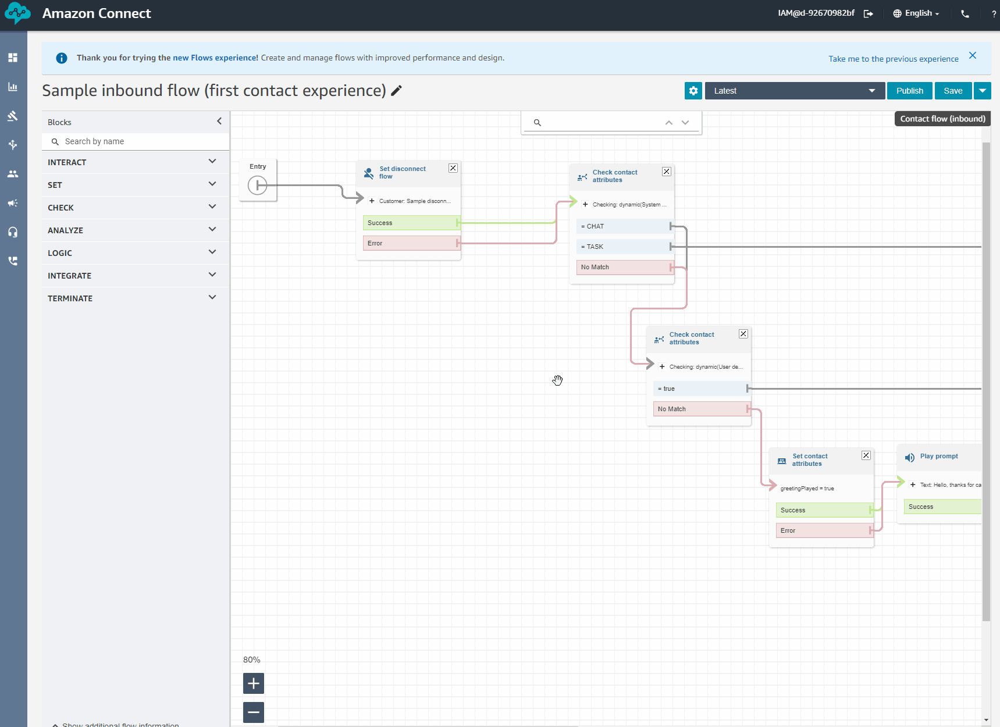

#### Released Amazon Connect Cases for General Availability

Amazon Connect Cases allows your agents to quickly track and manage customer issues that require
multiple interactions, follow-up tasks, and teams in your contact center. For more information,
see [Amazon Connect Cases](cases.md "cases.md") and [Amazon Connect Cases API Reference](../../../cases/latest/APIReference/Welcome.md "../../../cases/latest/APIReference/Welcome.md").

### September 2022 Updates

#### Searching for a contact? Choose from a list of

categories

When you search a contact and filter results by Contact Lens categories, you can
pick from a list of categories, rather than manually typing the name of a category.

#### Updated flow designer

We've released a number of improvements to the flow designer experience to make building
and editing flows easier.

- Updated look and feel of block dock, blocks, and flow designer canvas.

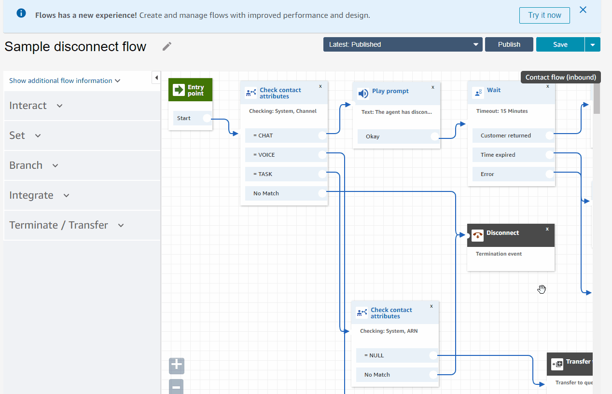

- Import / Export uses a standard flow language so you can interchangeably build flows in
  APIs or in the UI.

###### Important

To copy and paste flows and blocks in the updated flow designer, the flow must be in
the new flow language. To convert a legacy flow into the new format, you have two
options:

    + Option 1: In the flow designer user interface, opt in to the updated flow designer.
     Your legacy flows are automatically converted.
    + Option 2: Manually [import](contact-flow-import-export.md "contact-flow-import-export.md") a legacy
     flow using the updated flow designer.


    This option is most useful for scenarios where you have stored your flows in JSON
     offline. For example, for configuration control, you may have flow configurations in an
     offline data store. To copy a part of that flow and paste it into the updated flow
     designer, you need to import it into the updated flow designer. The importing process
     converts it to the new flow language. After that, you can copy and paste within the
     updated flow designer. If you want to keep using your offline data store as a source of
     truth, update the flow with the new format.

- You can use **Search** to filter blocks in the block dock.

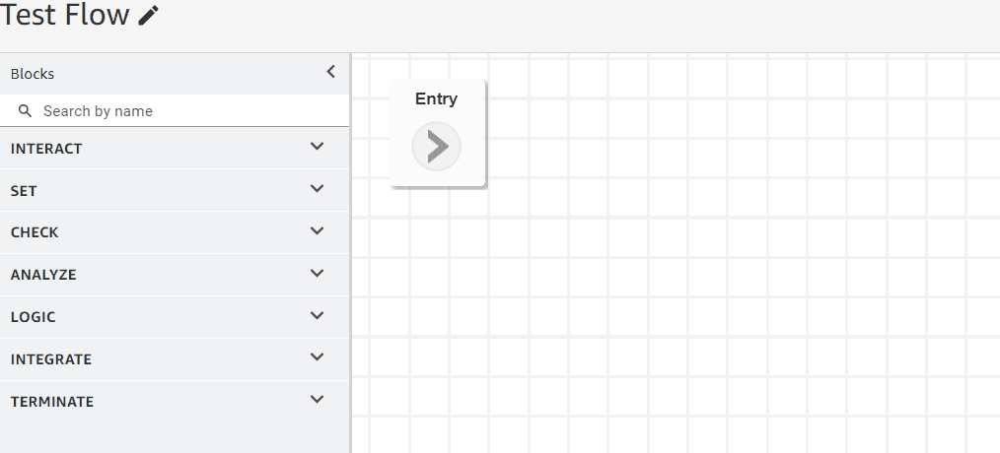

- Multi-line block metadata allows you to click and expand to see block
  configurations.

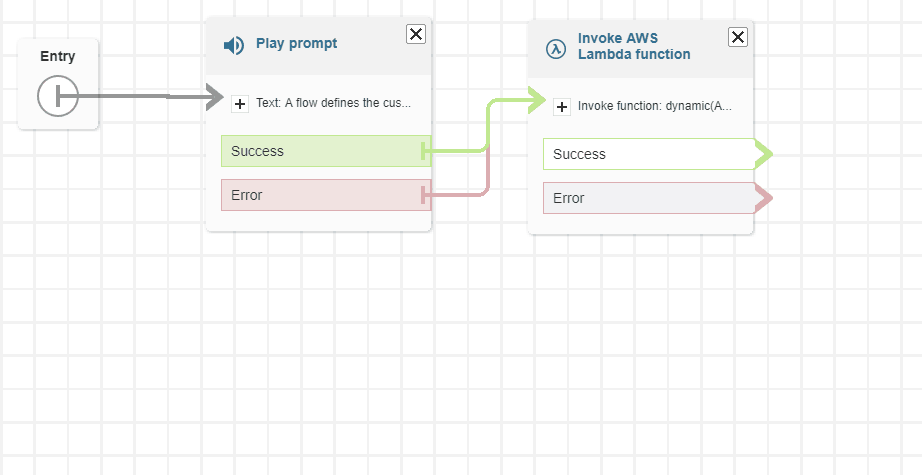

- Color-coded branches and connectors help you distinguish paths.

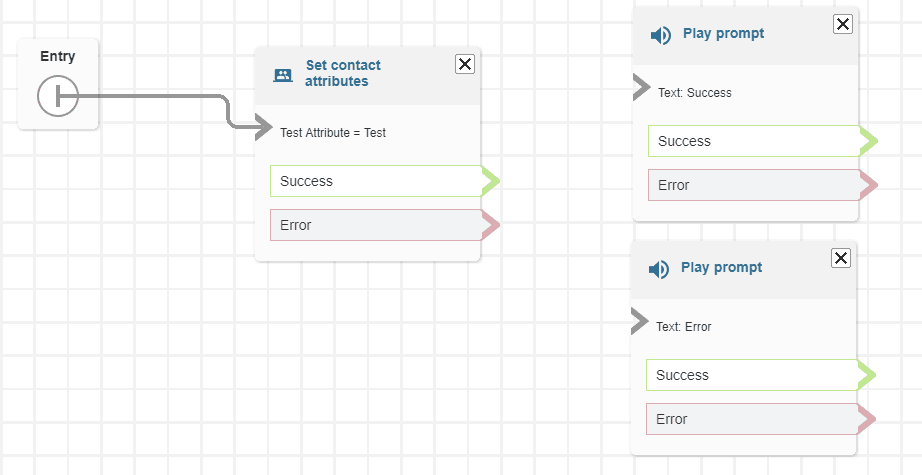

- Improved zooming.

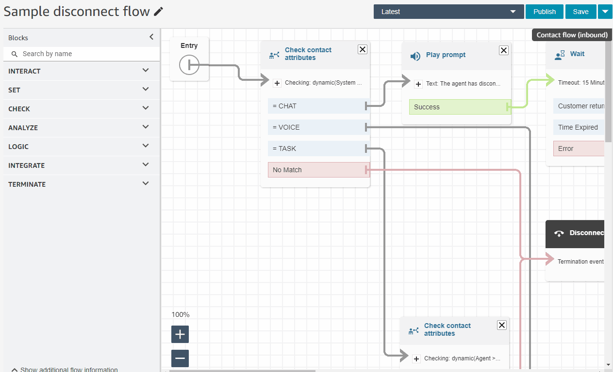

- Flow/module metadata appears at the bottom of the block dock.

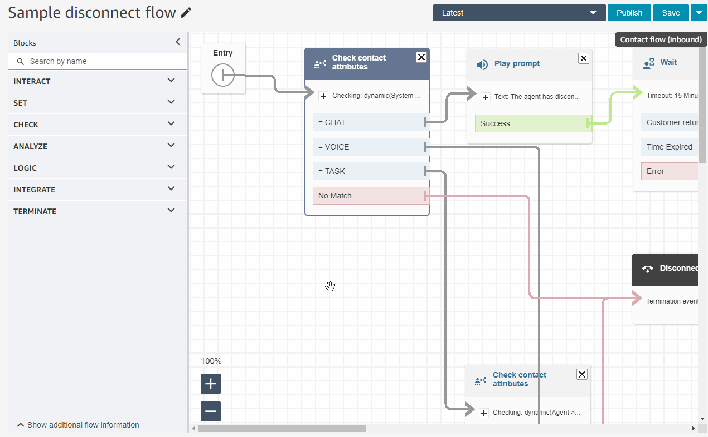

- New, more intuitive categories (**Check**,
  **Analyze**, and **Logic**) to make it easier to find the
  blocks you are looking for.

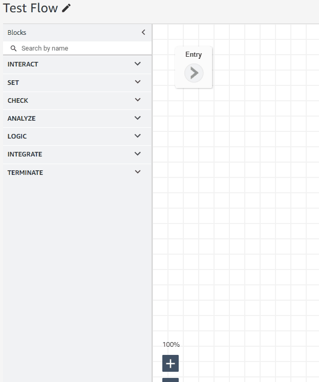

- Updated user interface in the block **Property** pages.

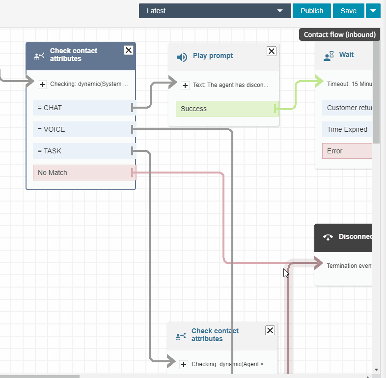

#### Search for Amazon Connect users by first name, last name,

login, and more

You can search for Amazon Connect users by first name, last name, user login, agent hierarchy,
security profile, and routing profile. For example, you can search for all Amazon Connect users who have
the first name "Jane."

#### Queue dashboard

You can visualize historical queue data by using time series graphs to help identify
patterns, trends, and outliers specifically for **Service Level**,
**Contacts Queued**, and **Average Handle Time**. For more
information, see [Visualize: Queue
dashboard](visualize-queue-dashboard.md "visualize-queue-dashboard.md").

### August 2022 Updates

#### Contact search: Apply "Match any" or "Match all" to

Contact Lens category searches

When you search for contacts, and filter by Contact Lens categories, you can apply
**Match any** or **Match all** to the search. For example,
you can search contacts with both "category A" and "category B," or with either one of the two
categories.

#### Evaluate calls for voice spoofing

Use Voice ID to evaluate calls for voice spoofing. For more information, see [Voice spoofing detection](voice-id.md#voice-spoofing-detection "voice-id.md#voice-spoofing-detection") and the [Amazon Connect Voice ID API Reference](../../../voiceid/latest/APIReference/Welcome.md "../../../voiceid/latest/APIReference/Welcome.md").

#### Added SearchSecurityProfiles API

Added a new API for programmatically searching security profiles. For more information,
see [SearchSecurityProfiles](../APIReference/API_SearchSecurityProfiles.md "../APIReference/API_SearchSecurityProfiles.md").

#### Released Schedule Adherence (Preview)

Contact center supervisors or managers track schedule adherence to understand when agents
are following the schedule that you have created. This helps ensure you achieve your service
level targets, while improving agent productivity and customer satisfaction. For more
information, see [Schedule Adherence](schedule-adherence.md "schedule-adherence.md").

### July 2022 Updates

#### Search for contacts by using the agent's first or last

name

You can search for contacts using the agent's first or last name. The filter name is
**Agent**.

##### Search contacts by agent's first or last

name

The following image shows the Agent filter, and the option to choose agents by
name.

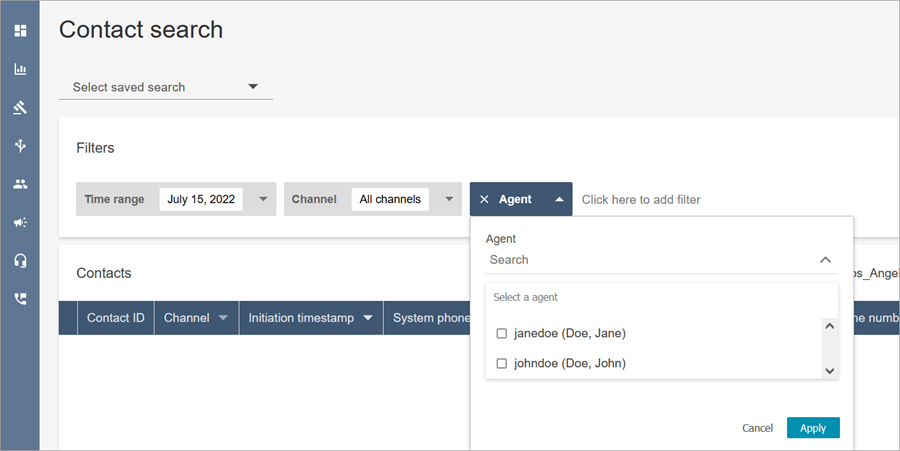

##### Required permissions to "Agent" search

filter

To use the **Agent** filter on the **Contact search**
page, in your Amazon Connect security profile you must have **Users - View**
permissions, as shown in the following image:

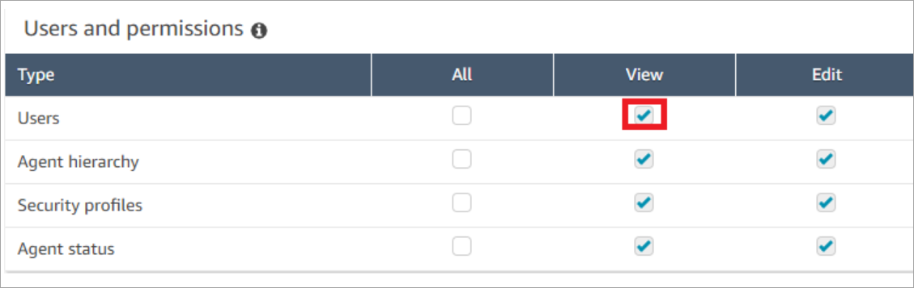

When you have **Users - View** permissions, on the **Contact
search** page the **Agent** filter appears, as shown in the
following image:

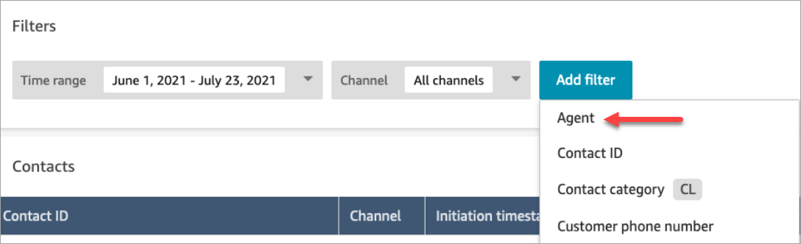

Without **User - View** permissions, the **Agent**
filter is not visible, and searching contacts by Agent login is not supported, as shown in the
following image:

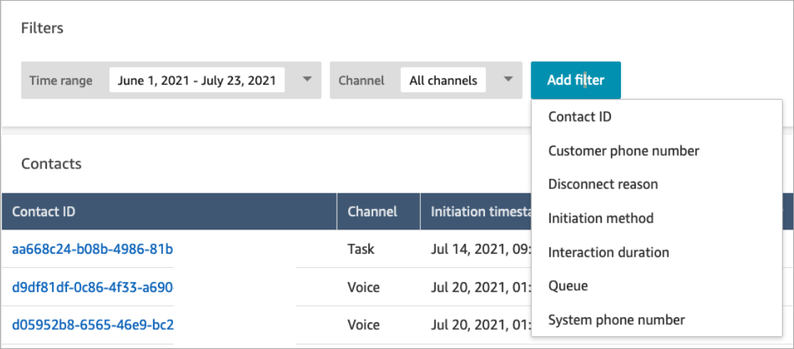

#### Released updates for rich text format

rendering

On the **Contact Search** and **Contact Detail** pages,
you can now view chat transcripts that have rich text formatting, such as bold or italic font,
bullet points, numbered lists, and hyperlinks. For more information about getting started with
Amazon Connect Chat, see [Set up your customer's chat
experience](enable-chat-in-app.md "enable-chat-in-app.md").

#### View call transcript using the CCP or agent

application

Agents can view call unredacted transcripts in the CCP and agent application. For more
information, see [View a call transcript during
ACW](view-call-transcript-ccp.md "view-call-transcript-ccp.md").

### June 2022 Updates

#### Support for Lex intent confidence scores and

sentiment analysis

You can further personalize the automated self-service customer experience using Amazon Lex
intent confidence scores and sentiment analysis as a branch within your flows. For more
information, see the [Get customer input](get-customer-input.md "get-customer-input.md") block. For
a list of new contact attributes, see [Amazon Lex contact
attributes](connect-attrib-list.md#attribs-lex-table "connect-attrib-list.md#attribs-lex-table").

#### Metrics Updates

The following updates were released in June 2022.

**15 minute scheduled reports**

You can now schedule historical metrics to refresh every 15 minutes. To select 15-minute
schedules, select generate this report **Hourly** every .25 hours (this is the
top most option in the second dropdown), for the previous .25 hours. The following image shows
the values that you need to select.

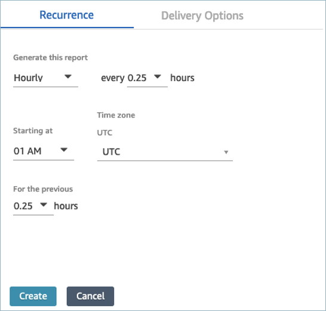

**Filter Real-Time Metrics Agent Table by Agent**

You can now filter the agent table on the Real-Time Metrics page by agent. This filter
functions the same as the existing queues, routing profiles, and agent hierarchy
filters.

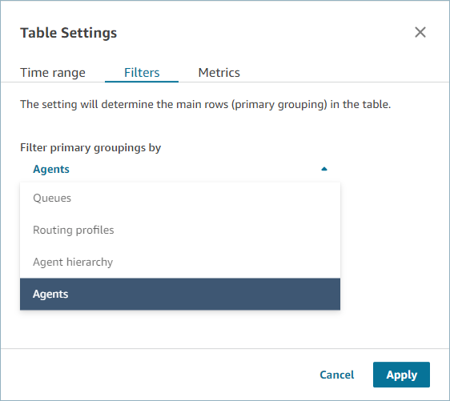

#### New contact transferred related metrics

We upgraded the existing [Contacts transferred in](metrics-definitions.md#contacts-transferred-in "metrics-definitions.md#contacts-transferred-in") and [Contacts transferred out](metrics-definitions.md#contacts-transferred-out "metrics-definitions.md#contacts-transferred-out") metrics to have consistent definitions. We added
[Contacts transferred in by
agent](metrics-definitions.md#contacts-transferred-in-by-agent "metrics-definitions.md#contacts-transferred-in-by-agent") and [Contacts transferred out by
agent](metrics-definitions.md#contacts-transferred-out-by-agent "metrics-definitions.md#contacts-transferred-out-by-agent") for more granular contact transferred related metrics.

#### Changes to real-time metrics agent tables

We are rolling out a new service to maintain the high availability from metrics that you
expect from Amazon Connect. Due to this change, the agent tables are sorted by [agent status](metrics-agent-status.md "metrics-agent-status.md") instead of by agent login.

Additionally, the queues and routing profiles table are sorted by agents online instead of
by queue or routing profile name.

#### Faster reload times for the Real-time metrics page

We are upgrading the performance of the **Real-time metrics** page so reload times are faster. The page
will have the same functionality and user experience as the existing **Real-time metrics** page.

#### Released Amazon Connect Cases (Preview)

Amazon Connect Cases (Preview) allows your agents to quickly track and manage customer issues that
require multiple interactions, follow-up tasks, and teams in your contact center. For more
information, see [Amazon Connect
Cases (Preview)](cases.md "cases.md") and [Amazon Connect Cases API Reference
(Preview)](../../../cases/latest/APIReference/Welcome.md "../../../cases/latest/APIReference/Welcome.md").

#### GA for Amazon Connect outbound campaigns

Released Amazon Connect outbound campaigns, formerly known as High-volume outbound communications.
This release includes a set of APIs for creating and managing outbound campaigns. For more
information, see [Enable Amazon Connect outbound
campaigns](outbound-campaigns.md "outbound-campaigns.md") and [Amazon Connect Outbound Campaigns API
Reference](../../../connect-outbound/latest/APIReference/Welcome.md "../../../connect-outbound/latest/APIReference/Welcome.md").

#### Released GetCurrentUserData API

Released the [GetCurrentUserData](../APIReference/API_GetCurrentUserData.md "../APIReference/API_GetCurrentUserData.md") API. It enables you to return the real-time active
user data from the specified Amazon Connect instance.

#### Released task templates

You can now create custom task templates, making it easy for agents to consistently
capture the relevant and required information to create or complete tasks. For more
information, see [Create task templates](task-templates.md "task-templates.md"). For
information about using the API to programmatically create and manage task templates, see the
[Amazon Connect API
Reference](../APIReference/Welcome.md "../APIReference/Welcome.md") and the [Amazon Connect Resource Type
Reference](../../../AWSCloudFormation/latest/UserGuide/AWS_Connect.md "../../../AWSCloudFormation/latest/UserGuide/AWS_Connect.md") in the _AWS CloudFormation User Guide_.

#### New API to transfer contacts

Added a new API that you can use to transfer contacts from one agent or queue to another
agent or queue at any point after a contact is created. You can transfer a contact to another
queue by providing the flow which orchestrates the contact to the destination queue. This gives
you more control over contact handling and helps you adhere to the service level agreement
(SLA) guaranteed to your customers.

For information, see [TransferContact](../APIReference/API_TransferContact.md "../APIReference/API_TransferContact.md") in the
_Amazon Connect API Reference_.

### May 2022 Updates

#### Updated workflow for outbound campaigns

Updated the workflow for onboarding to outbound campaigns using the Amazon Connect and Amazon Pinpoint user interface.
For more information, see [Enable outbound campaigns](outbound-campaigns.md "outbound-campaigns.md").

#### Voice ID expires speakers

For BIPA Compliance, Amazon Connect Voice ID automatically expires speakers that have not been
accessed for enrollment, re-enrollment, or successful authentication for three years. You can
see a speaker's last access time by looking at the `lastAccessedAt` attribute
returned by the [DescribeSpeaker](../../../voiceid/latest/APIReference/API_DescribeSpeaker.md "../../../voiceid/latest/APIReference/API_DescribeSpeaker.md") and [ListSpeakers](../../../voiceid/latest/APIReference/API_ListSpeakers.md "../../../voiceid/latest/APIReference/API_ListSpeakers.md") APIs.

For more information, see [What data is
stored?](voice-id.md#voice-id-data-storage "voice-id.md#voice-id-data-storage") in the [Use real-time caller authentication with
Voice ID](voice-id.md "voice-id.md") topic.

### April 2022 Updates

#### New API to change an agent's current status

Amazon Connect provides an API to programmatically change the current status of an agent. [Agent statuses](metrics-agent-status.md "metrics-agent-status.md") are used to determine when an agent is
**Available** to be routed contacts in Amazon Connect, versus when they are set to
**Offline** or a custom status such as **Lunch** or
**Break** and should not be routed contacts. For more information, see [PutUserStatus](../APIReference/API_PutUserStatus.md "../APIReference/API_PutUserStatus.md") in the [Amazon Connect API Reference](../APIReference/Welcome.md "../APIReference/Welcome.md").

#### New API to search for users by name, agent hierarchies, and

tags

Added API to search for user records in your Amazon Connect instance. This new API provides a
programmatic and flexible way to search for users by first name, last name, username, routing
profile, security profile, agent hierarchies or tags. For example, you can now use this API to
search for all users tagged with a Department:key value pair. You can also quickly find a list
of all users assigned to a specific security profile, routing profile, or agent hierarchy. For
more information, see the [Amazon Connect API Reference](../APIReference/Welcome.md "../APIReference/Welcome.md").

#### New APIs to claim and configure phone numbers

Added new APIs to claim new phone numbers and configure them programmatically. Using these
APIs, you can programmatically search for and claim available phone numbers, associate phone
numbers to flows, or release phone numbers that are no longer needed. Additionally, the phone
number APIs come with support for AWS CloudFormation. For more information, see the [Amazon Connect API
Reference](../APIReference/Welcome.md "../APIReference/Welcome.md") and the [Amazon Connect Resource Type
Reference](../../../AWSCloudFormation/latest/UserGuide/AWS_Connect.md "../../../AWSCloudFormation/latest/UserGuide/AWS_Connect.md") in the _AWS CloudFormation User Guide_.

#### Telephony: Multi-party calls

You can enable Amazon Connect to allow up to six parties on a call: the agent, the caller, and four
more participants. (By default, Amazon Connect allows agents to have up to three parties on a call: the
agent, and caller, and another participant.)

For more information, see the following topics:

- [Comparison of enhanced contact
  monitoring (multi-party) and three-party functionality in Amazon Connect](three-party-multi-party-comparison.md "three-party-multi-party-comparison.md")
- [Enable enhanced multi-party contact monitoring
  in Amazon Connect](monitor-conversations.md "monitor-conversations.md")

For information about new functionality on the existing Connection and Contact API in
Amazon Connect Streams, see the [Amazon Connect
Streams Readme](https://github.com/amazon-connect/amazon-connect-streams/blob/master/README.md "https://github.com/amazon-connect/amazon-connect-streams/blob/master/README.md").

The following sections describes how managing multi-party calls differs from managing
three-party calls.

#### Play prompts from an Amazon S3 bucket

Added the ability to source prompts from an Amazon S3 bucket. You can store as many voice
prompts as needed in Amazon S3 and access them in real time by using contact attributes in the
following contact blocks that play prompts: [Get customer input](get-customer-input.md "get-customer-input.md"), [Loop prompts](loop-prompts.md "loop-prompts.md"), [Play prompt](play.md "play.md"), and
[Store customer input](store-customer-input.md "store-customer-input.md").

For more information, see the [Play prompt](play.md "play.md") block. For
information about the policy required for Amazon Connect to access the Amazon S3 bucket, see [Set up prompts to play from an S3 bucket in
Amazon Connect](setup-prompts-s3.md "setup-prompts-s3.md").

#### CloudTrail support for queues and routing profiles

Amazon Connect records all changes made to users, routing profiles, and queues as events in
AWS CloudTrail. For example, you can identify who took which action, what resources were acted upon,
and when an event occurred. For more information, see [Log Amazon Connect API calls with AWS CloudTrail](logging-using-cloudtrail.md "logging-using-cloudtrail.md").

### March 2022 Updates

#### Rich messaging for chat

Added support for rich messaging for your customer's chat experience. Agents and customers
can use bold, italics, bulleted lists, numbered lists, hyperlinks, and attachments. For more
information, see [Enable text formatting for
your customer's chat experience](enable-text-formatting-chat.md "enable-text-formatting-chat.md").

#### Customer Profiles: Object type mapping user interface

Added a user interface for creating object type mapping by using the Amazon Connect admin console.
For more information, see [Create an object type
mapping](create-object-type-mapping.md "create-object-type-mapping.md").

### February 2022 Updates

#### Added bulk ingestion of data for Customer Profiles

Added support for the bulk ingestion of data for Customer Profiles. For more information, see
_Bulk ingestion of data_ in the [Set up integration
for Salesforce, ServiceNow, Marketo, or Zendesk](integrate-customer-profiles-appflow.md "integrate-customer-profiles-appflow.md") topic.

#### New CloudWatch metrics for chat

Added the following Amazon CloudWatch metrics for chat: **ConcurrentActiveChats**,
**ConcurrentActiveChatsPercentage**,
**ChatBreachingActiveChatQuota**, and
**SuccessfulChatsPerInterval**. For more information, see [Monitoring your Amazon Connect instance using CloudWatch](monitoring-cloudwatch.md "monitoring-cloudwatch.md").

### January 2022 Updates

#### Configure maximum chat duration up to 7 days

You can configure the maximum chat duration to last up to 7 days. For more information,
see the `ChatDurationInMinutes` parameter in the [StartChatContact](../APIReference/API_StartChatContact.md "../APIReference/API_StartChatContact.md") API.

#### Add custom vocabularies to Contact Lens

Improve the accuracy of speech recognition for product names, brand names, and
domain-specific terminology, by expanding and tailoring the vocabulary of the speech-to-text
engine in Contact Lens. For more information, see [Add custom vocabularies to
Contact Lens using the Amazon Connect admin website](add-custom-vocabulary.md "add-custom-vocabulary.md").

### December 2021 Updates

#### Communications widgets support browser notifications

The communications widget supports browser notifications for desktop devices. For more information,
see [Send browser notifications to customers
when chat messages arrive](browser-notifications-chat.md "browser-notifications-chat.md").

#### Ingest data into Customer Profiles from Segment and Shopify

For more information, see [Set up integration
for Segment](integrate-customer-profiles-segment.md "integrate-customer-profiles-segment.md") and [Set up integration
for Shopify](integrate-customer-profiles-shopify.md "integrate-customer-profiles-shopify.md").

### November 2021 Updates

#### Released unified agent application

Amazon Connect released the unified agent application to improve the agent experience and customer
interactions. For more information, see [Agent training guide](agent-user-guide.md "agent-user-guide.md").

#### Released key highlights

Amazon Connect Contact Lens provides the option for you to view key highlights. The highlights
show only those lines where Contact Lens has identified an issue, outcome, or action
item in the transcript. For more information, see [View key highlights of customer conversations in
the Contact Control Panel (CCP)](key-highlights.md "key-highlights.md").

#### Released Identity Resolution to consolidate similar

profiles

Amazon Connect Customer Profiles offers Identity Resolution, a feature that is designed to automatically detect similar customer
profiles by comparing name, email address, phone number, date of birth, and address. For
example, two or more profiles with spelling mistakes, such as "John Doe" and "Jhn Doe," can be
detected as belonging to the same customer "John Doe" using clustering and matching machine
learning (ML) algorithms. Once a group of profiles are detected to be similar, admins can
configure how profiles should be merged together by setting up consolidation rules by using the
[Amazon Connect
admin console](use-identity-resolution.md "use-identity-resolution.md") or [Amazon Connect Customer Profiles APIs](../../../customerprofiles/latest/APIReference/Welcome.md "../../../customerprofiles/latest/APIReference/Welcome.md").

#### Amazon Connect Customer Profiles stores contact history at no charge

Amazon Connect Customer Profiles now provides contact history and customer information together in unified
customer profiles at no charge, helping contact center managers personalize the contact center
experience. In new instances, Customer Profiles is enabled by default. For more information, see [Step 4:
Data Storage](amazon-connect-instances.md#get-started-data-storage "amazon-connect-instances.md#get-started-data-storage") in the _Create an Amazon Connect instance_ topic.

#### Added modular flows to help you create common

functions

Flow modules are reusable sections of a flow. You can create them to extract repeatable
logic across your flows, and create common functions. For more information, see [Flow modules
for reusable functions](contact-flow-modules.md "contact-flow-modules.md").

#### New APIs to archive/unarchive and delete contact

flows

Added new APIs that provide a programmatic and flexible way to manage your library of
flows at scale. For example, flows used only during certain times of the year can be archived
when not in use and then unarchived when needed. You can now also delete a flow so it is no
longer available for use. For more information, see the [Amazon Connect API Reference](../APIReference/Welcome.md "../APIReference/Welcome.md").

#### Search contacts by custom contact

attributes

Added support for searching contacts by custom contact attributes (also called
user-defined attributes). For more information, see [Search by custom contact
attributes](search-custom-attributes.md "search-custom-attributes.md").

#### Added Customer profiles block

Added the [Customer profiles](customer-profiles-block.md "customer-profiles-block.md") block. It
enables you to retrieve, create, and update a customer profile.

#### Released Contact APIs

Added APIs so you can get and update contact details programmatically. For example, you
can describe contact details such as queue information, chat attachments, task references, and
update contact information such as task name. For more information, see [DescribeContact](../APIReference/API_DescribeContact.md "../APIReference/API_DescribeContact.md"), [UpdateContact](../APIReference/API_UpdateContact.md "../APIReference/API_UpdateContact.md"), and [ListReferences](../APIReference/API_ListReferences.md "../APIReference/API_ListReferences.md") in the _Amazon Connect API
Reference_.

#### Released scheduled tasks

Added the ability to schedule tasks up to six days in the future to follow-up on customer
issues when promised. You can also update the scheduled date and time using the [UpdateContactSchedule](../APIReference/API_UpdateContactSchedule.md "../APIReference/API_UpdateContactSchedule.md") API. For more information, see the [Create
task](create-task-block.md "create-task-block.md") block and the [Create a task](create-task.md "create-task.md") topic in the
_Agent training guide_.

#### Released security profiles APIs

Added APIs so you can create and manage security profiles programmatically. Security
profiles help you manage who can access the Amazon Connect dashboard and Contact Control Panel (CCP),
and who can perform specific tasks. For more information, see the [Amazon Connect API Reference](../APIReference/Welcome.md "../APIReference/Welcome.md").

#### Changes to real-time metrics agent tables

We are rolling out a new service to maintain the high availability from metrics that you
expect from Amazon Connect. Due to this change, the agent tables are sorted by [agent status](metrics-agent-status.md "metrics-agent-status.md") instead of by agent login.

Additionally, the queues and routing profiles table are sorted by agents online instead of
by queue or routing profile name.

#### Added new metrics

Added following new historical metrics: **Contacts transferred in by
agent** and **Contacts transferred out by agent**. Added new
real-time metrics: **Transferred in by agent** and **Transferred out
by agent**. For more information, see [Metrics definitions](metrics-definitions.md "metrics-definitions.md").

### October 2021 Updates

#### Released real-time chat message streaming

You can subscribe to a real-time stream of chat messages. For more information, see [Enable
real-time chat message streaming](chat-message-streaming.md "chat-message-streaming.md").

#### Released `HoursOfOperation` APIs for General

Availability

Released the Amazon Connect `HoursOfOperation` APIs for general availability (GA). Also
launched CloudFormation support for Users, User Hierarchies, and Hours of Operation. For more
information, see the [Amazon Connect API Reference](../APIReference/Welcome.md "../APIReference/Welcome.md") and the [AWS CloudFormation User
Guide](../../../AWSCloudFormation/latest/UserGuide/AWS_Connect.md "../../../AWSCloudFormation/latest/UserGuide/AWS_Connect.md").

### September 2021 Updates

#### Released Amazon Connect Wisdom General Availability

###### Note

In November 2023 we released Amazon Q. It includes real-time agent assist functionality formerly known as Amazon Connect Wisdom,
along with generative AI-powered recommended responses, actions, and links to more information.

For more information, see [Use Connect AI agents for real-time assistance](connect-ai-agent.md "connect-ai-agent.md") and the [Connect AI agents API Reference](../../../amazon-q-connect/latest/APIReference/Welcome.md "../../../amazon-q-connect/latest/APIReference/Welcome.md").

#### Amazon Connect Voice ID - General Availability

For more information, see [Use real-time caller authentication with
Voice ID](voice-id.md "voice-id.md") and the [Amazon Connect Voice ID API Reference](../../../voiceid/latest/APIReference/Welcome.md "../../../voiceid/latest/APIReference/Welcome.md").

#### Preview release of Amazon Connect outbound campaigns

Added content for the preview release of outbound campaigns. By using Amazon Pinpoint Journeys and Amazon Connect, you
can now create outbound campaigns for voice, SMS, and email. For more information, see [Enable
outbound campaigns](outbound-campaigns.md "outbound-campaigns.md").

#### New Amazon AppIntegrations Service APIs

New DataIntegration APIs for the Amazon AppIntegrations Service: `CreateDataIntegration`,
`DeleteDataIntegration`, `GetDataIntegration`,
`ListDataIntegrationAssociations`, `ListDataIntegrations`,
`UpdateDataIntegration`.

For more information, see [Amazon AppIntegrations Service API
Reference](../../../appintegrations/latest/APIReference/Welcome.md "../../../appintegrations/latest/APIReference/Welcome.md").

#### Display name and contact attributes in chat

You can now personalize the chat experience, as you can specify the name of your customer
that interacts using the chat user interface. You can also securely pass the contact attributes
to capture information about the contact which can be used in the flow to further personalize
the experience. For more information, see [Pass the customer display name
when a chat initializes](pass-display-name-chat.md "pass-display-name-chat.md") and [Pass contact attributes when
a chat initializes](pass-contact-attributes-chat.md "pass-contact-attributes-chat.md").

#### Preview of agent application

Launched an updated UI for the agent application preview that combines Customer Profiles
and the Contact Control Panel (CCP). For more information, see [Access Customer Profiles in the
agent application](customer-profile-access.md "customer-profile-access.md").

#### Added Create task block

Added the **Create task** block. It creates a new task, sets the tasks
attributes, and initiates a flow to start the task. For more information, see [Flow block: Create
task](create-task-block.md "create-task-block.md").

### August 2021 Updates

#### Improved user interface for Amazon Connect console

Released a redesigned and improved user interface for the Amazon Connect console, making it easier
and faster to manage Amazon Connect instances. For more information, see [Create an Amazon Connect instance](amazon-connect-instances.md "amazon-connect-instances.md").

#### APIs for Hours of Operation and Agent Status (Preview)

Released for ungated preview new APIs for managing hours of operation and agent status.
For more information, see [Amazon Connect Service API Reference](../APIReference/Welcome.md "../APIReference/Welcome.md").

#### Contact Lens: Build rules that generate tasks

and EventBridge events

Contact Lens rules now allow you to automatically generate tasks and EventBridge events
based on uttered keywords, sentiment scores, customer attributes, and other criteria. For more
information, see [Create Contact Lens rules
using the Amazon Connect admin website](build-rules-for-contact-lens.md "build-rules-for-contact-lens.md").

#### Networking: Allow AWS Global Accelerator

When using SAML Sign-In to your Amazon Connect instance, you now need to add the AWS
Global Accelerator domain, **\*. awsglobalaccelerator.com**, to your allow
list. For more information, see [Set up your network to use the Amazon Connect Contact Control Panel
(CCP)](ccp-networking.md "ccp-networking.md").

### July 2021 Updates

#### "Next status" feature for the CCP

In busy contact centers, it can be difficult for agents to take a break or go offline when
contacts are being quickly routed to them. To help agents manage their time, we have released a
feature that lets agents pause new contacts being routed to them while they finish their
current contacts. When all their slots are cleared, Amazon Connect automatically sets agents to the next
status, such as **Lunch**.

For details about how agents use this feature, see [Set your "Next status" in the Contact Control Panel
(CCP)](set-next-status.md "set-next-status.md").

##### Metrics: No changes due to "Next status"

When an agent is in **Next status**, their metrics are the same as when
their status is **Available**.

For example, an agent is handling one contact and chooses **Next
status**. Here's what you'll see in the real-time metrics report:

- Agent Activity state = On Contact
- Agent - Staffed = 1

**Non-productive time** (NPT) is not incremented when an agent is in
**Next status** because the agent is still **Available**.
NPT increments only when the agent actually enters the non-productive status, such as
**Lunch**.

##### Agent event stream has new NextAgentStatus

field

When an agent sets their status to **Next status**, Amazon Connect populates a
new `NextAgentStatus` field with the next status selected by the agent.

At the same time, the `AgentStatus` field continues to display
`Available`.

The following code snippet shows what the agent event stream looks like when an agent has
set their CCP to **Next status: Lunch**.

```
"CurrentAgentSnapshot":
{
    "AgentStatus": {
            "ARN": "example-ARN",
            "Name": "Available",
            "StartTimestamp": "2019-08-13T20:52:30.704Z"
        },
     "NextAgentStatus": {
            "Name": "Lunch",
            "ARN": "example-ARN2",
            "EnqueueTimestamp": "2019-08-13T20:58:00.004Z",
        }
}
```

When an agent has not selected a **Next status**, the field is
`null`, as shown in the following snippet:

```
"CurrentAgentSnapshot": {
    "AgentStatus": {
            "ARN": "example-ARN",
            "Name": "Available",
            "StartTimestamp": "2019-08-13T20:52:30.704Z"
        },
     "NextAgentStatus": null
}
```

##### Amazon Connect Streams API and "Next status"

The feature has the following effect:

- If you integrate with Amazon Connect Streams API and your agents interact directly with the
  native CCP user interface, your agents will start using this new feature immediately.
- If you integrate with Amazon Connect Streams API but your agents don't interact directly with
  the native CCP user interface, your contact center will continue to have the previous
  behavior when agent.setState() is called: an agent will not be able to select an NPT or
  Offline status while connected to at least one contact.

If you are handling state change logic yourself from Amazon Connect Streams, you will need to
make additional changes explained in the [Amazon Connect
Streams README](https://github.com/amazon-connect/amazon-connect-streams/blob/master/README.md "https://github.com/amazon-connect/amazon-connect-streams/blob/master/README.md").

#### Contact search: To search contacts by Agent login

requires Users - View permissions in your security profile

To use the **Agent** filter on the **Contact search**
page, in your Amazon Connect security profile you must have **Users - View**
permissions, as shown in the following image:


When you have **Users - View** permissions, on the **Contact
search** page the **Agent** filter appears, as shown in the
following image:

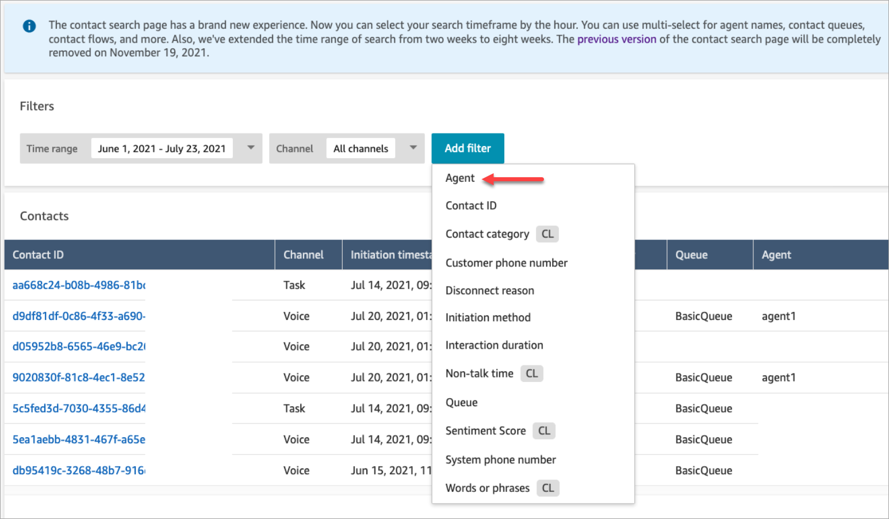

Without **User - View** permissions, the **Agent**
filter is not visible, and searching contacts by Agent login is not supported, as shown in the
following image:


### June 2021 Updates

#### Apple Messages for Business GA

Released Apple Messages for Business for general availability (GA). For more information, see [Enable Apple Messages for Business with Amazon Connect](apple-messages-for-business.md "apple-messages-for-business.md").

#### Quick connects management API GA

Released Amazon Connect quick connects management API for general availability (GA). For more
information, see [Amazon Connect Service API Reference](../APIReference/Welcome.md "../APIReference/Welcome.md"). The quick connects API also supports AWS CloudFormation. For more
information, see [Amazon Connect Resource Type
Reference](../../../AWSCloudFormation/latest/UserGuide/AWS_Connect.md "../../../AWSCloudFormation/latest/UserGuide/AWS_Connect.md") in the AWS CloudFormation User Guide.

#### Support for Amazon Lex V2 console and APIs

For more information on using the Amazon Lex V2 console with Amazon Connect, see [Add an Amazon Lex bot](amazon-lex.md "amazon-lex.md").
Added these three APIs: AssociateLexBot, DisassociateLexBot, and ListLexBots. See the [Amazon Connect Service API
Reference](../APIReference/Welcome.md "../APIReference/Welcome.md").

#### Chat: Increase to chat agent concurrency

Chat agents can now handle up to 10 concurrent chat contacts. For more information, see
[Create a routing
profile](routing-profiles.md "routing-profiles.md").

### May 2021 Updates

#### Added contact events

Subscribe to a near real-time stream of contact events (for example, call is queued) in
your Amazon Connect contact center. For more information, see [Amazon Connect contact events](contact-events.md "contact-events.md").

#### Contact search

The following changes were release for Contact search:

- Download increase: You are able to download 3,000 rows of search results to a CSV file,
  instead of 1,000 rows. This increase applies to contacts that occurred after Dec 01, 2020.
- Contact search supports Disconnect Reason as a new filter on the **Contact
  search** page.

The following image shows how **Disconnect reason** appears in the user
interface as a filter.

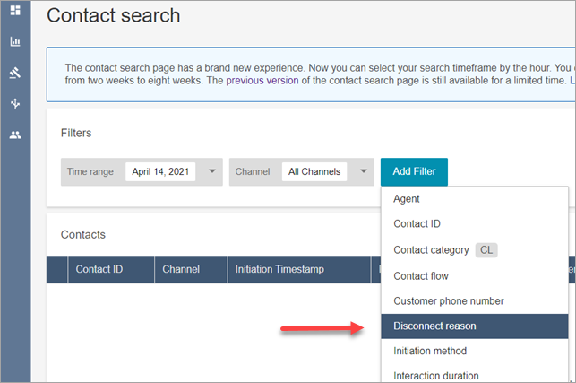

The following image shows how you can filter by type of disconnect reason. For a
definition of each disconnect reason, see the [ContactTraceRecord](ctr-data-model.md#ctr-ContactTraceRecord "ctr-data-model.md#ctr-ContactTraceRecord") section of the _Contact records data
model_ topic.

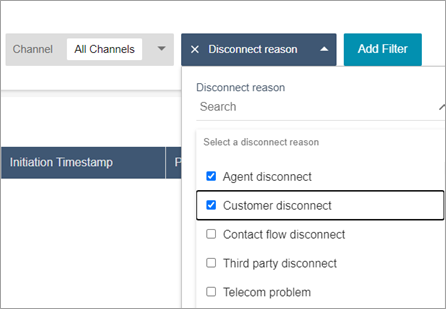

The following image shows how you add **Disconnect reason** as a column
to your search results.

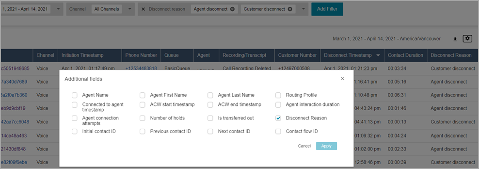

### April 2021 Updates

#### Customer Profiles: Identity resolution

Added identity resolution APIs to Customer Profiles. For more information, see the [GetMatches](../../../customerprofiles/latest/APIReference/API_GetMatches.md "../../../customerprofiles/latest/APIReference/API_GetMatches.md") and [MergeProfiles](../../../customerprofiles/latest/APIReference/API_MergeProfiles.md "../../../customerprofiles/latest/APIReference/API_MergeProfiles.md") APIs in the Amazon Connect Customer Profiles API
reference.

#### Contact Lens: Use category tags to navigate

transcript

For more information, see [Tap or click category tags to navigate
through transcript](turn-by-turn-transcript.md#category-navigation "turn-by-turn-transcript.md#category-navigation").

#### Fixes for chat metrics

We released fixes for the following issues identified in chat metrics:

- Amazon Connect incorrectly reported that chat contacts that were created from disconnect flows
  were created from transfer flows.
- When these fixes, Amazon Connect correctly reflects in the contact records and agent event stream
  that these chat contacts were created from disconnect flows.

There is no impact to voice or task contacts.

Chat contacts created through disconnect flows no longer increment the following metrics:

- [Contact flow time](metrics-definitions.md#contact-flow-time "metrics-definitions.md#contact-flow-time")
- [Contacts incoming](metrics-definitions.md#contacts-incoming "metrics-definitions.md#contacts-incoming")
- [Contacts handled incoming](metrics-definitions.md#contacts-handled-incoming "metrics-definitions.md#contacts-handled-incoming")
- [Contacts transferred in](metrics-definitions.md#contacts-transferred-in "metrics-definitions.md#contacts-transferred-in")

In addition, note the following fixes for contact records and the agent event stream for
chat contacts:

- Contact records: There was an issue in the Attributes section of a chat contact record
  where the initiation method is **API** for both disconnect and transfer
  contacts. With this fix, the initiation method correctly reflects
  **Disconnect** and **Transfer**, respectively.
- Agent event stream: Chat contacts created from disconnect flows now have
  **Disconnect** as the initiation method.

### March 2021 Updates

#### Amazon Connect is now available in the Canada (Central) Region

Amazon Connect is now available in the Canada (Central) Region. You can claim toll-free and
local telephone numbers from Canadian telephony suppliers. For a list of countries were the
Canada (Central) Region is supported, see [Region requirements for phone
numbers](phone-number-requirements.md "phone-number-requirements.md"). For a list of Contact Lens features available in the
Canada (Central) Region, see [Availability of
Contact Lens features by Region](enable-analytics.md#regions-contactlens "enable-analytics.md#regions-contactlens").

#### Domain for new Amazon Connect instances is "my.connect.aws"

The domain for the Amazon Connect access URL has changed to **my.connect.aws**.

For example:

- Current: https://[*instance name*].**awsapps.com**/connect/
- New: https://[*instance name*].**my.connect.aws**/

##### How does this change impact logging in to Amazon Connect?

The current access URL continues to work for Amazon Connect instances created before the release
of the **my.connect.aws** domain. Any Amazon Connect instances created after the
release automatically use the new domain.

Also, if you create new Amazon Connect instances after the release of the new domain, you must add
new domains to your allowlist. These domains are **in addition**
to the ones that are currently required.

**Currently required domains added to your allow
list:**

- {myInstanceName}.awsapps.com/connect/ccp-v2
- {myInstanceName}.awsapps.com/connect/api
- \*.cloudfront.net

**New additional domains to add to your allowlist:**

- {myInstanceName}.my.connect.aws/ccp-v2
- {myInstanceName}.my.connect.aws/api
- \*.static.connect.aws

For more information, see [Set up your network to use the Amazon Connect Contact Control Panel
(CCP)](ccp-networking.md "ccp-networking.md").

##### Schedule for domain change

The change has been rolled out to all Regions.

#### March 2021

The following updates were released in March 2021.

When customizing a historical metrics report, you have the option to select a 15 minutes
interval, in addition to the current option of a 30 minutes interval.

The 15 minutes interval works the same as the 30 minutes interval. For example, you can
query up to three days of data at a time, for the past 35 days.

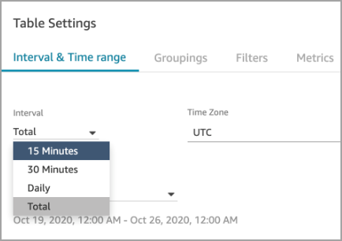

#### Chat: Add a chat user interface your website

Added a communications widget that you can customize and secure so it can only be launched from
your widget. For more information, see [Set up your customer's chat experience in Amazon Connect](enable-chat-in-app.md "enable-chat-in-app.md").

Provided an open source example. For more information, see [Customize chat with the Amazon Connect open source
example](download-chat-example.md "download-chat-example.md").

#### Amazon Connect Endpoint Test Utility

To help you validate connectivity to Amazon Connect, or troubleshoot when your agents are
experiencing problems with the Contact Control Panel (CCP), we've added the Amazon Connect Endpoint Test
Utility. For more information, see [Validate connectivity to Amazon Connect with the
Endpoint Test Utility](check-connectivity-tool.md "check-connectivity-tool.md").

### February 2021 Updates

#### Contact Lens: Availability of real-time

analytics

Contact Lens real-time analytics is available in Europe (London), Europe
(Frankfurt), and Asia (Tokyo). For more information, see [Conversational analytics features by Region](regions.md#regions-contactlens "regions.md#regions-contactlens").

#### Ingest data into Customer Profiles using

Amazon S3

Added the ability to create and ingest data from Amazon S3. For more information, see [Create and ingest customer data
into Customer Profiles](customer-profiles-object-type-mappings.md "customer-profiles-object-type-mappings.md").

#### Disconnect reason in contact record stream

The Amazon Connect contact records stream now includes **DisconnectReason** for
voice calls and tasks. **DisconnectReason** indicates whether an agent or
customer disconnected the call, or whether a telecom or network issue caused a call to
disconnect. You can also determine whether a task was completed by an agent or an automatic
flow, or it expired. For more information, see [ContactTraceRecord](ctr-data-model.md#ctr-ContactTraceRecord "ctr-data-model.md#ctr-ContactTraceRecord").

#### Custom service levels

Added the ability to create custom service levels. For details, see [New metric groupings and
categories](#metrics-changes-custom-service-levels "#metrics-changes-custom-service-levels").

#### Metrics updates

The following updates were released in February 2021.

##### New metric groupings and

categories

With the release of custom service level metrics, we also made the following
changes:

- On the **Table settings** pages, pre-set and custom service level
  metrics are in a new group called **Contact Service Levels**.
- Historical metrics on the **Table settings** page are grouped into
  categories.
- The order of metric columns on historical metrics reports changed to match the order of
  the metrics on the **Table settings** page.

Following is more information about these changes.

##### Real-time metrics: New Contact Service Level

category

A new category of metrics appears on the **Table settings** page:
**Contact Service Level**.

The following image shows this new category on the **Table settings**
page, in an expandable group. Choose the arrow next to the group to view and select the
metrics you want to add to your report.

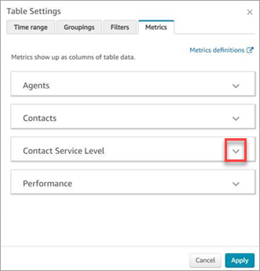

Use the **Contact Service Level** category to choose pre-set service
level metrics, and to create custom service level metrics.

The following image shows the user interface for creating custom service level
metrics.

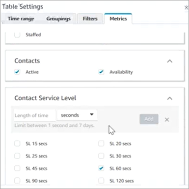

##### Historical metrics: New categories for metrics

To make it easier to find the historical metrics you want to add to a report, metrics on
the **Table settings** page are grouped into the following
categories:

- Agents
- Contacts Abandoned
- Contact Service Level: This group contains preset and custom service levels.
- Contacts Answered
- Performance

Choose **Add Custom SL** to add custom service levels to your
historical metrics report, as shown in the following image.

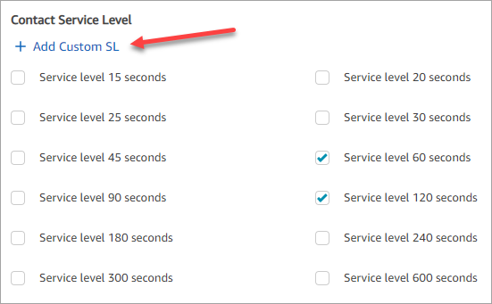

##### The order of the metric columns on the

historical metrics reports has changed

The order of the metric columns on the historical metrics reports matches the updated
grouping scheme and order of the metrics on the **Table settings**
page.

This change supports the addition of custom service level metrics. It also allows us to
make future improvements for where, for example, control of how a report looks resides on the
**Real-time metrics** page and the **Historical metrics**
page, not the **Table settings** page.

Note how metric columns now appear on reports:

- When you open the **Real-time metrics** page, custom service levels
  appear at the end of the **Performance** group.
- Metrics on existing **Scheduled reports** (the processed documents
  that arrive in your Amazon S3 buckets) are not re-ordered automatically. However,
  if you update an existing report, the metrics are re-ordered to match the order on the
  **Table settings** page.
- **Service level metrics**:
  - Real-time metrics reports: Service level metrics are always added to the end of the
    **Performance** group, in ascending order.
  - Historical metrics reports: When you add custom service level metrics, they are
    added to the end of the report in the order they were created.

##### Custom service level metrics

You have the ability to add custom service level metrics. You can also choose from
additional durations, such as minutes, hours, or days.

The maximum duration for a custom service level is 7 days. That's because in Amazon Connect you can't have a contact that goes longer than 7 days.

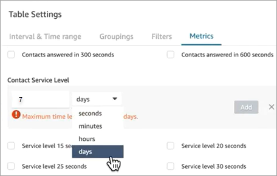

##### Group by channel in a historical

metrics report

###### To group by channel on historical metrics reports

1. On the navigation menu, choose **Analytics and optimization**,
   **Historical metrics**, and then choose a report.
2. Choose **Settings**.
3. On the **Table Settings** page, choose the
   **Groupings** tab. Add **Channel**, and choose
   **Apply**.

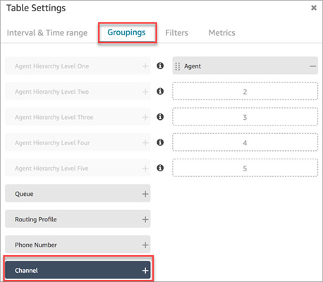 4. The table shows a column for **Channel**, as shown in the following
image.

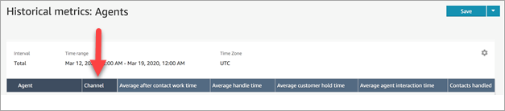

### January 2021 Updates

#### CCP: Change your audio settings

Added the ability to change audio settings from the Contact Control Panel (CCP). This
applies to organizations using a customized CCP. For more information, see [Change your audio device settings in the CCP or
agent workspace](audio-device-settings.md "audio-device-settings.md").

#### Queue APIs (Preview)

Added APIs so you can programmatically create and manage queues. For more information, see
[Amazon Connect Service API
Reference](../APIReference/Welcome.md "../APIReference/Welcome.md").

#### Amazon AppIntegrations APIs - GA

Released Amazon AppIntegrations APIs for general availability (GA). For more information,
see [Amazon
AppIntegrations Service API Reference](../../../appintegrations/latest/APIReference/Welcome.md "../../../appintegrations/latest/APIReference/Welcome.md").

### December 2020 Updates

#### Quick Connect APIs (Preview)

Added APIs so you can programmatically create and manage quick connects. For more
information, see [Amazon Connect Service API Reference](../APIReference/Welcome.md "../APIReference/Welcome.md").

#### Chat: Support for attachments

Added support for chat attachments. For more information, see [Enable attachments in your CCP so customers and
agents can share and upload files](enable-attachments.md "enable-attachments.md").

Added the following APIs:

- [CompleteAttachmentUpload](../../../connect-participant/latest/APIReference/API_CompleteAttachmentUpload.md "../../../connect-participant/latest/APIReference/API_CompleteAttachmentUpload.md")
- [GetAttachment](../../../connect-participant/latest/APIReference/API_GetAttachment.md "../../../connect-participant/latest/APIReference/API_GetAttachment.md")
- [StartAttachmentUpload](../../../connect-participant/latest/APIReference/API_StartAttachmentUpload.md "../../../connect-participant/latest/APIReference/API_StartAttachmentUpload.md")

#### Configurable DTMF timeouts for Lex bots

For more information, see [Configurable fields
for DTMF input](get-customer-input.md#get-customer-input-configurable-dtmf "get-customer-input.md#get-customer-input-configurable-dtmf").

#### Tasks

Added support for tasks, allowing you to prioritize, assign, track, and even automate
tasks across the disparate tools agents use to support customers. For more information, see
[The task channel in Amazon Connect](tasks.md "tasks.md").

#### Amazon Connect APIs

Added an Amazon Connect API that provides the ability to create tasks
(`StartTaskContact`), and a set of preview APIs.

**Preview APIs:**

- `CreateIntegrationAssociation`
- `DeleteIntegrationAssociation`
- `ListIntegrationAssociations`
- `CreateUseCase`
- `DeleteUseCase`
- `ListUseCases`

#### Amazon AppIntegrations APIs (Preview)

Added the Amazon AppIntegrations APIs (Preview), which enables you to configure and reuse
connections to external applications. For more information, see [Amazon AppIntegrations Service API
Reference (Preview)](../../../appintegrations/latest/APIReference/Welcome.md "../../../appintegrations/latest/APIReference/Welcome.md").

#### Customer Profiles

Added Amazon Connect Customer Profiles, enabling agents to create a customer profile for every new
contact that comes in. You can also integrate with external applications that provide customer
profile data. For more information, see [Use Amazon Connect Customer Profiles](customer-profiles.md "customer-profiles.md") and the [Amazon Connect Customer Profiles API
Reference](../../../customerprofiles/latest/APIReference/Welcome.md "../../../customerprofiles/latest/APIReference/Welcome.md").

#### Real-time analytics using Contact Lens

Added real-time analytics for Contact Lens so you can detect and resolve customer
issues more proactively while the call is in progress. For more information, see [Analyze conversations using conversational
analytics in Amazon Connect Contact Lens](analyze-conversations.md "analyze-conversations.md") and the [Amazon Connect Contact Lens API Reference](../../../contact-lens/latest/APIReference/Welcome.md "../../../contact-lens/latest/APIReference/Welcome.md").

#### Amazon Connect Voice ID (Preview)

Added Amazon Connect Voice ID (Preview), which provides for real-time caller authentication. For
more information, see [Use real-time caller authentication with Voice ID in
Amazon Connect](voice-id.md "voice-id.md").

#### Amazon Connect Wisdom (Preview)

###### Note

In November 2023 we released Amazon Q. It includes real-time agent assist functionality formerly known as Amazon Connect Wisdom,
along with generative AI-powered recommended responses, actions, and links to more information.

Added Amazon Connect Wisdom (Preview), which enables agents to search and find content across
multiple repositories, such as frequently asked questions (FAQs), wikis, articles, and
step-by-step instructions for handling different customer issues.

#### Amazon Connect with Apple Messages for Business (Preview)

Added support for using Amazon Connect with Apple Messages for Business. For more information, see [Enable Apple Messages for Business with Amazon Connect](apple-messages-for-business.md "apple-messages-for-business.md").

### November 2020 Updates

#### Telephony call metadata attributes

- Added call attributes to improve fraud detection and routing. For more information, see
  [Telephony call metadata attributes
  (call attributes)](connect-attrib-list.md#telephony-call-metadata-attributes "connect-attrib-list.md#telephony-call-metadata-attributes").

#### View historical changes

- The ability to **View historical changes** on the resource
  configuration pages is now available for the London Region. The following differences appear
  as the changes are rolled out to other Regions.
  - Total results: The number feature in the **View historical changes**
    search page, and page numbers, are replaced with **Previous** and
    **Next** icons.
  - The Username filter requires the entire login name.

#### Chat

- Added interactive message templates. For more information, see [Add Amazon Lex interactive messages for customers in
  chat](interactive-messages.md "interactive-messages.md").

#### APIs

- Added APIs so you can programmatically manage your agent hierarchies and agent groups.
  For more information, see [Amazon Connect Service API Reference](../APIReference/Welcome.md "../APIReference/Welcome.md").
- Added the following APIs (in an ungated preview release):
  - CreateInstance
  - DescribeInstance
  - ListInstances
  - DeleteInstance
  - UpdateInstanceAttribute
  - UpdateInstanceStorageConfig

### October 2020 Updates

The following updates were released in October 2020:

#### Flows

- Added chat support for whisper flows. For more information, see [Flow block in Amazon Connect: Set whisper flow](set-whisper-flow.md "set-whisper-flow.md").

#### Metrics

- Released the following real-time metrics:

      + [Average agent callback
       connecting time](metrics-definitions.md#average-agent-callback-connecting-time "metrics-definitions.md#average-agent-callback-connecting-time")
      + [Average agent incoming
       connecting time](metrics-definitions.md#average-agent-incoming-connecting-time "metrics-definitions.md#average-agent-incoming-connecting-time")
      + [Average agent outbound
       connecting time](metrics-definitions.md#average-agent-outbound-connecting-time "metrics-definitions.md#average-agent-outbound-connecting-time")

  Released the following historical metrics:

      + [Agent API connecting time](metrics-definitions.md#agent-api-connecting-time "metrics-definitions.md#agent-api-connecting-time")
      + [Agent callback connecting time](metrics-definitions.md#agent-callback-connecting-time "metrics-definitions.md#agent-callback-connecting-time")
      + [Agent incoming connecting time](metrics-definitions.md#agent-incoming-connecting-time "metrics-definitions.md#agent-incoming-connecting-time")
      + [Agent outbound connecting time](metrics-definitions.md#agent-outbound-connecting-time "metrics-definitions.md#agent-outbound-connecting-time")
      + [Average agent API connecting
       time](metrics-definitions.md#average-agent-api-connecting-time "metrics-definitions.md#average-agent-api-connecting-time")
      + [Average agent callback
       connecting time](metrics-definitions.md#average-agent-callback-connecting-time "metrics-definitions.md#average-agent-callback-connecting-time")
      + [Average agent incoming
       connecting time](metrics-definitions.md#average-agent-incoming-connecting-time "metrics-definitions.md#average-agent-incoming-connecting-time")
      + [Average agent outbound
       connecting time](metrics-definitions.md#average-agent-outbound-connecting-time "metrics-definitions.md#average-agent-outbound-connecting-time")

- In real-time metrics reports, added one-click drill-downs. These allow you to drill down
  into queue and routing profile data in one click. For more information, see [Use pre-filtered tables for Routing profiles
  and Queues tables in Amazon Connect](one-click-drill-downs.md "one-click-drill-downs.md").
- Added the **Restrict contact access** permission which enables you to
  manage a user's access to results on the **Contact search** page based on
  their agent hierarchy group. For more information, see [Search for completed and in-progress contacts in
  Amazon Connect](contact-search.md "contact-search.md").
- Added **ContactDetails** and **References** to the
  contact record. For more information, see [Data model for Amazon Connect contact records](ctr-data-model.md "ctr-data-model.md").

### September 2020 Updates

The following updates were released in September 2020:

#### Service quotas

- Updated the service quotas for the following Amazon Connect Participant Service APIs:
  - [CreateParticipantConnection](amazon-connect-service-limits.md#connect-participant-api-quotas "amazon-connect-service-limits.md#connect-participant-api-quotas")
  - [DisconnectParticipant](amazon-connect-service-limits.md#connect-participant-api-quotas "amazon-connect-service-limits.md#connect-participant-api-quotas")
  - [GetTranscript](amazon-connect-service-limits.md#connect-participant-api-quotas "amazon-connect-service-limits.md#connect-participant-api-quotas")

#### Flows

- Added the Amazon Connect Flow language, a JSON-based representation of a series of flow actions,
  and the criteria for moving between them. For more information, see [Flow
  language](../APIReference/flow-language.md "../APIReference/flow-language.md").

#### APIs

Added the following APIs for flows:

- [CreateContactFlowf](../APIReference/API_CreateContactFlow.md "../APIReference/API_CreateContactFlow.md")
- [DescribeContactFlow](../APIReference/API_DescribeContactFlow.md "../APIReference/API_DescribeContactFlow.md")
- [UpdateContactFlowContent](../APIReference/API_UpdateContactFlowContent.md "../APIReference/API_UpdateContactFlowContent.md")
- [UpdateContactFlowName](../APIReference/API_UpdateContactFlowName.md "../APIReference/API_UpdateContactFlowName.md")

Added the following API to list prompts:

- [ListPrompts](../APIReference/API_ListPrompts.md "../APIReference/API_ListPrompts.md")

Added the following APIs for routing profiles:

- [AssociateRoutingProfileQueues](../APIReference/API_AssociateRoutingProfileQueues.md "../APIReference/API_AssociateRoutingProfileQueues.md")
- [CreateRoutingProfile](../APIReference/API_CreateRoutingProfile.md "../APIReference/API_CreateRoutingProfile.md")
- [DescribeRoutingProfile](../APIReference/API_DescribeRoutingProfile.md "../APIReference/API_DescribeRoutingProfile.md")
- [DisassociateRoutingProfileQueues](../APIReference/API_DisassociateRoutingProfileQueues.md "../APIReference/API_DisassociateRoutingProfileQueues.md")
- [ListRoutingProfileQueues](../APIReference/API_ListRoutingProfileQueues.md "../APIReference/API_ListRoutingProfileQueues.md")
- [UpdateRoutingProfileConcurrency](../APIReference/API_UpdateRoutingProfileConcurrency.md "../APIReference/API_UpdateRoutingProfileConcurrency.md")
- [UpdateRoutingProfileName](../APIReference/API_UpdateRoutingProfileName.md "../APIReference/API_UpdateRoutingProfileName.md")
- [UpdateRoutingProfileQueues](../APIReference/API_UpdateRoutingProfileQueues.md "../APIReference/API_UpdateRoutingProfileQueues.md")

### August 2020 Updates

The following updates were released in August 2020:

#### Flows

- Added the ability to automatically use the best sounding voice available from Amazon Polly for
  text-to-speech. For more information, see [Amazon Polly best sounding voice](text-to-speech.md#amazon-polly-best-sounding-voice "text-to-speech.md#amazon-polly-best-sounding-voice").
- Added the ability to select, cut, copy, and paste flows. For more information, see [Copy and paste flows in Amazon Connect](copy-paste-contact-flows.md "copy-paste-contact-flows.md").

#### Telephony

- Added the ability for all customers to enable/disable media support for outbound phone
  calls. For more information, see [Step 3: Set telephony](amazon-connect-instances.md#get-started-telephony "amazon-connect-instances.md#get-started-telephony") in the [Create an Amazon Connect instance](amazon-connect-instances.md "amazon-connect-instances.md") topic.

#### Monitoring

- Added logging of Amazon Connect Participant Service calls with AWS CloudTrail. For more information,
  see [Log Amazon Connect API calls with AWS CloudTrail](logging-using-cloudtrail.md "logging-using-cloudtrail.md").

#### Amazon Connect Contact Lens

- Updated the security profile permissions for the redaction feature. For more
  information, see [Assign permissions to use
  Contact Lens conversational analytics in Amazon Connect](permissions-for-contact-lens.md "permissions-for-contact-lens.md").

### July 2020 Updates

The following updates were released in July 2020:

#### Flows

- The **Set voice** block supports speaking styles with neural
  text-to-speech (TTS) voices. For more information, see [Flow block in Amazon Connect: Set voice](set-voice.md "set-voice.md").

#### APIs

- Added [StartContactRecording](../APIReference/API_StartContactRecording.md "../APIReference/API_StartContactRecording.md"), [StopContactRecording](../APIReference/API_StopContactRecording.md "../APIReference/API_StopContactRecording.md"), [SuspendContactRecording](../APIReference/API_SuspendContactRecording.md "../APIReference/API_SuspendContactRecording.md"), [ResumeContactRecording](../APIReference/API_ResumeContactRecording.md "../APIReference/API_ResumeContactRecording.md") to the Amazon Connect Service API.

#### Amazon Connect Contact Lens

- Updated Contact Lens for general availability. This feature lets you analyze
  customer-agent conversations, by using speech transcription, natural language processing, and
  intelligent search capabilities. For more information, see [Analyze conversations using conversational
  analytics in Amazon Connect Contact Lens](analyze-conversations.md "analyze-conversations.md").

#### Metrics

- Fixed content that was added in June 2020 that said **Agent idle
  time**, **Agent on contact time**, and
  **Occupancy** had been deprecated. That was incorrect. Rather, they are no
  longer available for queue groupings only.
- Corrected how **Occupancy** is calculated. The correct calculation is:

(Agent on contact (wall clock time) / (Agent on contact (wall clock time) + Agent idle
time))

### June 2020 Updates

The following updates were released in June 2020:

#### June 2020: Changes for omnichannel support

##### Group by channel

###### To group queues or routing profiles by channel on real-time metrics reports

1. On the navigation menu, choose **Analytics and optimization**,
   **Real-time metrics**, and then select either **Queues**
   or **Routing profiles**.

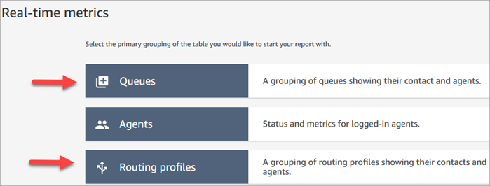 2. Choose **Settings**.

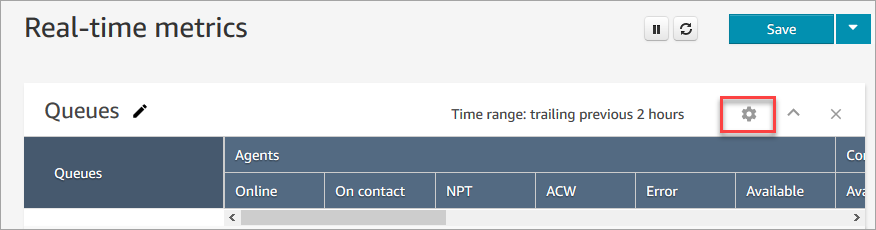 3. On the **Table Settings** page, choose the
**Groupings** tab and then select **Queues grouped by
channels**. Or, if you're setting up a **Routing profiles**
report, choose **Routing profiles grouped by channels**.

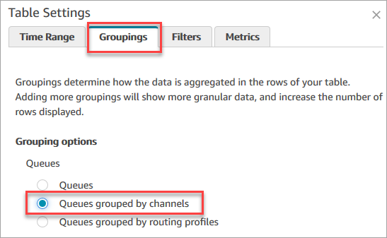 4. Choose **Apply**. 5. The table shows a column for **Channel**.

##### Group by queue in historical

metrics reports

In the historical metrics report, when you group or filter metrics by
**Queue**, the results for the following metrics aren't accurate:

- Agent idle time (not supported in queue grouping as of June, 2020)
- Agent on contact time (not supported in queue grouping as of June, 2020)
- Occupancy (not supported in queue grouping as of June, 2020)

Because of this, on the **Table Settings** page,
**Metrics** tab, these metrics are inactive, as shown in the following
image:

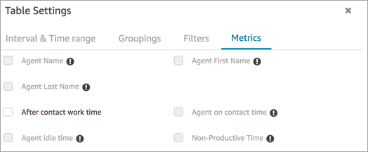

In addition, in the historical metrics report, Amazon Connect displays a hyphen (-)
in place of results for these metrics, and the cells are inactive (gray).

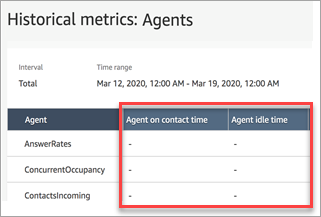

##### Effect of queue grouping

on saved and scheduled reports

If the **Queue** grouping or filter is used on the following reports,
note these effects:

- **Dashboards and reports**. The columns for these metrics don't appear
  in the saved reports when _grouped_ by Queue. When the saved report is
  _filtered_ by Queue, however, it shows "-".
- **Scheduled reports**. These reports continue to run successfully, but
  no results are returned for these metrics.

##### Agent on contact time (not

supported in queue grouping as of June, 2020)

On historical metrics reports when an agent handles multiple chats concurrently,
**Agent on contact time** shows wall clock time: the amount of time spent
chatting. However, there isn't a metric that shows the time an agent spends chatting with each
contact.

In addition, no results are returned when you use the **Queue** grouping
or filter with **Agent on contact time**.

##### Agent idle time (not supported in queue

grouping as of June, 2020

The **Agent idle time** metric divides the idle time into each queue
associated with the agent. When contacts are grouped or filtered by
**Queue**, however, Amazon Connect doesn't provide an accurate view into
the how the agent is working. Because of this, Amazon Connect doesn't show **Agent
idle time** when you apply the **Queue** grouping or filter to your
report.

##### Occupancy (not supported in queue grouping as

of June, 2020)

With the addition of chat, the **Occupancy** metric is now defined as
the percentage of time that an agent was active on contacts. This percentage is calculated as
follows:

- (Agent on contact (wall clock time) / (Agent on contact (wall clock time) + Agent idle
  time))

Because **Agent idle time** is now inaccurate when contacts are grouped
or filtered by **Queues**, the **Occupancy** metric is also
inaccurate. As a result, when contacts are grouped or filtered by Queues,
**Occupancy** doesn't appear on the report.

Occupancy no longer appears on the **Dashboard** page.

#### Contact Control Panel (CCP)

- Released the following improvements:
  - DTMF input is passed to all lines in a three-way call. Any party can enter DTMF input.
  - Resolved an issue where the DTMF tone degraded when agents interacted with Quick
    connect and/or Number pad during a session.
  - Resolved an issue where quick connects sometimes did not appear on a page, even after
    an agent refreshed it.
  - Improved the experience when a manager "listens in" to multiple chat conversations.
    Updated the unread message count on the CCP to include messages sent by the customer and
    those sent by the agent. Previously, the unread message count only included messages sent
    by the customer.

- Published instructions for upgrading to the latest CCP. For more information, see [Upgrade to the latest Amazon Connect Contact Control Panel
  (CCP).](upgrade-to-latest-ccp.md "upgrade-to-latest-ccp.md").
- Published a training video that explains how to use the CCP. For more information, see
  [Training video: How to use the Contact Center Panel
  (CCP) in Amazon Connect](ccp-video-training.md "ccp-video-training.md").

#### Flows

- The **Set disconnect flow** block supports voice conversations. For
  more information, see [Flow block in Amazon Connect: Set disconnect flow](set-disconnect-flow.md "set-disconnect-flow.md").
- The **Set Voice** block supports Amazon Polly Neural Text-to-Speech (NTTS)
  voices. For more information, see [Flow block in Amazon Connect: Set voice](set-voice.md "set-voice.md").
- The **Get queue metrics** block can return metrics by channel, for
  example, by voice or chat. For more information, see [Flow block in Amazon Connect: Get queue metrics](get-queue-metrics.md "get-queue-metrics.md").

### May 2020 Update

The following updates were released in May 2020:

#### Flows

- Added the ability to select multiple blocks at the same time and rearrange them as a
  group within a flow. For more information, see [Create an inbound flow](create-contact-flow.md#create-inbound-contact-flow "create-contact-flow.md#create-inbound-contact-flow").

### April 2020 Update

The following updates were released in April 2020:

#### Telephony

- Added early media support for outbound phone calls. Enabled by default, an agent hears
  tones and audio messages played by phone companies—such as busy signals, failure to
  connect errors, or other informational messages—through their headset or audio device.
  For more information, see [Step 3: Set telephony](amazon-connect-instances.md#get-started-telephony "amazon-connect-instances.md#get-started-telephony") in the [Create an Amazon Connect instance](amazon-connect-instances.md "amazon-connect-instances.md") topic.
- Added the `barge-in-enabled` session attribute to the [Get customer input](get-customer-input.md "get-customer-input.md") block so customers
  can interrupt Amazon Lex bots with their voice.

### March 2020 Update

The following updates were released in March 2020:

#### Flows

- Updated the [Store customer input](store-customer-input.md "store-customer-input.md") block to allow you to specify a custom
  terminating keypress.

#### Metrics

- Announced [June 2020: Changes for omnichannel support](#metrics-changes-june-2020 "#metrics-changes-june-2020").

#### Networking

- Updated softphone requirements in [Set up your network to use the Amazon Connect Contact Control Panel
  (CCP)](ccp-networking.md "ccp-networking.md").

### February 2020 Update

The following updates were released in February 2020:

#### Service Quotas

- Adjusted [Amazon Connect service quotas](amazon-connect-service-limits.md "amazon-connect-service-limits.md") for new accounts.

#### Flows

Updated the following blocks so you can set contact attributes:

- [Set customer queue
  flow](set-customer-queue-flow.md "set-customer-queue-flow.md")
- [Set hold flow](set-hold-flow.md "set-hold-flow.md")
- [Set whisper flow](set-whisper-flow.md "set-whisper-flow.md")

### January 2020 Update

The following updates were released in January 2020:

#### Contact Control Panel (CCP)

The following updates were made to the updated Contact Control Panel (ccp-v2):

- Agents can now transfer a contact by double-clicking a quick connect. For more
  information, see [Transfer calls to a quick connect or external phone
  number using the Contact Control Panel (CCP)](transfers.md "transfers.md").
- The number pad now retains the previously selected country flag so agents don't need to
  select it every time.
- All strings in the CCP user interface are now localized in available languages.
- Resolved an issue where the color of the call status bar incorrectly displayed as green
  during a conference call when the call was in the Joined state. It is now blue.
- Resolved an issue where the agent’s name was displayed in error messages for missed
  chats, rather than the customer’s name.

#### Networking

- Updated [Set up your network to use the Amazon Connect Contact Control Panel
  (CCP)](ccp-networking.md "ccp-networking.md") to include
  requirements for the updated Contact Control Panel (ccp-v2).

### December 2019 Update

The following update was released in December 2019:

#### Monitoring

- Added Contact Lens for preview. This feature enables you search conversations for
  keywords, sentiment scores, and non-talk time. For more information, see [Analyze conversations using conversational
  analytics in Amazon Connect Contact Lens](analyze-conversations.md "analyze-conversations.md").
- Added logging of Amazon Connect API calls with AWS CloudTrail. For more information, see [Log Amazon Connect API calls with AWS CloudTrail](logging-using-cloudtrail.md "logging-using-cloudtrail.md").

### November 2019 Update

The following updates were released in November 2019:

#### Omnichannel Support

- Added support for chat communications. For more information, see [Feature overview](connect-feature-overview.md "connect-feature-overview.md").

#### November 2019

##### Name changes for "Missed" and "Agent

status" and "On call"

The following real-time metrics were renamed:

| Old name     | New name           |
| ------------ | ------------------ |
| Missed       | Agent non-response |
| Agent status | Agent activity     |
| On call      | On contact         |

For each metric, existing saved reports automatically start displaying the new name; you
don't need to do anything for the new name to appear in your reports.

The column order for a saved report containing one of these metrics stays the same. For
example, if you previously saved a report where **Agent status** was the
third metric, now when you open that saved report, **Agent activity** is the
name for the third metric.

For **Missed**, only the name of the metric changed; the underlying
calculation stayed the same. We've changing the name of this metric to **Agent
non-response** so it better reflects its definition:

- **Agent non-response** increments whenever a contact is offered to an
  agent, and the agent doesn't respond to the contact for whatever reason.

For example, the agent could have intentionally let the timer run out, or the agent
could have forgotten to grant microphone access in the Contact Control Panel and never heard
the ring. In these situations, Amazon Connect doesn't drop the contact. Instead, the
routing engine will offer it to another available agent, while the customer continues to
wait in queue. This means a single contact could result in multiple **Agent
non-responses** before an agent responds and handles the contact.

For **On call**, the name change to **On Contact**
applies to the Real-time metrics UI only. You can continue using `AGENTS_ON_CALL`
with the `GetCurrentMetricData` API to retrieve data for this metric.

##### Label updates for "Agent activity" and

"Contact state"

Labels are the values returned in a report. For example, in the following image
**Available** and **Basic Routing Profile** are labels.

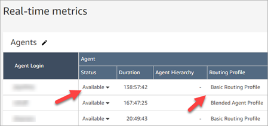

For **Agent Activity** and **Contact State**, we
renamed some of the labels that describe what the agent's current activity is and what's
happening with the contact they are currently working on. This way, the labels in the
Real-Time Metrics report are more consistent with the labels the agent sees in the Contact
Control Panel. They also align with the data returned about these different states in other
parts of Amazon Connect.

When the name of **Agent Status** changed to **Agent
Activity**, the following labels changed, too:

| Scenario                                                                                                     | Before: Agent Status Labels | After: Agent Activity Labels | Notes                            |
| ------------------------------------------------------------------------------------------------------------ | --------------------------- | ---------------------------- | -------------------------------- |
| Agent is logged in but offline                                                                               | Not shown                   | Not shown                    |                                  |
| Agent switches to \*_Available_<br>• in the CCP                                                              | Available                   | Available                    |                                  |
| Agent has an incoming call                                                                                   | CallIncoming                | Incoming                     | ContactState = Incoming contact  |
| Agent has an incoming callback                                                                               | CallbackIncoming            | Incoming                     | ContactState = Inbound callback  |
| Agent accepted a callback, which is now making an outbound call to the<br>customer                           | Calling                     | On Contact                   | ContactState = Outbound callback |
| Agent makes outbound call (regardless of what status the agent chose in their<br>CCP)                        | Calling                     | On Contact                   | ContactState = Outbound contact  |
| Agent missed a phone call due to timer expired                                                               | MissedCallAgent             | Missed                       |                                  |
| Agent is interacting with customer on phone call (regardless of what status the<br>agent chose in their CCP) | On call                     | On Contact                   |                                  |
| Agent puts customer on hold while on phone call (regardless of what status the agent<br>chose in their CCP)  | On call                     | On Contact                   |                                  |
| After agent hangs up call                                                                                    | After call work             | After contact work           |                                  |
| Agent is on Lunch (a custom status)                                                                          | Lunch                       | Lunch                        |                                  |
| Supervisor's activity state if they are monitoring some agent                                                | Monitoring                  | Monitoring                   |                                  |
| Agent's activity state if they are connected to customer while being monitored by a<br>supervisor            | On call                     | On Contact                   |                                  |

The following table shows the how the labels changed for **Contact
State**.

| Scenario                                                                                                     | Label Name Before | Label Name After   |
| ------------------------------------------------------------------------------------------------------------ | ----------------- | ------------------ |
| Agent is logged in but offline                                                                               |                   |                    |
| Agent switches to \*_Available_<br>• in the CCP                                                              | -                 | -                  |
| Agent has an incoming call                                                                                   | -                 | Incoming contact   |
| Agent has an incoming callback                                                                               | -                 | Inbound callback   |
| Agent accepted a callback, which is now making an outbound call to the<br>customer                           | Initial           | Outbound callback  |
| Agent makes outbound call (regardless of what status the agent chose in their<br>CCP)                        | Initial           | Outbound contact   |
| Agent missed a phone call due to timer expired                                                               | Missed call       | Missed contact     |
| Agent is interacting with customer on phone call (regardless of what status the<br>agent chose in their CCP) | Busy              | Connected          |
| Agent puts customer on hold while on phone call (regardless of what status the agent<br>chose in their CCP)  | OnHold            | On hold            |
| After agent hangs up call                                                                                    | After call work   | After contact work |
| Agent is on Lunch (a custom status)                                                                          | -                 | -                  |
| Supervisor's contact state if they are monitoring an agent                                                   | Monitoring        | Monitoring         |

#### Flows

Added the following flow blocks:

- [Wait](wait.md "wait.md")
- [Set disconnect flow](set-disconnect-flow.md "set-disconnect-flow.md")

Updated the following flow blocks for chat:

- [Play prompt](play.md "play.md")
- [Get customer input](get-customer-input.md "get-customer-input.md")
- [Store customer input](store-customer-input.md "store-customer-input.md")
- [Set recording and analytics
  behavior](set-recording-behavior.md "set-recording-behavior.md")

#### User Management

- Added that you can use AWS Identity and Access Management (IAM) with Amazon Connect. For more
  information, see [Identity and access management for Amazon Connect](security-iam.md "security-iam.md").

#### Live Media Streaming

- Added that you can capture customer audio for the entire interaction with your contact
  center. For more information, see [Set up live media streaming of customer audio in
  Amazon Connect](customer-voice-streams.md "customer-voice-streams.md").

#### API

- Added [StartChatContact](../APIReference/API_StartChatContact.md "../APIReference/API_StartChatContact.md"), [ListTagsForResource](../APIReference/API_ListTagsForResource.md "../APIReference/API_ListTagsForResource.md"), [TagResource](../APIReference/API_TagResource.md "../APIReference/API_TagResource.md"), [UntagResource](../APIReference/API_UntagResource.md "../APIReference/API_UntagResource.md") to the Amazon Connect Service API.
- Added the [Amazon Connect Participant Service](../../../connect-participant/latest/APIReference/Welcome.md "../../../connect-participant/latest/APIReference/Welcome.md")
  API. These APIs are used chat participants, such as agents and customers.

#### Contact Control Panel (CCP)

- Updated the CCP so it supports chat. For more information, see [Agent training guide for the Contact Control Panel (CCP)
  and agent workspace in Amazon Connect](agent-user-guide.md "agent-user-guide.md").

### October 2019 Update

The following update was released in October 2019:

#### Metrics

- The real time metric **On call** is now incremented whenever an agent
  is handling a contact who is connected, on hold, in After Contact Work, or the agent is
  dialog out to a customer.

This metric is available in the Queues tables and Routing Profile tables on the
**Real time metrics** page. It's also returned by the
`GetCurrentMetricData` API as `AGENTS_ON_CALL`.

### June 2019 Update

The following update was released in June 2019:

#### Flows

- Added flow versioning so you can choose between a saved or published version when you
  roll back.

### May 2019 Updates

The following updates were released in May 2019:

#### Metrics and Reporting

- Improved the error messages you might encounter when creating, editing, or deleting a
  scheduled report.
- In the Historical metrics report UI, changed **Contacts missed** to
  **Agent non-response**. This metric appears as **Contacts
  missed** in scheduled reports and exported CSV files.
- In the agent event stream, fixed the formatting of the timestamp millisecond so you can
  better order and analyze the data. To learn more, see [Amazon Connect agent event streams](agent-event-streams.md "agent-event-streams.md").

#### Contact Control Panel

- Resolved an issue where calling a destroy action (such as
  `connection.destroy`) using the [Amazon Connect
  Streams API](https://github.com/aws/amazon-connect-streams/blob/master/Documentation.md "https://github.com/aws/amazon-connect-streams/blob/master/Documentation.md") resulted in different behavior depending on which leg of the
  conversation it was called from: the agent or the customer. Now calling a destroy action
  results in the same behavior for both: a busy conversation is moved to After Call Work (ACW)
  and a conversation in any other state is cleared. If you used the native Contact Control
  Panel instead of the Amazon Connect Streams API, you weren't impacted by this issue.

### April 2019 Updates

The following updates were released in April 2019:

#### Contact Control Panel

- Resolved an issue where the hold flow didn't run in this case:

      + The agent missed a call and then set themselves back to Available.
      + Then they were re-routed the same call.
      + The agent put that customer on hold while handling the call.

  However, taking the customer off hold worked as expected and no other impact
  occurred.

- Resolved an issue where the [Amazon Connect
  Streams API](https://github.com/aws/amazon-connect-streams/blob/master/Documentation.md "https://github.com/aws/amazon-connect-streams/blob/master/Documentation.md") returned `softphoneAutoAccept = FALSE` even though
  **Auto-Accept Call** was enabled for the agent.

### March 2019 Update

The following updates were released in March 2019:

#### Metrics and Reporting

- Improved the error messages you might encounter when running real-time metrics reports.
  For example, if you manually configure a real-time metrics report to contain more than 100
  queues, we'll display this message: "You've hit the maximum limit of 100 queues. Please
  reconfigure your report to contain no more than 100 queues." To learn more, see [Troubleshoot no metrics or too few rows in a
  queues report in Amazon Connect](troubleshoot-rtm.md "troubleshoot-rtm.md")

#### Contact Control Panel

- Resolved an issue where, in rare cases, an agent already handling an outbound call could
  have been incorrectly presented with an additional queued callback, even though they are only
  allowed to handle one contact at a time. Since that agent would have been on contact and not
  idle, the agent wouldn't have been able to accept the queued callback.

In these cases, the outbound call was not impacted; the agent wouldn't have noticed any
differences in the CCP. The callback was presented to another agent instead of being
dropped.

### February 2019 Updates

The following updates were released in February 2019:

###### Updates by category

- [Contact Routing](#feb19-contact-routing "#feb19-contact-routing")
- [Flows](#feb19-flows "#feb19-flows")
- [Metrics and Reporting](#feb19-metrics "#feb19-metrics")
- [Contact Control Panel (CCP)](#feb19-ccp "#feb19-ccp")

#### Contact Routing

- Resolved an issue where in rare cases some contacts were not routed to the agent that
  was available for the longest time.
- Resolved an issue in the user interface where the value displayed for **No. of
  agents staffed** for the **Basic Routing Profile** on the
  **Routing Profiles** page was incorrect. The correct number of agents for
  the routing profile was displayed on the **User Management** page.

#### Flows

- Resolved an issue with the flow editor when adding intents in Chrome.
- Resolved an issue where routing priority and age for queued callbacks were not
  saved.
- Resolved an issue where contact attributes for an outbound whisper flow were not
  saved.

#### Metrics and Reporting

- Added **EnqueueTimestamp**, **Duration**, and **DequeueTimestamp** to the contact
  record for callback contacts.
- Resolved an issue where **InitiationTimestamp** for
  callback contacts did not match the time that the callback was created.
- Resolved an issue where users were given an incorrect message when they did not have
  permissions to edit a report.

#### Contact Control Panel (CCP)

- Resolved an issue where callbacks were not ringing in the CCP.

### January 2019 Updates

The following updates were released in January 2019:

###### Updates by category

- [Contact Routing](#jan19-contact-routing "#jan19-contact-routing")
- [Flows](#jan19-flows "#jan19-flows")
- [Metrics and Reporting](#jan19-metrics "#jan19-metrics")

#### Contact Routing

- Resolved an issue where in rare cases agent transfers were failing.

#### Flows

- Resolved an issue where agent transfers were failing.
- Resolved an issue that resulted in periodic delays in publishing flow logs.

#### Metrics and Reporting

- Resolved an issue in real-time metrics reports where the page showed the wrong
  calculation for **Avg queue answer time**.
- Resolved an issue where some events were missing from an agent event stream.

### December 2018 Updates

The following updates were released in December 2018:

###### Updates by category

- [Metrics and Reporting](#dec18-metrics "#dec18-metrics")
- [Contact Control Panel (CCP)](#dec18-ccp "#dec18-ccp")

#### Metrics and Reporting

- Resolved an issue where agent event streams were missing agent snapshots during login
  and logout events.
- Resolved an issue where the contact record detail page displayed timestamps using the
  timezone selected on the search page.
- Resolved an issue where the AfterContactWork status was overridden.
- Resolved an issue where the timestamps are incorrect if an agent accidentally
  disconnects while placing a customer on hold.

#### Contact Control Panel (CCP)

- Resolved an intermittent issue with initialization when an agent configuration is
  corrupted or null.
- Resolved an issue where pressing Enter to transfer a call did not work.

### November 2018 Updates

The following updates were released in November 2018:

###### Updates by category

- [General](#nov18-general "#nov18-general")
- [Flows](#nov18-flows "#nov18-flows")
- [Metrics and Reporting](#nov18-metrics "#nov18-metrics")

#### General

- Resolved an issue with auditing.
- Resolved an issue that sometimes resulted in agents being placed in a default state when
  a contact disconnected when attempting to connect to an agent.
- Resolved an issue that sometimes resulted in newly created agents not being able to log
  in correctly if the log in attempt occurred immediately after user account was
  created.

#### Flows

- Added the new Loop block, which lets you loop through segments of a flow, such as
  requesting customer information additional times if valid data is not entered.

#### Metrics and Reporting

- Resolved an issue where callbacks handled were included in the count for incoming
  contacts in historical reports, but not counted in scheduled reports. Callbacks handled are
  no longer included in the count for Incoming contacts handled in historical reports.
- Improved performance of report generation for reports with a large number of queues and
  agents in an instance.
- Resolved an issue with how ACW was reported, and backfilled data in customer instances
  to correct the ACW data for September, October, and November.

### October 2018 Updates

The following updates were released in October 2018:

###### Updates by category

- [General](#oct18-general "#oct18-general")
- [Metrics and Reporting](#oct18-metrics "#oct18-metrics")
- [API](#oct18-api "#oct18-api")

#### General

- Resolved an issue that sometimes resulted in stuck media sessions.

#### Metrics and Reporting

- Resolved an issue that sometimes resulted in agent names not being displayed correctly
  in historical reports.
- Resolved an issue that sometimes resulted in the data related to agent Auxiliary states
  were incorrectly overwritten.

#### API

- Resolved an issue where the `GetCurrentMetrics` operation returned the metric
  `OLDEST_CONTACT_AGE` in milliseconds instead of seconds.

### September 2018 Updates

The following updates were released in September 2018:

###### Updates by category

- [General](#sep18-general "#sep18-general")
- [API](#sep18-api "#sep18-api")

#### General

- Improved page loading times for the **User management** page.
- Resolved an issue that sometimes caused issues loading the **Queues**
  page when there were a large number of quick connects associated with a queue.

#### API

- Released the [UpdateContactAttributes](../APIReference/API_UpdateContactAttributes.md "../APIReference/API_UpdateContactAttributes.md") operation for the Amazon Connect API.

### August 2018 Updates

The following updates were released in August 2018:

###### Updates by category

- [General](#aug18-general "#aug18-general")
- [Contact Routing](#aug18-contact-routing "#aug18-contact-routing")
- [Metrics and Reporting](#aug18-metrics "#aug18-metrics")

#### General

- Added a restriction of 64 characters for the password length for the administrator
  account created during instance creation.
- Resolved an issue where the **Hours of operation** page would not load
  when no days were selected for a saved Hours of operation configuration.

#### Contact Routing

- Increased the timeout for whispers to 2 minutes for outbound and queued callbacks so
  that agents have longer to prepare for the incoming call.

#### Metrics and Reporting

- Modified how the value for the Contacts abandoned metric so that calls that transfer to
  callbacks are not counted as abandoned contacts.

### July 2018 Updates

The following updates were released in July 2018:

###### Updates by category

- [New Features](#july18-features "#july18-features")
- [General](#july18-general "#july18-general")
- [Metrics and Reporting](#july18-metrics "#july18-metrics")
- [Flows](#july18-contact-flows "#july18-contact-flows")

#### New Features

- [Outbound caller ID number](queues-callerid.md#using-call-number-block "queues-callerid.md#using-call-number-block")
- [Add an Amazon Lex bot to Amazon Connect](amazon-lex.md "amazon-lex.md")
- [User Management
  APIs](../APIReference.md "../APIReference.md")
- [Set up a flow to manage contacts in a queue in
  Amazon Connect](queue-to-queue-transfer.md "queue-to-queue-transfer.md")

#### General

- Added an error message when attempting to create an admin user during instance creation
  using "Administrator" as the user name. The user name Administrator is reserved for internal
  use, and cannot be used to create a user account in Amazon Connect.
- Added support for directory user names that include consecutive dashes.
- Added pagination when displaying security profiles in your instance so that more than 25
  security profiles can be displayed.
- Performance optimizations to reduce latency when using the
  `StartOutboundVoiceContact` API.

#### Metrics and Reporting

- Resolved an issue in real-time metrics reports where applied filters were not displayed
  in the settings page when an additional filter was applied. The settings page now displays
  the applied filters correctly.

#### Flows

- Added drop-down menus for contact attributes to make it easier to reference attributes
  in a flow.

### June 2018 Updates

The following updates were released in June 2018:

###### Updates by category

- [General](#june18-general "#june18-general")
- [Telephony and Voice](#june18-telephony "#june18-telephony")
- [Flows](#june18-contact-flows "#june18-contact-flows")
- [Metrics and Reporting](#june18-metrics "#june18-metrics")
- [Contact Control Panel (CCP)](#june18-ccp "#june18-ccp")

#### General

- Changed the font in the UI to Amazon Ember for better readability.

#### Telephony and Voice

- Introduced support for using Amazon Lex bots with Amazon Connect in the US West (Oregon)
  Region.
- Fixed a bug that in some cases caused a call to drop when a Loop prompt occurred at the
  same as a call connecting to an agent.

#### Flows

- Renamed the **Set queue** block to **Set working
  queue**.
- Added a **Copy to clipboard** button next to the ARN of a flow so you
  can easily copy the ARN. Choose **Show additional flow information** under
  the name of the flow in the designer to display the ARN.
- Added a new **Call phone number** block, which lets you choose the
  phone number from your instance to display as the caller ID in an outbound whisper flow. For
  more information, see [Outbound caller ID number](queues-callerid.md#using-call-number-block "queues-callerid.md#using-call-number-block").
- Released contact attributes for system metrics, including a new **Get
  metrics** block in flows. For more information, see [Use attributes in Amazon Connect to route based on number of
  contacts in a queue](attrib-system-metrics.md "attrib-system-metrics.md").

#### Metrics and Reporting

- Fixed an issue that caused incorrect rendering of the search field in the filters
  settings for some historical metrics reports.
- Fixed an issue in downloaded reports where the phone number would be blank instead of
  listing the phone number for calls that were callbacks.
- Login/Logout reports now support 20,000 rows per report generation, up from
  10,000.

#### Contact Control Panel (CCP)

- Added a mute button to the CCP and a mute function to the Streams API so agents can mute
  and unmute active calls.

### April and May 2018 Updates

The following updates were released in April and May 2018:

###### Updates by category

- [General](#may18-general "#may18-general")
- [Telephony and Voice](#may18-telephony "#may18-telephony")
- [Flows](#may18-contact-flows "#may18-contact-flows")
- [Metrics and Reporting](#may18-metrics "#may18-metrics")
- [Contact Control Panel (CCP)](#may18-ccp "#may18-ccp")

#### General

- New [Amazon Polly voices](../../../polly/latest/dg/voicelist.md "../../../polly/latest/dg/voicelist.md") are now automatically
  made available in Amazon Connect as soon as they are launched. You can use new voices, such as Matthew
  and Léa, in your flows.
- Updated password enforcement for Amazon Connect user accounts to match requirements for the Amazon Connect
  admin account created during instance creation.
- Resolved an issue that sometimes resulted in the email addresses not being saved when
  updating an existing user account.

#### Telephony and Voice

- Service optimizations to reduce latency and improve caller ID for Japanese
  telephony.
- Customers can now place calls to Jersey and Guernsey in the Channel Islands.
- Added support for keypad numeric input to an Amazon Lex bots when used in an Amazon Connect contact
  flow. For more information, see [Amazon Connect Now Supports Keypad Input with an Amazon Lex Chatbot](https://aws.amazon.com/about-aws/whats-new/2018/05/amazon-connect-now-supports-keypad-input-with-an-amazon-lex-chat/ "https://aws.amazon.com/about-aws/whats-new/2018/05/amazon-connect-now-supports-keypad-input-with-an-amazon-lex-chat/").
- Reduced latency for the contact control panel, improving the agent user
  experience.

#### Flows

- Resolved an issue with publishing a flow in the case where an **AWS Lambda
  function block** is used in a flow, and the input type for a parameter was changed
  from **Send attribute** with a **System** attribute is
  changed to **Send text**. These flows now publish successfully.
- Agent and customer whispers are now maintained with queued callbacks.
- Attributes now correctly persist with queue callbacks.
- Contact attributes are now maintained when using a **Loop prompt**
  block in a queue flow.

#### Metrics and Reporting

- Data for scheduled reports is now delayed by 15 minutes to allow for most recent data to
  be incorporated in to reports. Previously, in some cases, report data for the final 15 minute
  period during the scheduled report interval did not get included in scheduled reports. This
  applies to all report types.
- In metric calculations, the time that an incoming call rings is attributed to idle time
  if the agent is in idle state before an incoming call.
- The metric **Agent on contact time** now includes time that an agent
  spent in an auxiliary busy state.
- Published new documentation about metrics.

#### Contact Control Panel (CCP)

- Added a **Save** button to the settings menu for the CCP when an agent
  is using a desk phone. The **Save** button saves the deskphone configuration
  between sessions.
- Agent username is now available as part of agent configuration data in the [Amazon Connect Streams](https://github.com/aws/amazon-connect-streams/blob/master/Documentation.md "https://github.com/aws/amazon-connect-streams/blob/master/Documentation.md") API.
- Contact attributes are now available when using the streams.js (Streams API) for
  screenpops after queued callbacks.
- Fixed issue where for some auto-accept calls, the agent continued to hear ringing after
  accepting and joining the call.
