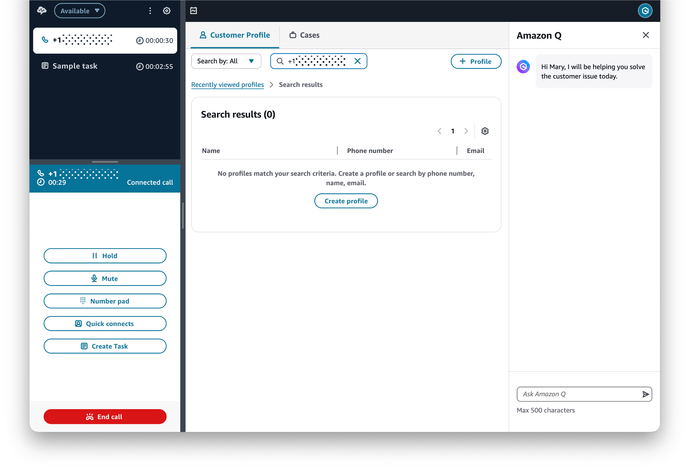
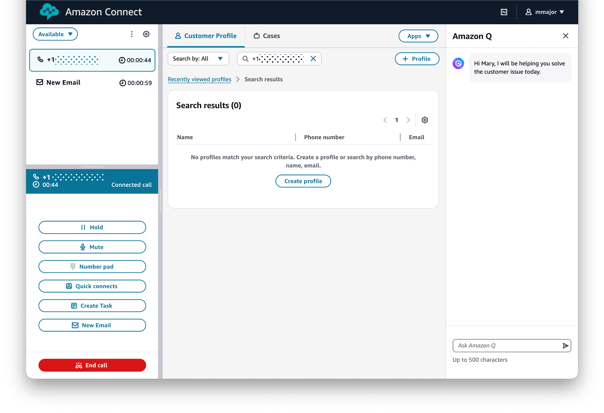

# Upcoming changes to the agent workspace

The Amazon Connect agent workspace will be updated with minor visual changes, on or after November 30, 2025. These changes will better align the agent workspace with other web pages in Amazon Connect, creating a more intuitive experience for your agents. The layout and functionality of the agent workspace will remain unchanged.

For examples of what the updated agent workspace looks like, see [Before and after examples of the visual changes](#example-visual-changes "#example-visual-changes").

If your agents use a custom agent application, a third-party agent desktop, or the Contact Control Panel (CCP) as a standalone or embedded application, you will not be impacted by these changes.

You do not need to take any action at this time. If you have any questions about the upcoming visual refresh, contact Support or your Technical Account Manager.

## Before and after examples of the visual changes

This section shows you the current user interface of the agent workspace and how it compares with the upcoming changes.

The agent workspace will have a new header bar at the top of the user interface. This header bar will include agent settings and sign-out in a more intuitive location at the top right. The calendar icon for agents to access their schedules will move alongside those settings in the header bar. In addition, the buttons for agents to update their status and access other actions and settings in the CCP will move immediately below the header bar.

The agent workspace will also have new color applications and styling. For example, the contact in focus will now be represented by a box, creating a more intuitive experience for agents.

**Before visual changes**

**After visual changes**

