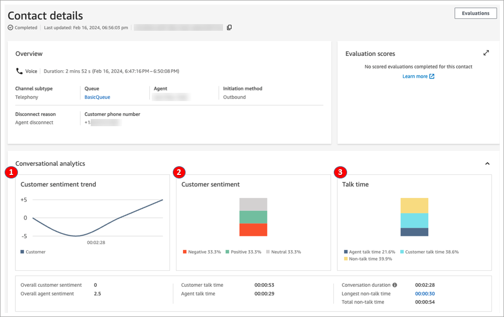
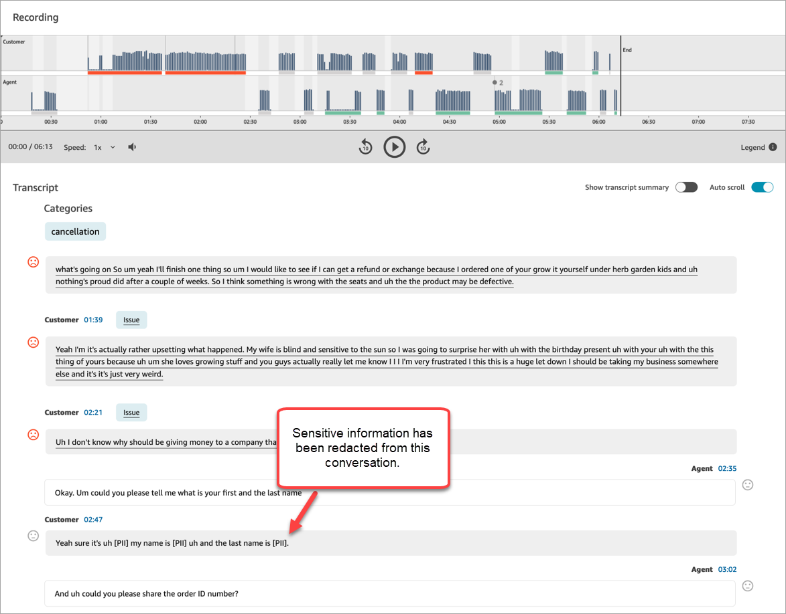
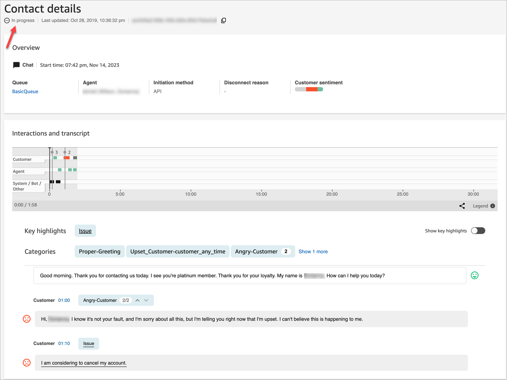
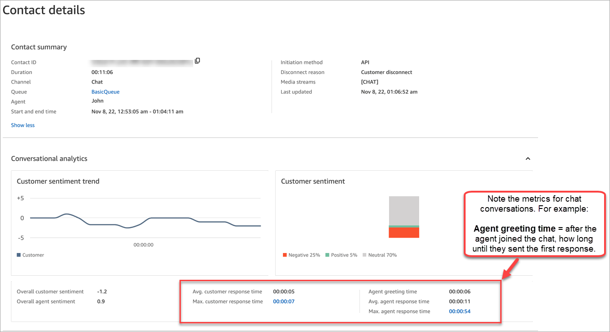
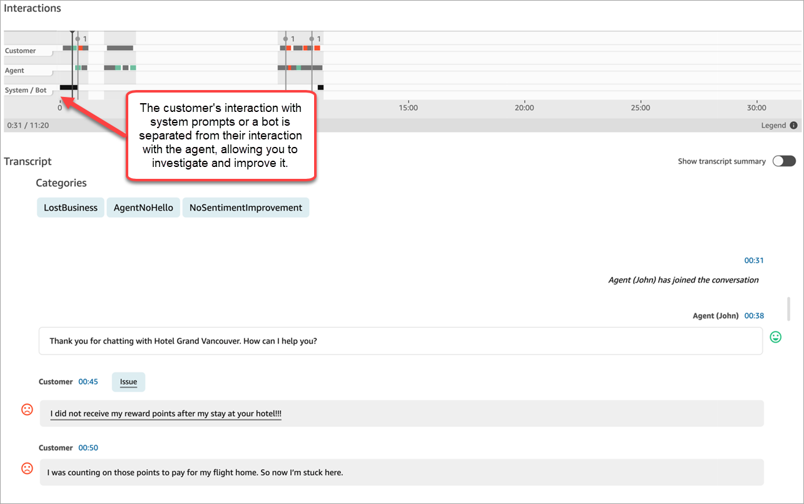

# Analyze conversations using conversational

analytics in Amazon Connect Contact Lens

With Contact Lens conversational analytics, you can analyze conversations
between customers and agents by using speech and chat transcriptions, natural language
processing, and intelligent search capabilities. Conversational analytics performs
sentiment analysis, detects issues, and enables you to automatically categorize
contacts.

###### Speech analytics support

- **Real-time call analytics**: Use to detect and
  resolve customer issues more proactively while the call is in progress. For
  example, it can [analyze and alert](add-rules-for-alerts.md "add-rules-for-alerts.md")
  you when a customer is getting frustrated because the agent is unable to resolve
  a complicated problem. This allows you to provide more immediate assistance.
- **Post-call analytics**: Use to understand trends
  of customer conversations and agent compliance. This helps you identify
  opportunities to coach an agent after the call.

###### Chat analytics support

- **Real-time chat analytics**: As with real-time
  call analytics, you can detect and resolve customer issues more proactively
  while the chat is progress and [receive
  an alert](add-rules-for-alerts-chat.md "add-rules-for-alerts-chat.md"). For example, managers can get a real-time email alert when
  customer sentiment for a chat contact turns negative, allowing them to join the
  in-progress contact and help resolve the customer issue.
- **Post-chat analytics**: Use to understand trends
  of customer conversations with both bots and agents. It provides information
  specific to a chat interaction, such as the agent greeting time, and agent and
  customer response times. The response times and sentiments help you investigate
  the customer's experience with the bot versus the agent, and identify areas for
  improvement.
  Each processed chat message is charged the same way. While not all messages may have
  all features applied (for example, summarization is applied to `text/plain`
  messages only), if Contact Lens conversational analytics is enabled on the
  contact, the message is counted for billing. For more information about pricing, see
  [Amazon Connect Pricing](https://aws.amazon.com/connect/pricing/ "https://aws.amazon.com/connect/pricing/").

You can protect your customer's privacy by redacting sensitive data, such as name,
address, and credit card information from transcripts and audio recordings.

## Sample Contact details page for a

call

The following image shows the conversational analytics for a voice call. Notice
that it includes **Talk time** metrics.

1. **Customer sentiment trend**: This graph shows how
   customer sentiment changes as the contact progresses. For more information,
   see [Investigate sentiment
   scores](sentiment-scores.md "sentiment-scores.md").
2. **Customer sentiment**: This graph shows the distribution
   of customer sentiment for the entire call. This is calculated by counting
   the total number of conversation turns or chat messages where a customer had
   Positive, Neutral, and Negative sentiment.
3. **Talk time**: This graph shows the distribution of talk
   time and non talk-time during the entire call. The talk time is further
   split into agent and customer talk time.

The following image shows the next section on the **Contact
details** page for a voice call: the audio analysis and transcript.
Notice that personally identifiable information (PII) has been [redacted from the transcript](sensitive-data-redaction.md "sensitive-data-redaction.md").

## Sample Contact details page for

real-time chat analytics

The following image shows the conversational analytics for a real-time chat.
Notice that it includes Key highlights and customer sentiment.

## Sample Contact details page for

post-chat analytics

The following image shows post-chat analytics. Notice that it includes chat
response metrics, such as **Agent greeting time** (the time from
the agent joining the chat to when they send the first response), **Customer
response time**, and **Agent response time**.

The following image shows the next section on the **Contact
details** page for a chat: the interaction analysis and transcript.
Notice that you can investigate the customer's interaction with a bot versus the
agent.

