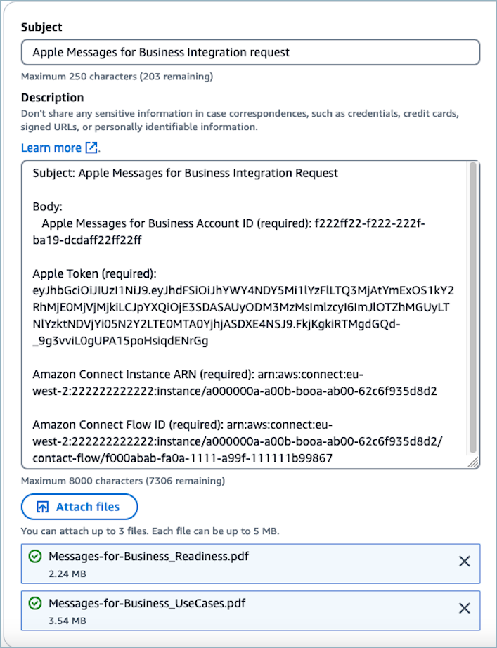

# Enable Apple Messages for Business with Amazon Connect

Your customers can engage directly with your contact center from within their Messages
application on their iPhone, iPad, and Mac.

When you enable Apple Messages for Business, your customers can find answers to their questions and request help
from agents to resolve issues, while using the familiar Messages application they use every
day to chat with friends and family. Any time customers use Search, Safari, Spotlight, Siri,
or Maps to call your registered phone number, they will be provided with the option to chat
with your contact center.

Apple Messages for Business integration with Amazon Connect enables you to use the same configuration, analytics,
routing, and agent UI that you already use for [Amazon Connect
Chat](web-and-mobile-chat.md "web-and-mobile-chat.md").

## Prerequisites: Determine if

Apple Messages for Business is the right channel for your use case

In order to qualify as a business, make sure you meet the criteria listed in the
[Apple Messages for Business documentation](https://register.apple.com/resources/messages/messaging-documentation/#qualifying-as-a-business "https://register.apple.com/resources/messages/messaging-documentation/#qualifying-as-a-business").

If you determine that Apple Messages for Business is the right channel for your business, fill in the
following forms:

- [Apple Messages for Business readiness document](https://register.apple.com/resources/messages/messaging-documentation/resources/Messages-for-Business_Readiness.pdf "https://register.apple.com/resources/messages/messaging-documentation/resources/Messages-for-Business_Readiness.pdf")
- [Description of your four primary use cases for Apple Messages for Business](https://register.apple.com/resources/messages/messaging-documentation/resources/Messages-for-Business_UseCases.pdf "https://register.apple.com/resources/messages/messaging-documentation/resources/Messages-for-Business_UseCases.pdf")

## Step 1: Register with Apple

Integrate Apple Messages for Business with Amazon Connect by first registering with Apple as a brand. When you do,
you'll get a unique Apple Messages for Business Account ID, and you can then link your Apple Messages for Business account to Amazon Connect.

1. Go to the [Apple Messages for Business](https://register.apple.com/business-chat "https://register.apple.com/business-chat")
   page. In the box that says **As a business, I want to connect with my
   customers in the Messages app**, choose **Get
   Started**.
2. Create an Apple ID for your business, if you don't already have one.

An Apple ID is typically for the personal use of Apple services, such as
storing personal content in iCloud and downloading apps from the App Store. If
you have a personal Apple ID, we recommend that you create a separate one using
your organization’s email address to administer Messages for Business. A separate administrative
Apple ID lets you distinguish Messages for Business communications from personal Apple
communications. 3. Register a profile for a new Messages for Business account by accepting **Apple’s Terms
of Service**. We recommend creating a [Commercial Messages for Business Account](https://register.apple.com/resources/messages/messaging-documentation/register-your-acct#create-a-commercial-business-chat-account "https://register.apple.com/resources/messages/messaging-documentation/register-your-acct#create-a-commercial-business-chat-account"). You then provide business details, such as
a logo and support hours. 4. Select Amazon Connect as your Messaging Service Provider. You can do this by selecting
Amazon Connect from the drop-down or by entering the following URL:

    * **https://messagingintegrations.connect.amazonaws.com/applebusinesschat**

After you submit your application to Apple, you’ll see the status of your application
at the top of your **Messages for Business Account** page.

For more information about registering with Apple, see the following articles on
Apple's website: [Getting Started with Messages for Business](https://register.apple.com/resources/business-chat/BC-GettingStarted.pdf "https://register.apple.com/resources/business-chat/BC-GettingStarted.pdf") and [Messages for Business Policies and Best Practices](https://register.apple.com/resources/business-chat/BC-Policies_and_Best_Practices.pdf "https://register.apple.com/resources/business-chat/BC-Policies_and_Best_Practices.pdf").

## Step 2: Gather required

information

Gather the following information so you have it on hand when you open a support ticket
in Step 3:

1. **Apple Messages for Business Account ID**: After you’ve been approved by Apple Messages for Business,
   you will be issued an Apple Messages for Business Account ID. For information about locating your Apple Messages for Business Account ID, see
   [Find your Apple Messages for Business Account ID for your
   integration with Amazon Connect](find-apple-messages-for-business-account-id.md "find-apple-messages-for-business-account-id.md").

###### Note

Your Apple Messages for Business Account ID is a randomized string of numbers and letters. It is not the
same as your Apple ID. 2. **Apple Token**: This is a unique ID that
authenticates your account. For help locating your Apple token, see [Find your Apple token when integrating Apple
Messages for Business with Amazon Connect](find-apple-token-id.md "find-apple-token-id.md"). 3. **Amazon Connect instance ARN**: This is the identifier
for the instance you want to link to your Apple business account. For
information about locating your instance ID, see [Find your Amazon Connect instance ID or ARN](find-instance-arn.md "find-instance-arn.md").

###### Note

Make sure you have service-linked roles enabled for the integration.

If your instance was created before **October
2018**, add the `connect:*` policy on the role that
is associated with your Amazon Connect instance. For more information about
service-linked roles, see [Use service-linked roles and role permissions for Amazon Connect](connect-slr.md "connect-slr.md"). 4. **Amazon Connect flow ID**: This is the identifier for the
flow you want to use for inbound chats. For information about locating your flow
ID, see [Find the flow ID when integrating Apple Messages
for Business with Amazon Connect](find-contact-flow-id.md "find-contact-flow-id.md").

## Step 3: Link your Apple Messages for Business ID to

Amazon Connect

In this step you create an Amazon Connect support ticket to link your Apple Messages for Business ID to Amazon Connect.

1. Create a [special Support ticket](https://support.console.aws.amazon.com/support/home#/case/create?issueType=customer-service&serviceCode=service-chime-end-user&categoryCode=other "https://support.console.aws.amazon.com/support/home#/case/create?issueType=customer-service&serviceCode=service-chime-end-user&categoryCode=other") to link your Apple Messages for Business to Amazon Connect.

If prompted, login using your AWS account.

###### Tip

Looking for technical support? [Open an Support ticket
here](https://console.aws.amazon.com/support/home "https://console.aws.amazon.com/support/home"). 2. Choose **Account and billing**. 3. Use the dropdown box to choose **Chime (End user)**. For
**Category** choose **Activation**, and
then choose **Next step: Additional information**. 4. For **Subject** enter **Apple Messages for Business
Integration request**. 5. In the **Description** box, copy and paste the following
template:

```
Subject: Apple Messages for Business Integration request
   Body:

   Apple Messages for Business Account ID (required): `enter your account ID`
   Apple Token (required): `enter your Apple token`
   Amazon Connect Instance ARN (required): `enter your instance ARN`
   Amazon Connect Flow ID (required): `enter your flow ID`

```

6. Attach the two forms from the [prerequisites](#apple-messages-for-business-prerequisites "#apple-messages-for-business-prerequisites")
   section to the support ticket.

###### Note

This step is required. Your request will not be processed if you do not
attach these forms.

The following image shows an example of a completed ticket:

 7. Choose **Next step**. 8. Choose **Contact us**, choose your **Preferred
contact language**, and then choose **Web** as the
contact method, if it's not selected by default.

 9. Choose **Submit**. 10. Support will work directly with the Amazon Connect team on your request and follow up
with any additional questions.

### Next steps

After Apple Messages for Business is enabled for your Amazon Connect instance, you can [add Apple Messages for Business features](add-apple-messages-for-business-features.md "add-apple-messages-for-business-features.md") to
your messages. For example:

- Deflect calls with Apple's Message Suggest.
- Embed Apple Messages for Business buttons on your website.
- Add list pickers, time pickers, forms, and quick replies to your
  messages.
- Add Apple Pay, iMessage Apps, and Authentication to your
  integration.
- Use rich links for URLs.
- Route Apple Messages for Business messages using contact attributes.
- Enable Attachments for your integration.

Additionally, pass the [Apple experience review](https://register.apple.com/resources/messages/messaging-documentation/xp-review "https://register.apple.com/resources/messages/messaging-documentation/xp-review").

## Step 4: Create and Submit

Experience Review Recording

Record a demo experience for review by Amazon Connect and Apple Messages for Business. The video must accurately
represent the user journey that occurs when the account is in production (all use
cases). Only upload a recording of the user's point of view (user's device). You don't
need to send recordings from the agent console or the bot activated on the backend. You
can split the video into multiple parts if needed. Demonstrate the [Rich Features](https://register.apple.com/resources/messages/messaging-documentation/customer-journey#interactive-features "https://register.apple.com/resources/messages/messaging-documentation/customer-journey#interactive-features") you have integrated in the experience, the live agent
interaction, and any [out of hours messages](https://register.apple.com/resources/messages/messaging-documentation/ux-design#automated-messaging "https://register.apple.com/resources/messages/messaging-documentation/ux-design#automated-messaging"). Make sure you follow Apple Messages for Business's [Best Practices](https://register.apple.com/resources/messages/messaging-documentation/ux-design#best-practices "https://register.apple.com/resources/messages/messaging-documentation/ux-design#best-practices") and [Policies](https://register.apple.com/resources/messages/messaging-documentation/policies "https://register.apple.com/resources/messages/messaging-documentation/policies").

###### Tips for developing the user experience

- **Introductory/welcome message:** Auto-respond to
  first message in a new conversation should be provided within 5 seconds by an
  automated system. When the customer starts a conversation with an automated
  system, provide a message like **This is an automated agent**
  or **I'm an automated agent**. For more information, see [Automated Messaging](https://register.apple.com/resources/messages/messaging-documentation/ux-design#automated-messaging "https://register.apple.com/resources/messages/messaging-documentation/ux-design#automated-messaging").
- **Terms of Use and Privacy Policy statements:**
  These should be handled via a [Rich Link](https://register.apple.com/resources/messages/msp-rest-api/type-richlink#rich-link-messages "https://register.apple.com/resources/messages/msp-rest-api/type-richlink#rich-link-messages") to the brand's web site, allowing users to read the full
  terms at their convenience. Do not send large bubbles of legal text in the
  conversation. These should only be sent the first time a user engages in the
  channel with the brand, or when the terms have been updated.
- **Initial triage:** A triage menu should be sent
  at the beginning of the interaction. This is a quick way to guide and help the
  user. You may use a Quick Reply message (up to 5 options). For more information,
  see [Triage Customers](https://register.apple.com/resources/messages/messaging-documentation/ux-design#triage-customers "https://register.apple.com/resources/messages/messaging-documentation/ux-design#triage-customers").
- **Make an introduction:** Always introduce live
  agents when a conversation begins, and after transferring a customer to a new
  agent.
- **Live support availability:** If a customer
  sends help outside of normal customer service hours when live agents aren't
  available, an automated response should let them know when a live agent is able
  to respond. For more information, see [Automated Messaging](https://register.apple.com/resources/messages/messaging-documentation/ux-design#automated-messaging "https://register.apple.com/resources/messages/messaging-documentation/ux-design#automated-messaging").
- **Allow switching from an automated to a live
  agent:** A live agent must be reachable anytime the customer texts
  the word "help". Additionally, if an automated agent doesn't understand a
  request, the agent must seamlessly transition to a live agent after displaying a
  message like "I'm routing your message to a live agent to better assist
  you."
- **Don't ask for previously provided
  information:** Agents can access the entire conversation history,
  including previous responses and recent transactions, so there should be no need
  to ask a customer to repeat information.
- **Rich Link:** All URLs should be sent as Rich
  Links. This means that no tap-to-load issues or in-text links should be sent.
  For more information, see [Use rich links for URLs](add-apple-messages-for-business-features.md#rich-links "add-apple-messages-for-business-features.md#rich-links") .
- **Feature bubbles:** Should have a relevant
  thumbnail image and call to action text, so customers are clear on the content
  of the feature and recognize it as a tap-able item.
- **We encourage the use of satisfaction surveys:**
  Once you complete an interaction with a customer, you may want to provide them
  with a customer service satisfaction (CSAT) survey. For a better customer
  experience, provide the CSAT surveys after the experience and not after every
  FAQ. For more information, see [Satisfaction Surveys](https://register.apple.com/resources/messages/messaging-documentation/ux-design#satisfaction-surveys "https://register.apple.com/resources/messages/messaging-documentation/ux-design#satisfaction-surveys").
- **Typing indicators:** When an agent, live or
  automated, starts typing, the typing indicator should be displayed, so the
  experience is consistent. The typing indicator should be displayed before any
  message type (text or interactive). For messages sent by bots, as well as
  messages in sequence, use only a 1-second typing indicators before each message.
  For more information, see [Typing Indicator Message](https://register.apple.com/resources/messages/msp-rest-api/common-specs#typingindicatormessage "https://register.apple.com/resources/messages/msp-rest-api/common-specs#typingindicatormessage").

After your experience review recording is created, you can once again create an Amazon Connect
support ticket to share. Feedback will be provided by Amazon Connect and Apple Messages for Business before final
approval.

1. Create a [special Support ticket](https://support.console.aws.amazon.com/support/home#/case/create?issueType=customer-service&serviceCode=service-chime-end-user&categoryCode=other "https://support.console.aws.amazon.com/support/home#/case/create?issueType=customer-service&serviceCode=service-chime-end-user&categoryCode=other") to share your experience review recording. If
   prompted, login using your AWS account.
2. Choose **Account and billing**.
3. Use the dropdown box to choose **Chime (End user)**. For
   **Category** choose **Activation**, and
   then choose **Next step: Additional information**.
4. For **Subject** enter **Apple Messages for Business
   Experience Review request**.
5. In the **Description** box, copy and paste the following
   template:

```
Subject: Apple Messages for Business Experience Review request

Body:

   Apple Messages for Business Account ID (required): `enter your account ID`
```

6. Attach the experience review recording.
7. Choose **Next step**.
8. Choose **Contact us**, choose your **Preferred
   contact language**, and then choose **Web** as the
   contact method, if it's not selected by default.
9. Choose **Submit**.
10. Support will work directly with the Amazon Connect team on your request and follow up
    with any feedback.
