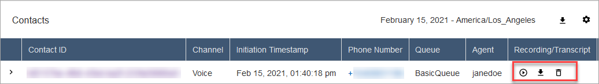

# Assign permissions to review

past contact center conversations in Amazon Connect

To access recordings and transcripts on the Amazon Connect admin website, you need security profile permissions to search for
and view contacts on the **Contact search** page. You also need permissions to access:

- Recordings and transcripts of agent
  interactions
- Automated interactions (IVR)
  recordings
- Automated interactions (IVR)
  transcripts
  This topic explains the required security profile permissions.

###### Contents

- [Permissions to
  search and view contacts](#assign-permissions-to-search-and-view-contacts "#assign-permissions-to-search-and-view-contacts")
- [Permissions to
  access recordings and transcripts of agent interactions](#assign-permissions-to-access-recordings-transcripts "#assign-permissions-to-access-recordings-transcripts")
- [Permissions to view automated interaction (IVR) recordings and
  transcripts](#assign-permissions-to-view-automated-recordings-transcripts "#assign-permissions-to-view-automated-recordings-transcripts")

## Permissions to

search and view contacts

Contacts and underlying recordings and transcripts are accessible through the
**Contact search** and **Contact details**
pages. At least one of the following permissions is required to view contacts on
**Contact search** and **Contact details**
pages:

- **Contact search - View**: Allows a user to
  access all contacts on **Contact search** and
  **Contact details** pages.
- **View my contacts - View**: On the
  **Contact search** and **Contact
  details** pages, allows agents to view only those contacts that
  they handled.

You can also enable the **Restrict contact
access** permission to restrict access to contacts based on the user's hierarchy.
For example:

- Agents who are assigned to AgentGroup-1 can only view contact records
  for contacts handled by agents in that hierarchy group and any groups below them.
- Agents assigned to AgentGroup-2 can only access contact records for contacts handled
  by their group, and any groups below them.
- Managers and others who are in higher
  level groups can view contact records for contacts handled by all the groups below
  them, such as AgentGroup-1 and 2.

For more information, see [Manage who can search for
contacts and access detailed information](contact-search.md#required-permissions-search-contacts "contact-search.md#required-permissions-search-contacts").

## Permissions to

access recordings and transcripts of agent interactions

Complete the following steps to assign permissions to access agent interactions
for voice, chat and email channels.

###### Note

For chat interactions, the same
transcript contains the agent interaction and the automated interaction (for
example, with chat bots).

1. Assign the **CallCenterManager** security profile so a user can
   listen to call recordings or review chat transcripts. This security profile also
   includes a setting that makes the icon to download recordings appear in the results
   of the **Contact search** page. The following image shows the
   recording play, download, and delete icons that are displayed to a user who has
   these permissions.

– OR –

1.  Assign the following individual permissions:
    - **Call recordings (redacted) - Access**: If your
      organization uses Amazon Connect Contact Lens, you can assign this permission so
      agents access only those agent call recordings in which sensitive data has
      been redacted.
    - **Contact transcripts (redacted) - Access**: If your
      organization uses Amazon Connect Contact Lens, you can assign this permission so
      agents access only those contact transcripts in which sensitive data has
      been redacted.

    The redaction feature is provided as part of Contact Lens. For more
    information, see [Use sensitive data redaction to protect
    customer privacy using Contact Lens](sensitive-data-redaction.md "sensitive-data-redaction.md").
    - **Manager monitor**: This permission allows users to
      monitor live conversations and listen to recordings.

    ###### Tip

    Be sure to assign managers to the **Agent** security
    profile so they can access the Contact Control Panel (CCP). This enables
    them can monitor the conversation through the CCP.
    - **Call recordings (unredacted) - Access**: Use this
      permission to manage who can access recordings on the **Contact
      search** and **Contact details** pages,
      through corresponding URLs that are generated in S3. From there, these users
      can delete recordings.

    Note the following:

        + If users do not have **Call recordings (unredacted) -
         Access** permission—or they're not logged in to
         Amazon Connect—they cannot listen to the call recording or access the
         URL in S3, even if they know how the URL is formed.
        + The **Call recordings (unredacted) - Enable download button**
         permission controls only whether the download button appears in the
         user interface. It does not control access to the recording.

    - **Contact transcripts (unredacted) - Access**: Use this
      permission to manage who can view unredacted chat and email conversations,
      and unredacted voice transcripts produced by Contact Lens on the **Contact
      search** and **Contact details** pages.

    Note the following:

        + If users do not have **Call recordings (unredacted) -
         Access** permission—or they're not logged in to Amazon Connect.
        + The **Call recordings (unredacted) - Enable download
         button** permission controls only whether the download
         button appears in the user interface. It does not control access to
         the recording.

    - **Delete recorded conversations**: To enable a user to
      delete recordings on the **Contact search** and **Contact details** pages, choose
      the **Delete** permission.
    - **Automated interaction voice (IVR) recordings
      (unredacted)**: Use this permission to grant access to manage
      and view IVR recordings on the **Contact details**
      page.
    - **Automated interaction voice (IVR) transcripts
      (unredacted)**: Use this permission to grant access to
      transcripts for the above Automated Interaction Voice (IVR) Recordings.

## Permissions to view automated interaction (IVR) recordings and

transcripts

Assign the following permissions:

- **Automated interaction voice (IVR) recordings
  (unredacted) - Access**: Enables user’s access to the recording
  of a contact during automated interactions (with IVR, Amazon Lex, or other
  bots).
- **Automated interaction voice (IVR) recordings
  (unredacted) - Enable Download Button**: Controls whether the
  download button appears next to the IVR recording on the **Contact details**
  page within Amazon Connect.

### Access automated interaction (IVR) logs and

transcripts

Assign the following permissions:

- **Automated interaction voice (IVR) transcripts
  (unredacted) - Access**: Enables a user's access to the
  interaction between the customer, IVR and any bots. They can see the customer's keypad inputs in response to IVR prompts and see
  the transcript for the interaction with Amazon Lex.

The transcript obfuscates customer inputs entered for the [Store customer input](store-customer-input.md "store-customer-input.md") flow block.
The transcript also obfuscates any [slots that are
configured to be obfuscated](../../../lexv2/latest/dg/monitoring-obfuscate.md "../../../lexv2/latest/dg/monitoring-obfuscate.md") in the _Amazon Lex developer
guide_ within Amazon Lex. Users with access to the IVR recording
can still listen to the voice customer inputs during Amazon Lex
interactions.

- **Flow - View** and **Flow modules - View**:
  Grant users with both of these permissions so they can view flow execution
  details for voice contacts on the **Contact details** page. For example, which
  flow was executed and what was the outcome.

###### Note

These permissions also
grant users with access to the Flows and Flow modules pages on the Amazon Connect admin website.
