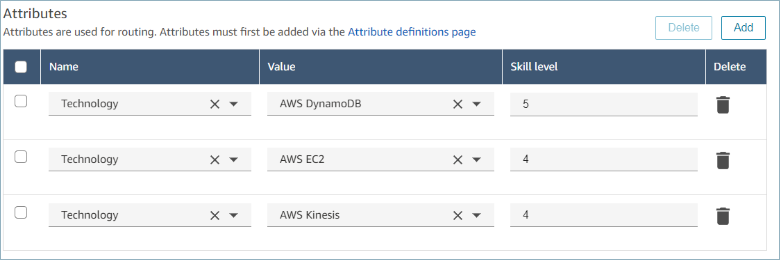

# Assign proficiencies to agents in your

Amazon Connect instance

A proficiency consists of a predefined attribute name, its value, and a proficiency level.
The level is a numeric value of 1, 2, 3, 4, or 5. After you have created predefined
attribute, you can assign one or more proficiencies to an agent.

For example, Agent1 and Agent2 may be proficient in multiple technologies at varying
levels. They can be assigned proficiencies to reflect their level of proficiency in those
technologies as shown in the following table:

| Agent Name | Predefined Attribute | Value         | Proficiency Level |
| ---------- | -------------------- | ------------- | ----------------- | ---------------------------------------------------------------------------------------------------------------------------------------------------------------------------------------------------------------------------------------------------------------------------------------------------------------------------------------------------------------------------------------------------------------------------------------------------------------------------------------------------------------------------------------------------------------------------------------------------------------------------------------------------------------------------------------------------------------------------------------------------------------------------------------------------------------------------------------------------------------------------------------------------------------------------------------------------------------------------------------------------------------------------------------------------------------------------------------------------------------------------------- |
| Agent1     | Technology           | AWS Kinesis   | 2                 |
| Agent1     | Technology           | AWS Dynamo DB | 5                 |
| Agent1     | Technology           | AWS EC2       | 4                 |
| Agent1     | Language             | French        | 3                 |
| Agent1     | Language             | English       | 4                 |
| Agent2     | Technology           | AWS Dynamo DB | 3                 |
| Agent2     | Technology           | AWS EC2       | 5                 |
| Agent2     | Technology           | AWS Nepture   | 5                 |
| Agent2     | Language             | French        | 4                 |
| Agent2     | Language             | English       | 3                 | ###### To assign a proficiency to a user 1. On the navigation menu, choose **Users**, **User Management.** 2. Select the user name to open the user profile. 3. Go to **Show advanced settings**. 4. In the **Attributes** section, for the **Name** field, using the dropdown menu select a predefined attribute that was created earlier. 5. From the **Value** field, using the dropdown menu ,select a option. 6. Under the **Skill level** field, select a proficiency level for the previous attribute value. 7. You can add up to 10 proficiencies per agent.  ###### Agent proficiencies management APIs  • [AssociateUserProficiencies](../APIReference/API_AssociateUserProficiencies.md "../APIReference/API_AssociateUserProficiencies.md")  • [DisassociateUserProficiencies](../APIReference/API_DisassociateUserProficiencies.md "../APIReference/API_DisassociateUserProficiencies.md")  • [ListUserProficiencies](../APIReference/API_ListUserProficiencies.md "../APIReference/API_ListUserProficiencies.md") |
