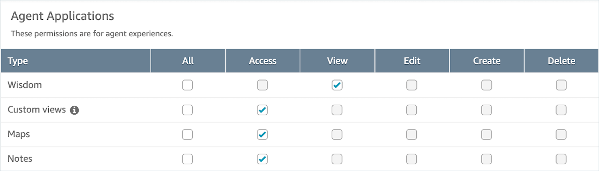

# Security profile permissions for

using third-party applications in Amazon Connect

This topic describes the security profiles permissions that are required to access
third-party applications that you have onboarded and associated. For a list of
third-party application permissions and their API name, see [List of security profile permissions in
Amazon Connect](security-profile-list.md "security-profile-list.md").

## Third-party

application permissions

###### Note

After associating an application to an instance, you may have to wait up
to 10 minutes to see the application appear the **Agent
Applications** section of the **Security
profiles** page.

Any applications that you have onboarded to AWS and associated
with your Amazon Connect instance appear in the **Agent
Applications** section of the **Security
profiles** page, as in the following image.

You also need to give access to the CCP in order for the app launcher menu to
appear.

After you assign permissions, review how to [Access third-party applications in the
Amazon Connect agent workspace](3p-apps-agent-workspace.md "3p-apps-agent-workspace.md").
