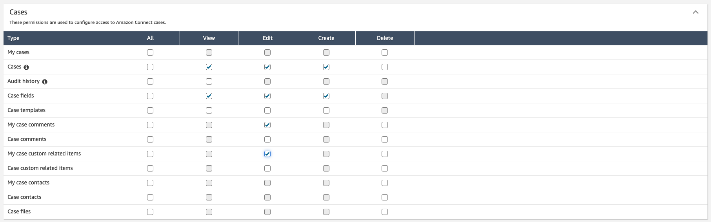
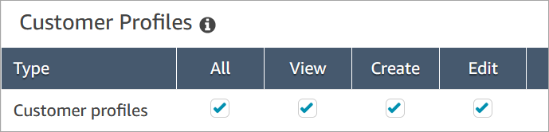
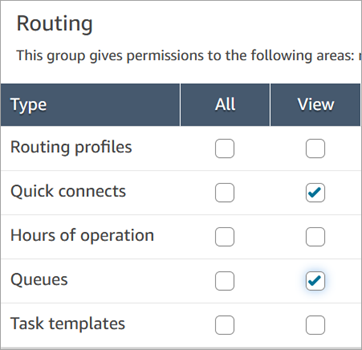
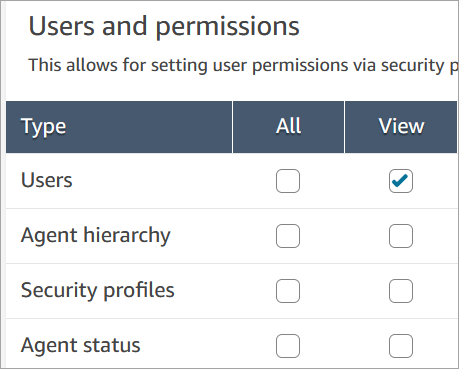
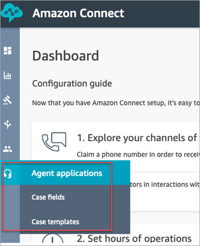
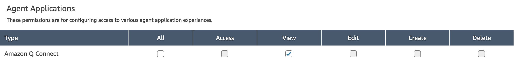

# Security profile permissions for Amazon Connect

Cases

This topic describes the security profiles permissions that are required to access and
use Amazon Connect Cases. For a list of Cases permissions and their API name, see [List of security profile permissions in
Amazon Connect](security-profile-list.md "security-profile-list.md").

## Required Cases permissions

The following image shows the security permissions used to manage access to [Amazon Connect Cases](cases.md "cases.md") functionality:

## Required Customer Profiles permissions

To use Amazon Connect Cases, your users also need permissions to Customer Profiles permissions, as
shown in the following image.

## Required queue, quick connect,

and user view permissions

To be able to assign case ownership to users or queues, agents need permissions to
view queues, quick connects, and users. To be able to view the author name on
comments, agents need permission to view users. These permissions are shown in the
following two images.

## Description of Cases

permissions

- **Audit History**: Manage who can access the audit
  history of cases in the agent application.
  - **View Audit History**: Allows the user to view
    the audit history of cases in the agent application.

- **Cases**: Manage who can access cases by using the agent
  application.
  - **View case**: Allows the user to view and search
    cases in the agent application. This includes viewing case data (for
    example, status, title, summary), contact history (for example,
    calls, chats, tasks with information such as start time, end time,
    duration, etc.), and comments.
  - **Edit case**: Allows the user to edit cases,
    which includes editing case data (for example, update case status),
    add comments, and associate contacts to cases.
  - **Create case**: Allows the user to create new
    cases, and associate contacts to cases.

- **Case Fields**: Manage who can configure case fields by
  using the Amazon Connect admin website.
  - **View Case Fields**: Allows users to view the
    case fields page and all of the existing case fields (could be
    system or custom).
  - **Edit Case Fields**: Allows users to edit any of
    the case fields (for example, change title, description,
    single-select options).
  - **Create Case Fields**: Allows users to create
    new case fields.

- **Case Templates**: Manage who can configure case
  templates by using the Amazon Connect admin website.
  - **View Case Fields**: Allows users to view the
    case fields page and all of the existing case fields (could be
    system or custom).
  - **Edit Case Fields**: Allows users to edit any of
    the case fields (for example, change title, description,
    single-select options).
  - **Create Case Fields**: Allows users to create
    new case fields.

When users have permissions to **View Case Fields** and
**View Case Templates**, they will see the **Case
fields** and **Case templates** options in their left
navigation menu, as shown in the following image:

## Required Agent Application permissions

To be able to generate a summary for a case in the agent application, agents need permission to view AI agents in the agent application, as shown in the following image.

