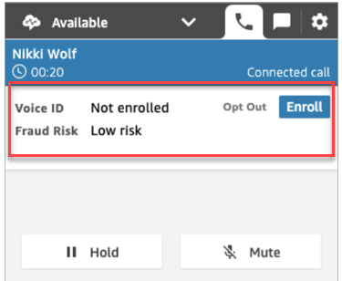

# Security profile permissions for Amazon Connect

Voice ID

###### Note

End of support notice: On May 20, 2026, AWS will end support for Amazon Connect
Voice ID. After May 20, 2026, you will no longer be able to access Voice ID on the
Amazon Connect console, access Voice ID features on the Amazon Connect admin website or Contact Control Panel, or access Voice ID
resources. For more information, visit [Amazon Connect
Voice ID end of support](amazonconnect-voiceid-end-of-support.md "amazonconnect-voiceid-end-of-support.md").

- To enable users to search for contacts by their Voice ID status, assign the
  following **Analytics and Optimization** permission to their
  security profile:
  - **Voice ID - attributes and search**: Enables users
    to search for and view Voice ID results on the **Contact
    detail** page.

- To grant agents access to Voice ID in the Contact Control Panel, assign the
  following permission in the **Contact Control Panel**
  group:

      + **Voice ID - Access**: Enables controls in the
       Contact Control Panel so agents can:

      	- View authentication outcomes.
      	- Opt-out or re-authenticate a caller.
      	- Update `SpeakerID`.
      	- View fraud detection results, rerun fraud analysis (fraud
      	 detection decision, fraud type and score).
      ###### Note

      The functionality to enter or update the `SpeakerID` is
       not available with the default Voice ID widget in the CCP. To
       include the option for updating the `SpeakerID`,
       implement the `updateVoiceIdSpeakerId`
      [Amazon Connect
       Streams](https://github.com/aws/amazon-connect-streams "https://github.com/aws/amazon-connect-streams") API in your custom CCP.

  The following image shows an example of these controls on the CCP:

For information about how to add more permissions to an existing security profile,
see [Update security profiles in Amazon Connect](update-security-profiles.md "update-security-profiles.md").

By default, the **Admin** security profile already has permissions to
perform all Voice ID activities.
