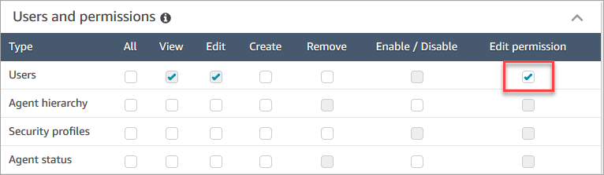

# Assign a security profile for Amazon Connect to a

contact center user

## Required permissions

to assign security profiles

Before you can assign a security profile to a user, you must be logged in with an
Amazon Connect account that has the **Users - Edit** permission, as shown in
the following image. Or, if you're creating the user's account for the first time,
you need **Users - Create** permission.

By default, the Amazon Connect **Admin** security profile has these
permissions.

## How to assign security

profiles

1. Review [Best practices for Amazon Connect and Contact
   Control Panel (CCP) security profiles](security-profile-best-practices.md "security-profile-best-practices.md").
2. Log in to the Amazon Connect admin website at https://`instance name`.my.connect.aws/.
3. Choose **Users**, **User
   management**.
4. Select one or more users and choose **Edit**.
5. For **Security Profiles**, add or remove security
   profiles as needed. To add a security profile, put your cursor in the field
   and select the security profile from the list. To remove a security profile,
   click the **x** next to its name.
6. Choose **Save**.
