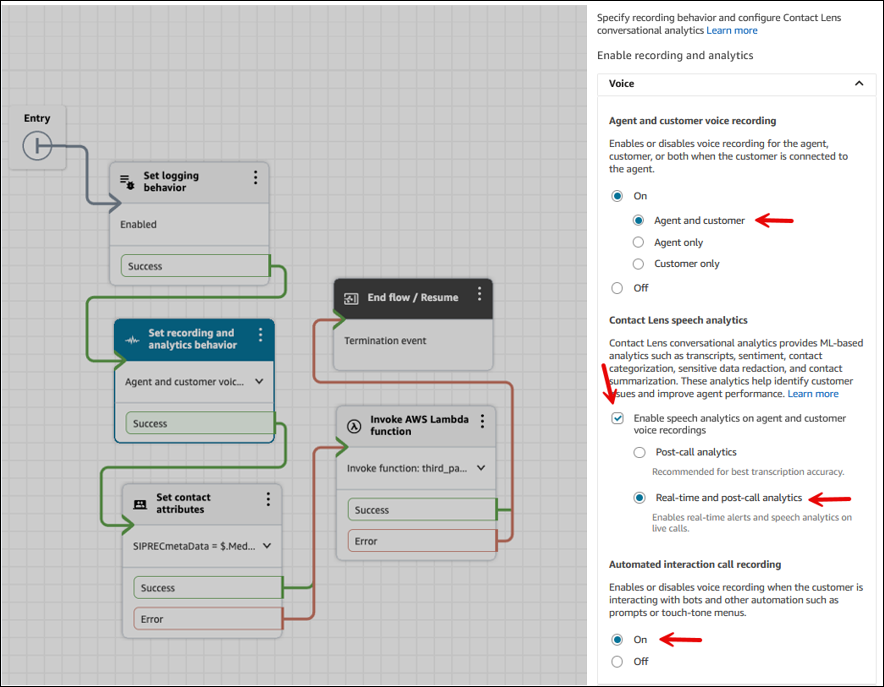
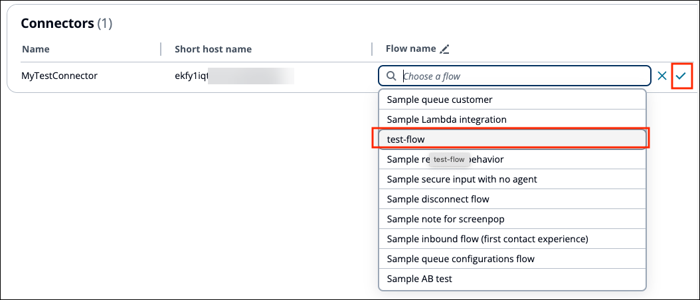

# Associate a Contact Lens

connector with a flow

After you have [configured](configure-external-voice-system.md "configure-external-voice-system.md")
your external SBC to point to the Contact Lens integration connector host,
you need to configure how the audio will be processed when it reaches
Amazon Connect Contact Lens. To do this, you define the audio processing steps in an
Amazon Connect flow. It specifies what steps the call audio will go through, including
invoking Contact Lens conversational analytics.

Complete the following steps to create a flow that enables Contact Lens,
and then associate the flow with the Contact Lens connector. This flow will
be invoked when the Contact Lens connector receives call audio.

1. In the Amazon Connect admin website, create a flow that uses the [Set recording and analytics
   behavior](set-recording-behavior.md "set-recording-behavior.md"). Configure the block to
   enable **Agent and customer voice recording**,
   **Contact Lens speech analytics**, and
   **Automated interaction call recording**. End the flow
   with the [End flow / Resume](end-flow-resume.md "end-flow-resume.md") block. This configuration is
   shown in the following image.

For a list of blocks you can use in a Contact Lens integration, see
[Supported flow blocks
for Contact Lens integration](contactlens-integration-supportedflowblocks.md "contactlens-integration-supportedflowblocks.md").

For detailed instructions, see [Enable conversational
analytics](enable-analytics.md "enable-analytics.md"). 2. On the navigation menu, choose **Channels**,
**Contact Lens connectors**. Choose the
Contact Lens integration connector that you want to associate
with the flow. In the **Flow name** field, start typing the
name of your flow to display a list, and then choose the flow.

