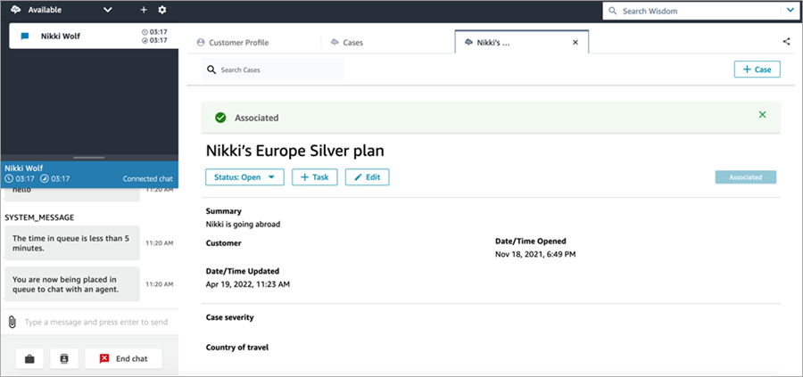
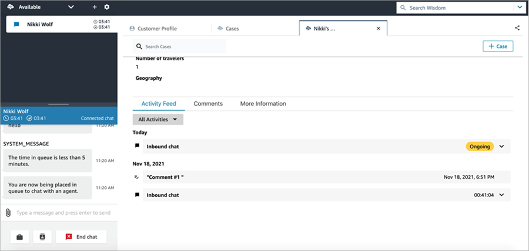

# Associate a contact with a case in Connect Customer

You can associate the contact to an existing case, such that the contact will
appear on the activity feed of the case with indicator
**Ongoing**.

