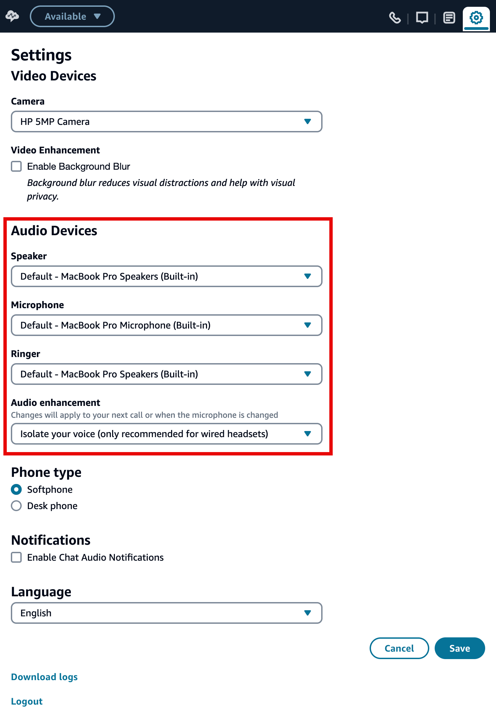

# Change your audio device settings in the CCP or

agent workspace

When you're using the CCP or agent workspace, you can choose your preferred device for
the audio, microphone, and ringer. This allows you to have audio notifications to ring
from a desktop/laptop speaker instead of a headset, for example.

###### Important

Your speaker, ringer, and microphone settings are saved in your browser storage, not in Amazon Connect.

- If your browser cache is cleared when you log off, these settings
  are also cleared.
- If you move to a different computer or browser, you will need to change
  these settings there, too.

## Change audio device settings in the

CCP

1. In the CCP or agent workspace, choose **Settings**. The
   **Settings** dialog box appears, similar to the
   following image.

 2. Under **Audio devices**, use the dropdown to select your
**Speaker**, **Microphone**,
**Ringer**, and **Audio
Enhancement**. For more information about Audio Enhancement,
see [Enable Audio
Enhancement for agents in Amazon Connect](audio-enhancement.md "audio-enhancement.md").

## Prerequisite: Allow your browser to access

your microphone

Before you can change your audio device settings in the CCP, you need to make sure
you've given your browser permission to access your microphone. This populates the
device list in the CCP.

If you haven't done this yet, see the instructions for your browser.

- [Chrome](https://support.google.com/chrome/answer/2693767 "https://support.google.com/chrome/answer/2693767")
- [Edge](https://support.microsoft.com/en-us/windows/windows-camera-microphone-and-privacy-a83257bc-e990-d54a-d212-b5e41beba857 "https://support.microsoft.com/en-us/windows/windows-camera-microphone-and-privacy-a83257bc-e990-d54a-d212-b5e41beba857")
- [Firefox](https://support.mozilla.org/en-US/kb/how-manage-your-camera-and-microphone-permissions#w_change-microphone-permissions "https://support.mozilla.org/en-US/kb/how-manage-your-camera-and-microphone-permissions#w_change-microphone-permissions")

## What to check when your audio device isn't working

as expected

Following are the top tips for resolving issues with audio devices.

- Check that your headset is properly connected to your desktop.
- Ensure that Windows exclusive mode is not enabled. For instructions that
  are appropriate for your device, search the internet for turning off Windows
  exclusive mode for your audio device.
- Ensure that the device is not muted or disabled in your operating system
  settings. Following are instructions for a Windows computer:
  1.  Press **Windows** + **I** to
      open **Settings**.
  2.  Click **System**, and then click
      **Sound** on the left navigation pane.
  3.  Scroll down the page and click **Microphone privacy
      settings**.
  4.  Under **Allow apps to access your microphone**,
      set the toggle to **On**.

## Info for IT admins and

Developers

- **IT admins**: Agents need **Contact
  Control Panel (CCP) - Audio device settings** permissions in
  their security profile to access this feature.
- **Developers**: If you are embedding the CCP
  into a CRM or custom desktop, you can use either the **Audio device
  settings** security profile permission or [Amazon Connect
  Streams](https://github.com/aws/amazon-connect-streams "https://github.com/aws/amazon-connect-streams") to pass the `enableAudioDeviceSettings`
  parameter to enable audio device settings upon initialization. If either of
  those flags is true, the audio device settings user interface is displayed
  in **Settings** on the CCP.

For granular permission, we recommend using the security profile
permission. The Streams flag is supported for backward compatibility.
