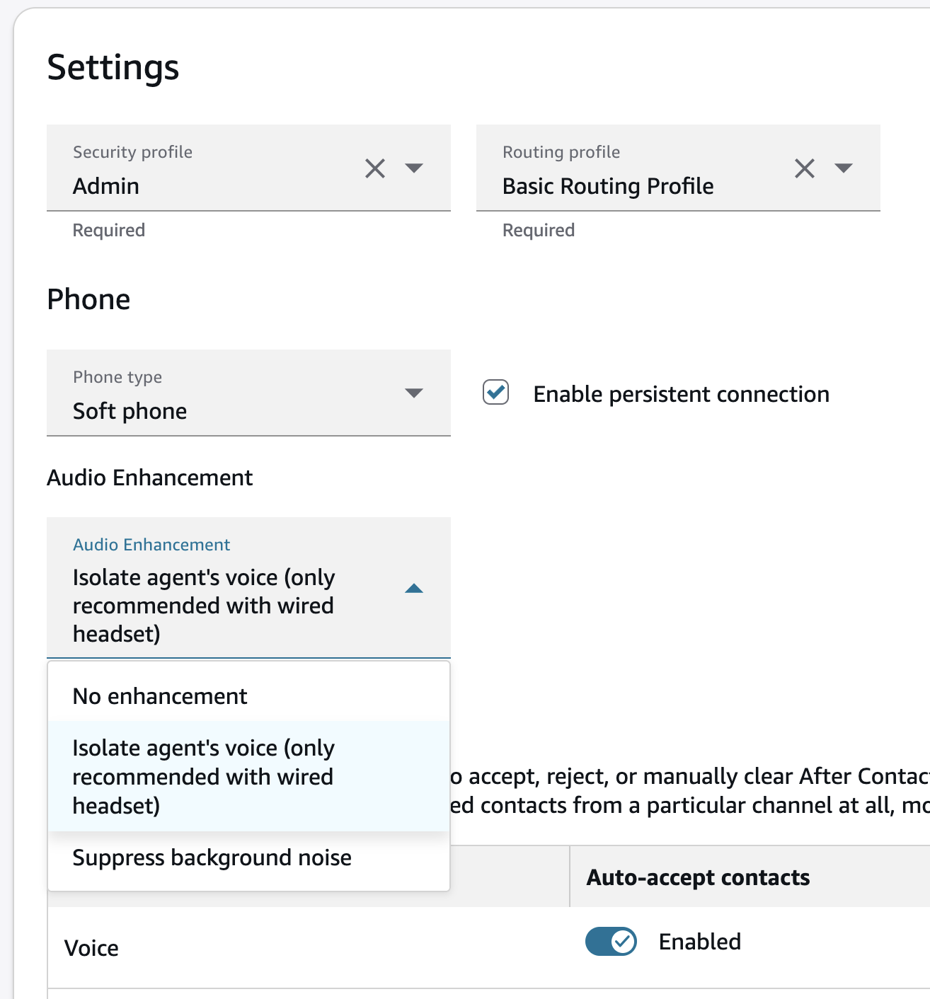
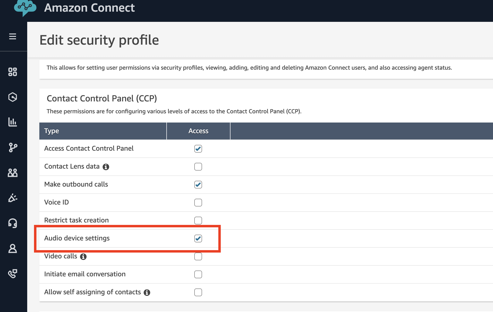
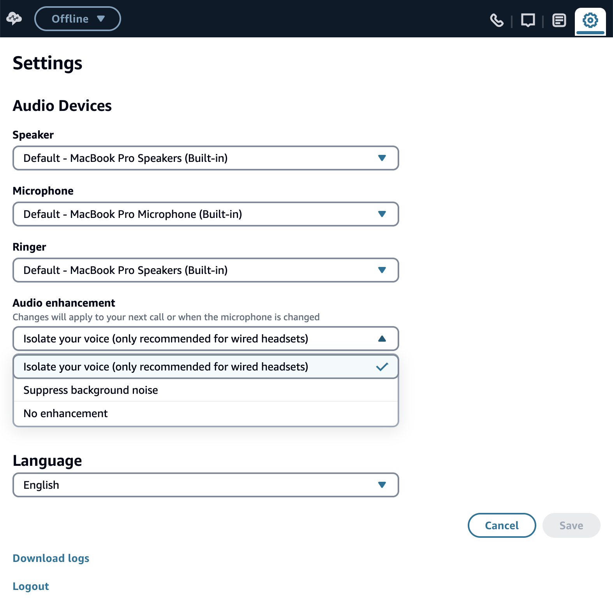

# Enable Audio Enhancement for agents in Amazon Connect

Audio Enhancement improves audio quality and reliability on the agent's side by reducing
background noise and isolating the agent's voice during calls. This feature includes
two enhancement modes: noise suppression and voice isolation.

## How Audio Enhancement works

Audio Enhancement processes audio in real-time and improves the audio quality
perceived by the end-customer in one of two modes:

- **Noise suppression** - Reduces background
  noise from the agent's environment.
- **Voice isolation** - Reduces background
  noise and isolates the agent's voice when multiple people are speaking
  in the contact center environment.

The feature automatically applies to incoming and outgoing calls once enabled
for an agent.

## Prerequisites

Before enabling Audio Enhancement, ensure the agent environment meets these
requirements:

- **CPU** - Minimum 4-core CPU or 4 vCPU
  for virtual machines
- **Memory** - Follow CCP hardware
  recommendations (see [Agent headset and workstation requirements for using
  the Contact Control Panel (CCP)](ccp-agent-hardware.md "ccp-agent-hardware.md"))
- **Phone type** - Softphone users only
- **Infrastructure** - Native, embedded,
  custom, and [VDI
  client with local browser access](scenario-deployment-approaches.md#vdi-with-browser "scenario-deployment-approaches.md#vdi-with-browser") are supported; [VDI
  with Amazon Connect audio optimization](scenario-deployment-approaches.md#vdi-citrix "scenario-deployment-approaches.md#vdi-citrix") is not supported

## Enable Audio Enhancement for agents

Audio Enhancement is disabled by default. Administrators must enable it for
specific agents through user management settings.

###### To enable Audio Enhancement

1. In the Amazon Connect admin website, choose **Users** and then choose
   **User management**.
2. Review the **Audio Enhancement** column to see current
   settings for each agent.
3. Select one or more agents, then choose **Edit**.
4. Make sure to set **Phone type** to **Soft phone**.
5. In the user edit panel, expand the **Audio Enhancement**
   dropdown and select your preferred mode:
   - **Isolate Agent's Voice** - Suppresses
     background noise and isolates the agent's voice. This mode should
     only be enabled if the agent uses a wired headset.
   - **Suppress Background Noise** -
     Suppresses background noise. We recommend using this mode if the
     agent is not using a wired headset.
   - **No enhancement** - Disables Audio
     Enhancement capability. This is the default setting.

###### Important

Voice isolation should only be used with a wired headset.

 6. Choose **Save**.

###### Important

Changes to Audio Enhancement settings take effect on the agent's next call.
Current ongoing calls are not affected.

## Allow agents to control their Audio Enhancement settings

To let agents adjust their own Audio Enhancement settings during work sessions,
you must enable the appropriate security profile permission.

###### To allow agents to control Audio Enhancement

1. In the Amazon Connect admin website, choose **Users**,
   **Security profiles**.
2. Select the security profile assigned to your agents.
3. Expand **Contact Control Panel (CCP)** permissions.
4. Select **Audio device settings**.

 5. Choose **Save**.

After enabling this permission, agents will see Audio Enhancement controls in
their CCP.



###### Important notes about agent control

- If you don't want your agents to adjust the Audio Enhancement settings,
  do not enable the **Audio device settings** security
  profile permission for those agents.
- Audio Enhancement changes take effect on the agent's next call, not
  during ongoing calls. However, changing the microphone device immediately
  applies the latest configured settings, even during active calls.
- The system doesn't automatically adjust settings when agents change
  headsets - agents must manually update their Audio Enhancement mode.
- When both administrators and agents can control Audio Enhancement,
  the most recent change takes effect.

## Set up Audio Enhancement mode through Amazon Connect APIs

If you are using the Amazon Connect APIs, you can set the Audio Enhancement mode by
including the [VoiceEnhancementConfigs](../APIReference/API_CreateUser.md#connect-CreateUser-request-VoiceEnhancementConfigs "../APIReference/API_CreateUser.md#connect-CreateUser-request-VoiceEnhancementConfigs")
parameter in the [CreateUser](../APIReference/API_CreateUser.md "../APIReference/API_CreateUser.md") or
[UpdateUserConfig](../APIReference/API_UpdateUserConfig.md "../APIReference/API_UpdateUserConfig.md")
requests.

For example, the body of the `UpdateUserConfig` request should be:

```
POST /users/InstanceId/UserId/config HTTP/1.1
Content-type: application/json
{
   ...,
   "VoiceEnhancementConfigs": [
      {
         "Channel": "VOICE",
         "VoiceEnhancementMode": "VOICE_ISOLATION"
      }
   ]
}
```

For both endpoints, the accepted values of `VoiceEnhancementMode` are
`VOICE_ISOLATION`, `NOISE_SUPPRESSION`, or `NONE`.

## Set up Audio Enhancement mode for custom CCP

If you are using a custom CCP with the Amazon Connect Streams API, you can set the Audio
Enhancement mode in either of the following ways:

- **Using agent.setVoiceEnhancementMode API**

```
agent.setVoiceEnhancementMode("VOICE_ISOLATION");
```

- **Using agent.setConfiguration API**

```
const configuration = agent.getConfiguration();
agent.setConfiguration({
  ...configuration,
  voiceEnhancementMode: "NOISE_SUPPRESSION",
});
```

- **Using the ConnectSDK** – Reference
  the [setVoiceEnhancementMode()](../../../agentworkspace/latest/devguide/3P-apps-voice-requests-setvoiceenhancementmode.md "../../../agentworkspace/latest/devguide/3P-apps-voice-requests-setvoiceenhancementmode.md")
  and [getVoiceEnhancementMode()](../../../agentworkspace/latest/devguide/3P-apps-voice-requests-getvoiceenhancementmode.md "../../../agentworkspace/latest/devguide/3P-apps-voice-requests-getvoiceenhancementmode.md")
  methods in the Voice API.

In all cases, the accepted values are `VOICE_ISOLATION`,
`NOISE_SUPPRESSION`, or `NONE`. Once the mode is set,
Amazon Connect Streams will apply the selected Audio Enhancement.

## Troubleshooting

If your customers report any audio quality issues:

1. Please make sure that Voice Isolation mode is enabled only if the agent
   is using a wired headset.
2. Confirm the agent's device meets minimum CPU requirements.
3. Check that the agent is using a supported CCP configuration.

If you require additional support, contact AWS Support and include:

- The affected contact IDs and AWS account ID
- Call recordings for affected contacts
- Confirmation of the agent's audio setup and selected enhancement mode

## Related topics

- [Agent headset and workstation requirements for using
  the Contact Control Panel (CCP)](ccp-agent-hardware.md "ccp-agent-hardware.md")
- [Security profiles for Amazon Connect and Contact Control
  Panel (CCP) access](connect-security-profiles.md "connect-security-profiles.md")
- [Provide agents with access to the
  Amazon Connect Contact Control Panel (CCP)](amazon-connect-contact-control-panel.md "amazon-connect-contact-control-panel.md")
- [Set up your contact center in Amazon Connect](amazon-connect-contact-centers.md "amazon-connect-contact-centers.md")
