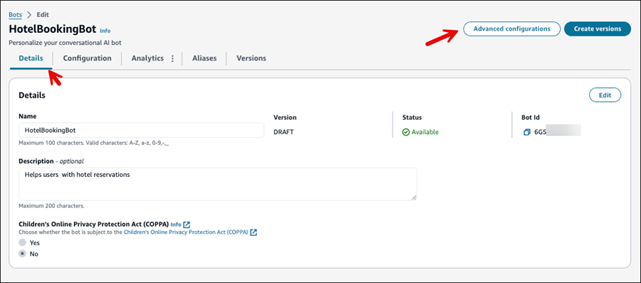
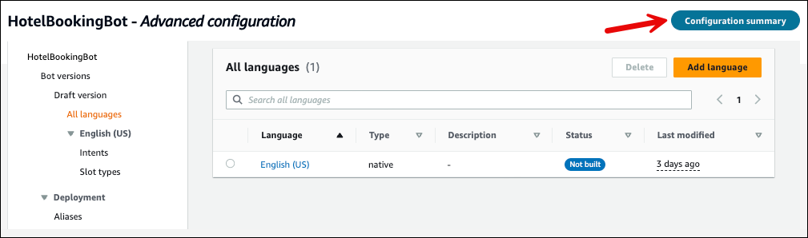

# Bot Advanced configuration support from

Amazon Connect

The advanced configuration feature enables you to make detailed customizations to your
bot without going to the Amazon Lex console.

1. On the Amazon Connect admin website, in the left navigation, choose **Flows**.
   Choose the **Bots** tab, and then choose the bot you want to
   work with.
2. Choose the **Advanced configurations** button, as shown in
   the following image.

This action will switch the view to a more detailed interface where you can
access more features to customize your bot. 3. To switch back to the simple bot user interface, choose
**Configuration summary**, as shown in the following
image.

