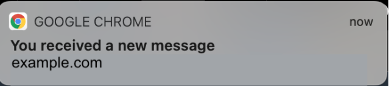

# Send browser notifications to customers

when chat messages arrive

The communications widget supports browser notifications for your customers through their
desktop devices. Specifically, your customers will receive a notification through their
web browser when they receive a new message, but are not active on the web page that
contains the chat window. When your customers click or tap this notification, they are
automatically redirected to the web page containing the chat window. Your customers can
enable or disable notifications at the start of each chat conversation.

The following image shows an example of the notification banner that customers receive
when they are not on the web page that contains the chat window. The banner tells your
customers that they have a new message, and it displays the name of the website.

Customers also receive a notification icon—a red dot—on the communications widget
when it is minimized. The following image shows an image of the notification icon that
customers receive when their chat window is minimized.

Both of these features are automatically included in the communications widget. You don't need
to perform any steps to make them available to your customers.

Your customers receive a pop-up to allow/deny notification when they initiate a chat
and have not yet allowed notifications from your website or domain. After they grant
notification permissions, they start receiving browser notifications for any message or
attachment sent by the agent when they are not on the web page with the chat window.
This behavior applies even if you've already implemented the communications widget.

## How to test

1. After you allow notifications as a test customer and the agent is
   connected to the chat, minimize your chat window and then open a new browser
   instance so you aren't on the web page that contains the chat window.
2. Send a message from the agent window.
3. As the test customer, you'll see the notification banner.
4. Choose or tap the notification banner. You'll automatically go to the web
   page that contains the chat window.
5. Because you minimized your chat window earlier, you will also see a
   notification icon—a red dot—on the communications widget.

If you can't see the browser notification, check the following:

- You're using a [supported
  browser](add-chat-to-website.md#chat-widget-supported-browsers "add-chat-to-website.md#chat-widget-supported-browsers").
- The notification permission is allowed/enabled on your browser for the web
  page with chat window.
- The agent (or you from your agent chat session) has sent a new
  message/attachment while you're on a web page that is different from the one
  that contains the chat window. For the notification icon—a red dot—on the
  widget to be visible, minimize your chat window.
- Notifications from the browser are not snoozed (temporarily
  dismissed).
