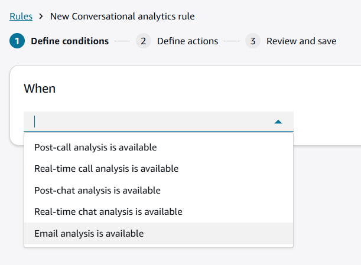
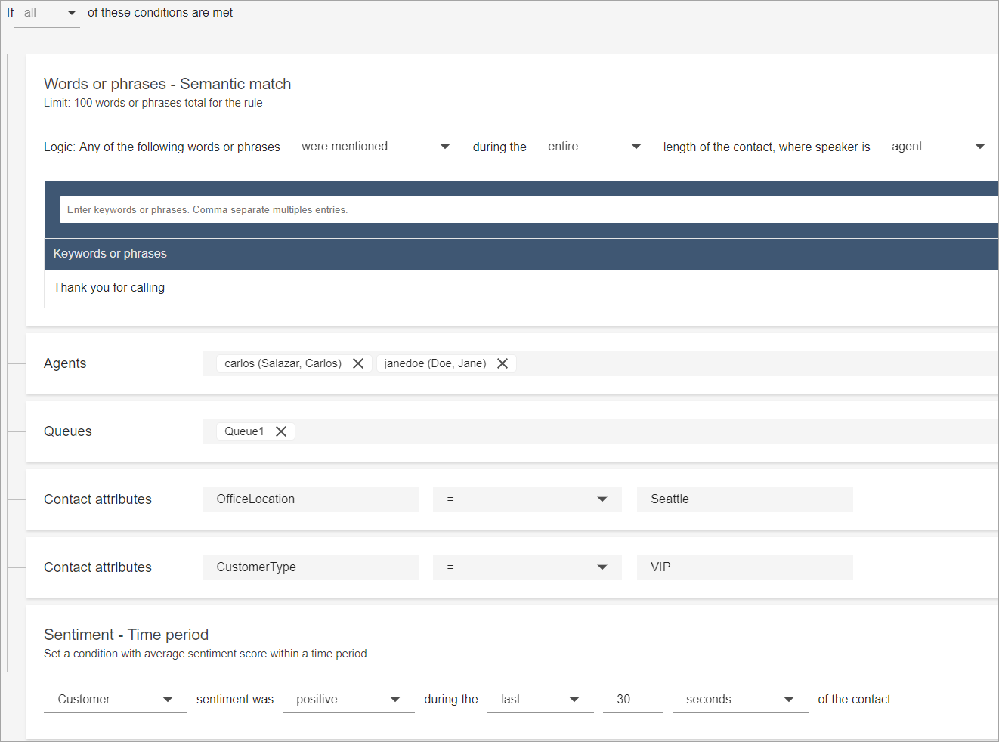
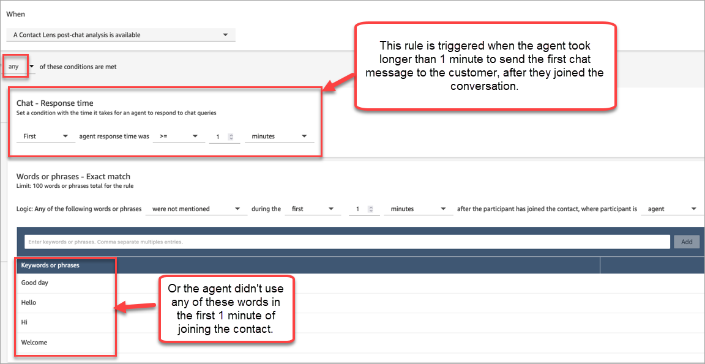

# Create Contact Lens rules

using the Amazon Connect admin website

Contact Lens rules allow you to automatically categorize contacts, receive
alerts, or generate tasks based on keywords that are used during a call or chat,
sentiment scores, customer attributes, and other criteria.

This topic explains how to create rules using the Amazon Connect admin website. To create and manage
rules programmatically, see [Rules actions](../APIReference/rules-api.md "../APIReference/rules-api.md") and the
[Amazon Connect Rules
Function language](../APIReference/connect-rules-language.md "../APIReference/connect-rules-language.md") in the _Amazon Connect API Reference Guide_.

###### Tip

For a list of rules feature specifications (for example, how many rules you
can create), see [Amazon Connect Rules feature
specifications](feature-limits.md#rules-feature-specs "feature-limits.md#rules-feature-specs").

## Step 1: Define rule conditions for

conversational analytics

1. On the navigation menu, choose **Analytics and
   optimization**, **Rules**.
2. Select **Create a rule**, **Conversational
   analytics**.
3. Under **When**, use the dropdown list to choose
   **post-call analysis**, **real-time
   analysis**, or **post-chat
   analysis**.

 4. Choose **Add condition**.

You can combine criteria from a large set of conditions to build very
specific Contact Lens rules. Following are the available
conditions:

    * **Words or phrases**: Choose from [Exact
     match, Pattern match, or Semantic match](exact-match-pattern-match-semantic-match.md "exact-match-pattern-match-semantic-match.md") to trigger an
     alert or task when keywords are uttered.
    * **Natural Language - Semantic Match**:
     Provide a natural language statement (e.g., customer called to
     cancel their account) to match with conversation transcripts
     using generative AI, and take an action (for example, triggering
     a task, performing an evaluation, etc.) For more information,
     see [Generative
     AI-powered semantic match](natural-language-semantic-match.md "natural-language-semantic-match.md")
    * **After contact work (ACW)**: Build rules to measure agent efficiency in completing after contact work.
    * **Agent hierarchy**: Build rules that run on a specific agent hierarchy. Agent hierarchies may represent geographical locations, departments, products, or teams.

    To see list of agent hierarchies so you can add them to rules, you need the **Agent hierarchy - View** permission in your security profile.
    * **Agent**: Build rules that run on a subset
     of agents. For example, create a rule to ensure newly hired
     agents comply with company standards.

    To see agent names so you can add them to rules, you need
     **Users - View** permissions in your
     security profile.
    * **AI agent**: Identify contacts where a particular Connect AI agent performed self-service or agent assistance. You can select multiple AI agents, or select a specific version of an agent.

    To see AI agent names so you can add them to rules, you need **AI agents - View** permissions in your security profile.
    * **AI agent - Escalation**: Identify contacts when a Connect AI agent used for customer self-service escalated to a human.

    To see AI agent names so you can add them to rules, you need **AI agents - View** permissions in your security profile.
    * **Agent interaction duration**: Build rules
     to identify contacts that had an agent interaction longer or
     shorter than what was expected. This feature applies to calls
     only.
    * **Contact segment attributes**: You can identify contacts within rules using custom contact segment attributes with values populated from other systems or using custom logic. You can [define an attribute](predefined-attributes.md#predefined-attributes-create-web-admin "predefined-attributes.md#predefined-attributes-create-web-admin") and set its value in flows. Custom segment attributes are only present on that specific contact ID, and not the entire contact chain. For example, you can build a rule that identifies that contact was pre-authenticated in IVR, before being connected with the agent.

    To see the list of contact segment attributes to add to a rule, you need **Predefined attributes - View** permissions.
    * **Disconnect reason**: Build rules that check for why a contact disconnected. For example, if the agent disconnected prior to the customer, or if the contact was transferred.
    * **Highest loudness score**: Build rules that check for the peak loudness score (in decibels) during the conversation for the agent or the customer. Higher loudness (for example, over 70Db) may be associated with excitement or anger, while speech below a certain loudness score (for example, 30Db or lower) might be hard to understand.
    * **Hold time**: Build rules to identify contacts that had unusual hold times to identify opportunities to handle contacts more efficiently. You can set rules using longest hold time, total hold time, and number of holds. You can also check for hold time as a percentage of the total time the customer was connected with the agent (customer hold time divided by agent interaction duration and customer hold time).
    * **Initiation method**: Build rules that check whether a contact was inbound, outbound, transferred, etc.
    * **Contact attributes**: Build rules that run
     on the values of custom [contact
     attributes](what-is-a-contact-attribute.md "what-is-a-contact-attribute.md"). For example, you can build rules
     specifically for a particular line of business or for specific
     customers, such as based on their membership level, their
     current country of residence, or if they have an outstanding
     order.

    You can add up to five contact attributes to a rule.
    * **Sentiment - Time period**: Build rules that
     run on the sentiment analysis results (positive, negative, or
     neutral) over a trailing window of time.

    For example, you can build a rule for when customer sentiment
     has remained negative for a set period of time. If the
     participant joined the contact later, the time period set here
     applies to when participant was present.

    When rules are applied to contacts that don't have sentiment
     data, neutral sentiment is used.
    * **Sentiment - Entire contact**: Build rules
     that run on the value of sentiment scores over an entire
     contact. For example, you can build a rule when customer
     sentiment has remained low for the entire contact, you can
     create a task for a customer experience analyst to review the
     call transcript and follow-up.

    When rules are applied to contacts that don't have sentiment
     data, neutral sentiment is used.
    * **Interruptions**: Build rules that detect when the agent has interrupted the customer for more than X times. This feature applies to calls only.
    * **Non-talk time**: Build rules that check for no speech detected. This may include periods of a customer being put on hold. You can check for total non-talk time, longest non-talk time period within a conversation, or percentage of non-talk time during the conversation. High non-talk time, such as a percentage of non-talk time exceeding 50 percent of the conversation, may indicate an opportunity to improve processes or agent coaching opportunities. This feature applies to calls only.
    * **Response time**: Build rules to identify
     contacts where the participant had a response time longer or
     shorter than what was expected: Average or Maximum.

    For example, you can set a rule on the **Agent
     greeting time**, also known as **First
     response time**: after the agent joined the chat,
     how long until they sent the first greeting message. This will
     help you to identify when an agent took too long to engage with
     the customer.
    * **Potential disconnect issue**: Build rules that check for any technical issues (such as network connectivity, device problems). You can use this to exclude contacts from automated agent performance evaluations, where there were connectivity issues out of the agent’s control.
    * **Queues**: Build rules that run on a subset of queues or check if the contact was not queued. Often organizations use queues to indicate a line of business, topic, or domain. For example, you could build rules specifically for your sales queues, tracking the impact of a recent marketing campaign, or, alternatively, rules for your customer support queues, tracking overall sentiment. For self-service interactions, you can check if the contact was never queued, potentially indicating successful self-service with an AI agent.

    To see queue names so you can add them to rules you need **Queues - View** permissions in your security profile.
    * **Routing profile**: Identify contacts handled by agents mapped to a specific routing profile. The routing profile may indicate agent department or skill proficiency. For example, you may perform automated evaluations of agents with the routing profile New hires, trained on basic troubleshooting using different evaluation criteria versus tenured multi-skilled agents.

    To see the routing profiles so you can add them to rules, you need **Routing Profiles - View** permissions in your security profile.
    * **Talk time**: Build rules using threshold of absolute time spent talking by the agent or the customer. This can be used to identify where the customer did not speak at all, leading the agent to disconnect or where the agent exhibited call avoidance behaviors such as not speaking after picking up the phone.
    * **Agent interaction duration**: Build rules to identify contacts that had an agent interaction longer or shorter than what was expected. This feature applies to calls only.

The following image shows a sample rule with multiple conditions for a
voice contact.

The following image shows a sample rule with multiple conditions for a
chat contact. The rule is triggered when the **First**
response time is greater than or equal to 1 minute, and the agent did
not mention any of the listed greeting words or phrases in their first
response.

**First response time** = after the agent has joined
the chat, how long until they sent the first message to the customer.

 5. Choose **Next**.

## Step 2: Define rule actions

1. Choose **Add action**. You can choose the following
   actions:
   - [Create
     Task](contact-lens-rules-create-task.md "contact-lens-rules-create-task.md"): this option is not available for real-time
     chat
   - [Send email
     notification](contact-lens-rules-email.md "contact-lens-rules-email.md")
   - [Generate
     an EventBridge event](contact-lens-rules-eventbridge-event.md "contact-lens-rules-eventbridge-event.md")

 2. Choose **Next**. 3. Review and make any edits, then choose **Save**. 4. After you add rules, they are applied to new contacts that occur after the rule was added. Rules are applied when Amazon Connect conversational analytics analyzes conversations.

You cannot apply rules to past, stored conversations.
