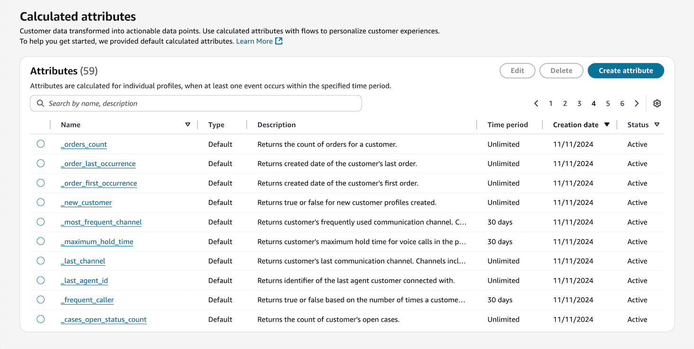
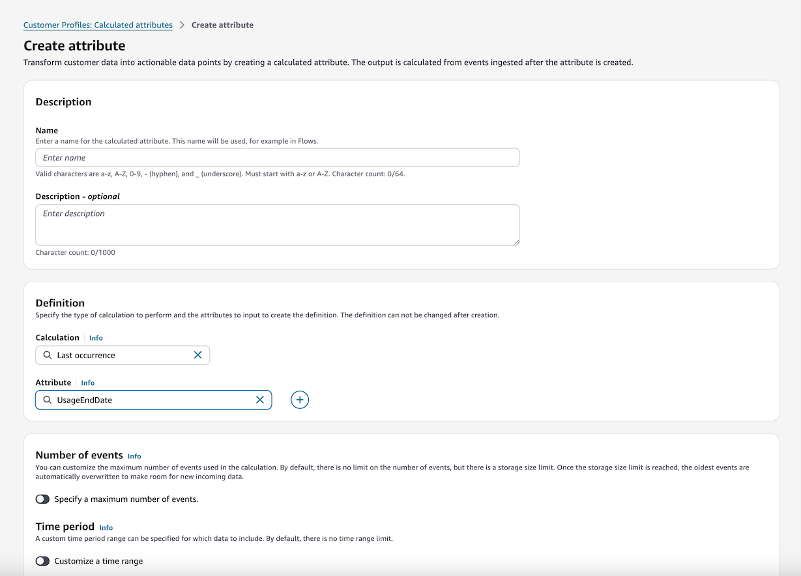
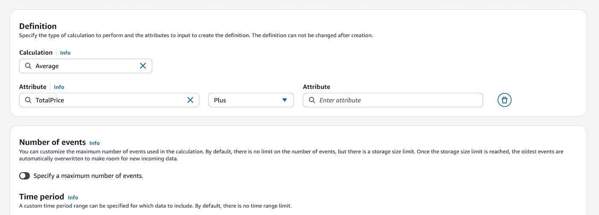
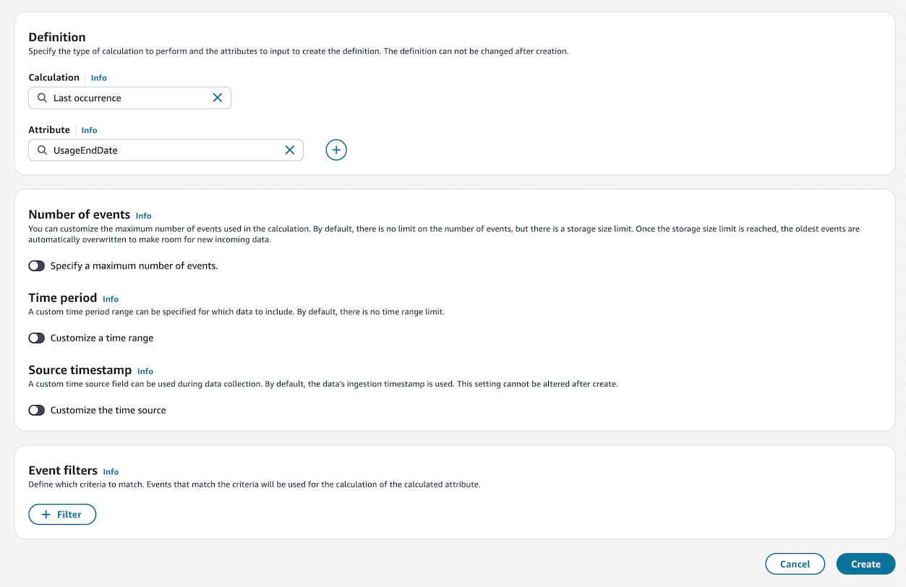
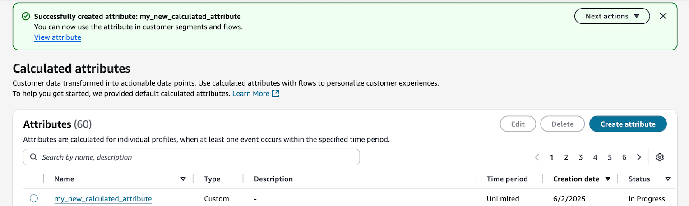

# Create calculated

attributes in Amazon Connect

1. Prerequisites: Ensure you have the necessary security profile
   permissions. For more information, see [Update permissions
   for calculated attributes in Amazon Connect Customer Profiles](security-profile-customer-profile-calc-attribs.md "security-profile-customer-profile-calc-attribs.md").
2. In Amazon Connect admin website, navigate to **Customer Profiles**,
   **Calculated attributes**, choose **Create
   attribute** in the **Calculated
   attributes** table view.

 3. To create a calculated attribute, assign a descriptive name, add
description (optional) with details about the attribute, and configure
the required fields:

    * **Calculation:** Defines how attributes are
     computed (average/count/sum/minimum/first occurrence/last
     occurrence/max occurrence).
    * **Attribute:** A data point from your
     customer profiles data.

###### Note

If you are selecting an attribute from a standard object type
(`_asset`, `_case`, `_order`),
the attributes must be in PascalCase. This means that the first
letter of each word in the attribute name is capitalized, such as
`_case.CreatedBy` or
`_order.TotalPrice`.

 4. Additionally, you can add another attribute by selecting the
_plus_ icon. You can choose up to two attributes
to calculate and combine them by an operator. Specify an operator such
as _plus_ or _minus_ to combine
the attribute values.

 5. Once the calculation is selected, you can optionally configure the
Number of events, Time period, and Source timestamp. By default,
calculated attributes is configured to use unlimited events, an
unlimited time period, and a timestamp based on ingestion date.

An output is returned when there is at least one event during the
specified time period.

    * **Number of events:** configure limit or use
     unlimited (default)
    * **Time period:** set specific timeframe or
     use unlimited (default)
    * **Source timestamp:** choose between a
     specific timestamp field or ingestion date (default)

###### Note

While there's no event limit, a data size limit exists where
oldest data will be replaced by newer data. Source timestamp cannot
be changed after creation.

 6. Optionally, you can define criteria to include only relevant events in
calculations. See [Set up event
filters](calculated-attributes-admin-website-event-filters.md "calculated-attributes-admin-website-event-filters.md")
for more information. 7. Select **Create** to create the calculated
attribute. 8. After a calculated attribute has been created successfully, a banner
is displayed on the table view for using the calculated attribute in a
segment or flow. You will also be able to view the status of calculated
attributes based on the readiness.

