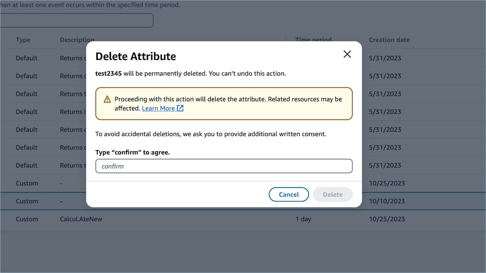

# Delete calculated

attributes in Amazon Connect

1. To delete a calculated attribute, choose an attribute in the table by
   selecting the radio button next to the attribute that you would like to
   delete.
2. Once selected, choose **Delete**.
3. In the **Delete Attribute** pop-up, verify the
   details and enter _confirm_ to enable the
   **Delete** button.

 4. Choose **Delete**.
