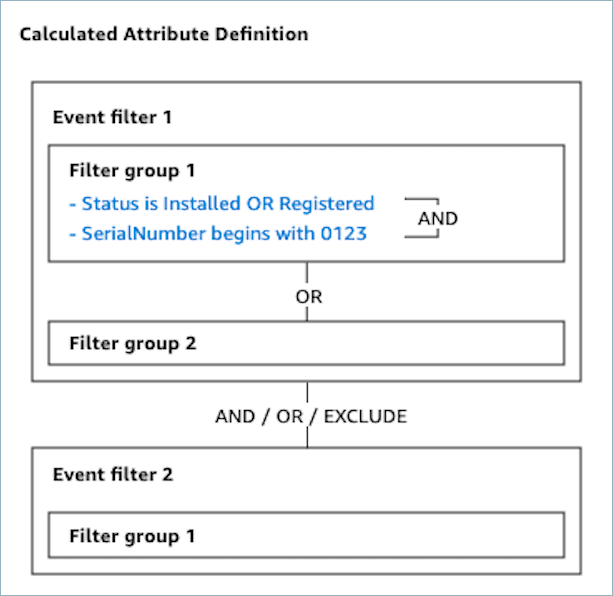

# Set up event

filters

Event filters allow you to filter the profile objects to be used in the
calculated attribute. For example, an event filter might filter the customer's
standard asset objects so that only the assets with **Status is
Installed OR Registered** are included in the calculation.

###### Note

You cannot edit event filters after creating a calculated attribute
definition.

When you create a calculated attribute, you can create one or more event
filters. An event filter consists of the following components:

- **Filter groups**: Group of filters that
  you apply to the profile objects. You can add multiple filter groups
  which are connected by OR relationships.
- **Filters**: Filters the profile objects
  that are included in the calculation of the calculated attribute by
  specifying attributes, operators, and values. You can add as many
  filters as needed for your use case.
- **Attribute**: The attribute of the object
  to filter by. You can select attributes from objects stored in the
  Customer Profiles domain or use the field names defined in the object
  type definition. for more information about object type mappings, see
  [Object type mapping
  definition details in Amazon Connect Customer Profiles](object-type-mapping-definition-details.md "object-type-mapping-definition-details.md").

###### Note

    + In Amazon Connect admin website, the attribute
     dropdown shows the timestamp of the last time any profile
     object was saved or updated with the attribute.
    + If there is both an attribute of a profile object and a
     field of an object type with the same name, the event filter
     prioritizes the object type field name in its filtering. For
     example, if a profile object has an attribute named
     **Status** and there is also an object
     type field named **Status**, the filter
     will use the object type field **Status**
     for filtering.

- **Operator** — The operator determines the
  relationship of the attribute to a value you enter. For more
  information, see [Filter operators](#calculated-attributes-admin-website-event-filter-operators "#calculated-attributes-admin-website-event-filter-operators")
- **Value** — The value to filter objects
  with. You can specify multiple values connected by OR relationships. For
  example, _Asset's Status is Installed or
  Registered_. Note that values are case-sensitive. For example,
  _Asset's Status is Installed_ returns different
  results than _Asset's Status is installed_. To view
  profile objects, use the Amazon Connect Customer Profiles [ListProfileObjects](../APIReference/API_connect-customer-profiles_ListProfileObjects.md "../APIReference/API_connect-customer-profiles_ListProfileObjects.md") API.
  You can optionally create up to two event filters and create a relationship
  (AND/OR/EXCLUDE) between them. For more details about the relationship,
  see [Relationship between event filters](#calculated-attributes-admin-website-relationship-between-event-filters "#calculated-attributes-admin-website-relationship-between-event-filters").

## Filter operators

Operators determine the relationship of the attribute to a value you
enter. The following table describes the available operators.

| **Supported type of attribute value**                                                                                                                                                                                                                                                                                                                                                                                                                                                                          | **Operator**                                                                                                                                                                                                                                                       | **Description**                                                                                                                                                            |
| ----------------------------------------------------------------------------------------------------------------------------------------------------------------------------------------------------------------------------------------------------------------------------------------------------------------------------------------------------------------------------------------------------------------------------------------------------------------------------------------------------------------- | ------------------------------------------------------------------------------------------------------------------------------------------------------------------------------------------------------------------------------------------------------------------ | -------------------------------------------------------------------------------------------------------------------------------------------------------------------------- |
| Number                                                                                                                                                                                                                                                                                                                                                                                                                                                                                                            | Greater than                                                                                                                                                                                                                                                       | Used for numeric attributes only. This operator filters results that are greater than the number passed. For example, \*Asset's Quantity • is greater than 1 . |
| Greater than or equal                                                                                                                                                                                                                                                                                                                                                                                                                                                                                             | Used for numeric attributes only. This operator filters results that are greater than or equal to the number passed. For example, \*Asset's Quantity • is greater than or equal to 1.                                                                  |
| Equals                                                                                                                                                                                                                                                                                                                                                                                                                                                                                                            | Used for numeric attributes only. This operator filters the audience by numeric value equality. For example, \*Asset's Quantity • equals 1 .                                                                                                              |
| Less than                                                                                                                                                                                                                                                                                                                                                                                                                                                                                                         | Used for numeric attributes only. This operator filters results that are less than the number passed. For example, \*Asset's Quantity • is less than 2.                                                                                                   |
| Less than or equal                                                                                                                                                                                                                                                                                                                                                                                                                                                                                                | Used for numeric attributes only. This operator filters results that are less than or equal to the number passed. For example, \*Asset's Quantity • is less than or equal to 2.                                                                        |
| String                                                                                                                                                                                                                                                                                                                                                                                                                                                                                                            | Is                                                                                                                                                                                                                                                                 | Filters the object whose attribute matches with the given string. For example, \*Ticket's Title • is Refund.                                                      |
| Is not                                                                                                                                                                                                                                                                                                                                                                                                                                                                                                            | Filters the object whose attribute does not match with a given string. For example, Ticket's title is not Refund.                                                                                                                                               |
| Contains                                                                                                                                                                                                                                                                                                                                                                                                                                                                                                          | Use this to filter the object based on a substring within a string. For example, \*Ticket's Title • contains Refund.                                                                                                                                      |
| Begins with                                                                                                                                                                                                                                                                                                                                                                                                                                                                                                       | Filters the object whose attribute begins with the given string. For example, Asset's SerialNumber begins with "1234".                                                                                                                                       |
| Ends with                                                                                                                                                                                                                                                                                                                                                                                                                                                                                                         | Filters the audience whose attribute ends with the given string. For example, \*Asset's SerialNumber • ends with "0000".                                                                                                                                  |
| Date                                                                                                                                                                                                                                                                                                                                                                                                                                                                                                              | Before                                                                                                                                                                                                                                                             | Filters the object whose attribute has a date value that is before a specific date. For example, \*Asset's UsageEndDate • is before 2024/10/01.                   |
| On                                                                                                                                                                                                                                                                                                                                                                                                                                                                                                                | Filters the object whose attribute value matches with a specific date. For example, \*Asset's UsageEndDate • is on 2024/10/01.                                                                                                                            |
| After                                                                                                                                                                                                                                                                                                                                                                                                                                                                                                             | Filters the object whose attribute has a date value that is after a specific date. For example, \*Asset's UsageEndDate • is after 2024/10/01.                                                                                                             |
| Time range is                                                                                                                                                                                                                                                                                                                                                                                                                                                                                                     | Filters the object whose attribute has a date value that is between a specific time range. You can either specify the time range in absolute time mode or relative time mode.                                                                                |
| **Absolute time mode**: allows you to specify an absolute time range. For example, between 2024/10/01 12:00 AM and 2024/10/07 12:00 AM.                                                                                                                                                                                                                                                                                                                                                                     |
| **Relative time mode**: allows you to specify the relative time range of future or past X hours, days, weeks, months, or years. • **Future time direction**: will filter audience whose attribute has a date value that is between now and a specified future time. For example, within the next 2 days. • **Past time direction**: will filter audience whose attribute has a date value that is between a specified past time and now. For example, within the last 2 days. |
| Time range is not                                                                                                                                                                                                                                                                                                                                                                                                                                                                                                 | Filters the audience whose attribute has a date value that is not between a specific time range. You can either specify the time range in absolute time mode or relative time mode. See the **Time range is** operator in this table for more details. |

###### Note

Calculated attributes in the Amazon Connect admin website use the UTC timezone and a default
time of 00:00:00 UTC for all time-based filters. You can filter on dates
but times are recorded as the same value. If you enter a date
of 2024-01-01, the console passes the time as 2024-01-01T00:00:00Z.

###### Note

By default, event filters are evaluated when a profile object is saved
or updated. For instance, if you filter standard asset objects where the
`PurchaseDate` is within the last week, the relative time
is calculated as _within the last week from the moment the
asset object is saved or updated_. This means the
filtering results may vary depending on when the object is saved or
updated.

## Relationship between event filters

Optionally, you can add the second event filter and define a relationship
with the first event filter. When you create a calculated attribute in the
Amazon Connect admin website, you can have a maximum of two event filters per calculated attribute.
If you add the second event filter to your calculated attribute, you can
choose one of two ways to specify how the two event filters are connected:

- **AND relationship** — If you use the
  AND relationship to connect two event filters, objects that meets
  both the first and second event filter, will be included in the
  calculation.
- **OR relationship** — If you use the OR
  relationship to connect two event filters, objects that meets either
  the first or second event filter, will be included in the
  calculation.
- **EXCLUDE relationship** — If you use
  the EXCLUDE relationship to connect two event filters, objects that
  meets the first event filter but does not meet the second event
  filter, will be included in the calculation.

## Next steps

- [Use your calculated attribute in your contact center via the
  Flow editor](customer-profiles-block.md#customer-profiles-block-properties-get-calculated-attributes "customer-profiles-block.md#customer-profiles-block-properties-get-calculated-attributes")
- [Use
  your calculated attribute to define a customer
  segment](segmentation-admin-website.md "segmentation-admin-website.md")
- [View Calculated Attributes in Amazon Connect](calculated-attributes-admin-website-view.md "calculated-attributes-admin-website-view.md")
- [Edit Calculated Attributes in Amazon Connect](calculated-attributes-admin-website-edit.md "calculated-attributes-admin-website-edit.md")
- [Delete Calculated Attributes in Amazon Connect](calculated-attributes-admin-website-delete.md "calculated-attributes-admin-website-delete.md")
