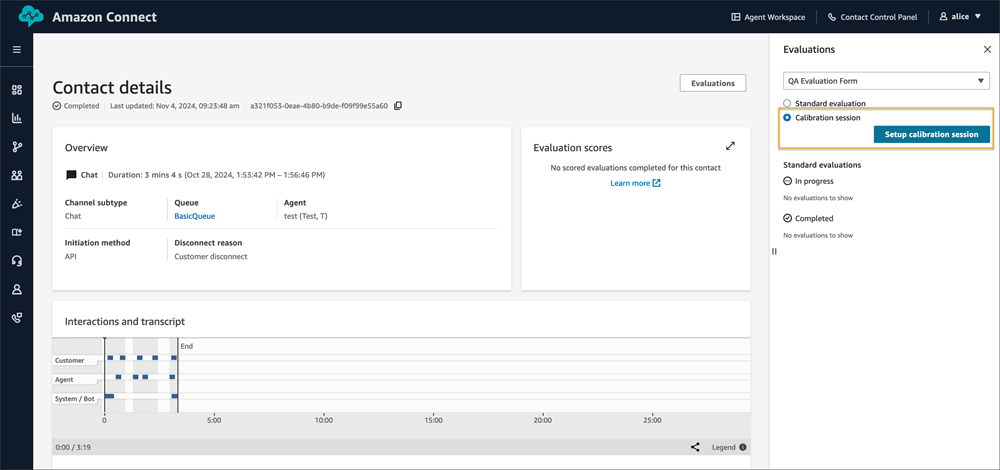
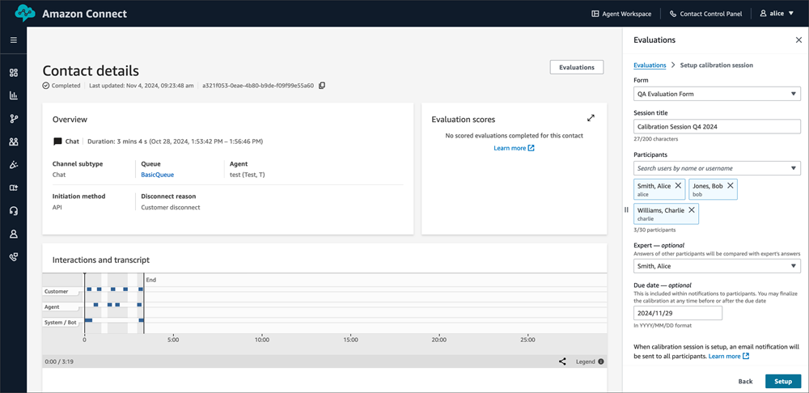
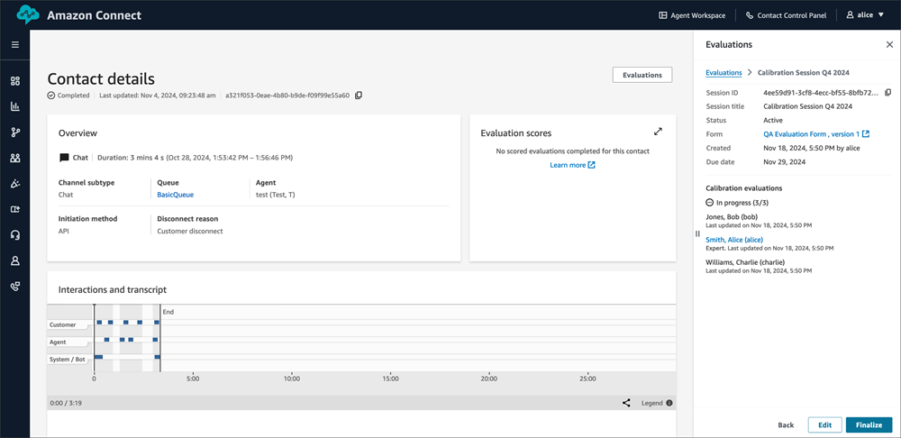
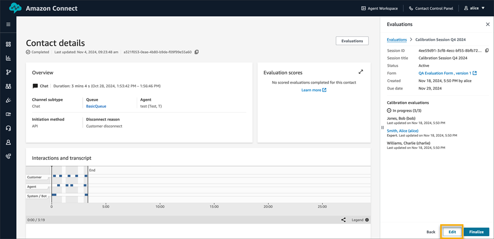
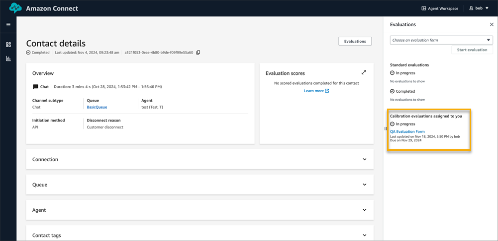
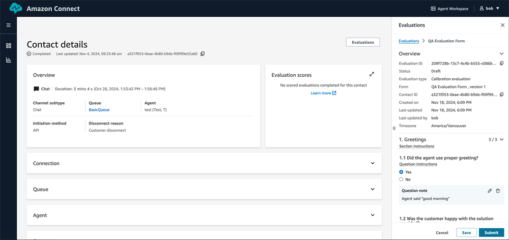
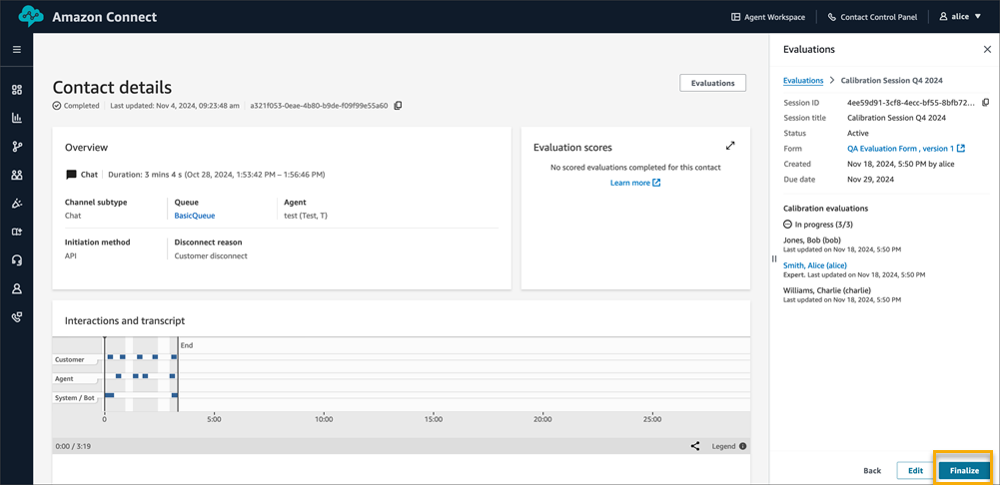

# Calibration sessions for

performance evaluations

Amazon Connect Contact Lens enables you to conduct calibration sessions to drive
consistency and accuracy in how managers evaluate agent performance, so that agents
receive feedback that is consistent. During a calibration, multiple managers can
evaluate the same contact using the same evaluation form. You can then review
differences in evaluations filled by different managers to align managers on evaluation
best practices and identify opportunities to improve the evaluation form, e.g.
rephrasing an evaluation question to be more specific, so that it is consistently
answered by managers. You can also compare manager’s answers with a designated expert,
to measure and improve manager accuracy on evaluating agent performance. The expert is
usually the quality manager who is conducting the calibration session.

## Permissions

needed for calibrations

You need the following permissions for calibrations:

- **Creating calibration sessions:** Add the
  permission **Evaluation forms - manage calibration
  sessions** to the security profiles of the set of users that
  should be permitted to conduct calibration sessions for performance
  evaluations.
- **Participating in a calibration session:**
  Any user who has the permission to perform evaluations, namely **Evaluation forms - perform evaluations**, can
  participate in a calibration session if they are added as one of the
  participants.

In addition, for both sets of users, you also need permissions to search and view
contacts. For more information, see [Manage who can search for
contacts and access detailed information](contact-search.md#required-permissions-search-contacts "contact-search.md#required-permissions-search-contacts").

## Create a calibration

session

###### To create a calibration session

1. Login to Amazon Connect with a user account that has the necessary permissions
   within their security profile.
2. On the left nav, go to **Analytics and optimization, Contact
   search**.
3. Search for a contact that you wish to perform calibrations on, for
   example, minimum interaction duration, specific queue, etc.
4. On the **Contact details** page of a contact, choose
   **Evaluations** on the top right to open the
   **Evaluations** side panel.
5. In the side panel, select the **Calibration session**
   radio button, choose the desired form for the calibration using the dropdown
   menu, and then choose the **Setup calibration session**
   button.

 6. Enter a title for the calibration session, select the participants, and
optionally designate an expert participant and set a due date.

 7. After creation, the calibration session will appear in the side panel. An
evaluation will be automatically generated for each participant.

## Edit a calibration

session

###### To edit a calibration session

1. On the side panel locate the calibration sessions and choose
   **Edit**.

 2. In the form that opens in the side panel you can modify the calibration
session title, add or remove participants, optionally designate an expert
participant, and set or adjust the due date. 3. Choose **Save** to update the calibration session. The
changes will be reflected in the side panel. New participants will
automatically receive an evaluation, while removed participants will have
their evaluations deleted.

## Perform evaluations as a part of

a calibration session

Use the following procedure to perform evaluations as a part of a calibration
session:

###### To perform evaluations

1. On the side panel locate the **Calibration evaluations assigned to
   you** section to view your calibration evaluations.

 2. Choose an evaluation to open it. You can respond to these evaluations in
the same manner as standard evaluations, with options to save your progress
or submit the completed evaluation. Note that automation is disabled on
calibration sessions.

 3. Calibration managers can access a list of all evaluations associated with
a specific calibration session by viewing the calibration session details in
the side panel. Calibration managers will also be able to view evaluations
submitted by participants.

## Finalize a calibration

###### To finalize a calibration

1. Access the calibration session details view and choose
   **Finalize**.

 2. Confirm the finalization when prompted. Note that once finalized, neither
the session nor its evaluations can be edited. 3. Within a few seconds, a calibration report will be available for download
in .csv format. This report contains the answers of participants that have
submitted evaluations, along with the weighted scores for each question,
section and the overall form, evaluator notes and comparison of the
evaluator’s scores with the expert evaluator.

Use the field **absolute deviation from expert** (lower
is better) for each participant to determine if an evaluator is
significantly deviating from the expert while answering evaluation
questions. You can also see **average absolute deviation from
expert** (lower is better) to see if there are certain
questions that get inconsistent answers from participants and need
improvement (For example, better phrasing, more specific questions, etc.)

## Finding calibration sessions

Amazon Connect notifies users participating in calibration sessions via email (for
example, if a user is added as a participant, if there is a change to the due date,
etc.). If a user managing a calibration session has added themselves as the
**expert** participant, then they would also
receive emails. The email contains a link to the contact which is being used for
calibration. Note that in order for users to receive email notifications, you need
to assign emails to the users on Amazon Connect. For more information, see [Add users to Amazon Connect](user-management.md "user-management.md").

As a manager setting up a calibration, you can copy the contact ID to search for
the contact on which the calibration session was setup. Note that if you have not
added yourself as an expert or if user emails are not setup within Amazon Connect, you will
not receive an email containing a link to the contact on which the calibration
session was setup.
