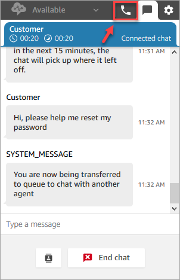
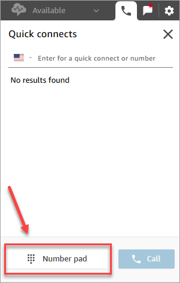
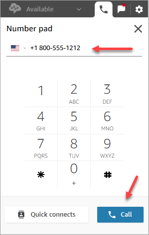
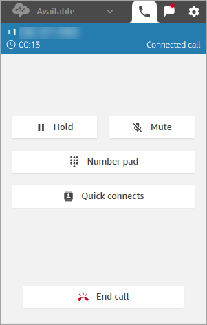

# Use the CCP in Amazon Connect to make a call while on a

chat

Let's say you're chatting with a contact and you want to consult with someone
else. While you're on a chat, you can use the updated CCP to make outbound calls
using the number pad and [phone number
quick connects](quick-connects.md#external-quick-connect-type "quick-connects.md#external-quick-connect-type").

Note the following limitation:

- You can't access agent quick connects while you're on a chat.
- Agents can receive calls while on a chat only if they are assigned to a
  routing profile that allows [cross-channel
  concurrency](routing-profiles.md "routing-profiles.md").

###### To make an external call while you're on a chat

1. In the CCP, choose the phone tab.

 2. Choose **Number pad**.

 3. Enter the external number you want to call, and then choose
**Call**.

 4. You'll be connected to the call at the same time the chat is still
ongoing, as shown in the following image.

 5. To go to the chat conversation while you're on the phone, choose the chat
tab. 6. To end the phone conversation, choose the phone tab, choose **End
call**, and then choose **Close contact**.
You're still connected to the chat conversation.

## Can't make outbound call to another

agent

If you're on a chat and having trouble making an outbound call to another
agent, it could be because that agent's routing profile is not set up to allow
them to take calls while on a chat or task contact. They need to be assigned to
a routing profile that allows [cross-channel
concurrency](routing-profiles.md "routing-profiles.md").

## Can't see phone number quick connects

in the CCP

[Agent quick connects](quick-connects.md#agent-quick-connect-type "quick-connects.md#agent-quick-connect-type") are not
visible in the CCP while you're on a chat.

If you can't see [phone number
quick connects](quick-connects.md#external-quick-connect-type "quick-connects.md#external-quick-connect-type") in your CCP, however, check that the phone number
quick connect has been added to your queue as described in [Step 2: Enable agents to
see quick connects](quick-connects.md#step2-enable-agents-to-see-quick-connects "quick-connects.md#step2-enable-agents-to-see-quick-connects").

## Enable agent quick

connects for calls during a chat

To enable agents to consult over the phone with each other while they are on
chats, your Amazon Connect administrator needs to set up a direct dial number (DID) that
routes to the agent. This configuration incurs additional costs.
