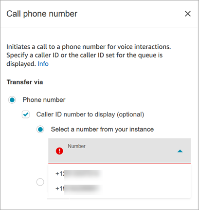
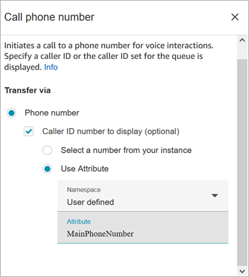
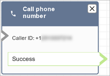

# Flow block in Amazon Connect: Call phone number

This topic defines the flow block for the call phone number used for voice
interactions with contact center customers.

## Description

- Use to place an outbound call from an **Outbound
  Whisper** flow.

## Supported channels

The following table lists how this block routes a contact who is using the
specified channel.

| Channel | Supported? |
| ------- | ---------- |
| Voice   | Yes        |
| Chat    | No         |
| Task    | No         |
| Email   | No         |

## Flow types

You can use this block in the following [flow
types](create-contact-flow.md#contact-flow-types "create-contact-flow.md#contact-flow-types"):

- Outbound Whisper flow

## Properties

The following image shows an example of what the **Call phone
number** properties page looks like when you select a phone number
manually. The **Select a number from your instance** option is
selected, and the dropdown menu displays a list of available phone numbers claimed
for your instance.

The following image shows an example of what the **Call phone
number** properties page looks like when you select a phone number
dynamically. The **Use Attribute** option is selected. The
**Namespace** box is set to **User-defined**.
The **Attribute** box is set to
**MainPhoneNumber**.

Outbound whisper flows run in Amazon Connect immediately after an agent accepts the call
during direct dial and callback scenarios. When the flow runs:

- The caller ID number is set if one is specified in the [Call phone number](call-phone-number.md "call-phone-number.md")
  block.
- If no caller ID is specified in the [Call phone number](call-phone-number.md "call-phone-number.md") block, the caller ID number
  defined for the queue is used when the call is placed.
- When there is an error with a call that is initiated by the [Call phone number](call-phone-number.md "call-phone-number.md")
  block, the call is disconnected and the agent is placed in
  **AfterContactWork** (ACW).

Only published flows can be selected as the outbound whisper flow for a
queue.

###### Note

To use a custom caller ID, you must open an Support ticket to enable this feature.
For more information, see [Set up outbound caller
ID](queues-callerid.md "queues-callerid.md").

## Configured block

The following image shows an example of what this block looks like when it is
configured. It shows the **Caller ID** phone number, and a
**Success** branch.

There is no error branch for the block. If a call is not successfully initiated,
the flow ends and the agent is placed in an **AfterContactWork**
(ACW).

## Sample flows

Amazon Connect includes a set of sample flows. For instructions that explain how to access the sample flows in the flow designer, see
[Sample flows in Amazon Connect](contact-flow-samples.md "contact-flow-samples.md"). Following are topics
that describe the sample flows which include this block.

- [Sample customer queue priority flow in
  Amazon Connect](sample-customer-queue-priority.md "sample-customer-queue-priority.md")
- [Sample queue configurations flow in
  Amazon Connect](sample-queue-configurations.md "sample-queue-configurations.md")

## Scenarios

See these topics for more information about caller ID works:

- [Set up outbound caller ID in Amazon Connect](queues-callerid.md "queues-callerid.md")
