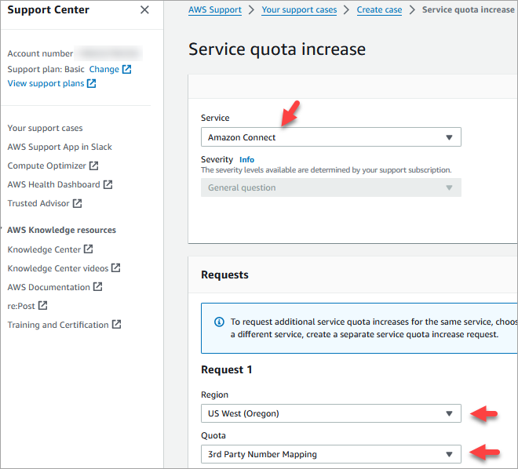
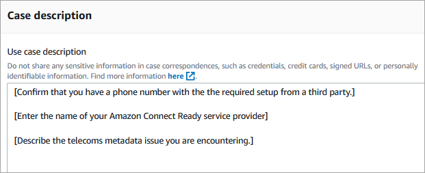

# Use caller identification

to personalize customer interaction

You can provide a personalized experience for your customers by using metadata
attributes that provide information related to call origination. For example, you can
look up a customer's contact ID, and welcome them with a personalized greeting.

###### Important

Features that are provided by Amazon Connect or third parties may rely on call data for
identifying inbound callers for personalizing customer interaction or detecting
fraud and may be subject to additional terms and conditions. Network-related call
data that is not displayed to call recipients may not be used for any purpose other
than fraud detection.

## Use telephony call metadata

attributes

The following table lists the available telephony call metadata attributes. For
information about using attributes, see [Use Amazon Connect contact attributes](connect-contact-attributes.md "connect-contact-attributes.md").

| Attribute                 | Description                                                                                                                                                                                               | Type   | JSONPath Reference                            |
| ------------------------- | --------------------------------------------------------------------------------------------------------------------------------------------------------------------------------------------------------- | ------ | --------------------------------------------- | ----------------------------------------------------------------------------------------------------------------------------------------------------------------------------------------------------------------------------------------------------------------------------------------------------------------------------------------------------------------------------------------------------------------------------------------------------------------------------------------------------------------------------------------------------------------------------------------------------------------------------------------------------------------------------------------------------------------------------------------------------------------------------------------------------------------------------------------------------------------------------------------------------------------------------------------------------------------------------------------------------------------------------------------------------------------------------------------------------------------------------------------------------------------------------------------------------------------------------------------------------------------------------------------------------------------------------------------------------------------------------------------------------------- |
| P-Charge-Info             | The party responsible for the charges associated with the call.                                                                                                                                           | System | $.Media.Sip.Headers.P-Charge-Info             |
| From                      | The identity of the end user associated with the request.                                                                                                                                                 | System | $.Media.Sip.Headers.From                      |
| To                        | Information about the called party or the recipient of the request.                                                                                                                                       | System | $.Media.Sip.Headers.To                        |
| ISUP-OLI                  | Originating Line Indicator (OLI). Shows the type of line placing call (for example, PSTN, 800 service call, wireless/cellular PCS, payphone).                                                             | System | $.Media.Sip.Headers.ISUP-OLI                  |
| JIP                       | Jurisdiction Indication Parameter (JIP). Indicates geographic location of caller/switch. Example value: 212555                                                                                            | System | $.Media.Sip.Headers.JIP                       |
| Hop-Counter               | Hop Counter. Example value: 0                                                                                                                                                                             | System | $.Media.Sip.Headers.Hop-Counter               |
| Originating-Switch        | Originating Switch. Example value: 710                                                                                                                                                                    | System | $.Media.Sip.Headers.Originating-Switch        |
| Originating-Trunk         | Originating Trunk. Example value: 0235                                                                                                                                                                    | System | $.Media.Sip.Headers.Originating-Trunk         |
| Call-Forwarding-Indicator | Call Forwarding Indicators (for example, Diversion header). Indicates domestic or international origin of call. Example value: sip:+15555555555@public-vip.us2.telphony-provider.com;reason=unconditional | System | $.Media.Sip.Headers.Call-Forwarding-Indicator |
| Calling-Party-Address     | Calling Party Address (number). NPAC dip shows true line type and native geographic switch. Example value: 15555555555;noa=4                                                                              | System | $.Media.Sip.Headers.Calling-Party-Address     |
| Called-Party-Address      | Called Party Address (number). Example value: 15555555555;noa=4                                                                                                                                           | System | $.Media.Sip.Headers.Called-Party-Address      |
| SIPREC metadata           | SIPREC metadata XML received by Amazon Contact Lens connector                                                                                                                                             | System | $.Media.Sip.SiprecMetadata                    | ## Troubleshoot issues The availability of telephony metadata is not consistent across all telephony providers and may not be available in all cases. Before opening an AWS Support case:  • If you are missing data on all calls required by a third-party Amazon Connect Ready service, check that you followed the service configuration guide provided by the third party. If you need to open a AWS Support case, provide the following information: + **Service** = **Amazon Connect** + **Quota** = **3rd-Party Number Mapping** + **Case description** box:  • State that you have confirmed you have a phone number with the required setup.  • Enter the name of your Amazon Connect Ready service provider  • Describe the telecoms metadata issue you are encountering. The following images show an example case and where you enter this information.    • If you're getting partial data on a percent of calls as part of normal service calls: Note that data is not available on all calls. Certain fields, such as ISUP-OLI, are only present based on specific routes through networks. It's not possible to guarantee data will be available for all calls. |
