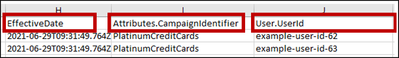
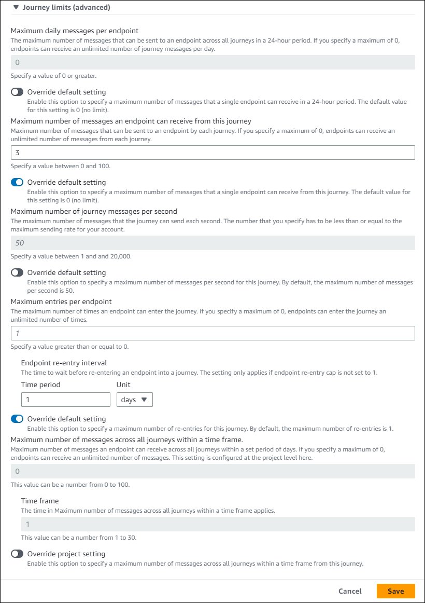
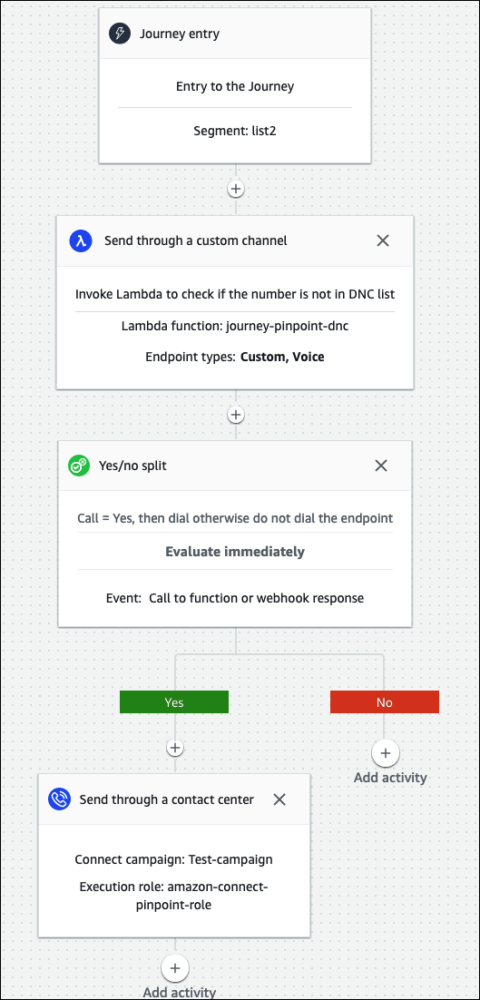
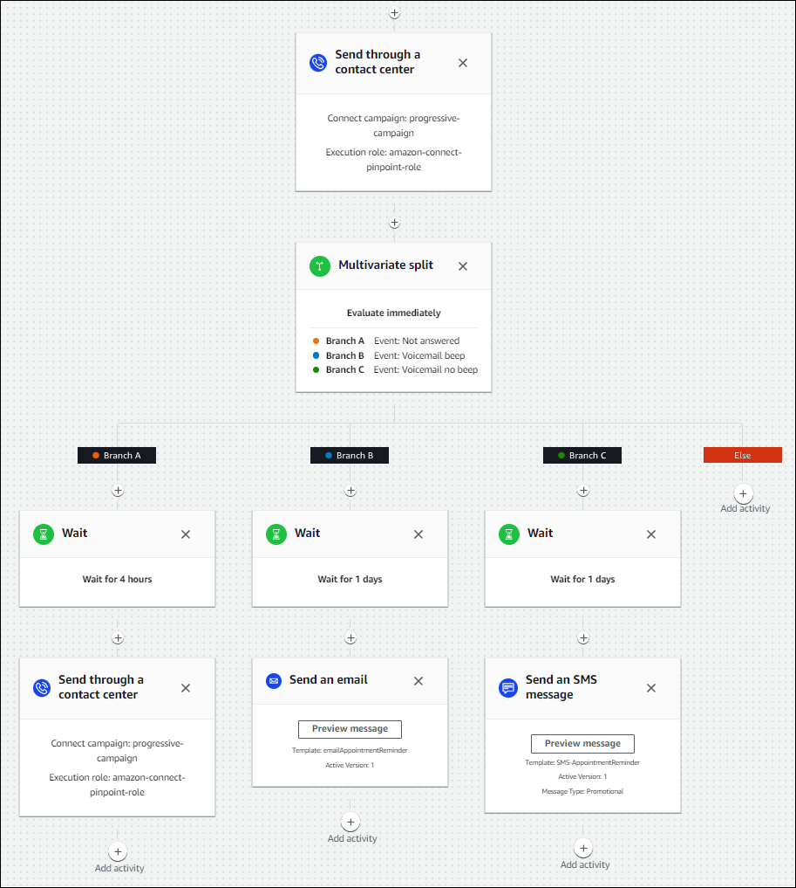

# Best practices for Amazon Connect outbound campaigns using

Pinpoint

###### Important

**End of support notice:** On October 30, 2026, AWS will end
support for Amazon Pinpoint. After October 30, 2026, you will no longer be able to access the
Amazon Pinpoint console or Amazon Pinpoint resources (endpoints, segments, campaigns, journeys, and
analytics). For more information, see [Amazon Pinpoint end of support](../../../console/pinpoint/migration-guide.md "../../../console/pinpoint/migration-guide.md"). **Note:** APIs related to SMS, voice, mobile push, OTP, and phone number validate are
not impacted by this change and are supported by AWS End User Messaging.

The topics in this section explain best practices for outbound calling campaigns using
Pinpoint. These practices can increase agent productivity, help you comply with regulations, and
help protect the integrity of your phone numbers.

###### Note

Amazon Connect outbound campaigns work in concert with Amazon Pinpoint journeys. Journeys have their own best
practices. The topics in this section describe some of those practices, but for more
information, see [Tips and best practices for
journeys](../../../pinpoint/latest/userguide/journeys-best-practices.md "../../../pinpoint/latest/userguide/journeys-best-practices.md"), in the _Amazon Pinpoint User Guide_.

###### Contents

- [Choose the right campaign](#right-campaign-for-cc "#right-campaign-for-cc")
- [Agent staffing best practices](#agent-staffing "#agent-staffing")
- [Connection latency best practices](#call-latency "#call-latency")
- [Best practices for answering machine detection](#machine-detection "#machine-detection")
- [Journey best practices](#journey-settings "#journey-settings")
- [Schedule best practices](#schedule-settings "#schedule-settings")
- [Best practices for activity settings](#activity-no-call "#activity-no-call")
- [Do Not Call best practices](#dnc "#dnc")
- [Best practices for managing redials](#manage-redials "#manage-redials")

## Choose the right campaign

Amazon Connect provides several types of dialing campaigns. The following sections describe each
type so that you can implement the campaign that best meets your needs.

###### Contents

- [Predictive campaigns](#predictive-campaigns "#predictive-campaigns")
- [Progressive campaigns](#progressive-campaigns "#progressive-campaigns")
- [Agentless campaigns](#agentless-campaigns "#agentless-campaigns")
- [Preview campaigns](#preview-campaigns "#preview-campaigns")

### Predictive campaigns

When agent productivity, cost per calls, or contact center efficiency are critical
metrics, use predictive dialers. Predictive dialers anticipate that many calls won't be
answered. They counterbalance that by dialing as many phone numbers in a list as possible
during an agent's shift by making predictions about agent availability.

The predictive algorithm calls ahead based on certain performance metrics. This means
that calls can be connected before an agent becomes available, and a customer is connected to
the next available agent. The predictive algorithm constantly analyzes, evaluates, and makes
agent availability predictions in real-time so that agent productivity and efficiency can
improve.

### Progressive campaigns

When you need to reduce answer speeds, use progressive mode. A progressive mode campaign
dials the next phone number in a list after an agent completes the previous call. If there are
multiple campaigns targeting the same set of agents, then each of them may end up dialing
contacts for the same agents. There are two ways to prevent this:

- Change the bandwidth allocation of the campaigns so the sum of the bandwidth allocation
  of each of those campaigns is less than or equal to 100%. This greatly reduces the likelihood
  of multiple campaigns dialing contacts for the same agents, but it does not completely
  eliminate it.
- If a 1:1 guarantee is required, then have an exclusive set of agents for each campaign.
  To do this, assign the campaign's queue to a single routing profile. That routing profile
  must only have this campaign's queue, must only allow voice calls, and no inbound contacts
  should be put into this queue.

You can use integrated answering machine detection to help identify a live customer pickup
or a voicemail, and customize your contact strategy accordingly. For example, if a person
answers a call, you can present options for them to select. If a call goes to voicemail, you
can leave a message.

You can also manage pacing by specifying capacity for each campaign. For example, you can
send more voice notifications faster by setting a higher capacity for a given agentless
campaign compared to other dialer campaigns.

### Agentless campaigns

You use agentless campaigns to send high-volume personalized voice notifications,
appointment reminders, or to enable self-service using the Interactive Voice Response (IVR)
with no agents needed.

### Preview campaigns

Use preview dialing for personalized customer conversations and to support compliance.
Preview dialing enables agents to review recipient details such as name, address, product
usage, prior interactions before initiating an outbound call, ensuring personalized and
efficient proactive engagement while supporting compliance.

Best Practice for Preview Dialing Mode: disable call classification.

## Agent staffing best practices

When call recipients answer a call and hear silence in return, they often hang up. For
predictive campaigns, use the following best practices to help reduce that silence:

- Ensure that you have enough agents logged in to your call queue. For more information
  about staffing, see [Forecasting, capacity planning, and scheduling in Amazon Connect](forecasting-capacity-planning-scheduling.md "forecasting-capacity-planning-scheduling.md").
- Consider using Amazon Connect's machine learning services.
  - [Forecasting](forecasting.md "forecasting.md"). Analyze and predict contact volume
    based on historical data. What will future demand—the contact volume and handle time—look
    like? Amazon Connect forecasting provides accurate and auto-generated forecasts that are
    automatically updated daily.
  - [Capacity planning](capacity-planning.md "capacity-planning.md"). Predict how many agents
    your contact center will require. Optimize plans by scenarios, service level goals, and
    metrics, such as shrinkage.
  - [Scheduling](scheduling.md "scheduling.md"). Generate agent schedules for day-to-day
    workloads that are flexible, and meet business and compliance requirements. Offer agents
    flexible schedules and work-life balance. How many agents are needed in each shift? Which
    agent works in which slot?

  [Schedule adherence](schedule-adherence.md "schedule-adherence.md"). Enable contact center
  supervisors to monitor schedule adherence and improve agent productivity. Schedule adherence
  metrics are available after the agent schedules are published.

## Connection latency best practices

Successful outbound calling campaigns avoid silent calls, the period of silence after a
person answers a call and before an agent comes on the line. Legal requirements to limit the
number of silent or abandoned calls and keep the called party informed may also apply. You can
configure Amazon Connect in different ways to reduce call connection delays.

###### Contents

- [Pinpoint segment attributes](#pinpoint-segment-attributes "#pinpoint-segment-attributes")
- [Outbound agent-staffed calling](#outbound-agent-staffed "#outbound-agent-staffed")
- [Outbound agentless calling](#outbound-agentless "#outbound-agentless")
- [Whisper and queue flow best practices](#whisper-and-queue "#whisper-and-queue")
- [User administration best practices](#user-admin "#user-admin")
- [Workstation and network best practices](#workstations "#workstations")
- [Testing best practices](#testing "#testing")

### Pinpoint segment attributes

When creating an Amazon Pinpoint segment file, add the data (attributes) required for
routing logic, custom greetings, or agent screen pop. Do not use Lambda functions in the flow to
extract additional information, such as `EffectiveDate`,
A`ttributes.CampaignIdentifier`, or `User.UserId` before connecting to
an agent.

For more information, see [Supported attributes](../../../pinpoint/latest/userguide/segments-importing.md#segments-importing-available-attributes "../../../pinpoint/latest/userguide/segments-importing.md#segments-importing-available-attributes") in the _Amazon Pinpoint User Guide_.

### Outbound agent-staffed calling

When using the [Check call progress](check-call-progress.md "check-call-progress.md") flow block:

- Call Answered branch - Remove all flow blocks between the [Check call progress](check-call-progress.md "check-call-progress.md") and [Transfer to queue](transfer-to-queue.md "transfer-to-queue.md") blocks. This minimizes
  delay between the dialed party saying hello, and the agent answer time.
- Not Detected branch - This branch should be treated in the same manner as a Call
  Answered with routing to a [Transfer to queue](transfer-to-queue.md "transfer-to-queue.md") block. This branch is used when the ML-model was
  not able to classify the answer type. Since this could be a voicemail or a live person, you
  can play a message before to the **Transfer to queue** block in the event
  that there is a voicemail answering a message can be left.

For example, "This is Example Corp. calling to confirm your appointment. We couldn't
tell if you or your voicemail answered this call. Please stay on the line while we connect
you with an agent."

### Outbound agentless calling

Outbound campaigns often use custom greetings and self service functions. Do not use
Lambda functions to get contact attributes. Instead, provide customer data (attributes) via the
campaign segment. Use these attributes from the campaign segment to play custom
greetings.

- Example - Call Answered or Not Detected: "Hello, `$.Attributes.FirstName`.
  This is `$.Attributes.CallerIdentity` calling to confirm your upcoming appointment
  on `$.Attributes.AppointmentDate` at `$.Attributes.AppointmentTime`. If
  this is still a good time and date for you, just say, "Confirm". If you would like to use our
  self service system to modify your appointment, just say, "self service" or stay on the line
  and we will connect you with the next available agent."
- Example - Voicemail with or without beep: "Hello, `$.Attributes.FirstName`.
  This is `$.Attributes.CallerIdentity` calling to confirm your upcoming appointment
  on `$.Attributes.AppointmentDate` at `$.Attributes.AppointmentTime`. If
  this is still a good time and date for you, we will see you then. If you would like to modify
  your appointment, please call us back at `$.SystemEndpoint.Address` to reschedule
  your appointment"
- Error branch - Occasionally there could be an issue that causes a call to follow the
  Error branch. As a best practice, use a [Play prompt](play.md "play.md")
  block with a message that applies to the contact that was dialed, with instruction to "Please
  call us at `$.SystemEndpoint.Address` to confirm or reschedule your appointment."
  Do this before the [Disconnect / hang up](disconnect-hang-up.md "disconnect-hang-up.md") block in case the call recipient answered, but an
  error occurred in the processing.

### Whisper and queue flow best practices

- Remove the **Loop prompts** from the **Default customer
  queue** flow and replace them with **End flow / Resume**.

- If agents don't answer within 2 seconds of calls going to queue, you can minimize silent
  calls by using **Loop prompts** and play a message for the customer. The
  following image shows a typical flow block with a Loop prompt.

- Use the **Disable agent whisper** and **Disable customer
  whisper** options on the [Set whisper flow](set-whisper-flow.md "set-whisper-flow.md") block. This is so customers perceive less
  connection latency as part of an outbound campaign. The following image shows the location of
  the **Disable agent whisper** setting on the block's properties page.

### User administration best practices

We recommend setting the following options for your users to reduce connection times. To
access these settings, in the Amazon Connect admin website navigate to **Users**, **User
management**, **Edit**.

These options apply to soft phones only.

- [Enable the Auto-accept calls](enable-auto-accept.md "enable-auto-accept.md"). It reduces the
  potential for call connection latency/delay after a dialed party answers.
- [Set After Contact Work (ACW) timeout](configure-agents.md "configure-agents.md") to 30.
  Minimizing the ACW time will optimize the dialing algorithm when using Predictive dialing
  campaigns.
- [Enable persistent connection](enable-persistent-connection.md "enable-persistent-connection.md"). This
  maintains agent connection after a call ends. It enables subsequent calls to connect
  faster.

The following image shows the **Settings** section of the **Edit
user** page.

### Workstation and network best practices

The following best practices can help optimize agent efficiency by ensuring adequate
hardware and network resources.

- Ensure that agent workstations meet the minimum requirements. For more information, see
  [Agent headset and workstation requirements for using
  the Contact Control Panel (CCP)](ccp-agent-hardware.md "ccp-agent-hardware.md").
- Ensure that the agent has the CCP or agent workspace open and present on their desktop.
  This reduces the time spent bringing the screen to the front before greeting the
  caller.
- On the local network, ensure that the agents are connected to a LAN. This mitigates
  potential wireless network latency
- If possible, minimize the geographic distance between the AWS Region that hosts your
  Amazon Connect instance and the agents that interact with the outbound campaigns. The greater the
  geographic distance between your agents and the hosting Region, the higher the possible
  latency.

###### Note

Outbound campaigns have limitations on the numbers that agents can dial, depending on the
origin of the Amazon Connect instance. For more information, see the [Amazon Connect
Telecoms Country Coverage Guide](https://d1v2gagwb6hfe1.cloudfront.net/Amazon_Connect_Telecoms_Coverage.pdf "https://d1v2gagwb6hfe1.cloudfront.net/Amazon_Connect_Telecoms_Coverage.pdf").

### Testing best practices

As a best practice, run tests at scale. To achieve the lowest call connection latency, use
outbound campaigns to make hundreds of thousands of continuous calls to mimic your production
environment. Call connection latency can be relatively high when making a handful of campaign
calls.

## Best practices for answering machine detection

To use Answering Machine Detection (AMD) in a campaign, use the [Check call progress](check-call-progress.md "check-call-progress.md") flow block. It
provides call progress analysis. This is an ML-model that detects an answered call condition so
that you can provide different experiences for calls answered by people and calls answered by
machine, with or without a beep. The flow block also provides a branch for routing calls when
the ML-model can't distinguish between people and voicemail, or when errors occur in call
processing.

AMD uses the following criteria to detect live calls:

- Background noise associated with a pre-recorded message.
- Long strings of words such as "Hello, I am sorry I missed your call. Please leave a
  message at…"
- A live caller saying something similar to "Hello, hello?" followed by a post-greeting
  silence.

Forty to 60-percent of calls to consumers go to voicemail. AMD helps eliminate the number
of voicemail calls over live calls. However, the detection accuracy has limitations.

- If the voicemail greeting is a short "Hello" or includes a pause, AMD detects it as a
  live customer (a false negative).
- Sometimes a long greeting by a live customer is incorrectly detected as a voicemail (a
  false positive).
- There is a small delay while the system connects the call to an agent, which could result
  in the customer possibly hanging up.
- PBX (private branch exchange) numbers with multiple levels of voicemail prompts are not
  supported.

### The pros, cons, and best uses of Answering Machine

Detection

The use of Answering Machine Detection (AMD) may not comply with telemarketing laws. You
are responsible for implementing AMD in a manner that is compliant with applicable laws, and
you should always consult your legal advisor regarding your specific use case.

Use case 1: AMD is on and leaving automatic voicemails

- **Pros** – Agents primarily interact with live calls
  95-percent of the time, maximizing talk time. AMD can leave automatic voicemails if a
  voicemail is detected.
- **Cons** – The technology leaves a voicemail
  50-percent to 60-percent of the time due to false positives due to the large variety of
  answering machine types. Also, AMD can irritate customers because it adds a short delay to
  live calls.
- **Best uses** – Calling consumers during the day
  when you may get a large quantity of answering machines and it’s not urgent to ensure every
  call receives a voicemail.

Use case 2: AMD is on but not leaving automatic voicemails

- **Pros** – Agents primarily interact with live calls
  95-percent of the time, maximizing talk time.
- **Cons** – Cannot leave any voicemails. Adds a delay
  to live calls which can annoy customers.
- **Best uses** – Calling consumers during the day
  when you may get a large quantity of voicemails and you don’t want to leave any
  voicemails.

Use case 3: AMD is off and agents can leave manual voicemails

- **Pros** – Voicemails can be left 100-percent of the
  time.
- **Cons** – Agents must determine whether they are
  receiving a live call or voicemail. Must manually leave a voicemail. Most time consuming and
  can lower the number of calls your agents make in a day.
- **Best uses** – Calling consumers or businesses and
  leaving customized voicemails.

Use case 4: AMD is off and agents can leave a prerecorded voicemail

- **Pros** – Agents can leave a personalized,
  pre-recorded voicemail 100% of the time saving significant time by avoiding repeating the
  same message over and over with 'Voicemail Drop'.
- **Cons** – Agents must determine whether they are
  receiving a live call or voicemail. More time consuming than AMD but quicker than manually
  leaving a voicemail.
- **Best uses** – Calling consumers or businesses and
  leaving generic voicemails.

## Journey best practices

As a best practice, create a well-defined scenario for each Amazon Pinpoint journey. Limit the scope
of a scenario to a specific aspect of a larger customer experience that enables you to monitor,
refine, and manage a customer's specific experience. You can then create a sequence of related
journeys.

For example, a journey can welcome new customers and provide recommended first steps during
their first seven days as a customer. Based on each customer's actions during the first journey,
you can route them to additional journeys tailored to their initial level of engagement. One
journey might provide next steps for customers who were highly engaged in the first journey.
Another subsequent journey might promote different products or services to customers who were
less engaged in the first journey. By creating a sequence of scoped journeys, you can
continually refine and manage the customer experience throughout the customer lifecycle.

After you define a scenario, choose journey settings that support your goals for the
scenario. The settings define the timing, volume, and frequency with which any part of a journey
can engage participants.

###### Note

The following steps assume that you have at least one project and one journey in Amazon Pinpoint. If
not, see [Managing Amazon Pinpoint projects](../../../pinpoint/latest/userguide/projects-manage.md "../../../pinpoint/latest/userguide/projects-manage.md"), and [Create a journey](../../../pinpoint/latest/userguide/journeys-create.md "../../../pinpoint/latest/userguide/journeys-create.md"), both in the
_Amazon Pinpoint User Guide_

###### To access journey settings

1. Open the Amazon Pinpoint console at [https://console.aws.amazon.com/pinpoint/](https://console.aws.amazon.com/pinpoint/ "https://console.aws.amazon.com/pinpoint/").
2. In the navigation pane, choose **Journeys**, then open a journey with a
   status of **Draft** or **Paused**.

You can also choose **Stop journey** to stop a journey. 3. Open the **Actions** list and choose **Settings**. 4. Expand the following sections to implement the various best practices.

Time zone detection helps estimate an endpoint's time zone based on
`Endpoint.Location.Country` and any combination of `Endpoint.Address`
and `Endpoint.Location.PostalCode`. The endpoint's time zone is used to avoid
calling at inappropriate times of the day, when quiet time is configured, and also when a
journey sends messages based on a local time zone. Time zone estimation is only performed on
endpoints that do not have a value for the `Demographic.Timezone` attribute.

###### Note

AWS GovCloud (US-West) does not support time zone detection.

If a journey contains endpoints with multiple time zones:

- When you enable `Recipient's local time zone`:

      + The journey calls or sends a message according to the latest time zone for an
       endpoint.
      + The journey stops sending when all messages have been sent, or according to the
       earliest time zone for an endpoint.

  When you enable **Quiet time**, and you have endpoints on multiple time
  zones, the journey does not call or send messages to an endpoint during the quiet time of any
  timezone. The journey only calls and sends messages when all the endpoints can receive them,
  as controlled by the journey's sending rules.

For example, if your journey's quiet time runs from 20:00 (8:00 PM) to 08:00 (8:00 AM),
and the journey uses endpoints in UTC-8 America/Los_Angeles and UTC-5 America/New_York, the
journey starts sending messages at 08:00 America/Los_Angeles (11:00 America/New_York) and
stops sending messages at 17:00 America/Los_Angeles (20:00 America/New_York).

To optimize participant engagement in a journey that has a scheduled start and end time,
configure the journey to use each participant's local time zone. This helps to ensure that
journey activities occur when a participant is most likely to participate in those
activities.

###### To use recipient time zones

- Under **When to send**, choose the **Recipeints local time
  zone** radio button.

###### Note

That setting's usefulness depends on whether you store local time zone values in the
endpoint definitions for participants. If you use this setting and the endpoint definition
for a participant doesn't specify a time zone, Amazon Pinpoint doesn't include the participant in the
journey. To avoid this issue, use the `Demographic.Timezone` attribute to store
time zone information for participants. This is a standard attribute provided by
Amazon Pinpoint.

If you configure an activity to send messages at a time that conflicts with the
quiet-time settings for the journey, Amazon Pinpoint doesn't send messages until the quiet time ends. If
you chose to resume sending messages after quiet time ends, Pinpoint also sends any messages
held during quiet time. If not, it drops the held messages.

For certain use cases, such as telemarketing, organizations limit attempts to call an
endpoint over a certain number of days. Amazon Pinpoint provides the following ways to configure the
number of attempts:

- Specify the maximum contact attempts made to an endpoint in a 24 hour period.
- Specify the maximum number of times you can reach an endpoint for a particular journey,
  and across journeys.
- Set a rolling limit by specifying the maximum number of times you can reach an endpoint
  within a certain time period. For example, contact an endpoint at most 2 times over the next
  7 days.
  The following image shows the various journey limit settings.

## Schedule best practices

Amazon Connect outbound campaigns enable you to limit calls to certain times of day and avoid calls
during quiet times in the evening or during weekends. You can also set calling exceptions in an
Amazon Pinpoint journey. The exceptions overwrite the sending times configured for days of the
week.

We recommend using both features. For more information about scheduling in Amazon Connect, see . For
more information about scheduling in Amazon Pinpoint, see [Step 4: Choose when to send the
campaign](../../../pinpoint/latest/userguide/campaigns-schedule.md "../../../pinpoint/latest/userguide/campaigns-schedule.md"), in the _Amazon Pinpoint User Guide_.

In addition to exceptions, you can:

- Stop calls from predictive and progressive campaigns by logging all agents out of the
  campaign queue.
- Use the Amazon Connect console to manually pause a campaign.

## Best practices for activity settings

In the **Entry** activity of your journey, only use the **Add
participants from a segment** option.

## Do Not Call best practices

Many countries have created DNC (Do Not Call) lists. These allow telephone subscribers to
not receive marketing calls. Companies must check customer phone numbers against such DNC lists,
and remove those numbers before placing a call. You use Amazon Pinpoint to manage DNC lists in outbound
campaigns.

Journeys allow you to check the status of an endpoint against third-party data sources
before sending the messages. You can also add an AWS Lambda function that conducts external
DNC checks and does or does not dial based on the response.

The following image shows the suggested DNC flow.

## Best practices for managing redials

The following sections provide best practices for managing redials and differentiating your
call center from spammers.

### Automate workflows and use multiple channels

As a best practice, don't persistently call leads and hope the contact answers. The more
you call, the less likely the contact may be to answer. Instead, use automation to move the
contact to another list and call back 30 days later, then perhaps 60 days later.

Also, look at the number of times a call goes to voicemail. At some point, you may want to
stop calling that lead.

An optimal strategy uses automated workflows with multiple communication channels to build
an outreach cadence. For example, you start with a phone call, then send an SMS message, then
an email. This can significantly increase the chances of contacting the lead. For more
information about setting up multiple channels, see:

- [Tutorial: Using Postman with the Amazon Pinpoint API](../../../pinpoint/latest/developerguide/tutorials-using-postman.md "../../../pinpoint/latest/developerguide/tutorials-using-postman.md"), in the _Amazon Pinpoint Developer
  Guide_.
- [Tutorial: Setting up an SMS registration system](../../../pinpoint/latest/developerguide/tutorials-two-way-sms.md "../../../pinpoint/latest/developerguide/tutorials-two-way-sms.md"), in the _Amazon Pinpoint Developer
  Guide_.

The next sections provide other tips for managing redials.

### Manage your call volume

The following best practices can help differentiate your call center from spammers and
help protect the integrity of your phone numbers.

- Place no more than 50 calls per area code, per carrier, per day.
- To configure how often a number is dialed, use the **Send through a contact
  center** activity with a **Wait** activity in your journey. Amazon Pinpoint
  supports a maximum of three **Send through a contact center** activities per
  journey. Use that activity strategically.

For example, use it when a call is **Not answered**, but choose another
follow up method for **Voicemail beep** and **Voicemail no
beep**, such as email or SMS. Those channels can still provide in-session
engagement with the contact by using hyperlinks in emails, or keyword responses such as YES
in SMS, to provide self service or contact an agent. This allows contacts to connect when
they want to.

###### To limit dialing

1. As needed, [create a journey in
   Amazon Pinpoint](../../../pinpoint/latest/userguide/journeys-create.md "../../../pinpoint/latest/userguide/journeys-create.md").
2. Set up the journey entry and add the **Send through a contact center**
   activity.

For more information about doing that, see [Set up the journey entry
activity](../../../pinpoint/latest/userguide/journeys-entry-activity.md "../../../pinpoint/latest/userguide/journeys-entry-activity.md"), in the _Amazon Pinpoint User Guide_. 3. After the activity, add a multivariate split.

For more information about doing that, see [Set up a multivariate split activity](../../../pinpoint/latest/userguide/journeys-add-activities.md#journeys-add-activities-procedures-multivariate-split "../../../pinpoint/latest/userguide/journeys-add-activities.md#journeys-add-activities-procedures-multivariate-split"), in the _Amazon Pinpoint User
Guide_. 4. Open the split and add **Branch B** and **Branch
C**. 5. Edit the branches in the split as follows:

    * **Branch A**

    	1. Open the **Choose a condition** list and select
    	 **Event**.
    	2. Open the **Choose a journey message activity and event** list and
    	 select the **Contact center key**.
    	3. Open the **Event** list and select **Not
    	 answered**.
    * **Branch B**

    	+ Repeat the same steps as Branch A but choose **Voicemail
    	 beep**.
    * **Branch C**

    	+ Repeat the same steps as Branch A but choose **Voicemail no
    	 beep**.

6. Add a **Wait** activity after each branch, then edit each
   **Wait** activity as follows:
   - Branch A
     1. In the **Time period** section, enter
        **4**.
     2. In the **Unit** list and select **hours**.
     3. Select **Save**.

   - Branch B
     1. In the **Time period** section, enter
        **1**.
     2. In the **Unit** list and select **hours**.
     3. Select **Save**.

   - Branch C
     1. In the **Time period** section, enter
        **4**.
     2. In the **Unit** list and select **days**.
     3. Select **Save**.

7. After Branch A, add the **Send through a contact center** activity. Set
   the parameters of this activity similar as Lab 2.
8. After branches B and C, add the **Send an email** or **Send an
   SMS** activities. Set up a message template to complete this activity. For more
   information, see [Amazon Pinpoint message
   templates](../../../pinpoint/latest/userguide/messages-templates.md "../../../pinpoint/latest/userguide/messages-templates.md").

The following image shows the workflow:

