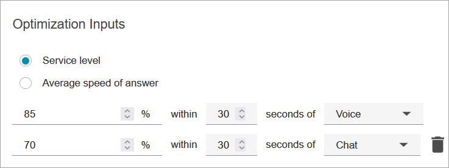

# Create capacity planning

scenarios in Amazon Connect

A scenario has two parts:

- Scenario inputs: The maximum occupancy, daily attrition, FTE hours per
  week. For example, you might enter data that represent your best case
  scenarios (everyone is at work) or worst case scenarios (a large number of
  people are out sick during winter months).
- Optimization inputs: The service level or average speed of answer (ASA).
  For example, 85% of calls are answered within 30 seconds of entering the
  queue.
  You can then use this scenario to generate a capacity plan that represents how
  many people you need to hire accordingly to meet your business goals. The output
  includes the required FTE employees with and without shrinkage, forecasted occupancy
  rate, the gap between available required FTEs, and maximum overtime (OT) and
  voluntary time-off (VTO) rate allowed.

###### To create a capacity planning scenario

1. Before you can create a capacity plan, you must create and publish a
   long-term forecast. Amazon Connect uses the published long-term forecast as the input
   for creating the capacity plan. If you haven't yet created a forecast, see
   [Getting started with
   forecasting](forecasting.md#getting-started-forecasting "forecasting.md#getting-started-forecasting").
2. Log in to the Amazon Connect admin website with an account that has security profile permissions
   for **Analytics**, **Capacity planning -
   Edit**.

For more information, see [Assign
permissions](required-optimization-permissions.md "required-optimization-permissions.md"). 3. On the Amazon Connect navigation menu, choose **Analytics and
optimization**, **Capacity planning**. 4. On the **Planning Scenarios** tab, choose
**Create a Scenario**. 5. On the **Create scenario** page, enter a name and
description. 6. In the **Scenario inputs** section, enter the following
information:

    1. **Max Occupancy (optional)**: The percentage of
     time agents will spend handling contact volume when they log
     in.

    	1. **Daily attrition**: The percentage of
    	 staff leaving your contact center.

    	For example, if the annual attrition is 50%, the daily
    	 attrition would be 50%/250 working days per year =
    	 0.2%.
    	2. **Full-time equivalent (FTE) hours per
    	 week**: How many hours each FTE employee will
    	 work per week.
    2. **Outsourced contacts (optional)**: You can
     outsource a percentage to a third-party.
    3. **Max overtime (OT) allowed (optional)**: Specify
     the maximum percent of overtime to plan for peaks. As a planner, you
     don't want to burn out your workforce.

    For example, you specify 40 as FTE hours per week, with 10 percent
     maximum overtime. The total work week would be up to 44 hours.
    4. **Max voluntary time off (VTO) allowed
     (optional)**: Specify the maximum percent of time off
     to plan for troughs, when there is a lull in contacts and you can
     save in costs. Be sure not to give too much time off in case traffic
     increases again.

    For example, you specify 40 as FTE hours per week, with 10 percent
     maximum time off. The total work week would be at least 36 hours.

7. In the **Optimization inputs** section, enter the
   operational goals for your organization:
   1. **Service level**: The percentage of contacts
      answered within a defined target time threshold.

   The following image shows service level targets where 80 percent
   of voice contacts and 70 percent of chat contacts will be answered
   within 30 seconds.

    2. **Average speed of answer** (ASA): The average
   amount of time it takes for contacts to be answered in a call center
   during a specific time period. 3. You can create one goal per channel. Choose **Add another
   goal** to add another goal.
