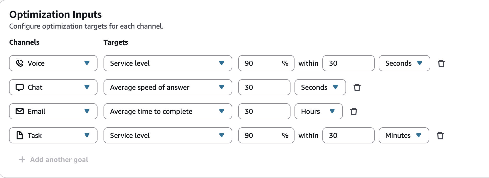

# Create capacity planning scenarios in Connect Customer

A scenario has two parts:

- Scenario inputs: The maximum occupancy, daily attrition, full-time
  equivalent (FTE) hours per week. For example, you might enter data that
  represent your best case scenarios (everyone is at work) or worst case
  scenarios (a large number of people are out sick during winter
  months).
- Optimization inputs: The optimization target for each channel that you
  want FTE estimates for. Depending on the channel, you can set a service
  level, average speed of answer (ASA), or average time to complete target.
  For example, 85% of calls are answered within 30 seconds of entering the
  queue.
  You can then use this scenario to generate a capacity plan that represents how
  many people you need to hire accordingly to meet your business goals. The output
  includes the required FTE employees with and without shrinkage, forecasted occupancy
  rate, the gap between available required FTEs, and maximum overtime (OT) and
  voluntary time-off (VTO) rate allowed.

###### To create a capacity planning scenario

1. Before you can create a capacity plan, you must create and publish a
   long-term forecast. Connect Customer uses the published long-term forecast as the input
   for creating the capacity plan. If you haven't yet created a forecast, see
   [Getting started with forecasting](forecasting.md#getting-started-forecasting "forecasting.md#getting-started-forecasting").
2. Log in to the Connect Customer admin website with an account that has security profile permissions
   for **Analytics**, **Capacity planning -
   Edit**.

For more information, see [Assign
permissions](required-optimization-permissions.md "required-optimization-permissions.md"). 3. On the Connect Customer navigation menu, choose **Analytics and
optimization**, **Capacity planning**. 4. On the **Planning Scenarios** tab, choose
**Create a Scenario**. 5. On the **Create scenario** page, enter a name and
description. 6. In the **Scenario inputs** section, enter the following
information:

    1. **Max Occupancy (optional)**: The percentage of
     time agents will spend handling contact volume when they log
     in.

    	1. **Daily attrition**: The percentage of
    	 staff leaving your contact center.

    	For example, if the annual attrition is 50%, the daily
    	 attrition would be 50%/250 working days per year =
    	 0.2%.
    	2. **Full-time equivalent (FTE) hours per
    	 week**: How many hours each FTE employee will
    	 work per week.
    2. **Outsourced contacts (optional)**: You can
     outsource a percentage to a third-party.
    3. **Max overtime (OT) allowed (optional)**: Specify
     the maximum percent of overtime to plan for peaks. As a planner, you
     don't want to burn out your workforce.

    For example, you specify 40 as FTE hours per week, with 10 percent
     maximum overtime. The total work week would be up to 44 hours.
    4. **Max voluntary time off (VTO) allowed
     (optional)**: Specify the maximum percent of time off
     to plan for troughs, when there is a lull in contacts and you can
     save in costs. Be sure not to give too much time off in case traffic
     increases again.

    For example, you specify 40 as FTE hours per week, with 10 percent
     maximum time off. The total work week would be at least 36 hours.
    5. **Shrinkage (optional)**: Enter a total shrinkage
     percentage to apply to the plan. This field applies to both Hiring
     plans and Scheduling plans.

    If you need more granular interval-level or day-level shrinkage
     values, you can upload a CSV on the **Import** tab
     instead. For more information, see [Import estimated future shrinkage and available full-time employees in Connect Customer](upload-estimated-future-shrinkage.md "upload-estimated-future-shrinkage.md").
    6. **Hours of operation**: Select the hours of
     operation that represent when your agents are available to work.
     This list shows the hours of operation defined in your
     Connect Customer instance. For more information, see [Set the hours of operation and time zone for a queue using Connect Customer](set-hours-operation.md "set-hours-operation.md").

    You must select an hours of operation to save a scenario. When you
     select an hours of operation, Connect Customer displays a snapshot of its name,
     time zone, and weekly hours. Capacity planning uses only the base weekly operating
     hours, and doesn't include overrides or inherited hours.

    For scenarios that were created before hours of operation became
     a required input, Connect Customer asks you to select an hours of operation
     before you can save your changes.

    ###### Note

    The time zone of the selected hours of operation must match
     the time zone of the plan when you generate it.

    When you generate a plan, Connect Customer saves a snapshot of the
     selected hours of operation and uses that snapshot for the plan.
     If you later change the hours of operation in your Connect Customer
     instance, re-run the plan to use the updated hours.

7. In the **Optimization inputs** section, configure an
optimization target for each channel that you want FTE estimates for. You
can configure one target per channel, for up to four channels: Voice, Chat,
Task, and Email. The targets do not have to be the same type. For
example, you can use service level for Voice and average time to complete
for Task.

The following image shows the **Optimization inputs**
section with a different target type configured for each channel.

    1. **Service level**: The percentage of contacts
     answered within a defined target time threshold. Service level is
     available for all channels.
    2. **Average speed of answer** (ASA): The average
     amount of time it takes for contacts to be answered during a
     specific time period. Average speed of answer is available for the
     Voice and Chat channels.
    3. **Average time to complete**: The average amount
     of time it takes for an agent to complete a contact. Average time to
     complete is available for the Task and Email channels.

    When you set this target for the Task or Email channel, capacity
     planning treats the channel as asynchronous. It uses starting
     backlog projections to estimate headcount. If you set a
     **Service level** target for the Task or Email
     channel instead, capacity planning treats the channel as
     synchronous. For more information, see [Manage starting
     backlog projections](capacity-planning-backlog-projections.md "capacity-planning-backlog-projections.md").
    4. To add an optimization target for another channel, choose
     **Add another goal**.
