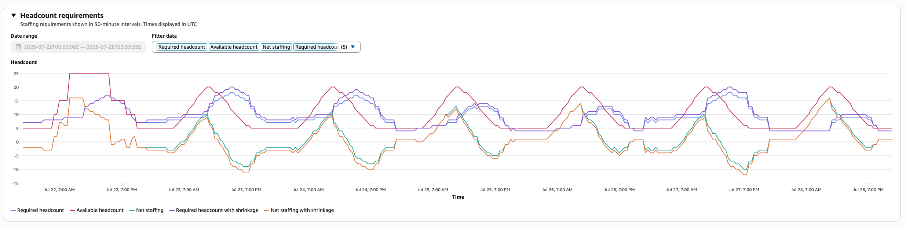
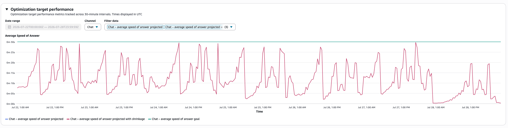
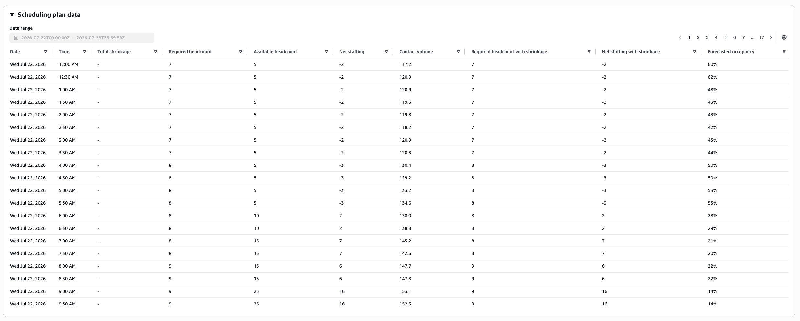

# Review capacity plan output in Connect Customer

To review capacity plan output, choose the hyperlink for the plan you generated.
The first half of the page summarizes the input you used in scenario and capacity
plan generation.

The plan output shows a week-by-week or month-by-month calculation. To switch from
weekly to monthly view, select **Monthly** from the dropdown, as
shown in the following image.

###### Note

The following output description, screenshot, and metrics list apply to
Hiring plans only. For Scheduling plan output, see [Review Scheduling plan output](#capacity-planning-scheduling-plan-output "#capacity-planning-scheduling-plan-output").

Following is a description of the metrics in the plan output:

- **Forecasting Inputs**

  - **Forecasted Contact Volume**: The total
    forecasted contact volume across the channels in your selected
    scenario's optimization targets.
  - **Forecasted Average Handling Time (AHT),
    seconds**: The forecasted average handling time across
    the channels in your selected scenario's optimization
    targets.
  - The forecasted contact volume and AHT in the plan output table
    reflects only the values from the selected forecast group. After
    there are newly published forecasts, consider re-running the
    capacity plan to reflect the latest published contact volume and
    AHT.

- **Outputs**

  - **Required FTEs (without Shrinkage)**: How many
    full-time equivalent agents need to be hired to meet the defined
    business goals (such as service level target), without considering
    shrinkage.
  - **Forecasted Occupancy %**: How much occupancy is
    for the agents.

- **Outputs with additional input**

  - **Required FTEs (with Shrinkage)**: How many
    full-time equivalent agents needed to be hired to meet the defined
    business goals (such as service level target), with considering
    shrinkage.
  - **Available FTEs**: How many agents are available
    for working that day. It can be uploaded in the **Import
    data** section.

- **Metrics calculated from available FTE input**

  - **Gap between available FTEs and required FTEs**:
    The difference between available FTEs and required FTEs.
  - **Gap %**: The percentage of the gap.
  - **Required OT %**: if there is a supply deficit
    (required FTEs higher than available FTEs), required OT% indicates
    how much overtime would be needed to cover the deficit.
  - **Required VTO %**: If there is a supply surplus
    (the number of required FTEs is lower than the available FTEs),
    required VTO % indicates how much voluntary time off could be used
    to lower the amount of agent idle time and thus lower costs.

## Review Scheduling plan output

To review Scheduling plan output, open the plan from the
**Capacity Plans** tab. The page shows two graphs and a
data table for the date range you select. Data appears in 15-minute or
30-minute intervals. The interval size matches your short-term forecast
settings.

### Headcount requirements graph

The **Headcount requirements** graph shows how many
agents you need at each interval. The x-axis shows time. The y-axis shows
headcount.

The graph plots the following series:

- Required headcount
- Available headcount
- Net staffing
- Required headcount with shrinkage
- Net staffing with shrinkage

The graph includes a legend and tooltips. Point to a data point to
view details. To show or hide series, use the **Filter
data** control.

### Optimization target performance graph

The **Optimization target performance** graph shows
data for one channel at a time. To change the channel, use the
**Channel** selector. You can choose Voice, Chat,
Email, or Tasks.

The y-axis label changes based on the target type for that
channel:

- **Service level** –
  Percentage
- **Average Speed of Answer
  (ASA)** – Average Speed of Answer
- **Average Time to Complete
  (ATC)** – Average Time to Complete

The graph plots three lines for the selected channel: the goal, the
projected value, and the projected value with shrinkage. It includes a
legend and tooltips. Use **Filter data** to show or hide
series.

### Date range filter

Use the **Date range** picker to choose which days
appear in the graphs and table. The maximum range is 7 days. By default,
the page shows 7 days starting from the plan start date. You can pick
dates only within the plan start and end date range. Relative date options
are not available.

### Scheduling plan data

The **Scheduling plan data** table shows one row per
interval (15 or 30 minutes). It includes the following columns:

- Date
- Time
- Contact volume
- Average handle time
- Required headcount
- Available headcount
- Net staffing
- Total shrinkage
- Required headcount with shrinkage
- Net staffing with shrinkage
- Forecasted occupancy

The table also shows columns for each channel. These include the
service level goal, projected service level, and projected value with
shrinkage. For ASA or ATC targets, it shows projected values. For Task
and Email, it shows projected backlog.

To change the page size or show and hide channel columns (Voice, Chat,
Email, Task), choose **Preferences**.
