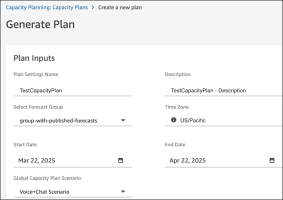
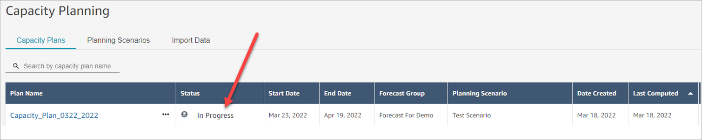

# Create capacity plans using

forecasts and scenarios in Amazon Connect

Before you can create a capacity plan, you must create a planning scenario and
publish a long-term forecast. Amazon Connect uses the forecasts and planning scenarios as
inputs for creating the capacity plan. If you haven't yet created a forecast and
planning scenario, see [Getting started with
forecasting](forecasting.md#getting-started-forecasting "forecasting.md#getting-started-forecasting") and [Create capacity planning
scenarios in Amazon Connect](capacity-planning-create-scenarios.md "capacity-planning-create-scenarios.md").

## How to create a capacity

plan

1. Navigate to the **Capacity Plans** tab, and choose
   **Generate Plan**.
2. Provide the plan name, description, forecast group (which has
   published long-term and short-term forecasts), start/end date, and plan
   scenario. The following image shows example values for these
   fields.

 3. Choose **Generate Capacity Plan**. 4. To quickly identify the plan that is in processing, choose
**Last Computed** to sort the table list. In the
following image, the status of the plan is **In
Progress**.

It usually takes between 5-10 minutes for the plan to be generated. If
the plan generation fails, try publishing the selected long-term
forecasts, and then generating the capacity plan again.
