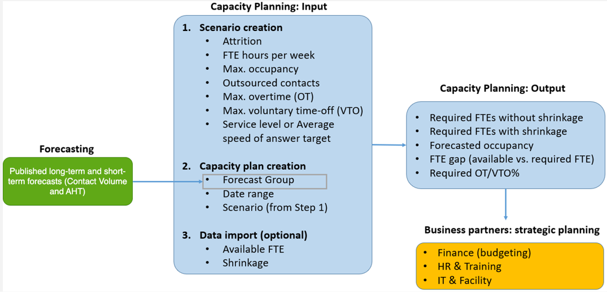

# Capacity planning in Amazon Connect

A capacity plan helps you estimate the long-term FTE (full-time equivalent)
requirements for your contact center, up to 64 weeks in the future. It specifies how
many FTE agents are required to meet the service level target for a certain period of
time.

After you generate long-term FTE estimations, you can share this information with
other stakeholders, such as Human Resources, Finance, and the Training Department, to
help facilitate the hiring and training of staff. When a business launches a new product
or extends into a new Region, staff hiring is needed to meet the customer service
demand.

Capacity planning uses published long-term and short-term forecasts as inputs, along
with scenario information that you provide. It then creates a long-term capacity plan
that you can share with stakeholders. When generating a capacity plan, an overlap of at
least 4 weeks between short-term and long-term forecasts is recommended to identify
contact patterns correctly within a day. At a minimum, an overlap of at least one day is
required.

The following diagram illustrates this integration among published long-term
forecasts, capacity planning, and capacity planning output.

## Getting started

Following is the order of steps for creating a capacity plan and sharing it with
others.

1. [Create capacity
   planning scenarios](capacity-planning-create-scenarios.md "capacity-planning-create-scenarios.md")
2. [Import estimated future
   shrinkage and available full-time employees in Amazon Connect](upload-estimated-future-shrinkage.md "upload-estimated-future-shrinkage.md"): This is an optional
   step but it can improve the accuracy of your capacity plan.
3. [Create capacity plans
   using forecasts and scenarios](capacity-planning-use-forecast.md "capacity-planning-use-forecast.md")
4. [Create capacity
   planning scenarios](capacity-planning-review-output.md "capacity-planning-review-output.md")
5. [Review](capacity-planning-review-output.md "capacity-planning-review-output.md"), [override](override-capacity-plan.md "override-capacity-plan.md"), [re-run](rerun-capacity-plan.md "rerun-capacity-plan.md"), or [download](download-capacity-plan.md "download-capacity-plan.md") a capacity plan.
6. [Publish a capacity
   plan](publish-capacity-plan.md "publish-capacity-plan.md")
