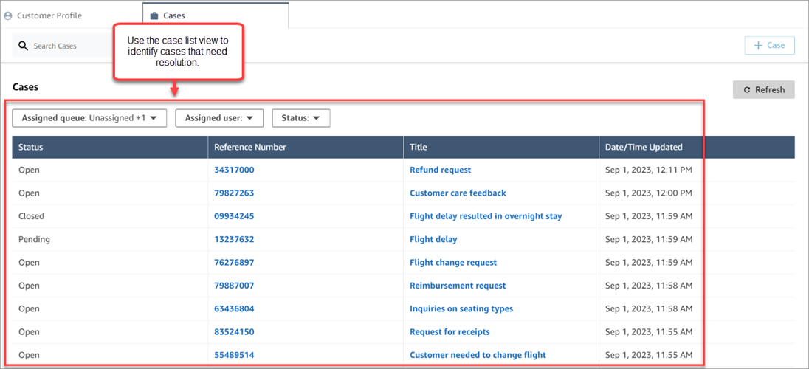
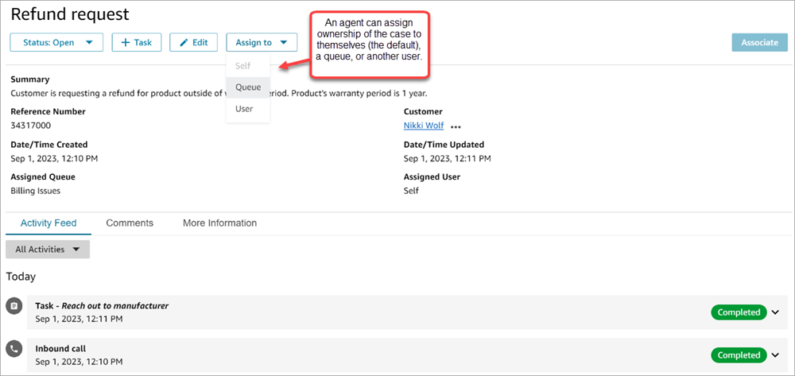
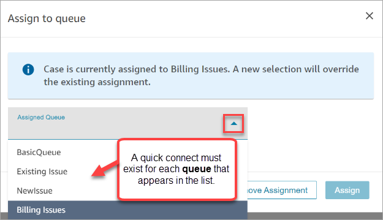
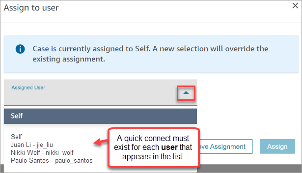
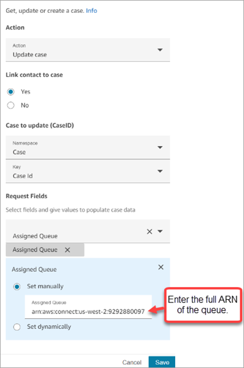

# Set up a case assignment in Amazon Connect Cases

To help your organization clearly track ownership of cases and resolve them faster,
you can ensure every case has an assigned owner who is responsible for case resolution.
The owner can be a queue or an individual user.

###### Note

Assigning a case owner does not route the case to the queue or the individual.

The following image shows the **Case list** view in the agent
workspace. You can filter by unassigned cases, for example, and assign ownership as
needed. The default view is set to cases assigned to the agent who is viewing the
list.

###### Contents

- [Set up agents and
  flows](#setup-case-assignment "#setup-case-assignment")
- [How agents assign case ownership](#agents-case-assignment "#agents-case-assignment")
- [How to configure the Cases block to assign
  case ownership in a flow](#flows-case-assignment "#flows-case-assignment")

## Set up agents and flows case

assignment

To enable case assignment in your Amazon Connect instance, configure the following
resources:

1. **Case template**. Add the following [system case fields](case-fields.md#system-case-fields "case-fields.md#system-case-fields") to a new or
   existing case template:
   - Assigned queue
   - Assigned user

2. To enable agents to assign case ownership in the agent workspace:
   - **Security profile**. Grant agents permission to
     view the queues, users, and quick connects that are going to appear
     in the dropdown lists in the agent workspace. For more information,
     see [Required queue, quick connect,
     and user view permissions](assign-security-profile-cases.md#required-cases-queue-permissions "assign-security-profile-cases.md#required-cases-queue-permissions").
   - **Quick connects**. Create user and queue quick
     connects for each user and queue that you want to appear in the
     dropdown lists. For instructions, see [Create quick connects in Amazon Connect](quick-connects.md "quick-connects.md").
   - **Queues**. Add the quick connects to the agent's
     queue. For instructions, see [Create a queue using the Amazon Connect admin website](create-queue.md "create-queue.md").
   - **Routing profile**. Add the queue to the agent's
     routing profile. For instructions, see [Create a routing profile in Amazon Connect to link queues to
     agents](routing-profiles.md "routing-profiles.md").

   Agents see only those quick connects that are added to the queues
   assigned to their routing profile.

3. To configure the Cases block to assign case ownership automatically during
   a flow, set the **Request Fields** section to
   **Assigned Queue** or **Assigned
   User**. For an image and more instructions, see [How to configure the Cases block to assign
   case ownership in a flow](#flows-case-assignment "#flows-case-assignment").

## How agents assign case ownership

The following image shows the agent workspace. Agents choose the **Assign
to** dropdown box to assign ownership of a case to themselves (the
default option), a queue, or another user.

If agents assign ownership of a case to a queue or another user, they are
presented with a prompt to choose from a filtered list of queues or users. The
filtered list of available queues or users is based on the quick connects in the
agent's routing profile.

### Assign to queue

The following image shows an example dropdown list of queues in the agent
workspace. For this list of queues to be displayed to an agent: create a quick
connect for each queue, and then add the queue to the agent's routing
profile.

### Assign to user

The following image shows an example dropdown list of users in the agent
workspace. For this list of users to be displayed to an agent: create a quick
connect for each user, assign the quick connects to the queue, add the queue to
the agent's routing profile.

## How to configure the Cases block to assign

case ownership in a flow

You can configure the [Cases](cases-block.md "cases-block.md") block to
automatically populate the **Assigned queue** or **Assigned
user** ownership fields. When agents view the case in the agent
workspace, the case ownership is already set. Agents can override the assignment as
needed, but are restricted to the queues and users that are available in their
routing profile.

The following image shows an example of the Properties page for the
**Cases** block. The **Request Fields**
section is configured to **Set manually**, **Assigned
queue**. You must enter the full ARN of the queue.

There are situations where you may want to set the assigned queue or assigned user
dynamically. For example, when the customer enters a DTMF number for a fraud issue,
you can create cases where the Fraud department is automatically set as the case
owner.
