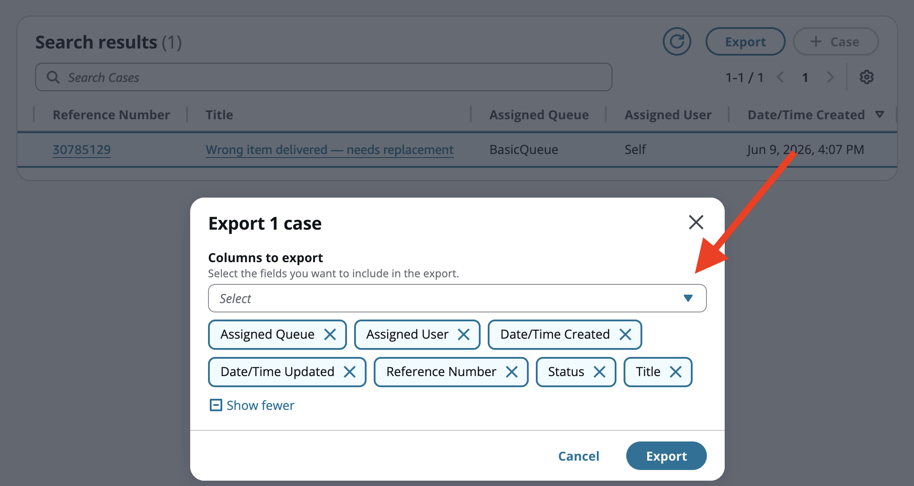

# Export cases to CSV in Connect Customer Cases

When you search for cases in the agent workspace, you can select one or more cases
and export them to a CSV file. The exported file contains the case field values you
choose, formatted for use in spreadsheet applications such as Microsoft Excel or Google
Sheets. This is useful for generating reports, sharing case data with stakeholders, or
performing offline analysis.

## Prerequisites

To export cases, the agent's security profile must include the
**Cases** - **Export** permission. Without this permission, the
**Export** button is not displayed in the case search
view. Enabling **Export** automatically grants the
**View** permission for Cases if it is not already
granted. For information about configuring security profiles, see [Security profile permissions for Connect Customer Cases](assign-security-profile-cases.md "assign-security-profile-cases.md").

## How to export cases

1. In the agent workspace, navigate to the case search view.
2. Use search filters to find the cases you want to export.
3. Select one or more cases using the checkboxes in the search results
   table.
4. Choose the **Export** button. The export modal opens and
   shows the number of cases selected.
5. In the export modal, choose the columns to include and then choose
   **Export**. For details, see [Choose columns](#case-bulk-export-choose-columns "#case-bulk-export-choose-columns").

## Choose columns to export

In the export modal, you can select which columns to include in the CSV
file:

- By default, all columns currently displayed in the search results table
  are pre-selected.
- Use the **Columns to export** multiselect dropdown to
  add or remove fields. You can type to filter the list.
- You must select at least one column. The **Export**
  button is disabled when no columns are selected.

Choose **Export** to generate and download the CSV file, or
choose **Cancel** to close the modal without exporting.

## CSV file format

The exported CSV file has the following characteristics:

- **File name** — The file is named
  `Cases-export-YYYY-MM-DD.csv`, where the date reflects when
  the export was initiated.
- **Encoding** — UTF-8 with a byte order mark
  (BOM), which ensures correct character rendering when opening the file in
  spreadsheet applications.
- **Headers** — The first row contains the
  display name of each selected field as a column header.
- **Column order** — Columns appear in the
  same order as they are displayed in the search results table.

## How field values appear in the CSV

The export supports all case field types. The following table describes how each
type is formatted in the CSV output.

| Field type    | How it appears in the CSV                                                              |
| ------------- | -------------------------------------------------------------------------------------- |
| Text          | Exported as-is.                                                                        |
| Number        | Formatted according to the agent's locale settings.                                    |
| Date/time     | Formatted using medium date style and short time style based on the agent's locale. |
| Boolean       | Displayed as *_True_ • or **False**.                                             |
| Single-select | The option's display name is shown, not the internal value.                         |
| User          | The user's display name is resolved and shown.                                         |
| Queue         | The queue's display name is shown.                                                     |
| Tags          | All tags are joined with commas.                                                       |

Fields with no value are exported as an empty cell.

## Download and confirmation

After you choose **Export**, the CSV file downloads immediately
to your browser's default downloads folder. A success banner confirms the export
and displays the file name.

If the export fails, an error banner is shown. Choose **Export**
again to retry.
