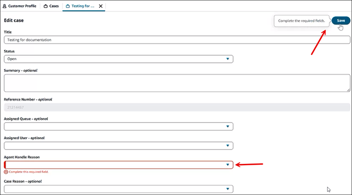
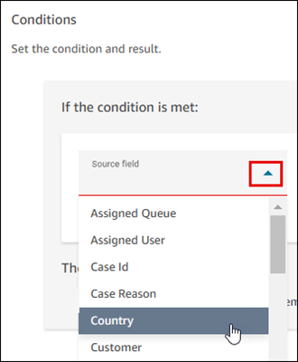
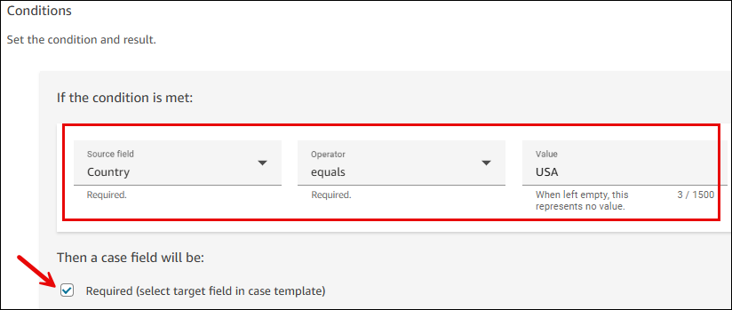
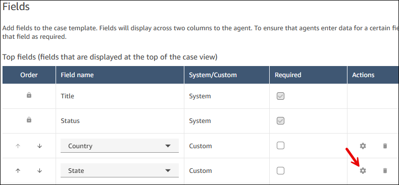
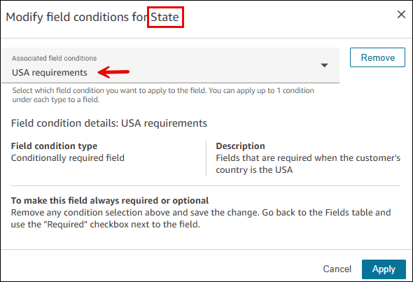
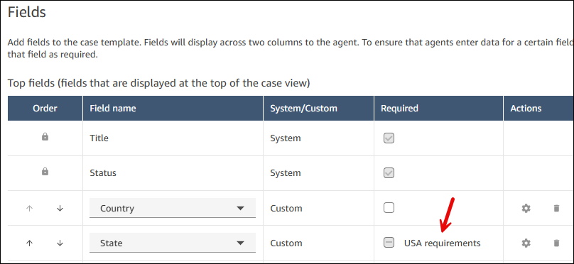
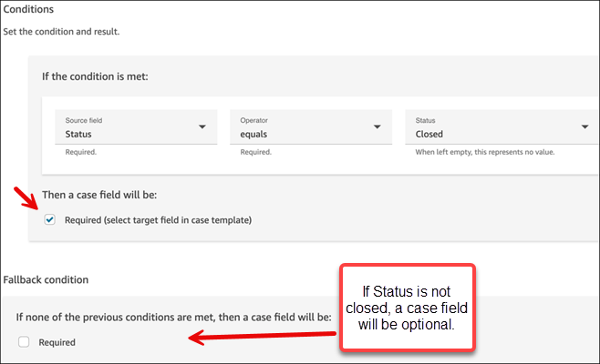
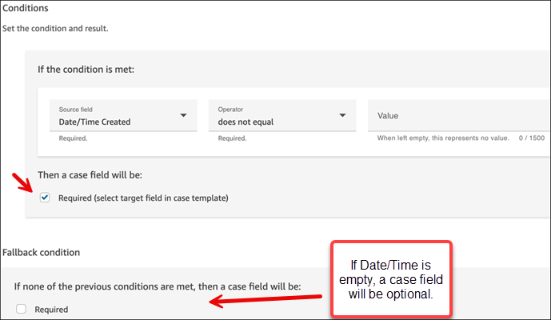
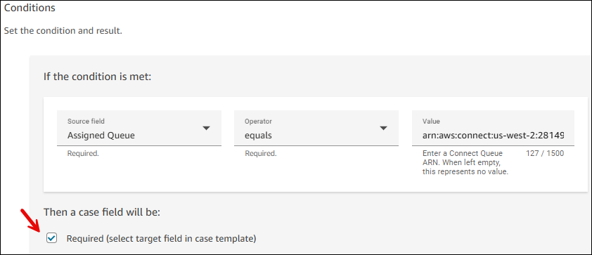

# Add case field conditions to a case template in

Amazon Connect

Case field conditions in Amazon Connect make your case templates more dynamic and user-friendly.
There are three types of case field conditions: Conditionally required, Hidden field
conditions, and Dependent field options. Conditionally required fields allow you to enforce field completion based on specific criteria. Hidden field conditions let you show or
hide fields based on other field values. Dependent field options create cascading dropdown menus where available choices depend on previous selections. These features help
streamline agent workflows, reduce data entry errors, and ensure agents see only relevant information when managing cases.

## Conditionally required

You can streamline how agents populate case fields, and reduce data entry errors, by
conditionally requiring specific fields.

To make a field conditionally required, you first set up a field condition. Then, on a
case template, choose which field the case field condition should apply to.

For example, you may want to enforce that **Agent Handle Reason** is
required if a case is updated after it was created. To achieve this you would:

1. Create a case field condition based on whether the [Date/Time Opened](case-fields.md "case-fields.md") field is not blank.
2. Apply the case field condition to the **Agent Handle Reason**
   field on the case template.

The following image shows an example **Edit case** page where this
requirement is being enforced.

This feature provides a lot of flexibility. Following are few other examples you can
set up:

- If Status = Closed, then the Close Reason field must be populated.
- If Case Reason = Refund, then the Amount field is required.
- If Country = USA, the State field is required.

You can apply case field conditions to multiple fields on a template.

###### Contents

- [Step 1: Create case
  field conditions](#step1-create-case-field-condition "#step1-create-case-field-condition")
- [Step 2: Add the
  case field conditions to a template](#step2-add-casefieldcondition-template "#step2-add-casefieldcondition-template")
- [Example field case
  conditions](#example-case-conditions "#example-case-conditions")
- [APIs to create field case
  conditions](#case-conditions-apis "#case-conditions-apis")

### Step 1: Create case field

conditions

1. Log in to the Amazon Connect admin website with an **Admin** account, or an
   account assigned to a security profile that has the following permission in
   it's security profile: **Cases** - **Case
   Templates** - **Create**.
2. On the left navigation menu, choose **Agent
   applications**, **Case field
   conditions**.
3. Choose **New Field Condition**.
4. On the **Create new field condition** page, use the
   **Source field** dropdown list to choose the field you
   want to validate, as shown in the following image:

 5. Choose the operator and the value to check.

For example, the following image shows when the
**Country** field equals the **USA**,
a case field will be required.

The condition is configured as follows:

    * **Source** = **Country**
    * **Operator** = **equals**
    * **Value** = **USA**
    * **Required** is selected. A case field that you
     specify in [Step 2](#step2-add-casefieldcondition-template "#step2-add-casefieldcondition-template") will be required when this condition is
     met.

6. For **Fallback condition**, if the condition is not met,
   choose this field to set the default experience.

For example, if you leave **Fallback condition**
unselected, when **Country** does not equal
**USA**, then the field this condition is applied to
won't be required. So, if you apply the condition to
**State**, but the **Country =
France**, the **State** field won't be
required. 7. Choose **Save**, and then proceed to the next step to add
the condition to your template.

### Step 2: Add case field

conditions to a template

In this step, you specify which case fields the condition will apply to.

1. Log in to the Amazon Connect admin website with an **Admin** account, or an
   account assigned to a security profile that has the following permission in
   it's security profile: **Cases** - **Case
   Templates** - **Create** or
   **Edit**.
2. On the left navigation menu, choose **Agent
   applications**, **Case templates**.
3. Choose the case template you want to apply the condition to.

You may want the condition to apply to one template but not others. For
example, you may want a **Close reason** condition to apply
to escalations, but not to general inquires. 4. In the **Fields** section, choose the settings icon next
to the field you want to apply the condition to. The following image shows
the settings icon for the **State** field.

 5. In the **Modify field conditions for**
[`field`] use the dropdown box to choose the
condition you want to apply to the field.

In the following image, the **USA requirements**
condition is going to be applied to the **State**
field.

 6. Choose **Apply**, and then choose
**Save** to save the change to the template.

The status page indicates which conditions have been applied to a field.
The following image shows the **USA requirements**
condition is applied to the **State** field.

### Example case field conditions

#### Example 1: Require agents to enter a

reason for closing a case

1.  Create the following condition:

        * If **Status** is **Closed**,
         then a case field will be required. If
         **Status** is not
         **Closed**, then a case field will be
         optional.

    The following image shows how to set up this condition.

 2. Assign this condition to the **Closed Reason** field
on the cases template. 3. Result: When agents save a case and the **Closed
Reason** field is blank, they will be prompted to enter a
value.

#### Example 2: Require agents to provide

a reason every time they update a case

1. Create the following condition:

If the **Date/Time Created** field does not equal
blank, then a case field will be required. If the **Date/Time
Created** field is empty, then that case field is optional.
The following image shows how to set up this condition.

 2. Assign this condition to the **Agent Handle Reason**
field on the cases template. 3. Result: When agents save a case and the **Agent Handle
Reason** is blank, they will be prompted to enter a
value.

#### Example 3: Require agents to provide

a reason when they assign a case to the Escalation queue

1. Create the following condition:

If the **Assigned Queue** field equals the
**Escalation queue** Amazon Resource Name (ARN),
then a case field will be required. If the **Assigned
Queue** field does not equal the **Escalation
queue** ARN, then that case field is optional.

###### Tip

You can copy the ARN of a queue from the
**Queues** page.

The following image shows how to set up this condition.

 2. Assign this condition to the **Escalation reason**
field on the cases template. 3. Result: When agents assign a case to the **Escalation
queue**, and the **Escalation reason**
field is blank, they will be prompted to enter a value.

### APIs to create case field conditions

Use the following APIs to programmatically create case field conditions and
associate them to a template:

- [CreateCaseRule](../APIReference/API_connect-cases_CreateCaseRule.md "../APIReference/API_connect-cases_CreateCaseRule.md"): Creates the case field condition.
- [CreateTemplate](../APIReference/API_connect-cases_CreateTemplate.md "../APIReference/API_connect-cases_CreateTemplate.md") or [UpdateTemplate](../APIReference/API_connect-cases_UpdateTemplate.md "../APIReference/API_connect-cases_UpdateTemplate.md"): Associate the case field condition with the
  case template.

## Hidden field conditions

You can create dynamic case templates that show or hide fields based on other field values, improving the user experience and reducing complexity for agents.

To make a field conditionally hidden, you first set up a hidden field condition. Then, on a case template, choose which field the hidden field condition should apply to.

For example, you may want to hide the **Advanced Configuration** field unless the user selects **Advanced** as the **User Level**. To achieve this you would:

1. Create a hidden field condition based on whether the **User Level** field equals **Advanced**.
2. Apply the hidden field condition to the **Advanced Configuration** field on the case template.

This feature provides a lot of flexibility. Here are a few other examples you can set up:

- If Case Type = Basic, hide the Priority field.
- If Customer Type = Internal, hide the Billing Address fields.
- If Status = Draft, hide the Approval fields.

You can apply hidden field conditions to multiple fields on a template.

### Step 1: Create hidden field conditions

1. Log in to the Amazon Connect admin website with an **Admin** account, or an account assigned to a security profile that has the following permission in it's security profile: **Cases** - **Case Templates** - **Create**.
2. On the left navigation menu, choose **Agent applications**, **Case field conditions**.
3. Choose **New Field Condition**.
4. On the **Create new field condition** page, select **Hidden** as the condition type.
5. Use the **Source field** dropdown list to choose the field you want to evaluate for the condition.
6. Configure the visibility settings:
   - **Default visibility**: Choose whether the field is hidden or shown when no conditions match
   - **Show field when**: Define the conditions that will show the field

7. Choose the operator and the value to check.
8. Choose **Save**, and then proceed to the next step to add the condition to your template.

### Step 2: Add hidden field conditions to a template

In this step, you specify which case fields the hidden condition will apply to.

1. Log in to the Amazon Connect admin website with an **Admin** account, or an account assigned to a security profile that has the following permission in it's security profile: **Cases** - **Case Templates** - **Create** or **Edit**.
2. On the left navigation menu, choose **Agent applications**, **Case templates**.
3. Choose the case template you want to apply the condition to.
4. In the **Fields** section, choose the settings icon next to the field you want to apply the condition to.
5. In the **Modify field conditions for** [field] use the dropdown box to choose the hidden condition you want to apply to the field.
6. Choose **Apply**, and then choose **Save** to save the change to the template.

### Example hidden field conditions

#### Example 1: Hide advanced options unless user selects advanced mode

1. Create the following condition: If **User Level** equals **Advanced**, then show the field. Otherwise, hide the field by default.
2. Assign this condition to the **Advanced Configuration** field on the cases template.
3. Result: **Advanced Configuration** will only be visible when agents select **Advanced** in the **User Level**.

#### Example 2: Hide billing fields for internal customers

1. Create the following condition: If **Customer Type** does not equal **Internal**, then show the field. If **Customer Type** equals **Internal**, hide the field.
2. Assign this condition to the **Billing Address** field on the cases template.
3. Result: **Billing Address** will be hidden when the **Customer Type** is set to **Internal**.

#### Example 3: Hide approval fields for draft cases

1. Create the following condition: If **Status** does not equal **Draft**, then show the field. If **Status** equals **Draft**, hide the field.
2. Assign this condition to the **Approval** field on the cases template.
3. Result: **Approval** will be hidden until the case **Status** changes from **Draft**.

### APIs for hidden field conditions

Use the following APIs to programmatically create hidden field conditions:

- [CreateCaseRule](../APIReference/API_connect-cases_CreateCaseRule.md "../APIReference/API_connect-cases_CreateCaseRule.md"): Creates the hidden field condition using the "hidden" rule type.
- [CreateTemplate](../APIReference/API_connect-cases_CreateTemplate.md "../APIReference/API_connect-cases_CreateTemplate.md") or [UpdateTemplate](../APIReference/API_connect-cases_UpdateTemplate.md "../APIReference/API_connect-cases_UpdateTemplate.md"): Associate the hidden field condition with the case template.

## Dependent field options

You can create cascading dropdown fields where the options in a single-select field (target) depend on the selection made in another field (source), providing a more intuitive and organized experience for agents.

To set up dependent field relationships, you first create a field options condition that defines the relationship between a source field and a target field. Then, on a case template, apply this condition to control the available options.

For example, you may want the **State/Province** field options to change based on the selected **Country**. To achieve this you would:

1. Create a field options condition that maps country selections to their respective states/provinces.
2. Apply the field options condition to the **State/Province** field on the case template.

This feature provides a lot of flexibility. Here are a few other examples you can set up:

- If Product Category = Electronics, show subcategories: Computers, Phones, Tablets, Accessories.
- If Department = IT, show relevant issue types: Hardware, Software, Network, Security.
- If Service Type = Premium, show premium-specific options in the Service Level field.

You can apply field options conditions to multiple dependent field pairs on a template.

### Step 1: Create field options conditions

1. Log in to the Amazon Connect admin website with an **Admin** account, or an account assigned to a security profile that has the following permission in it's security profile: **Cases** - **Case Templates** - **Create**.
2. On the left navigation menu, choose **Agent applications**, **Case field conditions**.
3. Choose **New Field Condition**.
4. On the **Create new field condition** page, select **Field Options** as the condition type.
5. Configure the relationship:
   - **Source field**: Choose the field that will control the options
   - **Target field**: Choose the field whose options will be controlled

6. Set up the option mappings by defining which source field values correspond to which target field options.

For example, the following configuration shows when **Country** equals **United States**, the state field will show US states:

    * **Source field** = **Country**
    * **Target field** = **State/Province**
    * Mapping: "United States" → ["California", "New York", "Texas", "Florida"]

7. Add additional mappings for other source field values as needed.
8. Choose **Save**, and then proceed to the next step to add the condition to your template.

### Step 2: Add field options conditions to a template

In this step, you specify which target field the options condition will apply to.

1. Log in to the Amazon Connect admin website with an **Admin** account, or an account assigned to a security profile that has the following permission in it's security profile: **Cases** - **Case Templates** - **Create** or **Edit**.
2. On the left navigation menu, choose **Agent applications**, **Case templates**.
3. Choose the case template you want to apply the condition to.
4. In the **Fields** section, choose the settings icon next to the target field you want to apply the condition to.
5. In the **Modify field conditions for** [field] use the dropdown box to choose the field options condition you want to apply to the field.
6. Choose **Apply**, and then choose **Save** to save the change to the template.

### Example field options conditions

#### Example 1: Show states/provinces based on country selection

1. Create the following condition:
   - **Source field**: **Country**
   - **Target field**: **State/Province**
   - Mappings:
     - "United States" → ["California", "New York", "Texas", "Florida"]
     - "Canada" → ["Ontario", "Quebec", "British Columbia"]

2. Assign this condition to the **State/Province** field on the cases template.
3. Result: When agents select a **Country**, only the relevant states or provinces will be shown.

#### Example 2: Show product subcategories based on main category

1. Create the following condition:
   - **Source field**: **Product Category**
   - **Target field**: **Subcategory**
   - Mappings:
     - "Electronics" → ["Computers", "Phones", "Tablets", "Accessories"]
     - "Clothing" → ["Shirts", "Pants", "Shoes", "Accessories"]
     - "Books" → ["Fiction", "Non-Fiction", "Technical", "Children"]

2. Assign this condition to the **Subcategory** field on the cases template.
3. Result: When agents select a **Product Category**, only relevant subcategories will be shown.

#### Example 3: Show department-specific issue types

1. Create the following condition:
   - **Source field**: **Department**
   - **Target field**: **Issue Type**
   - Mappings:
     - "IT" → ["Hardware", "Software", "Network", "Security"]
     - "HR" → ["Benefits", "Payroll", "Policy", "Training"]
     - "Finance" → ["Invoicing", "Expenses", "Budget", "Reporting"]

2. Assign this condition to the **Issue Type** field on the cases template.
3. Result: When agents select a **Department**, only issue types relevant to that department will be available.

### APIs for field options conditions

Use the following APIs to programmatically create field options conditions:

- [CreateCaseRule](../APIReference/API_connect-cases_CreateCaseRule.md "../APIReference/API_connect-cases_CreateCaseRule.md"): Creates the field options condition using the "fieldOptions" rule type.
- [CreateTemplate](../APIReference/API_connect-cases_UpdateTemplate.md "../APIReference/API_connect-cases_UpdateTemplate.md") or [UpdateTemplate](../APIReference/API_connect-cases_UpdateTemplate.md "../APIReference/API_connect-cases_UpdateTemplate.md"): Associate the field options condition with the case template.
